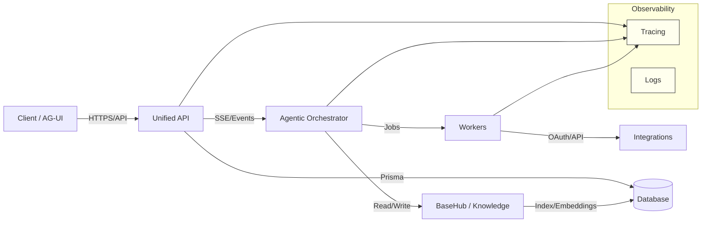

# Smart Business Assistant (SBA)

### Agentic SaaS Platform for Modern Business Automation

SBA adalah platform SaaS modular multi‑tenant yang memadukan AG‑UI (Agentic UI), Orchestrator, Tools (MCP), BaseHub CMS, dan observability end‑to‑end. Fokusnya adalah otomasi proses bisnis, dokumentasi terstruktur, serta antarmuka cerdas yang proaktif dan dapat meminta persetujuan.

---

# **Gambaran Umum**

- Deskripsi: Smart Business Assistant (SBA) adalah sistem asisten bisnis agentic yang membantu tim mengotomatiskan tugas operasional, menganalisis data, menyusun laporan, dan berintegrasi dengan ekosistem tool populer. SBA menggabungkan AI generatif, orkestrasi alur kerja, dan pusat pengetahuan terstruktur sehingga tim dapat bekerja cepat dengan kontrol, audit, dan kepatuhan.
- Target Pengguna: UMKM yang ingin mempercepat operasi, startup yang membutuhkan otomasi efisien, dan korporasi yang memerlukan orkestrasi multi‑tenant dengan kebijakan akses granular.
- Teknologi Inti: AI generatif & NLP, Agentic Orchestrator, BaseHub sebagai Knowledge Hub, API‑first backend, AG‑UI untuk antarmuka proaktif, event streaming SSE, DB dengan RLS, tracing observability (OTel), containerisasi (Docker/Kubernetes), CI/CD modern.

---

# **Fitur Utama**

- Manajemen Tugas Otomatis: Agent mengeksekusi task berulang (schedulling, follow‑up, sinkronisasi data) dengan langkah terstruktur, meminta persetujuan saat diperlukan, dan mencatat setiap step ke timeline audit.
- Analisis Data Bisnis: Pipeline ETL ringan dari integrasi (CRM, akuntansi, forms) → normalisasi → metrik → insight; hasil dibagikan ke dashboard atau laporan otomatis.
- Integrasi Tools Populer: Slack/Teams untuk notifikasi dan command, Google Workspace untuk dokumen/spreadsheet, CRM (HubSpot/Salesforce) untuk sinkronisasi data; OAuth dengan skema dan rate‑limit per provider.
- Pembuatan Laporan Otomatis: Template laporan berkala (keuangan, penjualan, operasional) disusun dari data tenant, dengan render PDF/HTML dan distribusi via email atau drive.
- Dukungan Multi‑Bahasa: Antarmuka dan konten laporan dapat berbahasa Indonesia/Inggris; model AI dipilih per tenant sesuai kebijakan bahasa.
- Dokumentasi Interaktif: Referensi API otomatis dari kontrak OpenAPI dan halaman panduan interaktif dengan fasilitas "coba endpoint" serta analitik penggunaan dokumentasi untuk memahami hambatan developer.

---

# **Persyaratan Sistem**

- Lingkungan Pengembangan: Node.js 18+ atau 20+, PNPM 9+, Python 3.9+ opsional (untuk tool tertentu), Docker Desktop, database PostgreSQL (direkomendasikan) atau MySQL.
- Dependensi Utama: TypeScript, TurboRepo, Prisma, OpenAPI generator, Playwright, k6, OTel SDK, Tailwind (untuk AG‑UI), serta SDK integrasi (Slack/Google/CRM) sesuai kebutuhan.
- Infrastruktur Produksi: Docker multi‑stage; Kubernetes untuk autoscaling dan isolasi; reverse proxy TLS (Nginx/Envoy); penyimpanan rahasia (AWS Secrets Manager/GCP Secret Manager); observability (Grafana/Tempo/Loki) atau layanan cloud setara.

---

# **Panduan Instalasi & Konfigurasi**

- Langkah‑langkah Setup:
  - Clone repositori.
  - Install dependensi (`pnpm install`).
  - Siapkan konfigurasi env (`.env`) dengan kredensial yang diperlukan.
  - Jalankan pengembangan (`pnpm dev`) atau server produksi (`pnpm build` + `docker compose up`).
- Variabel Lingkungan Utama:
  - `DATABASE_URL` untuk koneksi Postgres/MySQL.
  - `BASEHUB_API_KEY` untuk akses Knowledge Hub.
  - `AUTH_PROVIDER_KEYS` (mis. `CLERK_SECRET_KEY`/`AUTH0_CLIENT_SECRET`).
  - `STRIPE_SECRET_KEY` untuk billing dan metering.
  - `OPENAI_API_KEY` atau kunci model lain sesuai kebijakan tenant.
- Konfigurasi Lanjutan:
  - Integrasi baru: daftarkan provider di modul Integrations, tambahkan skema, OAuth callback, dan mapping field.
  - Tools agentic: definisikan kontrak input/output, guard RBAC, dan audit hooks; publikasikan ke katalog.
  - Pengetahuan: unggah SOP/guide ke BaseHub, buat embeddings per tenant, atur policy privasi.

---

# **Panduan Penggunaan**

- Flow Kerja: Pengguna berinteraksi melalui AG‑UI (chat, command panel, atau form action). Agent menyusun rencana, mengeksekusi langkah terukur, meminta persetujuan untuk aksi sensitif, dan mengirim notifikasi ke Slack/Email.
- Dashboard: Menampilkan run terbaru, event timeline, metrik penggunaan, dan status integrasi.
- Contoh Kasus:
  - Laporan keuangan bulanan dalam 5 menit: tarik data transaksi → kategorisasi → ringkas KPI → render PDF → kirim ke stakeholder.
  - Sinkronisasi pipeline penjualan: tarik lead dari formulir → validasi → buat entri CRM → atur follow‑up otomatis.
  - Monitoring SLA internal: agregasi run agent → hitung p95 latensi → kirim ringkasan ke channel ops.

---

# **Keamanan & Kepatuhan**

- Enkripsi Data: TLS untuk transport; enkripsi rahasia di penyimpanan; dukungan enkripsi di tingkat database.
- OTP/2FA: Gunakan penyedia identitas (Clerk/Auth0) dengan MFA; kebijakan akses berbasis peran dan scope per endpoint.
- Kepatuhan Regulasi: Desain mendukung prinsip GDPR (hak akses, penghapusan, minimisasi data) dan praktik ISO 27001 (kontrol akses, manajemen risiko, audit). Kepatuhan akhir bergantung pada konfigurasi dan lingkungan deployment.
- Audit & Observability: Setiap aksi penting dicatat dengan `actor`, `action`, `resource`, `outcome`, `ts`; korelasi `runId`/`tenantId` untuk tracing end‑to‑end.

---

# **Kontribusi & Dukungan**

- Cara Berkontribusi: Buat issue dengan use‑case dan dampak; ajukan PR dengan deskripsi perubahan, tes, dan update dokumentasi. Ikuti panduan gaya dan versi di `documents/governance/*`.
- Dukungan: Hubungi tim melalui email dan channel komunitas; gunakan forum diskusi dan changelog untuk mengikuti rilis.

---

# **Vision & Value Proposition**

- Agentic Automation: UI proaktif mengeksekusi task dengan pemahaman konteks.
- Multi‑Tenant Enterprise SaaS: isolasi data, RBAC, billing, kebijakan per tenant.
- API‑First & Extensible: seluruh fitur diekspos melalui API; SDK otomatis.
- Headless Knowledge Hub: BaseHub sebagai sumber kebenaran; embeddings untuk agent.
- Observability: tracing, logs, event timeline; audit yang kuat.

---

# **Monorepo Structure (TurboRepo)**

```
/sba-agentic
│
├── apps/
│   ├── app/           → Agentic Web App (AG‑UI)
│   ├── api/           → Unified API Layer
│   ├── admin/         → Admin Console (tenant, billing)
│   ├── orchestrator/  → Agentic orchestration server
│   ├── worker/        → Background workers
│   ├── docs/          → Knowledge Hub (BaseHub)
│   └── web/           → Shared UI surface
│
├── packages/
│   ├── ui/            → Design System + AG‑UI components
│   ├── core/          → Domain logic (DDD)
│   ├── utils/         → Helper libraries
│   ├── api-clients/   → SDK from OpenAPI
│   ├── configs/       → Shared configs (TS, ESLint, Tailwind)
│   └── types/         → Global types & contracts
│
├── infra/
│   ├── docker/        → Containerization
│   ├── db/            → Prisma schema + migrations
│   ├── terraform/     → IaC
│   └── pipeline/      → CI/CD
│
└── documents/         → Documentation (architecture, ADR, API, agents, etc.)
```

---

# **Core Architecture Overview**

- Domain: Tenant & Identity, Agentic Runtime, Knowledge, Workflow, Integrations, Billing, Observability.
- Bounded Contexts (DDD):
  - Tenant BC: identitas, konfigurasi, RBAC.
  - Agentic BC: reasoning, execution, events.
  - Knowledge BC: BaseHub konten, embeddings, pencarian.
  - Workflow BC: triggers, pipeline, jobs.
  - Integration BC: OAuth, schema mapping, sync.
  - Billing BC: plan, metering, invoicing.
- Data Flow: Client ↔ API ↔ Orchestrator ↔ Workers ↔ Integrations ↔ BaseHub ↔ DB; SSE untuk event stream.

Diagram Arsitektur (konseptual):



---

# **Agentic Design — Deep Dive**

- Lifecycle: `idle → planning → executing → awaiting_approval → completed|failed`.
- Context Building: sumber (BaseHub, konfigurasi tenant, recent runs) → filter (RBAC, relevansi, ukuran) → validasi (Zod) → Context Map untuk agent/tools.
- Tools Contract: katalog dengan input/output terdefinisi, preconditions, guard RBAC, rate‑limit, audit hooks; setiap eksekusi adalah step dalam timeline.
- Memory Strategy: short‑term (context per run), long‑term (embeddings per tenant, TTL, rehydration) dengan privacy guard.
- Event Model: envelope `eventId`, `runId`, `tenantId`, `ts`, `step`, `level`, `payload`; di‑stream via SSE dan disimpan untuk replay/debug.

---

# **API Surface Overview**

- Agent: `POST /agent/plan`, `POST /agent/execute`, `POST /agent/context`.
- Workflow: `POST /workflow/runs`, `GET /workflow/runs/:id/events`, `GET /workflow/runs/:id`.
- Docs/Knowledge: `GET /docs/sop/:id`, `GET /docs/search?q=...`.
- Integrations: `POST /integrations/:provider/oauth/callback`, `GET /integrations/:provider/schema`.
- Billing: `GET /billing/plan`, `POST /billing/usage`.

Error Schema (contoh):
```
{
  "code": "VALIDATION_ERROR",
  "message": "Invalid payload",
  "hint": "Check required fields",
  "details": { "fieldErrors": [{ "path": "workflowId", "issue": "required" }] },
  "requestId": "req_123"
}
```

AuthZ: bearer token, RBAC per‑tenant, scopes per endpoint, rate limit adaptif.

---

# **Multi‑Tenant Strategy**

- Data Isolation: shared DB + RLS berbasis `tenantId`; opsi schema per tenant untuk enterprise.
- Per‑Tenant Configuration: kredensial provider, automations, knowledge profiles, AI model policy, usage caps.
- Billing: Stripe, metering, invoicing, tiering.

---

# **Security Posture**

- Threats: auth bypass, tenant crossover, secret exposure, injection, data exfiltration.
- Controls: RBAC, RLS, input validation (Zod), rate limit, encrypted secrets, audit logging untuk aksi kritis.
- Audit Fields: `actor`, `action`, `resource`, `outcome`, `ts`, `metadata`.

---

# **SLO & Performance Targets**

- Availability: `app/api` ≥ 99.9%; orchestrator ≥ 99.5%.
- Latency: p95 API `≤ 250ms`; p95 enqueue `≤ 300ms`; p95 node exec sesuai domain.
- Throughput: queue depth stabil; autoscale target `CPU≤70%`.
- Error Rate: agent run failure < 1% (kecuali user cancellations).

---

# **Testing Strategy**

- Unit: coverage ≥ 80% untuk core logic (Vitest/Jest).
- Integration: alur bisnis utama (MSW/test DB sesuai profil).
- E2E: Playwright untuk tenant lifecycle, workflow run, approval.
- Performance: k6 untuk endpoint kritis; target p95/p99; throughput per komponen.

---

# **CI/CD Quality Gates & Promotion**

- Pre‑merge: type‑check, ESLint, unit/integration tests, coverage ≥ 80%, OpenAPI lint, bundle size guard.
- Build: Docker multi‑stage, provenance metadata, opsional SBOM.
- Staging Gates: E2E alur utama + perf smoke.
- Promotion: dev → staging → prod; canary/blue‑green; rollback prosedural.

---

# **Documentation Integration**

- Indeks: `documents/INDEX.md` dan navigasi `documents/README.md`.
- Arsitektur & ADR: `documents/architecture/*`, `documents/adr/*`.
- API: `documents/api/openapi.yaml` sebagai kontrak; generator SDK.
- Agent Spec & Instructions: `documents/agent/agent-spec.md`, `documents/instructions/*`.
- Use‑Cases: `documents/use-cases/USE_CASES_SBA.md`.

---

# **Development Standards**

- Coding: TypeScript strict, FSD boundaries, Atomic Design untuk UI, tanpa implicit dependencies.
- Error Taxonomy: `UserError`, `SystemError`, `ExternalProviderError` dengan `code`, `message`, `hint`.
- Logging & Tracing: korelasi `runId`/`tenantId`, OTel spans untuk API → orchestrator → tools → worker.

---

# **Getting Started**

Prerequisites
- Node 20+, PNPM 9+, Docker, BaseHub API Key, kredensial Auth (Clerk/Auth0).

Install
```
pnpm install
```

Dev
```
pnpm dev
```

Build
```
pnpm build
```

Scripts (turbo)
```
{
  "dev": "turbo run dev --parallel",
  "build": "turbo run build",
  "lint": "turbo run lint",
  "test": "turbo run test",
  "generate:sdk": "openapi-generator-cli generate",
  "db:migrate": "prisma migrate deploy"
}
```

---

# **Roadmap**

- Foundation: monorepo, tenant+auth, AG‑UI kernel, orchestrator v1, BaseHub.
- Automation: workflow engine, MCP tools, scalable workers, UI automation panel.
- Monetization: billing, usage metering, tenant customization, integrasi marketplace.
- Enterprise: schema‑per‑tenant, advanced access policies, SSO, audit logs.

---

# **Roadmap & Pengembangan Selanjutnya**

- Jangka Pendek: stabilisasi orchestrator v1, katalog tools inti, integrasi Slack/Google Workspace, laporan operasional standar.
- Jangka Menengah: integrasi CRM populer, panel otomasi AG‑UI yang kaya, kebijakan model AI per tenant, metering granular.
- Jangka Panjang: integrasi WhatsApp Business API, schema‑per‑tenant untuk enterprise, audit yang disempurnakan dan kepatuhan perluas.

---

# **Referensi & Sumber Eksternal**

- Praktik dokumentasi API interaktif dengan referensi otomatis dari kontrak OpenAPI, editor panduan, fitur coba endpoint, dan analitik penggunaan dokumentasi.
- Penjelasan akronim umum SBA sebagai Small Business Administration (berbeda dengan Smart Business Assistant di proyek ini) untuk menghindari kebingungan istilah.
- Sumber tren AI bisnis dan orkestrasi agentic: praktik industri terkait analitik, automasi, dan integrasi ekosistem.

---

# **Contribution & Governance**

- PR Conventions: referensi issue/use‑case, dampak, checklist test & docs.
- Style & Versioning: `documents/governance/STYLE_GUIDE.md`, `documents/governance/VERSIONING.md`.
- ADR untuk keputusan besar; review sesuai owner/reviewer.

---

# **License**

- MIT
