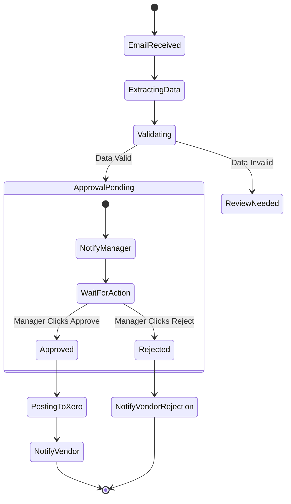

# Use-Case & Ide SaaS untuk Smart Business Assistant (SBA)

**Platform:** AI-native SaaS multi-tenant
**Komponen utama:** AG-UI, BaseHub, Multi-Tenant Architecture

---

## 1. Analisis Kebutuhan Non-Fungsional

Selain fitur fungsional, SBA harus memenuhi standar kualitas berikut:

| Kategori | Requirement | Target Metrik |
| :--- | :--- | :--- |
| **Performance** | Response time UI (Time to Interactive) | < 1.5 detik |
| | Latensi Streaming Agent (Time to First Token) | < 800 ms |
| | Throughput Event Bus | 1000 events/detik |
| **Security** | Data Isolation | Row-Level Security (RLS) di DB |
| | Encryption | AES-256 at rest, TLS 1.3 in transit |
| | Compliance | GDPR, SOC2 Ready |
| **Scalability** | Horizontal Scaling | Stateless API & Worker Nodes |
| **Availability** | Uptime SLA | 99.9% |
| **Reliability** | Idempotency untuk side-effect tools | 100% endpoint side-effect memiliki idempotency strategy |
| **Observability** | Metrics/traces/logs bertag `tenantId` | 100% request & tool call ter-tag |
| **Privacy** | Minimization & retention | data sensitif diproteksi; retention policy terdokumentasi |
| **Accessibility** | WCAG | minimal AA untuk layar utama |

---

## 2. Roadmap Pengembangan

### Phase 1: Foundation (Bulan 0-3)
*   [x] Setup Monorepo & TurboRepo.
*   [x] Implementasi AG-UI Chat Interface dasar.
*   [ ] Integrasi BaseHub sebagai CMS Knowledge Base.
*   [ ] Rilis MVP: "Q&A Agent" dengan data perusahaan sendiri.

### Phase 2: Actionable Agents (Bulan 4-6)
*   [ ] Implementasi Tool Registry (Calculator, Email Sender).
*   [ ] Workflow Automation Engine (Simple Linear Flows).
*   [ ] Dashboard Operasional v1.

### Phase 3: Vertical Expansion (Bulan 7-12)
*   [ ] **SBA-HR**: Modul rekrutmen & onboarding otomatis.
*   [ ] **SBA-Finance**: Integrasi Xero/Quickbooks & Forecasting.
*   [ ] Enterprise Connector (Salesforce, SAP).

---

## 3. Use-Case Detail & Diagram

### A. Business Knowledge Hub (SOP Automation)

**Skenario**: Karyawan baru ingin mengajukan cuti tetapi tidak tahu prosedurnya. Agent memandu berdasarkan SOP di BaseHub.

**Functional Specs**:
*   **Input**: Pertanyaan user ("Cara cuti gimana?").
*   **Process**: Retrieval SOP dari BaseHub -> Reasoning -> Generate jawaban.
*   **Output**: Jawaban teks + Link ke Form Cuti.

**Spesifikasi Fungsional (rinci)**:
*   **Aktor**: Karyawan (operator), HR Admin (opsional untuk eskalasi).
*   **Prekondisi**: Tenant memiliki dokumen SOP cuti; user terautentikasi.
*   **Main Flow**:
    1. User mengajukan pertanyaan.
    2. Sistem mencari SOP yang relevan.
    3. Sistem merangkum langkah, syarat, SLA, dan pihak approval.
    4. Sistem menawarkan aksi lanjut (buat pengajuan).
*   **Alternate Flow**:
    - SOP tidak ditemukan: sistem membuat task “klarifikasi ke HR” dan memberi kanal kontak.
*   **Input Tambahan**: `tenantId`, `userId`, `policyVersion` (jika SOP versioned).
*   **Output Tambahan**: `confidence`, `sourceRefs[]` (referensi SOP), `nextActions[]`.

**Activity Diagram**:

```mermaid
flowchart TD
    Start([User Ask: "How to apply leave?"]) --> Retrieve[Search Knowledge Base]
    Retrieve --> Found{SOP Found?}
    Found -- Yes --> Reason[LLM Summarize SOP]
    Found -- No --> Escalation[Suggest contacting HR]
    Reason --> Reply[Display Answer]
    Reply --> Action[Show "Apply Leave" Button]
    Action --> Click{User Clicks?}
    Click -- Yes --> Tool[Execute: open_leave_form]
    Click -- No --> End([End Conversation])
```

### B. Smart Workflow Automation (Invoice Processing)

**Skenario**: Invoice masuk via email -> Agent ekstrak data -> Minta approval manager -> Input ke sistem finance.

**Functional Specs**:
*   **Trigger**: Email masuk dengan attachment PDF.
*   **Process**: OCR -> Data Extraction -> Human-in-the-loop Approval -> API Call (Xero).
*   **Output**: Record di Xero + Notifikasi sukses.

**Spesifikasi Fungsional (rinci)**:
*   **Aktor**: Admin Finance, Manager Approver, Vendor (penerima notifikasi).
*   **Prekondisi**: Connector email aktif; template parsing tersedia; RBAC untuk approval.
*   **Main Flow**:
    1. Sistem menerima email (webhook).
    2. Sistem menjalankan OCR pada attachment.
    3. Sistem memvalidasi data (PO number match, total amount check).
    4. Sistem membuat "Approval Task" dan notifikasi ke Manager.
    5. Manager klik "Approve".
    6. Sistem memposting data ke Accounting Software.
*   **Alternate Flow**:
    - Validasi gagal: Task ditandai "Review Needed" untuk Admin Finance.
    - Manager Reject: Notifikasi ke Vendor untuk revisi.

**Activity Diagram**:



### C. Recruitment Screener Agent

**Skenario**: Ribuan CV masuk -> Agent melakukan scoring awal -> Chatbot wawancara awal -> Shortlist.

**Functional Specs**:
*   **Trigger**: Aplikasi baru masuk di ATS.
*   **Process**: CV Parsing -> Keyword Matching -> Cultural Fit Interview (Chat) -> Scoring.
*   **Output**: Ranked Shortlist + Summary Interview.

**Metrik Keberhasilan**:
*   Mengurangi waktu screening manual sebesar 70%.
*   Meningkatkan kualitas kandidat di tahap interview user sebesar 40%.

---

## 4. Matriks Prioritas Fitur

| Fitur | Nilai Bisnis | Kompleksitas | Prioritas |
| :--- | :--- | :--- | :--- |
| **Knowledge Retrieval (RAG)** | Tinggi | Sedang | **P0 (Must Have)** |
| **Invoice Processing** | Tinggi | Tinggi | **P1 (High)** |
| **Basic Approval Flow** | Tinggi | Sedang | **P1 (High)** |
| **Recruitment Screener** | Sedang | Tinggi | **P2 (Medium)** |
| **Salesforce Connector** | Tinggi | Sangat Tinggi | **P2 (Medium)** |
| **Voice Interface** | Rendah | Tinggi | **P3 (Low)** |

