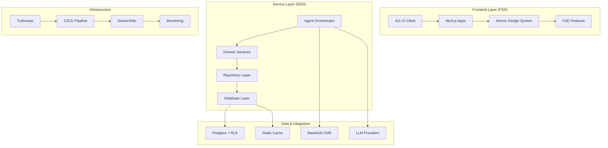

# PLAN & RANCANGAN Monorepo Turbo untuk SBA (Smart Business Assistant)

**Arsitektur Hybrid: FSD (Feature-Sliced Design) + DDD (Domain-Driven Design) + Atomic Design System**

## 📋 Executive Summary

Dokumen ini merupakan blueprint komprehensif untuk mengembangkan monorepo Turbo yang menggabungkan prinsip-prinsip arsitektur modern:
- **FSD** untuk struktur frontend yang scalable dan maintainable
- **DDD** untuk pemodelan bisnis yang kuat dan domain-focused  
- **Atomic Design** untuk sistem komponen UI yang konsisten
- **Multi-tenant SaaS** dengan isolasi data yang aman
- **AG-UI + BaseHub** sebagai core technology stack

## 🎯 Visi & Tujuan

**Visi:** Membangun platform Smart Business Assistant (SBA) yang menjadi "operating system" bisnis modern dengan AI-first approach.

**Tujuan 90 Hari:**
1. Monorepo skeleton dengan Turborepo & CI/CD pipeline
2. Implementasi FSD + DDD + Atomic Design yang konsisten
3. Core MVP: Agent Orchestrator + AG-UI streaming + Knowledge Base
4. Multi-tenant architecture dengan Postgres RLS
5. Design system yang reusable dan accessible

## 🏗️ Arsitektur Sistem

### High-Level Architecture



### Bounded Contexts (DDD)

1. **Knowledge Context** - Content, templates, knowledge base
2. **Conversation Context** - Sessions, messages, agent reasoning
3. **Document Context** - Template rendering, artifact storage
4. **Workflow Context** - Task lifecycle, approvals, automation
5. **Tenant Context** - Multi-tenancy, billing, provisioning
6. **Identity Context** - Authentication, authorization, user management

### FSD Layering & Rules

- Lapisan: `app → processes → widgets → features → entities → shared`.
- Public API per slice; impor satu arah (tidak ada upward imports).
- `features/*` hanya boleh mengimpor `entities/*` dan `shared/*`.
- Tegakkan via ESLint module boundaries.

### DDD Layers & Mappings

- Layer: `domain` (entities, value objects, aggregates, domain events), `application` (use-cases, DTO, orchestrators), `infrastructure` (repos/adapters, DB/cache/bus), `interfaces` (HTTP/WS controllers).
- Repositori domain di `packages/entities/*` diekspose sebagai interface; implementasi ada di `packages/db` dan adapters di `packages/services`.

### Hybrid FSD/DDD

- `entities` FSD merepresentasikan `domain` DDD; state UI berinteraksi lewat `application` use-cases.
- `features/*` membungkus orchestration `application` dan klien API/WS.
- Invariants bisnis ditempatkan di aggregates/domain services; UI hanya memicu use-case.

### Atomic Design Implementation

- Lapisan: `atoms`, `molecules`, `organisms`, `templates`, `pages`; tokens sebagai sumber kebenaran.
- Pola interaksi: loading/error/empty/skeleton/streaming terdokumentasi dan diuji.
- Aksesibilitas: WCAG 2.1 AA, ARIA, fokus, kontras; otomatisasi cek via axe.

## 📁 Struktur Monorepo

```
/home/inbox/smart-ai/sba-agentic/Smart Business Assistant/
├── 📂 apps/                          # Aplikasi utama
│   ├── 🌐 web/                       # Next.js AG-UI Client (FSD)
│   │   └── src/
│   │       ├── 📂 app/               # App Router
│   │       ├── 📂 processes/         # Long business flows
│   │       ├── 📂 widgets/           # Composite UI widgets
│   │       ├── 📂 features/          # Feature modules (FSD)
│   │       │   ├── chat/
│   │       │   ├── documents/
│   │       │   ├── tasks/
│   │       │   └── tenant/
│   │       ├── 📂 entities/          # Domain entities
│   │       └── 📂 shared/            # Shared utilities
│   ├── ⚙️ api/                       # Agent Orchestrator (NestJS)
│   ├── 🎨 admin/                     # Admin Dashboard
│   └── 🔧 worker/                    # Background jobs
│
├── 📂 packages/                      # Shared packages
│   ├── 🎨 ui/                        # Atomic Design System
│   │   ├── tokens/                   # Design tokens
│   │   ├── atoms/                    # Basic components
│   │   ├── molecules/                # Component groups
│   │   ├── organisms/                # Complex components
│   │   ├── templates/                # Page layouts
│   │   └── storybook/                # Documentation
│   ├── 🧩 agui-client/               # AG-UI wrappers
│   ├── 📦 sdk/                       # Generated API clients
│   ├── 🏢 entities/                    # DDD domain models
│   │   ├── conversation/
│   │   ├── document/
│   │   ├── tenant/
│   │   └── workflow/
│   ├── 🔧 services/                  # Domain services
│   ├── 🛠️ tools/                     # Tool adapters
│   ├── 🗄️ db/                        # Database schema & migrations
│   ├── 🔐 auth/                      # Authentication
│   ├── 📊 telemetry/                 # Observability
│   └── ⚡ utils/                     # Shared utilities
│
├── 📂 docs/                          # Documentation
├── 📂 scripts/                       # Development scripts
├── 📂 tooling/                       # Development tooling
└── 📂 ops/                           # Operations & monitoring
```

## 🎨 UI/UX Requirements

### Design System (Atomic Design)

**Core Principles:**
- Mobile-first responsive design
- Accessibility (WCAG 2.1 AA)
- Consistent spacing & typography
- Themeable per tenant
- Dark/light mode support

**Component Hierarchy:**
1. **Atoms**: Button, Input, Card, Badge, Icon
2. **Molecules**: SearchBar, FormGroup, ChatBubble
3. **Organisms**: ChatWindow, DocumentEditor, TaskPanel
4. **Templates**: DashboardLayout, OnboardingFlow
5. **Pages**: ChatPage, DocumentsPage, SettingsPage

### Design Tokens

```json
{
  "colors": {
    "primary": "#3B82F6",
    "secondary": "#8B5CF6",
    "success": "#10B981",
    "warning": "#F59E0B",
    "error": "#EF4444"
  },
  "typography": {
    "fontFamily": "Inter, sans-serif",
    "fontSizes": {
      "xs": "0.75rem",
      "sm": "0.875rem",
      "base": "1rem",
      "lg": "1.125rem",
      "xl": "1.25rem"
    }
  },
  "spacing": {
    "unit": 4,
    "scale": [0, 4, 8, 12, 16, 20, 24, 32, 40, 48, 64]
  }
}
```

### UX Patterns

1. **Streaming Chat**: Progressive rendering with skeleton loaders
2. **Human-in-the-Loop**: Clear interrupts and confirmation modals
3. **Tool Execution**: Visual feedback for tool calls and results
4. **Multi-Tenant**: Workspace switcher with clear tenant isolation
5. **Responsive**: Adaptive layouts for desktop, tablet, mobile

## 🔧 Technical Architecture

### Technology Stack

**Frontend:**
- Next.js 14+ (App Router)
- React 18+ with TypeScript
- Tailwind CSS + PostCSS
- TanStack Query for state management
- Zod for validation

**Backend:**
- NestJS with TypeScript
- Supabase (Postgres + Auth + Realtime)
- Redis for caching and sessions
- BullMQ for job queues

**Infrastructure:**
- Turborepo for monorepo management
- Docker for containerization
- Kubernetes for orchestration
- GitHub Actions for CI/CD

### Database Design

```sql
-- Multi-tenant tables with RLS
CREATE TABLE tenants (
  id UUID PRIMARY KEY DEFAULT gen_random_uuid(),
  name VARCHAR(255) NOT NULL,
  plan VARCHAR(50) DEFAULT 'free',
  created_at TIMESTAMP WITH TIME ZONE DEFAULT NOW()
);

CREATE TABLE conversations (
  id UUID PRIMARY KEY DEFAULT gen_random_uuid(),
  tenant_id UUID NOT NULL REFERENCES tenants(id),
  user_id UUID NOT NULL,
  title VARCHAR(255),
  status VARCHAR(50) DEFAULT 'active',
  created_at TIMESTAMP WITH TIME ZONE DEFAULT NOW(),
  updated_at TIMESTAMP WITH TIME ZONE DEFAULT NOW()
);

-- Enable RLS
ALTER TABLE conversations ENABLE ROW LEVEL SECURITY;

CREATE POLICY tenant_isolation ON conversations
  USING (tenant_id = current_setting('app.current_tenant')::uuid);
```

### API Design

**RESTful APIs with OpenAPI specification:**
- `GET /api/v1/conversations` - List conversations
- `POST /api/v1/conversations` - Create conversation
- `GET /api/v1/conversations/:id/messages` - Get messages
- `POST /api/v1/conversations/:id/messages` - Send message
- `GET /api/v1/tools` - List available tools
- `POST /api/v1/tools/:name/execute` - Execute tool

**WebSocket for real-time features:**
- Chat streaming
- Agent status updates
- Tool execution progress

## 🚀 Implementation Process

### Phase 0: Foundation (2 weeks)
- Setup monorepo with Turborepo
- Configure TypeScript and build tools
- Setup CI/CD pipeline
- Create design system foundation

### Phase 1: Core MVP (6 weeks)
- Implement AG-UI client with streaming
- Build Agent Orchestrator
- Integrate BaseHub for knowledge base
- Setup Supabase with RLS
- Basic chat functionality

### Phase 2: Features & Workflow (6 weeks)
- Document generation pipeline
- Task management system
- Multi-tenant UI
- Admin dashboard
- Workflow automation

### Phase 3: Enterprise Features (8 weeks)
- Advanced security features
- Billing integration
- Advanced analytics
- API rate limiting
- Enterprise SSO

### Phase 4: Scale & Optimize (Ongoing)
- Performance optimization
- Advanced caching strategies
- Vector search implementation
- Machine learning integration
- Global deployment

## 📊 Deliverables & Artefak

### Core Documentation
1. **Arsitektur Lengkap** - Diagram dan spesifikasi teknis
2. **API Specification** - OpenAPI documentation
3. **Design System** - Storybook dengan komponen lengkap
4. **Database Schema** - DDL dan migrasi
5. **Deployment Guide** - Infrastructure setup

### Development Tools
1. **Boilerplate Code** - Starter templates untuk fitur baru
2. **CLI Tools** - Generator untuk komponen dan services
3. **Testing Utilities** - Test helpers dan mocks
4. **Development Scripts** - Automation untuk development flow

### Monitoring & Observability
1. **Dashboard Metrics** - Business dan technical KPIs
2. **Alerting Rules** - Critical system alerts
3. **Log Aggregation** - Centralized logging setup
4. **Performance Monitoring** - APM integration

## 🎯 Success Metrics

### Technical Metrics
- **Build Time**: < 5 minutes for full build
- **Test Coverage**: > 80% for critical paths
- **Performance**: < 200ms API response time
- **Availability**: > 99.9% uptime

### Business Metrics
- **Time to Market**: Feature delivery < 2 weeks
- **Developer Experience**: < 30 minutes setup time
- **Tenant Onboarding**: < 5 minutes self-service
- **User Satisfaction**: NPS > 50

## 📦 Kode Boilerplate & Generator
- Paket `packages/ui` menyediakan contoh atoms/molecules/organisms dengan Storybook untuk prototyping cepat
- Generator SDK: `pnpm --filter packages/sdk gen` dari OpenAPI
- Template fitur FSD: folder `apps/web/src/features/*` dengan `model/ui/api` siap pakai
## 🔒 Security & Compliance

### Security Measures
- Row Level Security (RLS) di database
- JWT-based authentication
- API rate limiting per tenant
- Input validation dengan Zod
- Audit logging untuk semua perubahan

### Compliance
- GDPR compliance untuk data privacy
- SOC 2 Type II readiness
- Data encryption at rest dan in transit
- Regular security audits
- Incident response procedures

## 📚 Best Practices & Conventions

### Code Organization
- **FSD Import Rules**: No circular dependencies
- **DDD Boundaries**: Clear domain separation
- **Atomic Design**: Consistent component structure
- **Type Safety**: Strict TypeScript configuration

### Development Workflow
- **Feature Branches**: Git flow dengan PR reviews
- **Conventional Commits**: Standardized commit messages
- **Code Review**: Mandatory untuk semua perubahan
- **Automated Testing**: CI/CD dengan test automation

### Documentation Standards
- **README per Package**: Setup dan usage instructions
- **API Documentation**: OpenAPI dengan examples
- **Component Docs**: Storybook dengan variants
- **Architecture Decision Records**: ADR untuk keputusan penting

---

**Dokumen ini akan terus diperbarui sesuai perkembangan proyek dan feedback dari tim development.**

## 🔗 Konsolidasi Sumber & Referensi

- Diselaraskan dari: `Perencanaan Proyek — SBA (Smart Business Assistant).md`, `PLAN & RANCANGAN Monorepo — SBA (Smart Business Assistant).md`, `Use-Case & Ide SaaS untuk Smart Business Assistant (SBA).md`, `Rencana & Rancangan Lengkap — Monorepo Turbo untuk SBA (Smart Business Assistant).md`
- Artefak utama dirujuk ke `daftar deliverables artefak.md` untuk daftar lengkap dan tautan spesifik.

## 🧭 Analisis Monorepo Saat Ini

- Root: `turbo.json`, `pnpm-workspace.yaml`, `package.json` dengan script `build/dev/lint/test/type-check/clean/format`
- Apps:
  - `apps/web` Next.js 14 dengan alias FSD (`shared/entities/features/widgets/pages/app`)
  - `apps/app`, `apps/marketing` Next.js 14
  - `apps/api` NestJS 10 (REST/WebSockets)
  - `apps/docs` Vite + React
  - `apps/orchestrator` Bun + TypeScript
- Packages: `ui` (design system + Storybook), `entities`, `services`, `auth`, `utils`, `sdk`, `db`, `telemetry`, `security`, `logger`, `email`, `analytics`, `cms`, `jobs`, dll
- Turbo pipeline saat ini: `build/dev/lint/test/type-check/clean` dengan outputs dasar; perlu penambahan pipeline untuk `docs`, `storybook`, `e2e`, `format` dan caching yang lebih baik
- Kekosongan: workflows CI di `.github/workflows`, dokumentasi otomatis terpadu (Typedoc/OpenAPI/Storybook), ADR konsisten lintas paket

### Gap vs Best Practices TurboRepo

- Konsolidasi package manager ke `pnpm` untuk konsistensi lintas workspace.
- Hapus ketergantungan `^build` dari `lint` dan `type-check` agar paralelisme meningkat.
- Standarisasi skrip per workspace (`build/dev/lint/test/type-check/clean`).
- Aktifkan remote caching Turbo (Cloud/remote) untuk CI.
- Pusatkan `tsconfig`, `eslint`, `prettier` di root dan gunakan impor path konsisten (`@sba/*`).
- Batasi `globalDependencies` ke file yang memengaruhi build nyata (mis. `pnpm-lock.yaml`).

## 🗂️ Struktur Dokumen Pendukung

Semua dokumentasi pendukung ditempatkan di `.trae/documents/Smart Business Assistant` dengan hirarki:

```
Smart Business Assistant/
├─ core/            # Domain models, bounded contexts, ADR ringkas
├─ features/        # Spesifikasi FSD per fitur (chat, documents, tasks, tenant)
├─ shared/          # Design tokens, utilitas, pola lintas fitur
├─ apps/            # Arsitektur tiap aplikasi, integrasi SDK, routing
└─ docs/            # Panduan pengembangan, kontribusi, API, test plan, diagram
```

Setiap folder memiliki README ringkas dan tautan ke artefak utama.

## ♻️ Riset Best Practices Terbaru

- Turborepo: definisikan pipeline granular untuk `docs`, `storybook`, `e2e`, `format`; set `outputs` untuk cache; gunakan remote caching bila tersedia
- FSD: enforce import boundaries dan anti circular dependencies via ESLint
- DDD: pisahkan aggregate, value objects, repositories; gunakan contract tests
- Atomic: design tokens sebagai sumber kebenaran, aksesibilitas WCAG 2.1 AA
- CI/CD: matrix Node 18/20, pnpm + turbo cache, PR preview, lint/typecheck/test/build
- Dokumentasi otomatis: Typedoc untuk packages, Storybook untuk UI, OpenAPI generator untuk API dan SDK

## ⚙️ Konfigurasi TurboRepo (Optimal)

**pnpm-workspace.yaml**

```yaml
packages:
  - "apps/*"
  - "packages/*"
```

**turbo.json**

```json
{
  "globalDependencies": ["pnpm-lock.yaml"],
  "pipeline": {
    "build": {
      "dependsOn": ["^build"],
      "outputs": ["dist/**", ".next/**"]
    },
    "lint": { "cache": true },
    "type-check": { "cache": true, "outputs": ["tsc/**"] },
    "test": { "dependsOn": ["^build"], "outputs": ["coverage/**"] },
    "docs": { "outputs": ["docs/**"] },
    "storybook": { "outputs": ["storybook-static/**"] },
    "e2e": { "cache": false },
    "dev": { "cache": false, "persistent": true }
  }
}
```

**package.json (root) scripts**

```json
{
  "scripts": {
    "dev": "turbo run dev",
    "build": "turbo run build",
    "lint": "turbo run lint",
    "test": "turbo run test",
    "type-check": "turbo run type-check",
    "docs": "turbo run docs",
    "storybook": "turbo run storybook",
    "e2e": "turbo run e2e",
    "clean": "turbo run clean"
  }
}
```

Aktifkan remote cache agar build CI konsisten cepat; tambahkan variabel lingkungan dan token sesuai penyedia cache.

## 📑 Panduan Kontribusi & Kode

- TypeScript `strict`; tidak gunakan `any` tanpa alasan kuat.
- Zod-first untuk boundary (API/params); tipe diturunkan dari skema.
- FSD boundaries ditegakkan dengan ESLint rule import boundaries.
- DDD memisahkan domain/application/infrastructure/interfaces; repository di `packages/db` mengimplementasi interface domain.
- Conventional commits dan Changesets untuk versioning.

## 🎨 Prototipe UI/UX

- Gunakan Storybook/Ladle pada `packages/ui` untuk prototipe interaktif.
- Buat stories untuk `atoms/molecules/organisms/templates` dengan skenario: loading, empty, error, streaming.
- Tambahkan Playwright visual regression untuk komponen kritikal.

## 🔗 Deliverables

- Lihat `/.trae/documents/daftar deliverables artefak.md` untuk daftar artefak, diagram, spesifikasi API, panduan kontribusi, test plan, dan tautan ke dokumen pendukung.

## 🔄 CI/CD Baseline

- CI pada PR: `format:check`, `lint`, `type-check`, `test`, `build`
- Artifak preview: build output per paket/aplikasi
- CD: staging otomatis pada merge ke `main`, manual promote ke production

## 🧩 Deliverables Tambahan

- Diagram dependensi modul dan context map DDD ditambahkan ke `daftar deliverables artefak.md`
- Spesifikasi API OpenAPI, kontrak antar modul, dan test plan terhubung langsung dari folder `docs/`
