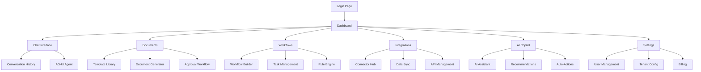

## 1. Product Overview
Smart Business Assistant (SBA) Apps Web Refactor merupakan proyek peningkatan arsitektur dan kualitas aplikasi web utama SBA dengan menerapkan pola FSD (Feature-Sliced Design), DDD (Domain-Driven Design), dan Atomic Design. Proyek ini bertujuan menciptakan codebase enterprise-grade yang scalable, maintainable, dan siap untuk multi-tenant SaaS dengan AI-first approach.

**Masalah yang Diselesaikan:**
- Struktur kode yang belum optimal untuk skala enterprise
- Kualitas kode yang perlu ditingkatkan untuk memenuhi standar industri
- UI/UX yang perlu diseragamkan dan ditingkatkan aksesibilitasnya
- Proses CI/CD yang perlu diperkuat dengan quality gates

**Target Pengguna:**
- UMKM, Startup, dan Enterprise yang membutuhkan platform bisnis berbasis AI
- Developer team yang membutuhkan arsitektur yang scalable
- Product team yang membutuhkan delivery feature yang cepat dan berkualitas

## 2. Core Features

### 2.1 User Roles
| Role | Registration Method | Core Permissions |
|------|---------------------|------------------|
| Tenant Owner | Email registration + tenant setup | Full access to tenant configuration, billing, user management |
| Admin | Invitation from owner | Manage workflows, documents, integrations, users |
| Operator | Admin invitation | Execute workflows, manage documents, view dashboards |
| Viewer | Admin invitation | Read-only access to dashboards, documents, reports |

### 2.2 Feature Module
Aplikasi ini terdiri dari fitur-fitur utama berikut:

1. **Dashboard Page**: Business overview, metrics, quick actions, notifications
2. **Chat Page**: AI-powered conversation interface, conversation history, real-time streaming
3. **Documents Page**: Document management, template generation, approval workflows
4. **Workflows Page**: Workflow builder, automation rules, task management
5. **Integrations Page**: Third-party connectors, data synchronization, API management
6. **AI Copilot Page**: Intelligent assistant, recommendations, automated actions
7. **Settings Page**: Tenant configuration, user management, billing, preferences

### 2.3 Page Details
| Page Name | Module Name | Feature description |
|-----------|-------------|---------------------|
| Dashboard | Metrics Overview | Display real-time business KPIs, charts, and trend analysis with interactive widgets |
| Dashboard | Quick Actions | Provide shortcuts to common tasks like create document, start workflow, send message |
| Dashboard | Notifications | Show system alerts, task reminders, and important updates with priority levels |
| Chat | Conversation Interface | Real-time AI chat with streaming responses, message history, and conversation management |
| Chat | Agent Integration | Connect with AG-UI agent orchestrator for intelligent responses and tool execution |
| Chat | Message Management | Create, edit, delete, and organize conversation threads with search functionality |
| Documents | Template Library | Browse and manage document templates with version control and categorization |
| Documents | Document Generator | Create documents from templates with AI assistance and dynamic data insertion |
| Documents | Approval Workflow | Route documents through approval chains with notifications and audit trails |
| Workflows | Workflow Builder | Visual drag-and-drop interface for creating business process automation |
| Workflows | Task Management | Monitor and manage automated tasks with status tracking and error handling |
| Workflows | Rule Engine | Define business rules and conditions for workflow execution with complex logic |
| Integrations | Connector Hub | Browse and configure third-party integrations with marketplace-style interface |
| Integrations | Data Sync | Manage data synchronization between systems with conflict resolution |
| Integrations | API Management | Configure API endpoints, webhooks, and data transformation rules |
| AI Copilot | Intelligent Assistant | Context-aware AI assistant that provides suggestions and automates tasks |
| AI Copilot | Recommendation Engine | Analyze business data to provide actionable insights and recommendations |
| AI Copilot | Auto-Actions | Execute automated actions based on AI analysis and business rules |
| Settings | Tenant Configuration | Manage tenant settings, branding, and domain configuration |
| Settings | User Management | Invite users, assign roles, and manage permissions with RBAC |
| Settings | Billing & Plans | View subscription details, upgrade plans, and manage payment methods |

## 3. Core Process

### User Flow - Business User
1. **Onboarding**: User mendaftar → Setup tenant → Pilih template industri → Konfigurasi dasar
2. **Daily Operations**: Login → Dashboard overview → Jalankan workflow → Monitor progress → Review metrics
3. **Document Management**: Buat dokumen dari template → Ajukan approval → Lacak status → Download/Share
4. **AI Interaction**: Buka chat → Tanyakan pertanyaan bisnis → Terima rekomendasi → Eksekusi tindakan
5. **Integration Setup**: Pilih connector → Konfigurasi koneksi → Test sync → Monitor status

### Admin Flow
1. **Tenant Management**: Setup tenant baru → Konfigurasi plan → Assign resources → Monitor usage
2. **User Management**: Invite users → Assign roles → Set permissions → Monitor activity
3. **System Configuration**: Configure integrations → Set business rules → Manage templates → Monitor performance

## 4. User Interface Design

### 4.1 Design Style
**Color Palette:**
- Primary: #3B82F6 (Blue-500) - Main actions and brand elements
- Secondary: #8B5CF6 (Purple-500) - Secondary actions and highlights
- Success: #10B981 (Green-500) - Positive feedback and success states
- Warning: #F59E0B (Amber-500) - Warnings and attention elements
- Error: #EF4444 (Red-500) - Errors and destructive actions
- Background: #FFFFFF / #0F172A (Light/Dark mode support)

**Typography:**
- Font Family: Inter, system-ui, sans-serif
- Font Sizes: xs (0.75rem), sm (0.875rem), base (1rem), lg (1.125rem), xl (1.25rem)
- Line Height: 1.5 for readability

**Component Style:**
- Buttons: Rounded corners (8px), consistent padding, hover states
- Cards: Subtle shadows, rounded corners, clean borders
- Forms: Clear labels, helpful hints, validation feedback
- Icons: Consistent line weight, semantic meaning, accessible labels

**Layout Style:**
- Card-based layout with consistent spacing
- Top navigation with sidebar for main sections
- Responsive grid system (12-column)
- Mobile-first approach with breakpoints: sm (640px), md (768px), lg (1024px), xl (1280px)

### 4.2 Page Design Overview
| Page Name | Module Name | UI Elements |
|-----------|-------------|-------------|
| Dashboard | Metrics Overview | Grid layout with metric cards, interactive charts with tooltips, real-time data indicators |
| Dashboard | Quick Actions | Floating action button, contextual menu, keyboard shortcuts support |
| Chat | Conversation Interface | Split-pane layout, message bubbles with timestamps, typing indicators, streaming text animation |
| Documents | Template Library | Card grid with preview images, search bar with filters, category sidebar |
| Documents | Document Editor | Rich text editor with toolbar, live preview pane, version history sidebar |
| Workflows | Workflow Builder | Canvas-based interface with drag-and-drop nodes, connection lines, property panel |
| Integrations | Connector Hub | Card-based marketplace, status indicators, configuration wizards |
| Settings | User Management | Data table with search, role badges, bulk actions, invitation modal |

### 4.3 Responsiveness
- **Desktop-First Design**: Optimized for desktop usage sebagai primary experience
- **Mobile Adaptive**: Responsive breakpoints untuk tablet dan mobile
- **Touch Interaction**: Touch-friendly controls, gesture support untuk mobile
- **Performance**: Lazy loading, code splitting, image optimization
- **Accessibility**: WCAG 2.1 AA compliance, keyboard navigation, screen reader support