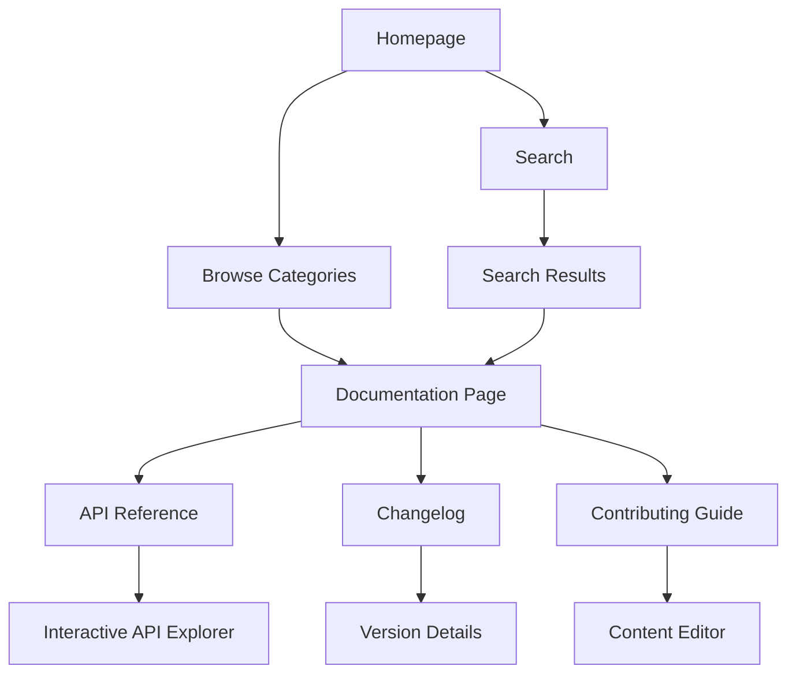

# Product Requirements Document - Apps/docs Enhancement (SBA BaseHub docs site)

## 1. Product Overview
Aplikasi dokumentasi BaseHub untuk workspace SBA-Agentic yang menyediakan pengalaman membaca dokumentasi yang optimal dengan UI/UX modern, performa tinggi, dan integrasi seamless dengan BaseHub CMS. Produk ini membantu developer, integrator, dan pengguna akhir mengakses dokumentasi yang selalu up-to-date dengan navigasi yang intuitif dan pencarian yang powerful.

Target pasar: Tim pengembang, integrator sistem, dan pengguna akhir yang membutuhkan dokumentasi teknis yang komprehensif dan mudah diakses.

## 2. Core Features

### 2.1 User Roles
| Role | Registration Method | Core Permissions |
|------|---------------------|------------------|
| Public Visitor | No registration required | Browse documentation, search content, view API references |
| Developer | GitHub OAuth integration | Access developer guides, contribute to documentation, view changelog |
| Admin | Internal invitation | Manage content, trigger revalidation, view analytics, configure webhooks |

### 2.2 Feature Module
Dokumentasi ini terdiri dari halaman-halaman utama berikut:
1. **Homepage**: Hero section dengan pencarian cepat, navigasi kategori, dan featured content
2. **Documentation Pages**: Artikel dokumentasi dengan sidebar navigation, breadcrumbs, dan table of contents
3. **API Reference**: Interactive API explorer dengan contoh kode dan response
4. **Search Page**: Hasil pencarian dengan filtering dan sorting
5. **Changelog**: Daftar perubahan dengan versi dan tanggal rilis
6. **Contributing Guide**: Panduan kontribusi untuk developer

### 2.3 Page Details
| Page Name | Module Name | Feature description |
|-----------|-------------|---------------------|
| Homepage | Hero Section | Display animated heading dengan value proposition, search bar dengan autocomplete, dan quick access cards untuk topik populer |
| Homepage | Navigation Bar | Sticky header dengan logo, language switcher, theme toggle, dan user menu |
| Homepage | Featured Content | Grid layout menampilkan topik-topik utama dengan icon dan deskripsi singkat |
| Documentation | Article Viewer | Render konten BaseHub dengan syntax highlighting, table of contents otomatis, dan copy code functionality |
| Documentation | Sidebar Navigation | Collapsible tree structure dengan active state indicator dan search within docs |
| Documentation | Breadcrumbs | Dynamic breadcrumb trail dengan kategori dan subkategori |
| API Reference | Endpoint List | Daftar endpoint API dengan method badges dan deskripsi singkat |
| API Reference | Interactive Explorer | Form input untuk testing API langsung dengan response preview |
| Search Page | Search Interface | Real-time search dengan debounce, filter by category/locale, dan result highlighting |
| Search Page | Results Display | Card-based results dengan excerpt, breadcrumbs, dan relevance score |
| Changelog | Version Timeline | Chronological list dengan collapsible sections dan tag filters |
| Contributing | Editor Interface | Rich text editor untuk konten baru dengan preview mode |

## 3. Core Process

### Public Visitor Flow
1. Visitor mengakses homepage melalui URL
2. Melihat hero section dengan search bar utama
3. Dapat langsung search atau browse kategori
4. Klik artikel untuk membaca dokumentasi
5. Navigate melalui sidebar atau breadcrumbs
6. Gunakan search untuk menemukan konten spesifik

### Developer Flow
1. Login melalui GitHub OAuth
2. Akses API reference untuk integrasi
3. Gunakan interactive API explorer
4. Lihat changelog untuk update terbaru
5. Kontribusi melalui contributing guide

### Admin Flow
1. Login dengan admin credentials
2. Akses dashboard untuk analytics
3. Trigger manual revalidation jika diperlukan
4. Monitor webhook status dan error logs
5. Manage content melalui BaseHub CMS

## 4. User Interface Design

### 4.1 Design Style
- **Primary Colors**: 
  - Primary: #2563eb (Blue-600) - untuk CTA dan link utama
  - Secondary: #64748b (Slate-500) - untuk teks sekunder
  - Accent: #f59e0b (Amber-500) - untuk highlight dan badges
- **Button Style**: Rounded corners (8px radius), hover effects dengan shadow, primary buttons dengan gradient background
- **Typography**: 
  - Heading: Inter font, size 32px/24px/20px untuk h1/h2/h3
  - Body: Inter font, 16px untuk desktop, 14px untuk mobile
  - Code: JetBrains Mono, 14px dengan line height 1.5
- **Layout Style**: Card-based layout dengan consistent spacing (8px grid system), sidebar navigation dengan sticky positioning
- **Icons**: Heroicons untuk consistency, dengan 2px stroke width

### 4.2 Page Design Overview
| Page Name | Module Name | UI Elements |
|-----------|-------------|-------------|
| Homepage | Hero Section | Centered layout dengan gradient background, animated heading dengan typewriter effect, prominent search bar dengan 48px height |
| Homepage | Navigation | Glassmorphism effect dengan backdrop blur, logo di kiri, menu items di tengah, actions di kanan |
| Documentation | Article Viewer | 70/30 split layout, main content dengan max-width 800px, syntax highlighting dengan theme-aware colors |
| Documentation | Sidebar | Collapsible tree dengan indent guide, active item dengan blue accent, smooth transitions |
| API Reference | Endpoint List | Card layout dengan method badges (GET/POST/PUT/DELETE), expandable sections |
| Search Page | Search Bar | Sticky search bar dengan clear button, search suggestions dropdown |
| Changelog | Timeline | Vertical timeline dengan version badges, collapsible content sections |

### 4.3 Responsiveness
- **Desktop-first approach**: Design optimal untuk layar 1440px ke atas
- **Tablet adaptation**: Sidebar menjadi drawer menu, content full width
- **Mobile optimization**: Hamburger menu, touch-friendly targets (min 44px), swipe gestures untuk navigation
- **Touch interaction**: Smooth scrolling, pull-to-refresh untuk update terbaru

## 5. Performance Requirements
- **Page Load Time**: < 2 detik untuk First Contentful Paint
- **Time to Interactive**: < 3 detik
- **Search Response**: < 200ms untuk autocomplete
- **Content Rendering**: < 100ms untuk markdown parsing
- **Cache Hit Rate**: > 90% untuk static content

## 6. Accessibility Standards
- **WCAG 2.1 Level AA**: Color contrast minimum 4.5:1
- **Keyboard Navigation**: Full keyboard support untuk semua interaksi
- **Screen Reader**: Semantic HTML dengan proper ARIA labels
- **Focus Management**: Visible focus indicators dengan 2px outline
- **Language Support**: RTL support untuk bahasa Arab/Hebrew

## 7. Security Requirements
- **Content Security Policy**: Strict CSP untuk mencegah XSS
- **HTTPS Only**: Semua traffic wajib HTTPS
- **Rate Limiting**: 100 requests per minute untuk search API
- **Input Sanitization**: Sanitize semua user input dan markdown content
- **Webhook Security**: HMAC signature verification untuk BaseHub webhooks

## 8. Testing Requirements
- **Unit Tests**: 90% code coverage untuk utility functions
- **Integration Tests**: Semua API endpoints dan webhook handlers
- **E2E Tests**: Critical user journeys (search, navigation, API explorer)
- **Performance Tests**: Load testing untuk 1000 concurrent users
- **Accessibility Tests**: Automated a11y testing dengan axe-core

## 9. Analytics & Monitoring
- **User Behavior**: Page views, search queries, click patterns
- **Performance Metrics**: Core Web Vitals, error rates
- **Content Analytics**: Popular articles, bounce rates
- **Search Analytics**: Query patterns, zero-result searches
- **Error Tracking**: Real-time error monitoring dengan Sentry

## 10. Success Metrics
- **User Engagement**: Average session duration > 3 menit
- **Search Success Rate**: > 85% queries dengan klik result
- **Page Performance**: Lighthouse score > 90
- **Content Freshness**: Update latency < 5 menit setelah BaseHub change
- **User Satisfaction**: Net Promoter Score > 50