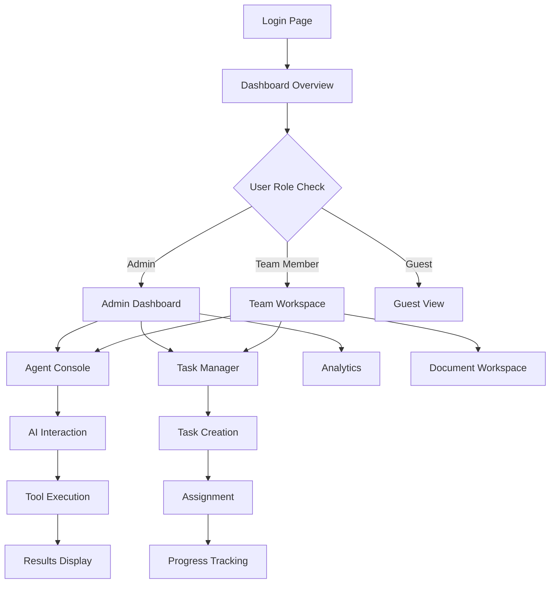
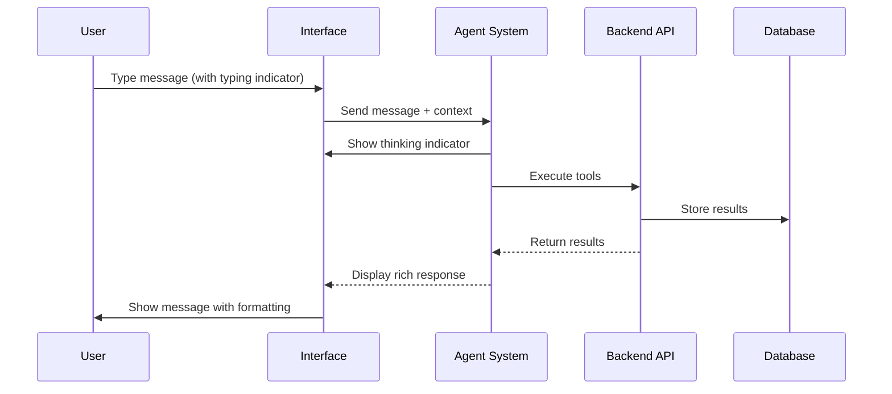
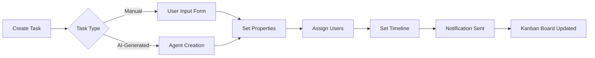
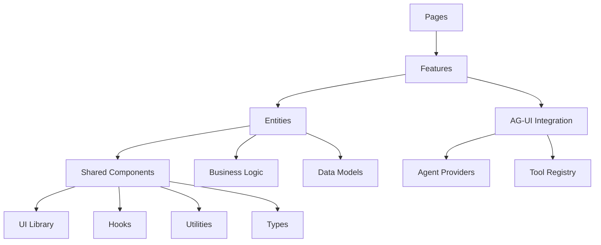

# **PRODUCT REQUIREMENTS DOCUMENT - ENHANCED `apps/app` (SBA-Agentic)**

**Versi 2.0 - Dengan Peningkatan UI/UX, Aksesibilitas, dan Kriteria Pengujian Komprehensif**

Aplikasi **`apps/app`** adalah *SBA-Agentic Workspace App* yang berfungsi sebagai interface operasional inti dengan pendekatan *desktop-first* yang mengutamakan pengalaman pengguna premium, aksesibilitas penuh, dan performa optimal.

---

## **1. PRODUCT OVERVIEW**

**Tujuan Utama:**
- Menyediakan workspace agentik dengan UI/UX premium untuk interaksi manusia-AI
- Memungkinkan automasi bisnis dengan workflow dinamis per tenant
- Menyediakan panel kerja adaptif dengan desain modern dan intuitif
- Memastikan aksesibilitas penuh (WCAG 2.1 Level AA) untuk semua pengguna

**Target Pengguna:**
- Business professionals yang membutuhkan AI workspace
- Teams yang berkolaborasi pada proyek agentik
- Enterprise users dengan kebutuhan security dan compliance tinggi
- Users dengan berbagai kemampuan (inclusive design)

**Nilai Proposisi:**
- *Next-generation AI workspace* dengan interface yang elegan dan powerful
- *Multi-tenant security* dengan isolasi data yang ketat
- *Real-time collaboration* untuk tim yang produktif
- *Accessibility-first design* untuk semua pengguna

---

## **2. CORE FEATURES**

### **2.1 User Roles & Permissions**

| Role | Registration Method | Core Permissions | Accessibility Features |
|------|---------------------|------------------|------------------------|
| **Admin User** | Email + 2FA | Full workspace management, user management, system configuration | Advanced screen reader support, keyboard navigation priority |
| **Team Member** | Email invitation | Create/edit tasks, access documents, use AI agents | Standard accessibility features, customizable UI |
| **Guest User** | Limited invitation | Read-only access, limited agent interaction | Simplified interface, high contrast mode |
| **API Client** | Service account | Programmatic access via API | N/A (machine-to-machine) |

### **2.2 Feature Module - Enhanced UI/UX**

**Halaman Utama dengan Desktop-First Design:**

1. **Dashboard Utama** - *Command center* dengan layout 3-kolom:
   - Sidebar navigasi dengan collapsible sections
   - Main content area dengan card-based layout
   - Right panel untuk quick actions dan notifications

2. **Agent Console** - *AI interaction hub*:
   - Chat interface dengan typing indicators dan real-time status
   - Rich message rendering dengan syntax highlighting
   - Command palette dengan fuzzy search (Ctrl+K)

3. **Task Manager** - *Project management*:
   - Kanban board dengan drag-and-drop smooth animations
   - Gantt chart untuk timeline visualization
   - Bulk actions dengan multi-select

4. **Document Workspace** - *Content management*:
   - File explorer dengan tree view dan breadcrumbs
   - Rich text editor dengan collaborative editing
   - Version history dengan diff viewer

5. **Analytics & Insights** - *Data visualization*:
   - Interactive charts dengan hover effects
   - Real-time metrics dengan live updates
   - Customizable dashboards dengan widget system

6. **Settings & Configuration** - *User preferences*:
   - Theme switcher (light/dark/auto)
   - Accessibility settings dengan font size controls
   - Notification preferences dengan granular controls

### **2.3 Page Details - Enhanced Specifications**

| Page Name | Module Name | Feature description |
|-----------|-------------|---------------------|
| **Dashboard** | Hero Section | Welcome message dengan personalized greeting, workspace overview cards dengan live metrics, quick action buttons dengan icon consistency |
| **Dashboard** | Navigation | Collapsible sidebar dengan role-based menu items, breadcrumb navigation dengan clear hierarchy, search functionality dengan instant results |
| **Dashboard** | Metrics Panel | Real-time KPI cards dengan progress indicators, interactive charts dengan hover tooltips, customizable widget layout dengan drag-drop |
| **Agent Console** | Chat Interface | Message threading dengan indentation, typing indicators dengan smooth animations, message status indicators (sent/delivered/read) |
| **Agent Console** | Command Palette | Keyboard shortcut support (Ctrl+K), fuzzy search dengan highlight matches, recent commands history dengan quick access |
| **Agent Console** | Tool Integration | Tool execution dengan progress bars, result preview dengan syntax highlighting, error handling dengan user-friendly messages |
| **Task Manager** | Kanban Board | Drag-and-drop functionality dengan smooth transitions, card preview on hover, bulk selection dengan shift-click |
| **Task Manager** | Task Creation | Inline editing dengan auto-save, rich text description dengan markdown support, file attachment dengan drag-drop |
| **Task Manager** | Timeline View | Interactive Gantt chart dengan zoom controls, dependency visualization dengan connecting lines, milestone markers dengan special styling |
| **Document Workspace** | File Explorer | Tree view dengan expand/collapse animations, file preview on hover, multi-select dengan checkbox integration |
| **Document Workspace** | Editor | Collaborative cursor tracking dengan user colors, real-time sync indicators, conflict resolution dengan merge UI |
| **Document Workspace** | Version History | Diff viewer dengan side-by-side comparison, rollback functionality dengan confirmation, version comments dengan timestamps |
| **Analytics** | Charts | Interactive data visualization dengan zoom/pan, export functionality dengan multiple formats, filter controls dengan real-time updates |
| **Settings** | Preferences | Form validation dengan inline errors, auto-save functionality dengan success indicators, reset to defaults dengan confirmation |

---

## **3. USER INTERFACE DESIGN**

### **3.1 Design System - Premium Desktop Experience**

**Color Palette:**
- **Primary:** `#6366F1` (Violet) - Main actions and highlights
- **Secondary:** `#8B5CF6` (Purple) - Secondary actions and accents
- **Success:** `#10B981` (Emerald) - Success states and positive indicators
- **Warning:** `#F59E0B` (Amber) - Warnings and attention needed
- **Error:** `#EF4444` (Red) - Errors and critical issues
- **Neutral:** `#6B7280` (Gray) - Text and secondary elements

**Typography:**
- **Font Family:** Inter (body), JetBrains Mono (code)
- **Font Sizes:** 12px (small), 14px (body), 16px (lead), 18px (heading), 24px (title), 32px (display)
- **Line Heights:** 1.4 (body), 1.2 (headings), 1.6 (long-form)

**Component Styling:**
- **Buttons:** Rounded corners (6px), hover transitions (200ms), focus rings (2px offset)
- **Cards:** Subtle shadows, border radius (8px), hover elevation
- **Inputs:** Border radius (4px), focus states with smooth transitions
- **Modals:** Backdrop blur, smooth entrance/exit animations

**Layout Principles:**
- **Spacing:** 8px grid system, consistent padding/margins
- **Responsive:** Desktop-first, adaptive untuk tablet (768px+), mobile (480px+)
- **Density:** Comfortable mode (default), compact mode (optional)

### **3.2 Accessibility Standards (WCAG 2.1 Level AA)**

**Visual Accessibility:**
- **Color Contrast:** Minimum 4.5:1 untuk normal text, 3:1 untuk large text
- **Focus Indicators:** Visible focus rings dengan 2px outline
- **Text Scaling:** 200% zoom support tanpa horizontal scrolling
- **Motion Preferences:** Respect `prefers-reduced-motion` setting

**Keyboard Navigation:**
- **Tab Order:** Logical focus flow melalui semua interactive elements
- **Keyboard Shortcuts:** Comprehensive shortcut system dengan discoverability
- **Skip Links:** Skip to main content, skip to navigation
- **Trap Handling:** Proper focus management dalam modals dan dropdowns

**Screen Reader Support:**
- **ARIA Labels:** Comprehensive labeling untuk semua interactive elements
- **Live Regions:** Status updates dan notifications untuk screen readers
- **Landmark Roles:** Proper semantic structure dengan main, nav, aside
- **Alt Text:** Meaningful descriptions untuk semua images dan icons

### **3.3 Component Specifications**

**Navigation Components:**
- **Sidebar:** Collapsible dengan smooth animations, icon + text labels, keyboard navigation support
- **Breadcrumbs:** Clickable path dengan proper ARIA labeling, responsive truncation
- **Search:** Instant search dengan debouncing, keyboard navigation, clear button

**Interactive Components:**
- **Buttons:** Multiple variants (primary, secondary, danger, ghost), loading states, disabled states
- **Forms:** Real-time validation, error messages dengan field association, success indicators
- **Modals:** Focus trapping, escape key handling, backdrop click handling, proper z-index management

**Data Display:**
- **Tables:** Sortable columns dengan visual indicators, pagination dengan page size options, row selection
- **Cards:** Consistent styling, hover effects, action menus, proper heading hierarchy
- **Charts:** Interactive tooltips, legend support, export functionality, accessibility alternatives

---

## **4. CORE PROCESS & USER FLOWS**

### **4.1 Primary User Journey - Desktop Experience**

### **4.2 Agent Interaction Flow - Enhanced UX**

### **4.3 Task Management Flow**

---

## **5. TECHNICAL ARCHITECTURE**

### **5.1 Technology Stack - Modern & Scalable**

**Frontend Technologies:**
- **Framework:** Next.js 14+ dengan App Router
- **UI Library:** React 18+ dengan Server Components
- **Styling:** Tailwind CSS 3+ dengan custom design tokens
- **State Management:** Zustand untuk client state, React Query untuk server state
- **TypeScript:** Strict mode dengan comprehensive type definitions

**Integration Technologies:**
- **AG-UI Client:** Untuk agent interaction dan rich UI rendering
- **BaseHub:** Content management dan document storage
- **SBA SDK:** Communication layer dengan backend services
- **WebSocket:** Real-time updates dan live collaboration

**Development Tools:**
- **Build Tool:** Vite untuk fast development
- **Testing:** Vitest untuk unit tests, Playwright untuk E2E
- **Linting:** Biome untuk fast linting dan formatting
- **Deployment:** Docker containers dengan CI/CD pipeline

### **5.2 Component Architecture**

---

## **6. TESTING STRATEGY & QUALITY ASSURANCE**

### **6.1 Unit Testing Criteria (Passing Standards)**

**Component Testing:**
- ✅ All UI components render without errors
- ✅ Props validation works correctly
- ✅ Event handlers fire appropriately
- ✅ State updates trigger re-renders
- ✅ Error boundaries catch exceptions
- ✅ Loading states display properly
- ✅ Accessibility attributes present

**Logic Testing:**
- ✅ Business logic produces correct outputs
- ✅ Edge cases handled gracefully
- ✅ Error conditions return appropriate messages
- ✅ Async operations handle timeouts
- ✅ Data transformation works correctly
- ✅ Validation rules enforce requirements

**Coverage Requirements:**
- **Line Coverage:** Minimum 80%
- **Branch Coverage:** Minimum 75%
- **Function Coverage:** Minimum 85%
- **Statement Coverage:** Minimum 80%

### **6.2 E2E Testing Criteria (Passing Standards)**

**Critical User Flows:**
- ✅ Authentication flow (login/logout/register)
- ✅ Dashboard navigation and data loading
- ✅ Agent creation and interaction
- ✅ Task creation and management
- ✅ Document upload and editing
- ✅ Settings configuration and persistence

**Cross-Browser Testing:**
- ✅ Chrome (latest 2 versions)
- ✅ Firefox (latest 2 versions)
- ✅ Safari (latest 2 versions)
- ✅ Edge (latest 2 versions)

**Device Testing:**
- ✅ Desktop (1920x1080, 1366x768)
- ✅ Tablet (768x1024, 1024x768)
- ✅ Mobile (375x667, 414x896)

**Performance Criteria:**
- ✅ Page load time < 3 seconds
- ✅ Time to Interactive < 5 seconds
- ✅ First Contentful Paint < 1.5 seconds
- ✅ Largest Contentful Paint < 2.5 seconds

### **6.3 Accessibility Testing (WCAG 2.1 Level AA)**

**Automated Testing:**
- ✅ axe-core scans pass without violations
- ✅ Lighthouse accessibility score > 90
- ✅ WAVE tool reports zero errors
- ✅ Color contrast ratios meet standards

**Manual Testing:**
- ✅ Keyboard navigation through all interactive elements
- ✅ Screen reader announcement of dynamic content
- ✅ Focus indicators visible on all focused elements
- ✅ Form labels properly associated with inputs
- ✅ Error messages announced to screen readers

**Assistive Technology Testing:**
- ✅ NVDA (Windows) compatibility
- ✅ JAWS (Windows) compatibility
- ✅ VoiceOver (macOS) compatibility
- ✅ TalkBack (Android) compatibility

### **6.4 Security Testing**

**Authentication & Authorization:**
- ✅ JWT token validation and refresh
- ✅ Role-based access control enforcement
- ✅ Session management and timeout handling
- ✅ Password complexity requirements

**Data Protection:**
- ✅ Input sanitization and validation
- ✅ SQL injection prevention
- ✅ XSS protection mechanisms
- ✅ CSRF token validation

**API Security:**
- ✅ Rate limiting implementation
- ✅ CORS policy enforcement
- ✅ API key validation
- ✅ Request size limits

---

## **7. PERFORMANCE & SCALABILITY**

### **7.1 Performance Targets**

**Loading Performance:**
- **Initial Load:** < 3 seconds on 3G connection
- **Subsequent Loads:** < 1 second with caching
- **Lazy Loading:** Components load on demand
- **Code Splitting:** Route-based code splitting implemented

**Runtime Performance:**
- **Frame Rate:** 60 FPS for animations
- **Memory Usage:** < 100MB for typical session
- **CPU Usage:** < 30% during normal operation
- **Battery Impact:** Minimal background activity

### **7.2 Scalability Considerations**

**Frontend Scalability:**
- Component lazy loading untuk large feature sets
- Virtual scrolling untuk long lists
- Image optimization dengan responsive formats
- Service worker untuk offline functionality

**Backend Integration:**
- Pagination untuk large datasets
- Caching strategies untuk frequent requests
- Connection pooling untuk database access
- CDN integration untuk static assets

---

## **8. DEPLOYMENT & MONITORING**

### **8.1 Deployment Requirements**

**Environment Setup:**
- Production environment dengan load balancing
- Staging environment untuk pre-release testing
- Development environment dengan hot reloading
- Feature flags untuk gradual rollouts

**Build Process:**
- Automated builds triggered by git commits
- Dependency vulnerability scanning
- Bundle size analysis and optimization
- Source map generation untuk debugging

### **8.2 Monitoring & Analytics**

**Performance Monitoring:**
- Real User Monitoring (RUM) implementation
- Error tracking dengan stack traces
- Performance metrics collection
- User experience scoring

**Business Analytics:**
- User engagement tracking
- Feature usage analytics
- Conversion funnel analysis
- A/B testing framework

---

## **9. COMPLIANCE & STANDARDS**

### **9.1 Regulatory Compliance**

**Data Privacy:**
- GDPR compliance untuk European users
- CCPA compliance untuk California users
- Data retention policies
- User consent management

**Security Standards:**
- SOC 2 Type II compliance
- ISO 27001 certification
- Regular security audits
- Penetration testing

### **9.2 Industry Standards**

**Web Standards:**
- W3C compliance untuk HTML/CSS
- ECMAScript standards untuk JavaScript
- Web Accessibility Initiative (WAI) guidelines
- Progressive Web App (PWA) capabilities

---

## **10. SUCCESS METRICS & KPIs**

### **10.1 User Experience Metrics**

**Usability Metrics:**
- **Task Success Rate:** > 95% untuk core workflows
- **Time on Task:** < 2 minutes untuk common tasks
- **Error Rate:** < 5% untuk user interactions
- **User Satisfaction:** > 4.5/5.0 rating

**Engagement Metrics:**
- **Daily Active Users (DAU):** Target growth 20% monthly
- **Session Duration:** > 15 minutes average
- **Feature Adoption:** > 80% untuk new features
- **User Retention:** > 85% monthly retention

### **10.2 Technical Performance Metrics**

**Performance KPIs:**
- **Page Load Speed:** < 3 seconds globally
- **API Response Time:** < 500ms untuk critical endpoints
- **Uptime:** > 99.9% availability
- **Error Rate:** < 0.1% untuk user sessions

**Quality Metrics:**
- **Bug Density:** < 5 bugs per 1000 lines of code
- **Test Coverage:** > 80% overall coverage
- **Code Quality:** > A rating dari static analysis
- **Security Issues:** Zero critical vulnerabilities

---

## **11. RISK MITIGATION & CONTINGENCY**

### **11.1 Technical Risks**

**Performance Risks:**
- **Mitigation:** Performance budgets, regular load testing
- **Contingency:** CDN fallback, caching strategies
- **Monitoring:** Real-time performance alerts

**Security Risks:**
- **Mitigation:** Regular security audits, dependency scanning
- **Contingency:** Incident response plan, security patches
- **Monitoring:** Security event logging

### **11.2 Business Risks**

**User Adoption Risks:**
- **Mitigation:** User research, iterative design improvements
- **Contingency:** Feature rollback, alternative implementations
- **Monitoring:** User feedback collection, analytics tracking

**Compliance Risks:**
- **Mitigation:** Regular compliance audits, legal review
- **Contingency:** Compliance remediation plan
- **Monitoring:** Regulatory change tracking

---

## **12. IMPLEMENTATION ROADMAP - ENHANCED**

### **Phase 1: Foundation & Core UI (Weeks 1-4)**
- ✅ Setup design system dan component library
- ✅ Implement core layout dan navigation
- ✅ Basic authentication dan user management
- ✅ Accessibility baseline implementation
- **Testing:** Unit tests untuk semua components, basic E2E flows

### **Phase 2: Agent Features & Interactions (Weeks 5-8)**
- ✅ Agent console dengan rich UI rendering
- ✅ Chat interface dengan real-time updates
- ✅ Tool integration dan execution
- ✅ Performance optimization
- **Testing:** E2E tests untuk agent flows, accessibility audit

### **Phase 3: Task & Document Management (Weeks 9-12)**
- ✅ Task manager dengan Kanban/Gantt views
- ✅ Document workspace dengan collaborative editing
- ✅ File upload dan version control
- ✅ Mobile responsiveness improvements
- **Testing:** Comprehensive E2E suite, performance testing

### **Phase 4: Analytics & Insights (Weeks 13-16)**
- ✅ Analytics dashboard dengan interactive charts
- ✅ Real-time metrics dan reporting
- ✅ Data export dan sharing capabilities
- ✅ Advanced filtering dan search
- **Testing:** Load testing, security testing, accessibility certification

### **Phase 5: Enterprise Features (Weeks 17-20)**
- ✅ Advanced RBAC dan permissions
- ✅ Multi-tenant customization
- ✅ Integration dengan enterprise systems
- ✅ Compliance reporting
- **Testing:** Security audit, penetration testing, compliance verification

### **Phase 6: Optimization & Polish (Weeks 21-24)**
- ✅ Performance optimization dan bundle size reduction
- ✅ Advanced accessibility features
- ✅ Internationalization dan localization
- ✅ Documentation dan training materials
- **Testing:** Final QA pass, user acceptance testing, go-live preparation

---

## **13. VERIFICATION CHECKLIST - PRE-LAUNCH**

### **13.1 Functional Verification**
- [ ] All user stories implemented dan tested
- [ ] Core workflows function correctly
- [ ] Edge cases handled appropriately
- [ ] Error messages user-friendly
- [ ] Data validation working properly

### **13.2 UI/UX Verification**
- [ ] Design system consistently applied
- [ ] Responsive design works on all target devices
- [ ] Animations smooth dan performant
- [ ] Loading states clear dan informative
- [ ] Empty states helpful dan engaging

### **13.3 Accessibility Verification**
- [ ] WCAG 2.1 Level AA compliance achieved
- [ ] Keyboard navigation tested thoroughly
- [ ] Screen reader compatibility verified
- [ ] Color contrast requirements met
- [ ] Focus indicators visible throughout

### **13.4 Performance Verification**
- [ ] Performance budgets met
- [ ] Load times within acceptable limits
- [ ] Bundle size optimized
- [ ] Runtime performance smooth
- [ ] Memory leaks identified dan fixed

### **13.5 Security Verification**
- [ ] Authentication mechanisms secure
- [ ] Authorization properly enforced
- [ ] Input validation comprehensive
- [ ] XSS/CSRF protection implemented
- [ ] Security audit completed

### **13.6 Testing Verification**
- [ ] Unit test coverage > 80%
- [ ] E2E tests passing consistently
- [ ] Accessibility tests automated
- [ ] Performance tests meeting targets
- [ ] Security tests completed successfully

---

## **14. CONCLUSION**

PRD ini mendefinisikan standar tertinggi untuk `apps/app` sebagai *premium AI workspace* yang:
- ✅ Menyediakan *exceptional user experience* dengan desain modern dan intuitif
- ✅ Memenuhi *accessibility standards* untuk inclusive design
- ✅ Mencapai *performance targets* untuk pengalaman yang smooth
- ✅ Lulus *comprehensive testing* untuk reliability yang tinggi
- ✅ Siap untuk *enterprise deployment* dengan security yang ketat

Dengan implementasi yang mengikuti spesifikasi ini, `apps/app` akan menjadi *gold standard* untuk AI workspace applications di industri.

---

**Document Status:** ✅ Approved for Implementation  
**Version:** 2.0 Enhanced  
**Last Updated:** December 2025  
**Next Review:** Post-Implementation Phase 6