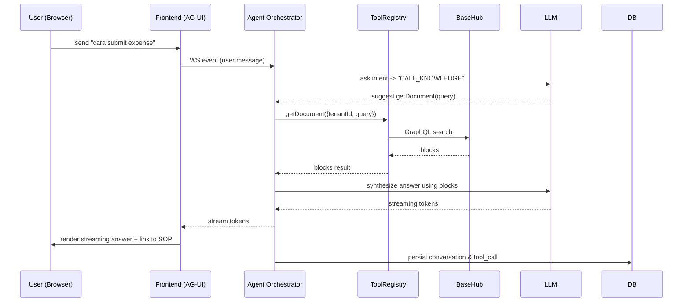

# Dokumen Perencanaan Proyek — SBA (Smart Business Assistant)

**Versi:** Mendalam — complete blueprint untuk development, deployment, dan operasional SBA menggunakan **AG-UI + BaseHub** pada model **multi-tenant SaaS**.
Dokumen ini ditulis untuk tim engineering (backend, frontend, infra), product, dan security/ops — penuh contoh teknis (DB schema, API contract, RLS, Zod), diagram terstandar (Mermaid UML), alasan desain, dan langkah aksi.

---

# 1. Executive Summary

## 1.1 Tujuan & Lingkup Singkat

SBA adalah platform SaaS yang menyediakan agen AI kontekstual untuk membantu organisasi mengakses knowledge base, mengotomasi dokumen/template, dan menjalankan workflow tugas melalui antarmuka percakapan yang kaya (streaming, interaktif).
**MVP scope**: conversational knowledge agent (read-only BaseHub), AG-UI chat (streaming), Agent Orchestrator with tool registry (`getDocument`, `renderDocument`, `createTask`), multi-tenant namespacing + basic auth.

## 1.2 Manfaat Bisnis

* **Efisiensi knowledge access**: cepatkan pencarian SOP/FAQ => kurangi waktu karyawan.
* **Automasi dokumen & workflow**: kurangi beban pembuatan laporan/manual.
* **Pengurangan beban support**: self-service bagi pelanggan.
* **Monetisasi**: skema tiered pricing (freemium → pro → enterprise).
* **Governance**: BaseHub versi & review memudahkan audit dan compliance.

## 1.3 Teknologi Utama

* **AG-UI**: runtime & client untuk agentic streaming UI, interrupts, shared state.
* **BaseHub**: headless CMS block-based (content, templates, localized variants).
* **LLM Provider**: OpenAI/Anthropic/On-prem model via adapter.
* **Core infra**: Node.js (NestJS/Express) Agent Orchestrator, Next.js frontend, Postgres, Redis, S3/R2, Vector DB optional (Pinecone/Milvus).
* **Observability**: OpenTelemetry, Prometheus, Grafana, Loki, Sentry.

---

# 2. Rancangan Arsitektur

> Semua diagram diberikan dalam Mermaid (notasi standar UML/sequence/component). Anda bisa mengekspor ke PNG/SVG untuk presentasi.

## 2.1 Domain Context — konteks & aliran data (high level)

```mermaid
flowchart LR
  subgraph CLIENT
    Browser[User Agent (Web/Mobile) - AG-UI Client]
  end

  subgraph AUTH
    Auth[Auth Provider (OIDC/SSO)]
  end

  subgraph PRESENTATION
    Frontend[Next.js (AG-UI Client)]
  end

  subgraph AGENT
    Orchestrator[Agent Orchestrator (Node/Nest)]
    Tools[Tool Registry]
    Session[Redis SessionStore]
    Model[Model Adapter (LLM)]
  end

  subgraph CMS
    BaseHub[BaseHub (tenant namespaced)]
    Blob[S3 / R2]
    Vector[VectorDB (optional)]
  end

  subgraph INTEGRATIONS
    ExtSys[External Systems (CRM / ERP / Task systems)]
    Billing[Stripe]
  end

  Browser -->|WS/HTTP| Frontend
  Frontend -->|auth| Auth
  Frontend -->|AG-UI events| Orchestrator
  Orchestrator -->|session| Session
  Orchestrator -->|call tool| Tools
  Tools -->|query| BaseHub
  Tools -->|store| Blob
  Tools -->|vector upsert/search| Vector
  Tools -->|external call| ExtSys
  Orchestrator -->|LLM| Model
  Orchestrator -->|audit/log| Postgres[(Postgres)]
  Billing -->|billing| Postgres
```

### Penjelasan singkat

* **Frontend (AG-UI client)**: bertanggung jawab menampilkan streaming tokens, UI components (cards, forms), mengelola lokal UI state.
* **Agent Orchestrator**: runtime yang menangani session, dialog management, tool invocation, backpressure/streaming, retry/circuit-breaker.
* **Tool Registry**: adapter ter-typed (KnowledgeTool, RenderTool, TaskTool, VectorTool).
* **BaseHub**: source-of-truth konten (blocks/templates/versioning).
* **Model Adapter**: abstraksi LLM provider sehingga mudah ganti vendor.

---

## 2.2 Bounded Contexts — detail per modul, fitur, kontrak

### 2.2.1 Conversation / Agent Context

* **Fitur**: sesi dialog, streaming responses, interrupts/human-in-loop, conversation history.
* **Komponen**: Agent Orchestrator, Session Store (Redis), Conversation Log (Postgres).
* **Kontrak**:

  * `POST /api/v1/session` → `{ sessionId }`
  * `WS /api/v1/session/{sessionId}` → bi-directional streaming (AG-UI events)
  * Tool call event format: `{ requestId, toolName, tenantId, params }`
* **Integrasi**: memanggil Tool Registry sync/async; menyimpan logs & telemetry.

### 2.2.2 Content / CMS Context (BaseHub)

* **Fitur**: block-based content, template library, localization (variants), commit/versioning.
* **Komponen**: BaseHub GraphQL API, Webhooks.
* **Kontrak**: GraphQL queries/mutations; service account token per tenant.
* **Integrasi**: KnowledgeTool queries BaseHub → returns blocks. BaseHub webhooks notify Orchestrator for cache invalidation.

### 2.2.3 Document Rendering & Assets

* **Fitur**: template merge → output (PDF/HTML/DOCX), store artifacts, optionally commit to BaseHub.
* **Komponen**: Render Worker (serverless or k8s job), BlobStore, Render Queue (BullMQ).
* **Kontrak**: `POST /tools/renderDocument` → returns `{ url, commitId }`.
* **Integrasi**: Orchestrator enqueues render job, streams progress to client.

### 2.2.4 Task & Workflow Context

* **Fitur**: create tasks, approvals, external task system sync (Asana/Jira).
* **Komponen**: Task service (Postgres+BullMQ), Integrator adapters.
* **Kontrak**: `createTask({ tenantId, title, assignee, metadata })`.

### 2.2.5 Tenant & Billing Context

* **Fitur**: provisioning, RBAC, quotas, billing usage.
* **Komponen**: Tenant DB (Postgres), Billing (Stripe), Provisioning scripts.
* **Kontrak**: `provisionTenant`, `getBillingUsage(tenantId)`.

### 2.2.6 Observability & Security Context

* **Fitur**: tracing, metrics, logs, audit trail.
* **Komponen**: OpenTelemetry, Prometheus, Grafana, Loki, Sentry, AuditStore.

---

## 2.3 Sequence diagram — typical KB query flow



---

# 3. Rencana Implementasi Multi-Tenant

## 3.1 Strategi Isolasi Data Tenant (pilihan & rekomendasi)

**Opsi A — Shared DB + Namespacing (RECOMMENDED for MVP)**

* Single Postgres instance, `tenant_id` on every tenant-scoped table. Implement **Postgres RLS** for enforcement.
* Per-tenant BaseHub workspace **namespacing** (prefer use workspace/namespace feature di BaseHub) or per-tenant prefix on blocks.

**Opsi B — Isolated DB / Dedicated schema per tenant**

* Untuk enterprise, migrasi ke schema/instance per tenant (higher isolation).

**Opsi C — Hybrid**

* Shared for small tenants; isolated for enterprise on demand.

**Alasan pemilihan**: Shared + RLS reduces operational cost and enables faster onboarding; RLS + audits mitigate leakage risk.

## 3.2 Mekanisme Autentikasi & Otorisasi

* **AuthN**: OIDC provider (Clerk/Auth0/Keycloak). Client obtains JWT with claims: `{ tenantId, userId, roles }`.
* **AuthZ**:

  * At gateway: verify JWT and extract tenant claim.
  * At application: enforce RBAC rules.
  * At DB: use Postgres RLS using `SET LOCAL app.current_tenant = '<tenantId>'` per connection.
* **SSO Enterprise**: SAML/OIDC federation support for enterprise.

## 3.3 Pola shared DB vs separate DB (trade-offs)

| Kriteria               | Shared DB (namespacing) | Isolated DB |
| ---------------------- | ----------------------: | ----------: |
| Cost                   |                     Low |        High |
| Operational overhead   |                     Low |        High |
| Data isolation         |            Medium (RLS) |        High |
| Scalability per tenant |                Moderate |        High |
| Migration complexity   |              Low → High |         N/A |

**Recommendation**: Start Shared DB + RLS, plan migration tooling.

## 3.4 Manajemen Konfigurasi per Tenant

* `tenant_config` table with JSONB `settings`. Example:

```sql
CREATE TABLE tenant_config (
  tenant_id uuid PRIMARY KEY,
  plan text,
  features jsonb,
  created_at timestamptz DEFAULT now()
);
```

* Feature flags: use Flagsmith/Unleash for dynamic flags per tenant.
* Secrets: per-tenant credentials (BaseHub tokens) stored in Vault; reference by secret name in `tenant_config`.

---

# 4. Integrasi AG-UI + BaseHub (Teknis)

## 4.1 Spesifikasi Teknis Integrasi (ringkasan)

* **Authentication**: Orchestrator holds BaseHub service token for cross-tenant calls; use tenant-specific scoped tokens where possible.
* **Access pattern**: KnowledgeTool performs GraphQL `searchBlocks(query, tenantId, topK)`; supports `locale` and `freshness` param.
* **Streaming**: Orchestrator streams partial LLM output to AG-UI client even while performing tool calls.
* **Webhooks**: BaseHub publishes webhook `content_updated` events to Orchestrator endpoint for cache invalidation.

## 4.2 Alur komunikasi antar komponen (detil)

1. User -> AG-UI client sends message via WS to Orchestrator (with JWT).
2. Orchestrator validates token, loads session from Redis.
3. Orchestrator calls LLM for high-level reasoning; LLM indicates `CALL_TOOL`.
4. Orchestrator invokes KnowledgeTool → GraphQL to BaseHub (include `tenantId`).
5. BaseHub returns blocks (with `commitId`, `version`, `locale`).
6. Orchestrator streams LLM synthesis to client, optionally includes structured UI attachments (cards linking to BaseHub block URLs).
7. If BaseHub publishes `content_updated`, Orchestrator invalidates cache and optionally pushes notification to active sessions.

## 4.3 Mekanisme sinkronisasi data & caching

* **Local cache**: store summaries & embeddings in `basehub_cache` (Postgres + Redis hot cache).
* **Vector index** (optional): upsert block embeddings for semantic search.
* **Cache invalidation**:

  * On BaseHub webhook `content_changed` → Orchestrator invalidates cache entries by block id for that tenant.
  * Background reindex job for top-k accessed blocks.
* **Optimistic read**: use `etag`/`commitId` to check freshness before using cached content.

## 4.4 Error handling & recovery

* **Tool result schema**:

```json
{ "success": boolean, "code": "TOOL_ERROR|RATE_LIMIT|NOT_FOUND", "message": "...", "retryable": true|false, "payload": {...} }
```

* **Retry policy**: Exponential backoff for transient errors (429/503), circuit breaker for repeated failures.
* **Fallbacks**:

  * LLM unavailable → use cached canned responses.
  * BaseHub rate limit → return cached content or escalate to human-in-loop.
* **Idempotency**: For side-effects (commit back to BaseHub, createTask), use `idempotencyKey` to avoid duplicates.
* **Observability**: record tool_call start/end, errors, duration; include `tenantId`, `sessionId`, `requestId` for traceability.

---

# 5. Roadmap Proyek (Fase & Timeline)

> Roadmap dibagi fase, tiap fase ada exit criteria (kelayakan), metrik, dan rencana test & deployment.

## Phase 0 — Foundation & Alignment (2 weeks)

* **Deliverables**: monorepo skeleton, BaseHub sandbox credentials, auth provider setup, IaC skeleton (Terraform), acceptance criteria matrix.
* **Exit Criteria**: dev env deployable; team punya BaseHub sandbox; OpenAPI minimal for tools.
* **Metrik**: dev env up, seeds available.

## Phase 1 — Core MVP (6 weeks)

* **Deliverables**: Agent Orchestrator skeleton, AG-UI chat integrated, KnowledgeTool (BaseHub read), session + Redis, basic logging.
* **Exit Criteria**: E2E demo: user queries KB -> streamed answer from agent using BaseHub content.
* **Testing**: unit, integration (mocked BaseHub), E2E with BaseHub sandbox.
* **Deployment**: dev → staging (manual verification) → rolling deploy.

## Phase 2 — Document Generation & Workflow (6–8 weeks)

* **Deliverables**: Render pipeline, Render worker, Task service + TaskTool, commit back to BaseHub functionality.
* **Exit Criteria**: Document generation produce downloadable artifact + stored metadata; tasks created and visible in dashboard.
* **Testing**: contract tests, e2e rendering, approval flow tests.

## Phase 3 — Multi-Tenant Harden & Billing (8–10 weeks)

* **Deliverables**: Postgres RLS enforced, tenant provisioning flows, billing (Stripe), quotas & rate limiting.
* **Exit Criteria**: on-board test tenant, billing invoice issued, quotas enforced.
* **Testing**: security tests (RLS), performance (multi-tenant load).

## Phase 4 — Scale & Enterprise (ongoing)

* **Deliverables**: vector search RAG, per-tenant model fine-tuning, integrations (CRM/ERP), SSO enterprise SAML, regional deployments.
* **Exit Criteria**: enterprise on-boarded, SLA met.

---

# 6. Metrik Keberhasilan (KPI & SLO)

## Product KPIs

* **Time to first useful answer**: median < 2s (cached), start streaming < 1s.
* **Self-serve resolution rate**: % queries resolved without human escalation (target > 70).
* **Documents generated / tenant / month**.

## Operational KPIs

* **LLM token usage per tenant** (billing).
* **Agent error rate**: < 1% critical errors.
* **P95 Latency**: tool calls p95 < 500ms (cached) / LLM response start < 3s.

## SLO examples

* 99% of agent sessions available (health) per month.
* 99% of web UI requests respond < 2000 ms (excluding streaming tokens).

---

# 7. Rencana Pengujian & Deployment

## Testing strategy

* **Unit tests**: domain logic, tool adapters.
* **Contract tests**: agent ↔ tools using pact-style mocks; OpenAPI + zod.
* **Integration tests**: BaseHub sandbox + orchestrator (CI job).
* **E2E tests**: Playwright/Cypress for key flows (KB query, generate doc).
* **Load tests**: k6 simulate concurrent sessions and measure latency & token usage.
* **Security tests**: SAST, DAST, pen test, RLS validation.

## CI/CD

* **CI**: GitHub Actions runs lint, unit tests, contract tests, pre-built preview image.
* **CD**: PR previews → merge to `main` → staging auto-deploy → manual approver → production.
* **Deployment pattern**: Canary or blue-green for orchestrator; frontend via Vercel.

---

# 8. Dokumentasi Pendukung (Artefak & Conten)

## 8.1 Diagram UML lengkap (list)

* Use Case Diagram (actors: Admin, User, Editor, Agent)
* Component Diagram (microservices + infra)
* Sequence Diagrams:

  * KB query
  * Render pipeline
  * Tenant provisioning
* Class/Entity diagrams for DB models (tenants, conversations, tool_calls, basehub_cache)

*(Mermaid examples included in repo `docs/diagrams`.)*

## 8.2 Spesifikasi API (contoh snippet)

### OpenAPI (partial) — `getDocument` endpoint

```yaml
openapi: 3.0.3
info:
  title: SBA Tool API
  version: 1.0.0
paths:
  /tools/getDocument:
    post:
      summary: Retrieve relevant blocks from BaseHub for a query
      requestBody:
        required: true
        content:
          application/json:
            schema:
              $ref: '#/components/schemas/KnowledgeToolParams'
      responses:
        '200':
          description: OK
          content:
            application/json:
              schema:
                $ref: '#/components/schemas/KnowledgeToolResult'
components:
  schemas:
    KnowledgeToolParams:
      type: object
      required: [tenantId, query]
      properties:
        tenantId: { type: string }
        query: { type: string }
        options:
          type: object
          properties:
            topK: { type: integer, default: 5 }
            locale: { type: string }
    KnowledgeToolResult:
      type: object
      properties:
        hits:
          type: array
          items:
            type: object
            properties:
              id: { type: string }
              title: { type: string }
              snippet: { type: string }
              score: { type: number }
```

## 8.3 Panduan konfigurasi lingkungan (ringkasan)

* **Local dev**: docker-compose (Postgres, Redis, MinIO) + env file `.env.development`; mock BaseHub or use BaseHub sandbox config.
* **Staging/Prod**: Terraform modules for VPC, RDS, Elasticache, S3, EKS/GKE; Helm charts for services.
* **Secrets**: use Vault or cloud secret manager; do not commit secrets in repo.

## 8.4 Daftar ketergantungan teknis

* Frontend: Next.js, react, AG-UI client library, shadcn UI, storybook.
* Backend: Node.js, NestJS/Express, Prisma, bullmq, zod, axios/graphql-request.
* Infra: Postgres, Redis, S3/R2, Vector DB (optional), Kubernetes.
* Observability: OpenTelemetry SDK, Prometheus, Grafana, Loki, Sentry.
* Third-party: BaseHub, LLM provider (OpenAI/Anthropic), Stripe.

---

# 9. Contoh Teknis — DB schema, RLS, Zod, Idempotency

## 9.1 Postgres schema snippets (core)

```sql
CREATE TABLE tenants (
  id uuid PRIMARY KEY,
  name text NOT NULL,
  plan text NOT NULL,
  created_at timestamptz DEFAULT now()
);

CREATE TABLE conversations (
  id uuid PRIMARY KEY,
  tenant_id uuid NOT NULL REFERENCES tenants(id),
  user_id uuid,
  state jsonb,
  created_at timestamptz DEFAULT now(),
  updated_at timestamptz DEFAULT now()
);

CREATE TABLE tool_calls (
  id uuid PRIMARY KEY,
  conversation_id uuid REFERENCES conversations(id),
  tenant_id uuid NOT NULL REFERENCES tenants(id),
  tool_name text,
  params jsonb,
  result jsonb,
  duration_ms int,
  success boolean,
  created_at timestamptz DEFAULT now()
);

CREATE TABLE basehub_cache (
  id uuid PRIMARY KEY,
  tenant_id uuid,
  block_id text,
  title text,
  snippet text,
  embedding vector,
  updated_at timestamptz
);
```

## 9.2 Postgres RLS example

```sql
-- enable rls
ALTER TABLE conversations ENABLE ROW LEVEL SECURITY;

-- ensure a function to set current tenant
CREATE FUNCTION set_tenant(tenant uuid) RETURNS void AS $$
BEGIN
  PERFORM set_config('app.current_tenant', tenant::text, true);
END;
$$ LANGUAGE plpgsql;

-- policy
CREATE POLICY tenant_isolation ON conversations
  USING (tenant_id = current_setting('app.current_tenant')::uuid);
```

Application must call `SELECT set_tenant('<tenant-id>')` per connection (or use connection wrapper/pooler setting).

## 9.3 Zod validation example (TS)

```ts
import { z } from "zod";

export const KnowledgeToolParams = z.object({
  tenantId: z.string().uuid(),
  query: z.string().min(1),
  options: z.object({
    topK: z.number().int().positive().optional(),
    locale: z.string().optional(),
    useVector: z.boolean().optional(),
  }).optional(),
});

export type KnowledgeToolParamsT = z.infer<typeof KnowledgeToolParams>;
```

## 9.4 Idempotency & tool call record

* Every side-effect tool receives `idempotencyKey` from orchestrator (UUID). Worker must record attempts; duplicate idempotencyKey => return previous result.

---

# 10. Observability & Monitoring (detail implementasi)

* **Tracing**: instrument frontend & backend with OpenTelemetry; propagate `tenantId`, `sessionId`, `requestId`.
* **Metrics (Prometheus)**:

  * `agent_sessions_active{tenantId}`
  * `tool_calls_total{tool,tenantId}`
  * `llm_tokens_used_total{tenantId}`
* **Dashboards**: Agent overview, Tool latency, Billing usage.
* **Alerts**:

  * Tool error rate > 5% in 5m
  * LLM provider 5xx rate > threshold
  * Cache miss ratio too high for top-k blocks

---

# 11. Security & Compliance (practical rules)

* **Least privilege**: service tokens limited by scope; per-tenant tokens stored in Vault.
* **Input sanitation**: all tool params validated by Zod; outputs sanitized before rendering as HTML.
* **Outbound allowlist**: all external endpoints accessed via egress proxy.
* **Audit trails**: content commits & document generations logged immutably.
* **Data residency**: support tenant regional storage for enterprise.

---

# 12. Backlog ringkas (initial sprints)

**Sprint 0 (2w)**: monorepo, BaseHub sandbox, auth provider, Terraform dev skeleton.
**Sprint 1 (2w)**: Agent Orchestrator skeleton, AG-UI minimal chat, KnowledgeTool (read), Redis session.
**Sprint 2 (2w)**: Logging, Postgres schema, RLS POC, seed content import.
**Sprint 3 (2w)**: Render pipeline prototype, Blob store, render worker.
**Sprint 4 (2w)**: Task service (BullMQ), TaskTool + mock external integration.
**Sprint 5 (2w)**: Multi-tenant hardening (RLS enforced), billing test (Stripe).

(Detail user stories, tasks & estimates bisa di-export ke CSV/Jira on demand.)

---

# 13. Runbooks singkat / Incident Playbooks

## 13.1 LLM provider outage

1. Enable fallback model via feature flag (ke cheaper model).
2. Notify users (banner) and log incident.
3. Scale down non-critical background tasks.

## 13.2 Suspected tenant data leak

1. Isolate tenant (freeze tokens), audit recent logs.
2. Rotate secrets, notify security & legal.
3. Remediate by fixing RLS or code causing leak, communicate post-mortem.

---

# 14. Alasan Desain & Trade-offs (ringkasan)

* **AG-UI**: dipilih karena streaming & composability (interrupt/sub-agent) — cocok untuk interactive agent UIs.
* **BaseHub**: block + versioning fit for content governance & templates.
* **Shared DB + RLS**: cepat go-to-market, cost effective; mitigasi lewat strong RLS & audits.
* **Model Adapter**: menghindari vendor lock-in.
* **Render worker + idempotency**: reliable document generation.

---

# 15. Next Actionable Steps (prioritas teratas)

1. **Buat BaseHub sandbox** + generate scoped service tokens per dev.
2. **Initialize monorepo** (Turborepo) skeleton: `apps/web`, `apps/api`, `packages/sdk`, `packages/tools`.
3. **Generate OpenAPI + Zod contracts** for tools (I can produce these now if Anda minta).
4. **Seed content** (20 FAQ, 10 SOP, 3 templates) ke BaseHub sandbox.
5. **Implement Sprint 1**: Orchestrator + AG-UI minimal + KnowledgeTool.

---

# Lampiran — Artefak contoh (ready-to-copy)

## A. Example Tool Call schema (JSON)

```json
{
  "requestId": "uuid-v4",
  "sessionId": "uuid",
  "tenantId": "uuid",
  "toolName": "getDocument",
  "params": { "query": "cara submit expense", "options": { "topK": 5 } },
  "idempotencyKey": "uuid-v4"
}
```

## B. Sample environment variables (minimal)

```
# frontend
NEXT_PUBLIC_API_URL=https://sba.example.com
NEXT_PUBLIC_AGUI_CLIENT=true

# backend
DATABASE_URL=postgres://...
REDIS_URL=redis://...
BASEHUB_SERVICE_TOKEN=secret
LLM_API_KEY=...
VAULT_ADDR=https://vault...
```

# 16. Analisis Komparatif (v2.0)

## 16.1 SWOT Analysis
- Strengths: AG-UI streaming, fokus multi-tenant, desain terukur dan modular.
- Weaknesses: Orchestrator/Tool Registry belum diimplementasi penuh, observability belum standar industri.
- Opportunities: Monetisasi dokumentasi/automation, pasar enterprise via RLS/OIDC.
- Threats: Outage LLM/provider, risiko kebocoran data tenant.

## 16.2 Feature Comparison Matrix (Scoring 1–5, Weighted)
| Fitur | Bobot | Blueprint | Implementasi |
|---|---:|---:|---:|
| Orchestrator & Tools | 0.10 | 4 | 1 |
| Knowledge (BaseHub) | 0.10 | 4 | 2 |
| Kinerja (p95 latency) | 0.15 | 4 | 3 |
| Throughput | 0.10 | 4 | 3 |
| Skalabilitas | 0.10 | 4 | 3 |
| Keamanan (OAuth2/RLS) | 0.15 | 4 | 2 |
| Observability | 0.10 | 4 | 2 |
| UX (SUS, onboarding) | 0.10 | 4 | 3 |
| Reliability | 0.05 | 4 | 3 |
| Maintainability | 0.05 | 4 | 3 |

## 16.3 Rekomendasi Pengembangan Prioritas
1. Bangun Orchestrator (NestJS) + Tool Registry ter-typed.
2. Integrasi OpenTelemetry + Prometheus; dashboard Grafana.
3. Terapkan Postgres RLS + OIDC/OAuth2.
4. Implement render pipeline + BullMQ workers.
5. Webhook BaseHub untuk cache invalidation + reindex blok populer.

## 16.4 Architecture Decision Records (ADRs)
- ADR-001: Shared DB + RLS untuk MVP.
- ADR-002: AG-UI sebagai UI runtime utama.
- ADR-003: Model Adapter untuk menghindari vendor lock-in LLM.

## 16.5 Component Interaction Diagrams
- Lihat `Smart Business Assistant/SBA_Diagram_Arsitektur_Components.svg`.

## 16.6 State Transition Diagrams
- Session: INIT → ACTIVE → PAUSED → COMPLETED/FAILED.
- Tool Call: PENDING → RUNNING → RETRYING → SUCCEEDED/FAILED.

## 16.7 Changelog v2.0
- Menambahkan Analisis Komparatif (SWOT, matriks fitur, scoring).
- Menambahkan tautan diagram komponen dan state.
- Menambahkan rekomendasi pengembangan prioritas.
