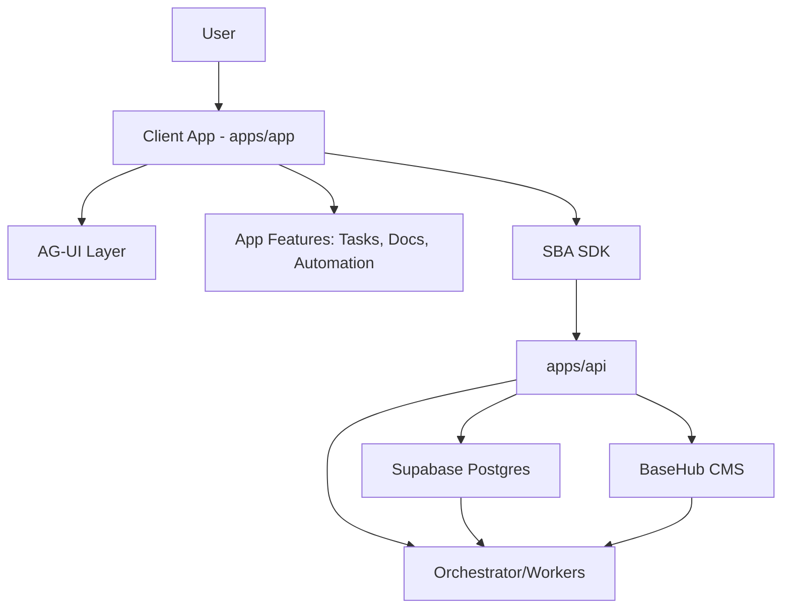
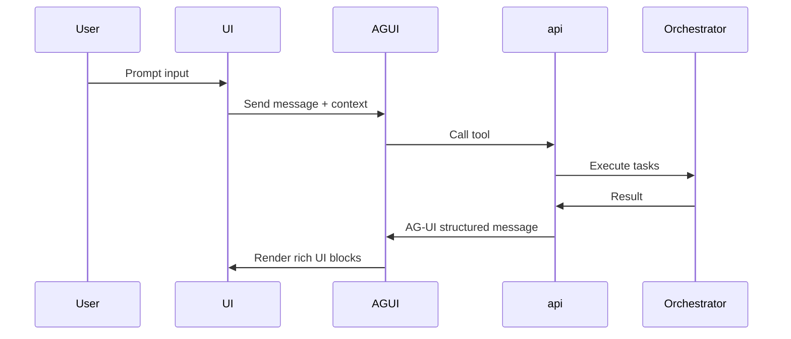

# **RANCANGAN LENGKAP & MENDALAM — `apps/app` (SBA-Agentic)**

Aplikasi **`apps/app`** adalah *SBA-Agentic Workspace App* yang berfungsi sebagai interface operasional inti di mana pengguna berinteraksi dengan AI Agent, menjalankan workflow bisnis otomatis, mengelola konteks kerja, dan berkolaborasi dalam satu workspace multi-tenant. Dokumen ini mendeskripsikan rancangan lengkap dan mendalam meliputi arsitektur, domain, modul, API, integrasi, serta standar UI/UX dan testing terbaru.

**Status**: 🔄 *Dalam Pengembangan Aktif* | **Versi**: 2.0 | **Last Update**: Desember 2025

---

# **1. TUJUAN & RUANG LINGKUP**

`apps/app` dirancang sebagai **Agentic Business Operations Hub** dengan fokus pada:

* Menyediakan agentic UI untuk interaksi manusia–AI
* Menjalankan task automation bisnis
* Mengaktifkan workflow dinamis per tenant
* Menyediakan panel kerja (work panels) yang berbeda per konteks
* Mengintegrasikan data BaseHub, Supabase, dan AG-UI Agents
* Mengelola project/workspace dengan fitur kolaboratif

Lingkup utama mencakup:

* Workspace-level app untuk end-user
* Interface AG-UI (agentic interface + shared UI model)
* Client orchestrator untuk interaksi AI workflow
* Modul tugas, dokumen, timeline, dan automation
* Multi-tenant personalization (layout, data, policy)

---

# **2. ARSITEKTUR APPS/APP**

## **2.1 High-Level Architecture**

`apps/app` dibangun dengan prinsip:

* **FSD (Feature-Sliced Design)** untuk modularitas UI
* **Agentic UX** menggunakan AG-UI
* **Data-driven UI** konsumsi dari BaseHub
* **Multi-tenant aware** dengan konteks workspace
* **SBA SDK** untuk API communication

### **Diagram High-Level** (mermaid)



---

# **3. STRUKTUR DIREKTORI (FSD Hybrid + Agentic Layer)**

```
apps/app
│
├── app/                  # Routing (Next.js App Router)
│   ├── (workspace)/      # Workspace-level routes
│   ├── (auth)/           # Authentication
│   ├── api/              # Edge API routes (if needed)
│   └── layout.tsx
│
├── features/             # FSD - business logic per feature
│   ├── agent-console/    # Chat, prompts, AG-UI bindings
│   ├── tasks/            # Task manager
│   ├── documents/        # BaseHub-driven document tools
│   ├── automation/       # Workflow automation
│   ├── timeline/         # Audit & activity
│   └── workspace/        # Settings, members
│
├── entities/             # Pure domain logic
│   ├── task/
│   ├── document/
│   ├── workflow/
│   └── user/
│
├── shared/               # UI components, hooks, utils
│   ├── ui/               # Atomic UI
│   ├── api/
│   ├── lib/
│   └── config/
│
└── agentic/              # Dedicated AG-UI layer
    ├── tools/            # Tool definitions
    ├── schemas/          # Zod types for AG-UI
    ├── states/           # Shared state management
    └── provider.tsx      # AG-UI client provider
```

---

# **4. DOMAIN MODEL — SBA AGENTIC APP**

## **4.1 Bounded Contexts**

| Bounded Context       | Deskripsi                     | Integrasi                    |
| --------------------- | ----------------------------- | ---------------------------- |
| Agent Console         | Interaksi AI/AG-UI            | Orchestrator, BaseHub, Tools |
| Tasking               | Manajemen tugas agent-driven  | API tasks, automation        |
| Document Intelligence | Read/write structured content | BaseHub, vector search       |
| Workflow Automation   | Task chaining, rules          | Worker, orchestrator         |
| Workspace             | Tenant-level config           | Apps/api, Supabase           |
| Timeline              | Audit & event stream          | EventStore                   |

---

# **5. FITUR UTAMA `apps/app`**

## **5.1 Agent Console (AG-UI Driven)**

* Chat interface + memory context
* Rich UI block rendering (AG-UI components)
* Command palette untuk agent actions
* Tool execution (search, summarization, task-creation, file ops)

## **5.2 Document Workspace**

* Explore, edit, versioning dokumen BaseHub
* Link document → agent prompt context
* Intelligent document suggestions

## **5.3 Task Manager**

* Create / assign / complete tasks
* Agent-autogenerated tasks
* Gantt/Kanban mode

## **5.4 Automation Builder**

* Workflow graph editor
* Trigger → Task → Output chaining
* Agent can auto-build automation

## **5.5 Timeline & Audit**

* Event log per workspace
* AI-generated summaries & insights

---

# **6. USER FLOW (HIGH LEVEL)**

### 6.1 Flow — Agent Console



### 6.2 Flow — Task Creation via Agent

* User mengetikkan command
* Agent mem-parsing dan membuat task
* Task tersimpan di DB
* UI memperbarui state

### 6.3 Flow — Document Intelligence

* User membuka dokumen
* AG-UI dapat menambah highlights, insights
* Semua editing tersinkron dengan BaseHub

---

# **7. IMPLEMENTASI TEKNIS**

## **7.1 Teknologi Utama & Standar**

* **Next.js 15 App Router** dengan React 18+ Server Components
* **TypeScript 5+** dengan strict mode
* **AG-UI Client SDK** untuk agentic interface
* **BaseHub Client** untuk CMS integration
* **SBA SDK** untuk API communication
* **Supabase Postgres** dengan RLS policies
* **Zustand** untuk client state management
* **ShadCN UI + Tailwind CSS 3.4+** dengan custom design system
* **Radix UI** untuk accessible components
* **Framer Motion** untuk animations
* **React Hook Form + Zod** untuk form validation
* **TanStack Query** untuk server state management

## **7.2 Client State Architecture**

* Local ephemeral: chat states, composing messages
* Server state: tasks, docs (SWR/React Query)
* Shared: AG-UI global states

## **7.3 API Access Pattern**

```
apps/app → SBA SDK → apps/api → DB, BaseHub, Orchestrator
```

---

# **8. INTEGRASI AG-UI**

## **8.1 Komponen Utama AG-UI Client**

* **AgentProvider**: root provider
* **Tool Registry**: mendefinisikan tool
* **UI Block Renderer**: interprets structured agent output
* **State Sync Layer**

## **8.2 Tooling Schema**

* getDocument
* renderDocument
* createTask
* searchVector
* commitContent

## **8.3 Dynamic Context Handling**

* Workspace context loaded during layout
* Tools automatically receive workspace-ID

---

# **9. MULTI-TENANT HANDLING (Client)**

## **Approach**

* Workspace prefix dalam route: `/app/{workspaceId}/...`
* Tenant config hydrated di server component layout
* Access control berdasarkan membership

---

# **10. SECURITY & PRIVACY**

* Edge-side validation
* Tenant-aware AG-UI tool policies
* Workspace isolation via RLS Supabase
* Secret & token isolation

---

# **11. STANDAR UI/UX & AKSESIBILITAS**

## **11.1 Design System & Component Standards**

### **Color Palette & Typography**
- **Primary**: `#0F172A` (slate-900) - Background utama
- **Secondary**: `#1E293B` (slate-800) - Cards & sections
- **Accent**: `#3B82F6` (blue-500) - Actions & CTAs
- **Success**: `#10B981` (emerald-500) - Success states
- **Warning**: `#F59E0B` (amber-500) - Warnings
- **Error**: `#EF4444` (red-500) - Errors
- **Text Primary**: `#F8FAFC` (slate-50) - Headings
- **Text Secondary**: `#CBD5E1` (slate-300) - Body text

### **Typography Scale**
```css
--font-heading: 'Inter', -apple-system, BlinkMacSystemFont, sans-serif;
--font-body: 'Inter', -apple-system, BlinkMacSystemFont, sans-serif;
--text-xs: 0.75rem;    /* 12px */
--text-sm: 0.875rem;   /* 14px */
--text-base: 1rem;     /* 16px */
--text-lg: 1.125rem;   /* 18px */
--text-xl: 1.25rem;    /* 20px */
--text-2xl: 1.5rem;    /* 24px */
--text-3xl: 1.875rem;  /* 30px */
--text-4xl: 2.25rem;   /* 36px */
```

### **Spacing & Layout**
```css
--space-1: 0.25rem;  /* 4px */
--space-2: 0.5rem;   /* 8px */
--space-4: 1rem;     /* 16px */
--space-6: 1.5rem;   /* 24px */
--space-8: 2rem;     /* 32px */
--space-12: 3rem;    /* 48px */
--space-16: 4rem;    /* 64px */
--radius-sm: 0.375rem;   /* 6px */
--radius-md: 0.5rem;      /* 8px */
--radius-lg: 0.75rem;     /* 12px */
--radius-xl: 1rem;        /* 16px */
```

## **11.2 Aksesibilitas WCAG 2.1 Level AA**

### **Color Contrast**
- **Normal text**: Minimal 4.5:1 contrast ratio
- **Large text**: Minimal 3:1 contrast ratio
- **Interactive elements**: Minimal 3:1 contrast ratio
- **Focus indicators**: Visible dengan outline 2px solid

### **Keyboard Navigation**
- **Tab order**: Logical dan predictable
- **Focus management**: Trap focus untuk modals
- **Skip links**: Untuk navigasi cepat ke konten utama
- **Keyboard shortcuts**: Standard patterns (Ctrl+K untuk command palette)

### **Screen Reader Support**
- **ARIA labels**: Semua interactive elements
- **Live regions**: Untuk status updates
- **Semantic HTML**: Proper heading hierarchy
- **Alt text**: Semua images dan icons

### **Motion & Animation**
- **Reduced motion**: Respects `prefers-reduced-motion`
- **Animation duration**: Max 200ms untuk micro-interactions
- **Loading states**: Clear feedback untuk async operations

## **11.3 Responsive Design**

### **Breakpoints**
```css
--mobile: 640px;   /* Max-width untuk mobile */
--tablet: 768px;   /* Min-width untuk tablet */
--desktop: 1024px; /* Min-width untuk desktop */
--wide: 1280px;    /* Min-width untuk wide screens */
```

### **Touch Targets**
- **Minimum size**: 44x44px untuk mobile
- **Spacing**: Minimal 8px antara targets
- **Hover states**: Disabled di touch devices

# **12. TESTING & QUALITY ASSURANCE**

## **12.1 Testing Strategy**

### **Unit Testing**
- **Framework**: Vitest + React Testing Library
- **Coverage target**: Minimal 80% untuk critical paths
- **Test files**: Co-located dengan components (`*.test.tsx`)
- **Mocking**: MSW untuk API calls, Zustand untuk state

### **E2E Testing**
- **Framework**: Playwright
- **Test scenarios**: Critical user journeys
- **Cross-browser**: Chrome, Firefox, Safari
- **Mobile testing**: Device emulation

### **Integration Testing**
- **API testing**: Supabase edge functions
- **Database testing**: RLS policies validation
- **Third-party**: BaseHub webhooks testing

## **12.2 Performance Testing**

### **Core Web Vitals Targets**
- **LCP (Largest Contentful Paint)**: < 2.5s
- **FID (First Input Delay)**: < 100ms
- **CLS (Cumulative Layout Shift)**: < 0.1
- **FCP (First Contentful Paint)**: < 1.8s

### **Bundle Size Monitoring**
- **Max initial bundle**: 200KB gzipped
- **Code splitting**: Route-based dan component-based
- **Lazy loading**: Untuk heavy components
- **Image optimization**: Next.js Image component

## **12.3 Bug Tracking & Reporting**

### **Bug Classification**
| Severity | Description | Response Time |
|----------|-------------|---------------|
| **Critical** | App crash, data loss | Immediate |
| **High** | Core feature broken | < 4 hours |
| **Medium** | UI/UX issues | < 24 hours |
| **Low** | Minor visual issues | < 72 hours |

### **Testing Checklist**
- [ ] Semua forms memiliki validation
- [ ] Error states ditangani dengan baik
- [ ] Loading states untuk async operations
- [ ] Empty states untuk data kosong
- [ ] Error boundaries implemented
- [ ] 404 dan error pages custom
- [ ] Print stylesheets (jika applicable)

# **13. ROADMAP `apps/app`**

## **Phase 1 — Foundation (Q4 2025)**

### **Milestone 1.1: Core Infrastructure**
- [x] Workspace shell dengan multi-tenant support
- [x] Authentication dengan Supabase Auth
- [x] Basic routing dengan Next.js App Router
- [ ] AG-UI integration dengan tool registry
- [ ] BaseHub CMS integration
- [ ] SBA SDK implementation

### **Milestone 1.2: Agent Console MVP**
- [ ] Chat interface dengan memory context
- [ ] Command palette untuk quick actions
- [ ] Basic tool execution (search, create task)
- [ ] Rich UI block rendering

## **Phase 2 — Core Features (Q1 2026)**

### **Milestone 2.1: Task Management**
- [ ] Task creation dan assignment
- [ ] Kanban board view
- [ ] Task automation dengan agent
- [ ] Task templates dan workflows

### **Milestone 2.2: Document Intelligence**
- [ ] BaseHub document explorer
- [ ] Real-time collaborative editing
- [ ] Document versioning dan history
- [ ] AI-powered document insights

### **Milestone 2.3: Timeline & Audit**
- [ ] Activity feed per workspace
- [ ] Event streaming dengan proper filtering
- [ ] AI-generated summaries
- [ ] Export capabilities

## **Phase 3 — Advanced Features (Q2 2026)**

### **Milestone 3.1: Workflow Automation**
- [ ] Visual workflow builder
- [ ] Trigger-based automation
- [ ] Custom action creation
- [ ] Integration dengan external services

### **Milestone 3.2: Analytics & Insights**
- [ ] Workspace analytics dashboard
- [ ] Agent performance metrics
- [ ] Usage patterns dan insights
- [ ] Custom reporting

## **Phase 4 — Enterprise Ready (Q3 2026)**

### **Milestone 4.1: Advanced Security**
- [ ] SAML/SSO integration
- [ ] Advanced RBAC dengan custom roles
- [ ] Audit logging lengkap
- [ ] Data residency options

### **Milestone 4.2: Scalability & Performance**
- [ ] Edge caching dengan Cloudflare
- [ ] Database optimization
- [ ] CDN untuk static assets
- [ ] Monitoring dan alerting

---

# **14. VERIFIKASI & PENERIMAAN**

## **14.1 Definition of Done**

### **Code Quality**
- [ ] Code review oleh minimal 1 developer
- [ ] All tests passing (unit, integration, e2e)
- [ ] No console errors atau warnings
- [ ] Performance metrics within targets
- [ ] Accessibility audit passed (Lighthouse > 90)

### **UI/UX Standards**
- [ ] Design system compliance verified
- [ ] Responsive design tested di semua breakpoints
- [ ] Cross-browser compatibility checked
- [ ] WCAG 2.1 AA compliance validated
- [ ] User feedback incorporated

### **Documentation**
- [ ] Component documentation updated
- [ ] API documentation lengkap
- [ ] User guides dan tutorials
- [ ] Deployment instructions
- [ ] Troubleshooting guides

## **14.2 Release Checklist**

### **Pre-Release**
- [ ] All features implemented sesuai spec
- [ ] Bug fixes dari testing cycles
- [ ] Performance optimization complete
- [ ] Security audit passed
- [ ] Backup dan rollback procedures tested

### **Release**
- [ ] Deployment ke staging environment
- [ ] Smoke testing di staging
- [ ] Production deployment dengan zero-downtime
- [ ] Monitoring dan alerting activated
- [ ] User communication sent

### **Post-Release**
- [ ] Health checks dan monitoring
- [ ] User feedback collection
- [ ] Bug tracking dan triage
- [ ] Performance monitoring
- [ ] Documentation updates

---

# **15. LAMPIRAN & REFERENSI**

## **15.1 Design Resources**
- [Figma Design System](link-ke-figma)
- [Component Library](link-ke-storybook)
- [Brand Guidelines](link-ke-brand-guide)

## **15.2 Development Resources**
- [API Documentation](link-ke-api-docs)
- [Component Documentation](link-ke-component-docs)
- [Testing Dashboard](link-ke-test-results)
- [Performance Monitoring](link-ke-performance)

## **15.3 External Dependencies**
- **AG-UI**: Agentic UI framework
- **BaseHub**: Headless CMS
- **Supabase**: Backend services
- **Vercel**: Hosting platform
- **Cloudflare**: CDN dan edge functions

---

**Dokumen ini akan terus diperbarui sesuai perkembangan project. Untuk pertanyaan atau saran, silakan hubungi development team.**

**Next Actions:**
1. Review dan validasi semua sections
2. Implementasi milestone 1.1 (infrastructure)
3. Setup testing frameworks
4. Create component library
5. Mulai development agent console MVP