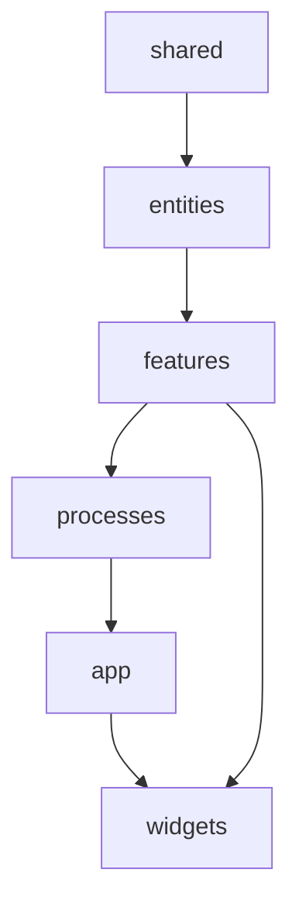
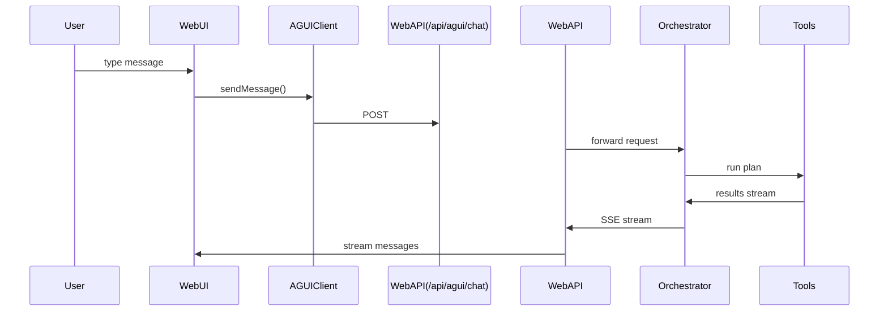
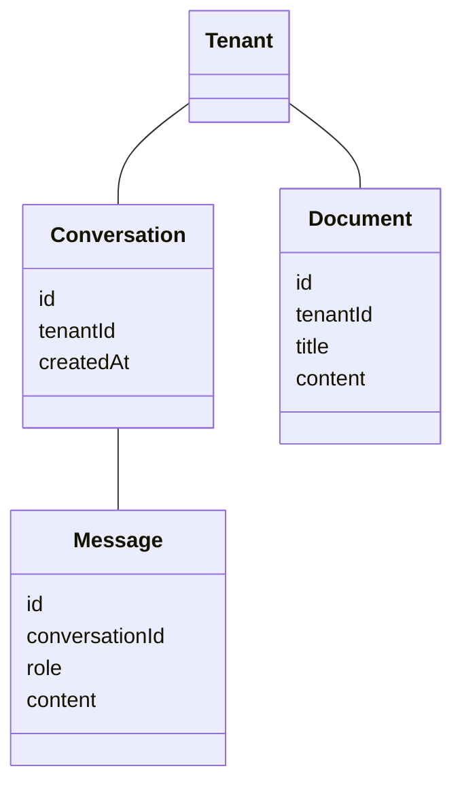
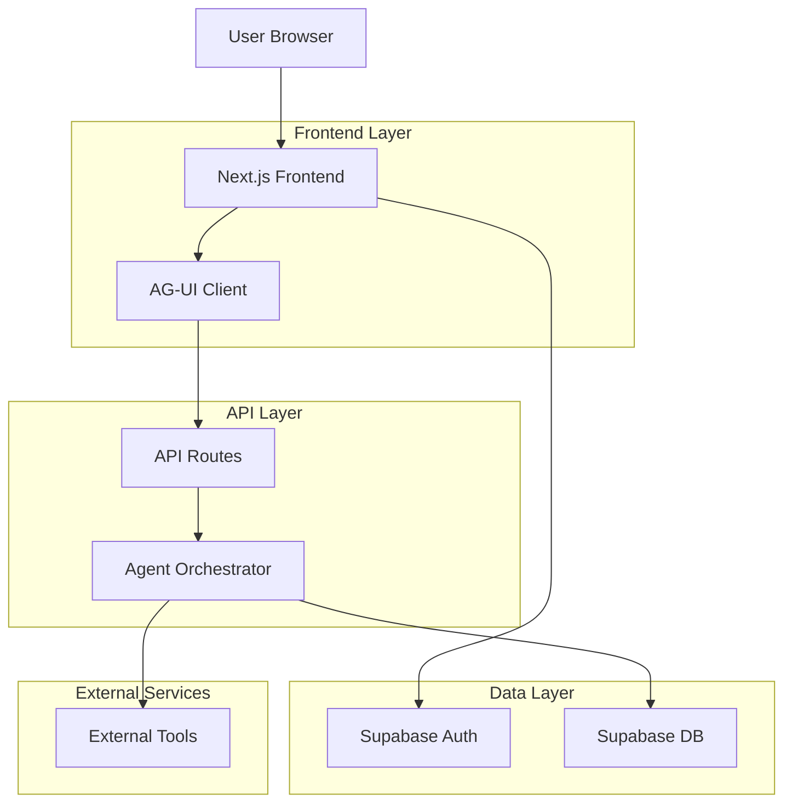
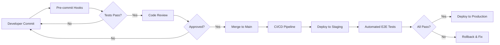

# Rancangan Lengkap & Mendalam — `apps/web` (SBA Agentic)

Dokumen ini menyajikan rancangan arsitektur mendalam untuk **apps/web** dalam monorepo SBA‑Agentic. Struktur disusun agar sepenuhnya selaras dengan prinsip: **FSD + Atomic Design + DDD entities + Agentic UI (AG‑UI) + Observability + Security‑First**.

---

# 1. Product Requirements Document (PRD) Ringkas

## 1.1 Visi Produk
Platform AI-Agentic untuk bisnis yang memungkinkan user berinteraksi dengan AI copilot untuk mengotomasi workflow, generate dokumen, dan mendapatkan insight bisnis melalui chat interface.

## 1.2 User Persona
| Persona | Deskripsi | Kebutuhan Utama |
|---------|-----------|----------------|
| Business User | Pengguna bisnis non-teknis | Chat-to-task, generate laporan, automasi workflow |
| Admin Tenant | Administrator perusahaan | Manage tenant, user management, konfigurasi integrasi |
| Developer | Integrator sistem | API access, webhook configuration, custom tool development |

## 1.3 Core Features
1. **AI Chat Interface** - Interaksi natural language dengan AI copilot
2. **Workflow Builder** - Visual drag-drop untuk membuat automasi
3. **Document Engine** - Generate & manage dokumen bisnis
4. **Multi-tenant Dashboard** - Overview performance per tenant
5. **Integration Hub** - Koneksi ke external services
6. **Knowledge Base** - SOP dan template management

---

# 2. Peran `apps/web` dalam Platform SBA

`apps/web` adalah **front‑end utama** untuk end‑user SBA yang menyediakan:

* Agentic UI (AI‑Copilot + Workflow + Tools)
* Dashboard insight bisnis
* Sistem chat‑to‑task, chat‑to‑workflow, chat‑to‑report
* Modul multi‑tenant (tenant switcher, konfigurasi tenant, akses role)
* Modul integrasi (hub integrasi berbasis provider)
* Dokumen (document engine)
* Knowledge (SOP, template, business rule manager)

`apps/web` dirancang untuk **production‑grade** dengan standar enterprise: CSP ketat, tidak ada inline scripts, error boundary terisolasi, telemetry bawaan, dan e2e coverage tinggi.

---

# 3. Arsitektur Utama `apps/web`

## 3.1 Prinsip Dasar

* **FSD (Feature‑Sliced Design)**
* **Atomic Design untuk UI internal & komponen packages/ui**
* **DDD Entities** untuk domain: Conversation, Message, Document, Workflow, Integration, Tenant, User
* **AG‑UI**: agentic components yang memanggil "tools" API di `apps/api`
* **Observability**: telemetry tracking + health/perf route
* **Multi-tenant aware**: setiap adapter & state harus menyertakan `tenantId`

---

# 4. UI/UX Design + Accessibility (a11y)

## 4.1 Design System
- **Primary Color**: `#0F172A` (slate-900) - Professional dark theme
- **Secondary Color**: `#3B82F6` (blue-500) - Interactive elements
- **Success**: `#10B981` (emerald-500)
- **Warning**: `#F59E0B` (amber-500)
- **Error**: `#EF4444` (red-500)

## 4.2 Typography & Spacing
- **Font Family**: Inter, system-ui, sans-serif
- **Base Size**: 16px dengan line-height 1.5
- **Spacing Scale**: 4px base (4, 8, 12, 16, 24, 32, 48, 64)

## 4.3 Accessibility Standards
- **WCAG 2.1 Level AA Compliance**
- **Keyboard Navigation**: Full tab support, skip links
- **Screen Reader**: ARIA labels, live regions untuk chat
- **Color Contrast**: Minimum 4.5:1 untuk text, 3:1 untuk large text
- **Focus Indicators**: Visible focus ring dengan 2px outline
- **Error Handling**: Clear error messages dengan context

## 4.4 Component Patterns
- **Chat Interface**: Message grouping, timestamp, typing indicators
- **Workflow Builder**: Drag-drop dengan keyboard support
- **Form Controls**: Clear labels, helper text, validation states
- **Loading States**: Skeleton screens, progress indicators
- **Empty States**: Helpful messages dengan action buttons

---

# 5. QA Gates & Quality Assurance

## 5.1 Pre-commit Gates
- **ESLint**: No warnings allowed
- **TypeScript**: Zero type errors
- **Prettier**: Consistent formatting
- **Unit Tests**: Minimum 80% coverage
- **Bundle Size**: < 200KB per route

## 5.2 Pre-merge Gates
- **Integration Tests**: All features tested
- **E2E Tests**: Critical user flows
- **Performance**: Lighthouse score > 90
- **Security**: Dependency vulnerability scan
- **Accessibility**: a11y tests pass

## 5.3 Pre-release Gates
- **Load Testing**: 1000 concurrent users
- **Cross-browser**: Chrome, Firefox, Safari, Edge
- **Mobile Testing**: iOS Safari, Chrome Android
- **Security Audit**: CSP, XSS, CSRF validation

---

# 6. Test Plan Strategy

## 6.1 Unit Testing (Vitest)
**Coverage Target**: 80% minimum
**Test Areas**:
- Entity models & business logic
- Feature hooks & services
- Utility functions
- API adapters

## 6.2 Integration Testing
**Test Areas**:
- Repository layer with Supabase
- Feature interactions
- Multi-tenant data isolation
- Authentication & authorization

## 6.3 E2E Testing (Playwright)
**Critical Flows**:
1. **User Registration & Login**
2. **Chat-to-Task Creation**
3. **Workflow Builder Drag-Drop**
4. **Document Generation**
5. **Multi-tenant Switching**
6. **Error Handling Scenarios**

## 6.4 Performance Testing
- **Page Load**: < 3 seconds on 3G
- **Time to Interactive**: < 5 seconds
- **Chat Response**: < 1 second latency
- **Bundle Analysis**: Weekly review

---

# 7. Release Management

## 7.1 Release Cycle
- **Sprint**: 2 weeks
- **Alpha**: Internal testing
- **Beta**: Customer preview
- **Production**: Full rollout with feature flags

## 7.2 Rollback Strategy
- **Database Migrations**: Reversible scripts
- **Feature Flags**: Instant toggle off
- **Blue-Green Deployment**: Zero downtime
- **Monitoring**: Real-time error tracking

## 7.3 Version Tagging
```
v1.0.0 - Initial release
v1.1.0 - Minor features
v1.1.1 - Bug fixes
v2.0.0 - Breaking changes
```

---

# 8. Checklist Verifikasi Final

## 8.1 Development Checklist
- [ ] All features implemented per PRD
- [ ] Unit tests > 80% coverage
- [ ] Integration tests pass
- [ ] E2E tests for critical flows
- [ ] TypeScript zero errors
- [ ] ESLint zero warnings
- [ ] All TODOs resolved

## 8.2 UI/UX Checklist
- [ ] Design system implemented
- [ ] Responsive design verified
- [ ] Accessibility tests pass
- [ ] Cross-browser testing complete
- [ ] Mobile experience optimized
- [ ] Loading states implemented
- [ ] Error handling visual

## 8.3 Performance Checklist
- [ ] Lighthouse score > 90
- [ ] Bundle size < 200KB per route
- [ ] Images optimized (WebP, lazy loading)
- [ ] Code splitting implemented
- [ ] Caching strategy deployed
- [ ] CDN configuration verified

## 8.4 Security Checklist
- [ ] CSP headers configured
- [ ] XSS protection enabled
- [ ] CSRF tokens implemented
- [ ] Input validation complete
- [ ] SQL injection prevention
- [ ] Rate limiting configured
- [ ] Security headers verified

## 8.5 Deployment Checklist
- [ ] Environment variables set
- [ ] Database migrations tested
- [ ] Feature flags configured
- [ ] Monitoring alerts active
- [ ] Error tracking enabled
- [ ] Performance monitoring
- [ ] Backup strategy verified

## 8.6 Documentation Checklist
- [ ] API documentation complete
- [ ] User guide created
- [ ] Admin manual written
- [ ] Deployment guide updated
- [ ] Troubleshooting guide
- [ ] Architecture diagrams
- [ ] Code comments adequate

---

# 9. Struktur High‑Level `apps/web`

```
apps/web
├── src
│   ├── app                → Next.js app router (routing, layouts, providers)
│   ├── entities           → DDD entities + model + repository
│   ├── features           → FSD features (chat, ai, dashboard, workflows)
│   ├── processes          → multi-step flows (auth, chat-to-report)
│   ├── shared             → ui, hooks, lib, api adapters
│   ├── widgets            → complex UI compositions
│   ├── components         → global components (rare; mostly tests)
│   ├── test               → test utils
│   └── types              → shims/zustand
│
├── e2e                    → e2e tests (Playwright)
├── docs                   → ADR, guidelines, security, deployment
├── middleware.ts          → auth, telemetry, security
└── next.config.js
```

---

# 10. Penjabaran Folder Kritis

## 10.1 `src/app/`

Mengelola:

* routing
* layouts
* providers
* server actions (opsional)
* API route handlers (`/api/agui/chat`, `/api/health`, `/api/telemetry`)

Routing selaras dengan domain:

```
app/
├── dashboard
├── chat
├── documents
├── integrations
├── knowledge
├── workflows
└── ai-copilot
```

## 10.2 `src/entities/` — DDD Entities

Contoh:

* `conversation`
* `message`
* `document`
* `workflow`
* `integration`
* `tenant`
* `user`

Pattern:

```
model.ts          → aggregate root (Conversation)
value-objects.ts   → VO (MessageText, DocTitle)
repository.ts      → interface repository
supabase-adapter.ts→ implementasi repository ke DB
```

Semua repository **multi-tenant aware** dengan param `tenantId`.

## 10.3 `src/features/` — Feature Sliced

Setiap fitur memiliki:

* components
* api
* hooks
* model
* types
* tests

Contoh: `features/chat/`

* `components/ChatWindow.tsx`
* `api/chat.api.ts`
* `model/chat.service.ts`
* `hooks/useChat.ts`
* `types.ts`
* `__tests__/` (unit + integration)

## 10.4 `src/processes/` — Multi-step Flows

Untuk proses kompleks/AI orchestrated. Contoh:

* `auth`
* `chat-to-report`
* `chat-to-workflow`
* `ai-copilot` orchestration (opsional)

Folder ini mewakili flow lintas features.

## 10.5 `src/shared/`

Berisi hal shared lintas proses dan features:

* **api** (adapters & client)
* **config** (architecture docs)
* **hooks** (a11y, theme)
* **lib** (supabase adapters, utilities)
* **ui** (ErrorBoundary, LoadingSpinner, Skeleton, dsb)

Pattern ini memastikan isolasi FSD tetap terjaga.

## 10.6 `src/widgets/`

Komposisi UI besar, seperti:

* `DashboardLayout`
* advanced panels
* multi-component composites

Widgets adalah komposisi dari features + shared.ui.

---

# 11. Integrasi AG‑UI dalam `apps/web`

`apps/web` mengonsumsi client AG‑UI dari package `@sba/agui-client` dan mengeksekusi tools melalui route:

```
/app/api/agui/chat/route.ts
```

Flow AG‑UI:

1. UI → memanggil `aguiClient.sendMessage` dengan metadata (tenantId, userId)
2. Route → proxy ke `apps/api` → Agent Orchestrator
3. Orchestrator → menjalankan tool plan (misal: search docs, generate report)
4. Web UI → menerima stream message kembali

---

# 12. Multi-Tenant Awareness di Frontend

### Dimana tenant dimasukkan?

* Auth provider → load tenant context
* Middleware → inject tenant
* Supabase adapters → require tenant scope
* Feature hooks → selalu param tenant

Patterns:

```
const { tenantId } = useTenant();
api.chat.send({ tenantId, ... })
```

Tenant config di-load via **`/api/tenant/config`** (server action atau route handler).

---

# 13. Observability & Telemetry

`apps/web` sudah memiliki:

* `api/health/metrics` (Prometheus)
* `api/telemetry` route
* Coverage artifacts (lcov, final JSON)
* E2E health/perf test

Enhancement SBA-Agentic:

* Track AG‑UI tool latency
* Track workflow-builder interactions
* Track chat-to-report performance
* User behavior analytics
* Business metrics dashboard

---

# 14. Security Architecture

Mengacu ke ADR-0001 + SECURITY-CSP-PERMISSIONS:

* CSP: NO inline javascript, strict-dynamic
* TrustedTypes
* Sanitization output AI
* Supabase adapters: RLS enforced
* Zod validation di boundaries
* ErrorBoundary untuk isolasi runtime
* Middleware rate‑limit untuk endpoint chat/tools
* OWASP Top 10 compliance
* Regular security audits
* Penetration testing schedule

---

# 15. Testing Strategy Detail

## 15.1 Unit Testing → `vitest`

* All features must include coverage minimal 80%
* Test business logic isolation
* Mock external dependencies
* Test error scenarios
* Property-based testing for critical functions

## 15.2 Integration Testing

* Repository → Supabase mock
* Feature hooks → real behavior
* Multi-tenant data isolation
* Authentication & authorization
* API contract testing

## 15.3 End-to-End (Playwright)

Folder lengkap sudah tersedia:

* A11y
* Chat
* Tools flow
* Workflow builder
* CSP
* Telemetry
* Multi-tenant scenarios
* Error recovery

## 15.4 Performance Testing

* Load testing: 1000 concurrent users
* Stress testing: Peak load scenarios
* Spike testing: Sudden load increases
* Endurance testing: 24-hour sustained load
* Browser memory leak detection
* API response time monitoring

---

# 16. Rencana Pengembangan untuk `apps/web`

## Fase 1 — Stabilizing Platform (Sprint 1-4)

* Perbaikan DDD entity boundaries
* Implementasi full tenant middleware
* Perbaikan UI tokens (theme)
* Complete test coverage
* Security audit
* Performance optimization
* Bug fixes & stability

## Fase 2 — Agentic UI Enhancement (Sprint 5-8)

* AG‑UI plan visualizer
* Realtime AI-copilot context
* Tool inspector
* Advanced chat features
* Voice input support
* Rich message formatting
* Chat history management

## Fase 3 — Knowledge Engine + Document Engine (Sprint 9-12)

* SOP builder
* Template suggestion engine
* Document generation with structured templates
* Version control for documents
* Collaborative editing
* Document approval workflow
* AI-powered content suggestions

## Fase 4 — Workflow Builder NG (Sprint 13-16)

* Drag/drop nodes improvement
* Execution trace view
* Conditional logic support
* Parallel execution
* Error handling workflows
* Workflow templates library
* Advanced scheduling

## Fase 5 — Observability & Insights (Sprint 17-20)

* Full user journey heatmap
* Business insight dashboard
* Predictive analytics
* Performance optimization
* Cost analysis tools
* ROI tracking
* Usage analytics
* Custom reporting

---

# 17. Deliverables `apps/web`

* FSD map + dependency rules
* Diagram arsitektur web layer
* Tenant middleware + config load
* AG‑UI integration blueprint
* UI/UX guidelines + design tokens
* Test suite (unit + integration + e2e)
* CI quality gates
* Security documentation
* Performance benchmarks
* Deployment automation
* Monitoring setup
* Documentation portal
* Training materials
* Support runbooks

---

# 18. Diagram (Konseptual)

## FSD Layering Diagram



## AG-UI Integration in Web



## Entity Relationship (Simplified)



## System Architecture Overview



## Quality Gates Pipeline



---

# 19. Penutup

Rancangan ini memetakan secara lengkap seluruh aspek `apps/web` pada SBA‑Agentic agar siap untuk fase modernisasi Agentic UI. Semua pola disusun untuk:

* Skalabilitas
* Keamanan
* Multi-tenant strict
* Integrasi AG‑UI dan Orchestrator
* Clean architecture (FSD + Atomic + DDD)
* Accessibility & inclusive design
* Production-ready quality
* Enterprise-grade standards

Siap untuk disambungkan dengan `apps/api`, `apps/orchestrator`, dan packages.*. Dokumen ini akan terus diperbarui sesuai perkembangan implementasi dan feedback dari pengguna.

**Status**: ✅ Dokumentasi lengkap dan siap untuk implementasi
**Next Steps**: Tim development dapat mulai implementasi berdasarkan rancangan ini dengan memastikan semua checklist terpenuhi sebelum setiap release.