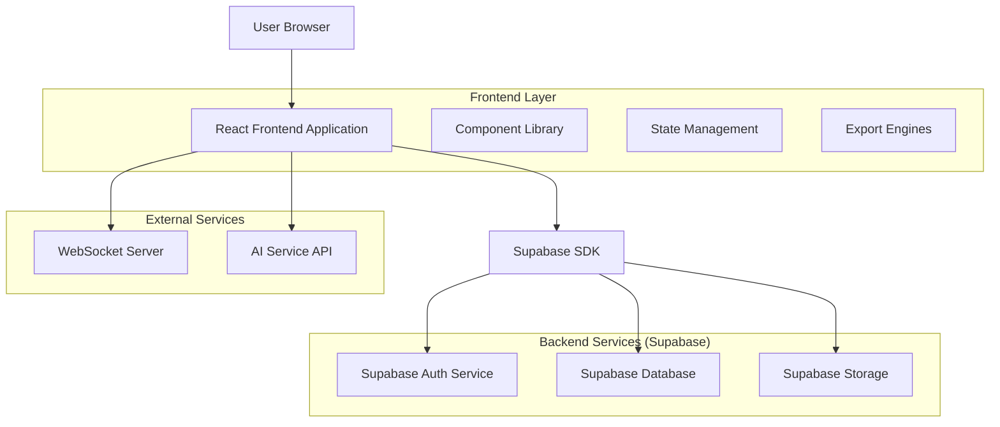
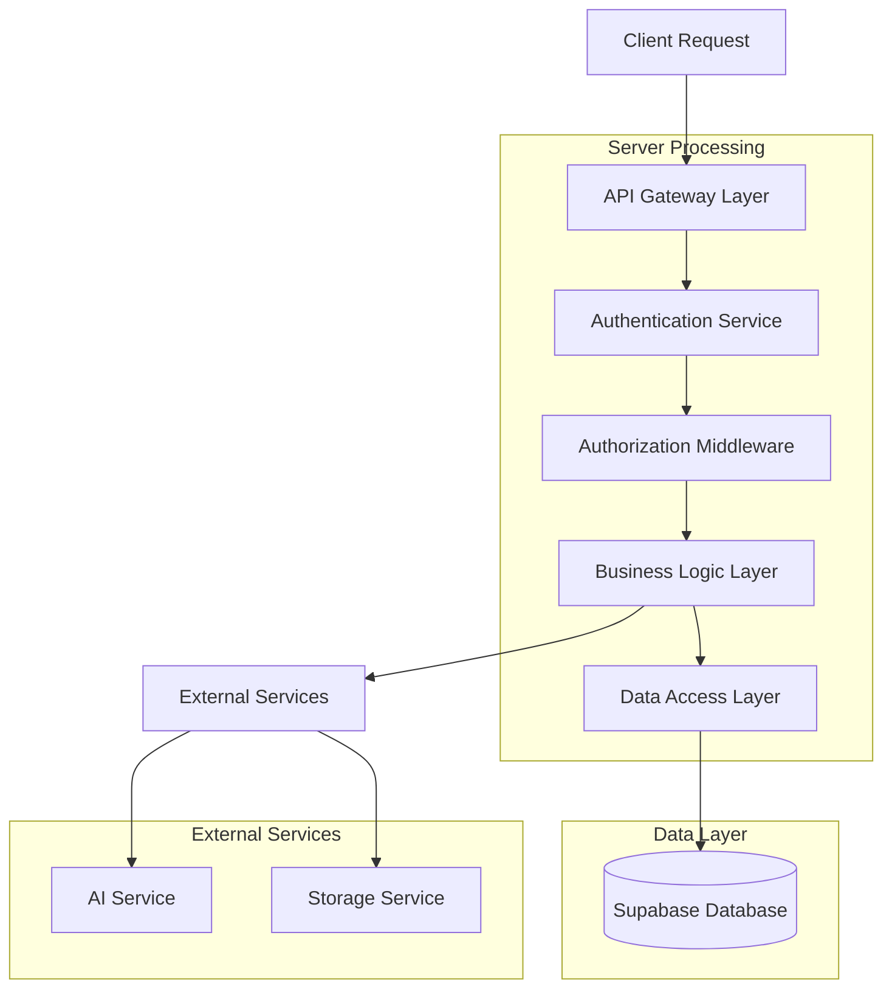
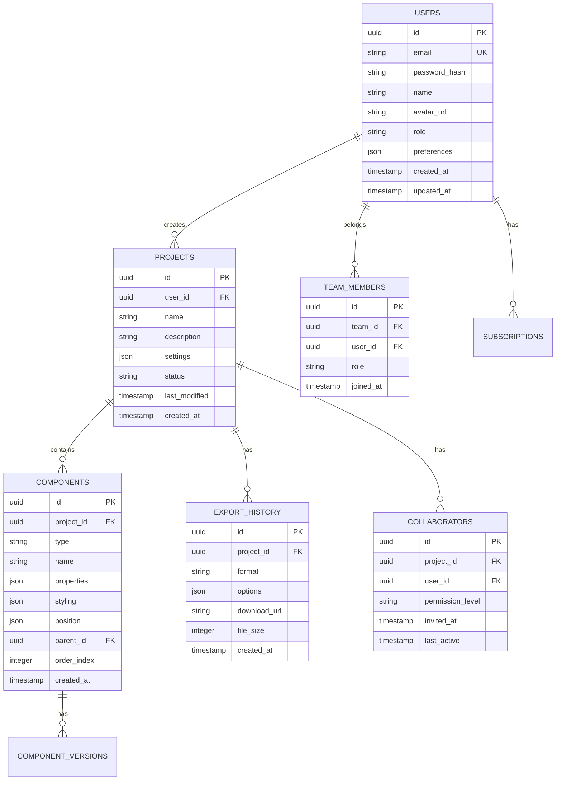
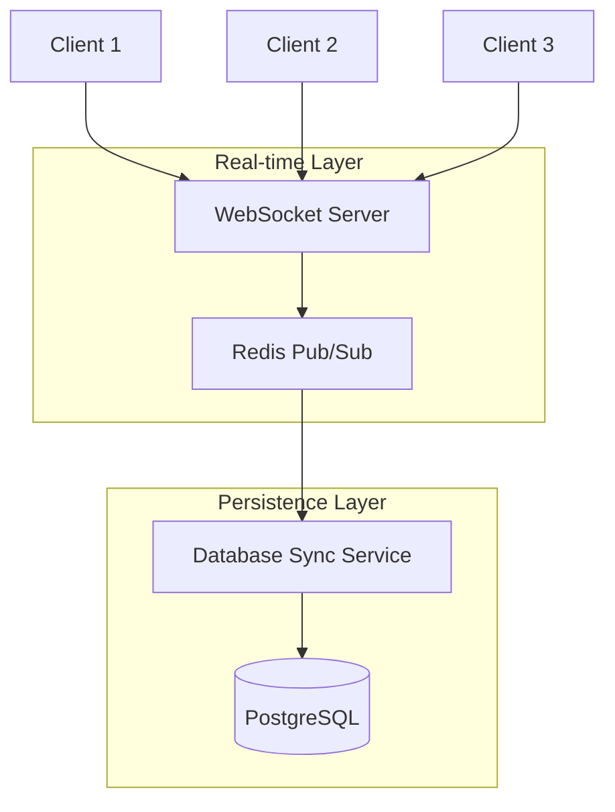
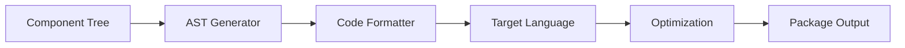

## 1. Architecture Design



## 2. Technology Description

- **Frontend**: React@18 + TypeScript + Vite
- **Styling**: TailwindCSS@3 + HeadlessUI
- **State Management**: Zustand + React Query
- **UI Components**: Custom component library + Radix UI
- **Real-time**: Socket.io client
- **Export Engines**: html2canvas, jsPDF, custom parsers
- **Initialization Tool**: vite-init
- **Backend**: Supabase (BaaS)
- **Database**: PostgreSQL (via Supabase)
- **Storage**: Supabase Storage
- **Authentication**: Supabase Auth
- **AI Integration**: OpenAI API (server-side)

## 3. Route Definitions

| Route | Purpose |
|-------|---------|
| / | Landing page dengan product showcase |
| /dashboard | Main dashboard untuk project management |
| /login | Authentication page dengan multiple providers |
| /register | User registration dengan email verification |
| /editor/:projectId | Visual editor utama |
| /preview/:projectId | Preview mode dengan device testing |
| /settings/:projectId | Project configuration dan team management |
| /library | Component library dan templates |
| /export/:projectId | Export center dengan format selection |
| /profile | User profile dan subscription management |
| /billing | Subscription dan payment management |
| /team | Team management untuk enterprise |
| /help | Documentation dan tutorial center |

## 4. API Definitions

### 4.1 Authentication APIs

```
POST /api/auth/login
```

Request:
| Param Name | Param Type | isRequired | Description |
|------------|-------------|-------------|-------------|
| email | string | true | User email address |
| password | string | true | User password |

Response:
| Param Name | Param Type | Description |
|------------|-------------|-------------|
| user | object | User data dengan profile info |
| session | object | JWT session token |
| access_token | string | Bearer token untuk API calls |

```
POST /api/auth/register
```

Request:
| Param Name | Param Type | isRequired | Description |
|------------|-------------|-------------|-------------|
| email | string | true | User email address |
| password | string | true | Min 8 characters |
| name | string | true | Display name |
| plan | string | false | 'free' \| 'pro' \| 'enterprise' |

### 4.2 Project APIs

```
GET /api/projects
```

Response:
| Param Name | Param Type | Description |
|------------|-------------|-------------|
| projects | array | Array of project objects |
| total_count | number | Total project count |
| pagination | object | Pagination metadata |

```
POST /api/projects
```

Request:
| Param Name | Param Type | isRequired | Description |
|------------|-------------|-------------|
| name | string | true | Project name |
| description | string | false | Project description |
| template_id | string | false | Template ID jika menggunakan template |
| settings | object | false | Initial project settings |

### 4.3 Export APIs

```
POST /api/projects/:id/export
```

Request:
| Param Name | Param Type | isRequired | Description |
|------------|-------------|-------------|
| format | string | true | 'html' \| 'react' \| 'vue' \| 'flutter' \| 'pdf' |
| options | object | false | Export-specific options |
| include_assets | boolean | false | Include assets in export |

Response:
| Param Name | Param Type | Description |
|------------|-------------|-------------|
| download_url | string | Temporary URL untuk download |
| expires_at | string | URL expiration timestamp |
| file_size | number | Size of exported file |

### 4.4 AI Assistant APIs

```
POST /api/ai/design-suggestions
```

Request:
| Param Name | Param Type | isRequired | Description |
|------------|-------------|-------------|
| project_data | object | true | Current project state |
| context | string | false | User context atau requirements |

Response:
| Param Name | Param Type | Description |
|------------|-------------|-------------|
| suggestions | array | Array of design suggestions |
| confidence | number | AI confidence score |
| reasoning | string | Explanation untuk suggestions |

## 5. Server Architecture Diagram



## 6. Data Model

### 6.1 Entity Relationship Diagram



### 6.2 Data Definition Language

#### Users Table
```sql
-- create table
CREATE TABLE users (
    id UUID PRIMARY KEY DEFAULT gen_random_uuid(),
    email VARCHAR(255) UNIQUE NOT NULL,
    password_hash VARCHAR(255) NOT NULL,
    name VARCHAR(100) NOT NULL,
    avatar_url TEXT,
    role VARCHAR(20) DEFAULT 'user' CHECK (role IN ('user', 'admin')),
    preferences JSONB DEFAULT '{}',
    created_at TIMESTAMP WITH TIME ZONE DEFAULT NOW(),
    updated_at TIMESTAMP WITH TIME ZONE DEFAULT NOW()
);

-- create indexes
CREATE INDEX idx_users_email ON users(email);
CREATE INDEX idx_users_created_at ON users(created_at DESC);
```

#### Projects Table
```sql
-- create table
CREATE TABLE projects (
    id UUID PRIMARY KEY DEFAULT gen_random_uuid(),
    user_id UUID NOT NULL REFERENCES users(id) ON DELETE CASCADE,
    name VARCHAR(255) NOT NULL,
    description TEXT,
    settings JSONB DEFAULT '{}',
    status VARCHAR(20) DEFAULT 'active' CHECK (status IN ('active', 'archived', 'deleted')),
    last_modified TIMESTAMP WITH TIME ZONE DEFAULT NOW(),
    created_at TIMESTAMP WITH TIME ZONE DEFAULT NOW()
);

-- create indexes
CREATE INDEX idx_projects_user_id ON projects(user_id);
CREATE INDEX idx_projects_created_at ON projects(created_at DESC);
CREATE INDEX idx_projects_status ON projects(status);
```

#### Components Table
```sql
-- create table
CREATE TABLE components (
    id UUID PRIMARY KEY DEFAULT gen_random_uuid(),
    project_id UUID NOT NULL REFERENCES projects(id) ON DELETE CASCADE,
    type VARCHAR(50) NOT NULL,
    name VARCHAR(255) NOT NULL,
    properties JSONB DEFAULT '{}',
    styling JSONB DEFAULT '{}',
    position JSONB DEFAULT '{}',
    parent_id UUID REFERENCES components(id) ON DELETE CASCADE,
    order_index INTEGER DEFAULT 0,
    created_at TIMESTAMP WITH TIME ZONE DEFAULT NOW()
);

-- create indexes
CREATE INDEX idx_components_project_id ON components(project_id);
CREATE INDEX idx_components_parent_id ON components(parent_id);
CREATE INDEX idx_components_type ON components(type);
```

#### Export History Table
```sql
-- create table
CREATE TABLE export_history (
    id UUID PRIMARY KEY DEFAULT gen_random_uuid(),
    project_id UUID NOT NULL REFERENCES projects(id) ON DELETE CASCADE,
    format VARCHAR(20) NOT NULL CHECK (format IN ('html', 'react', 'vue', 'flutter', 'pdf')),
    options JSONB DEFAULT '{}',
    download_url TEXT,
    file_size INTEGER,
    created_at TIMESTAMP WITH TIME ZONE DEFAULT NOW()
);

-- create indexes
CREATE INDEX idx_export_history_project_id ON export_history(project_id);
CREATE INDEX idx_export_history_created_at ON export_history(created_at DESC);
```

#### Collaborators Table
```sql
-- create table
CREATE TABLE collaborators (
    id UUID PRIMARY KEY DEFAULT gen_random_uuid(),
    project_id UUID NOT NULL REFERENCES projects(id) ON DELETE CASCADE,
    user_id UUID NOT NULL REFERENCES users(id) ON DELETE CASCADE,
    permission_level VARCHAR(20) DEFAULT 'view' CHECK (permission_level IN ('view', 'edit', 'admin')),
    invited_at TIMESTAMP WITH TIME ZONE DEFAULT NOW(),
    last_active TIMESTAMP WITH TIME ZONE,
    UNIQUE(project_id, user_id)
);

-- create indexes
CREATE INDEX idx_collaborators_project_id ON collaborators(project_id);
CREATE INDEX idx_collaborators_user_id ON collaborators(user_id);
```

### 6.3 Row Level Security (RLS) Policies

```sql
-- Enable RLS
ALTER TABLE projects ENABLE ROW LEVEL SECURITY;
ALTER TABLE components ENABLE ROW LEVEL SECURITY;
ALTER TABLE collaborators ENABLE ROW LEVEL SECURITY;

-- Projects policies
CREATE POLICY "Users can view their own projects" ON projects
    FOR SELECT USING (auth.uid() = user_id);

CREATE POLICY "Users can create projects" ON projects
    FOR INSERT WITH CHECK (auth.uid() = user_id);

CREATE POLICY "Users can update their own projects" ON projects
    FOR UPDATE USING (auth.uid() = user_id);

CREATE POLICY "Collaborators can view projects" ON projects
    FOR SELECT USING (
        EXISTS (
            SELECT 1 FROM collaborators
            WHERE collaborators.project_id = projects.id
            AND collaborators.user_id = auth.uid()
        )
    );

-- Components policies
CREATE POLICY "Users can manage components in their projects" ON components
    FOR ALL USING (
        EXISTS (
            SELECT 1 FROM projects
            WHERE projects.id = components.project_id
            AND (projects.user_id = auth.uid() OR
                 EXISTS (
                     SELECT 1 FROM collaborators
                     WHERE collaborators.project_id = projects.id
                     AND collaborators.user_id = auth.uid()
                     AND collaborators.permission_level IN ('edit', 'admin')
                 ))
        )
    );
```

## 7. Real-time Collaboration Architecture



### 7.1 Operational Transformation
- Implementasi operational transformation untuk concurrent editing
- Conflict resolution untuk simultaneous changes
- Version history dengan branching support
- Undo/redo system yang collaborative

### 7.2 Presence System
- Real-time cursor positions untuk all collaborators
- User activity indicators
- Typing indicators untuk text editing
- Selection highlighting untuk shared components

## 8. Export Engine Architecture

### 8.1 Multi-format Support
- **HTML/CSS**: Clean, semantic HTML dengan responsive CSS
- **React**: Functional components dengan hooks
- **Vue**: Single File Components (SFC)
- **Flutter**: Dart code dengan widget tree
- **PDF**: High-quality PDF dengan vector graphics

### 8.2 Code Generation Pipeline


## 9. Security Considerations

### 9.1 Authentication & Authorization
- JWT-based authentication dengan refresh tokens
- Role-based access control (RBAC)
- API rate limiting per user
- OAuth2 integration untuk Google, GitHub

### 9.2 Data Protection
- Encryption at rest untuk sensitive data
- HTTPS enforcement untuk all communications
- Input validation dan sanitization
- XSS prevention untuk user-generated content

### 9.3 Export Security
- Code sanitization untuk generated exports
- Malicious pattern detection
- Safe dependency management
- Sandboxed execution untuk preview mode

## 10. Performance Optimization

### 10.1 Frontend Optimization
- Code splitting dengan dynamic imports
- Virtual scrolling untuk large component lists
- Memoization untuk expensive computations
- Service worker untuk offline functionality

### 10.2 Backend Optimization
- Database query optimization dengan proper indexing
- Connection pooling untuk database connections
- Caching layer untuk frequently accessed data
- CDN integration untuk static assets

### 10.3 Real-time Performance
- Efficient WebSocket message batching
- Delta updates untuk component changes
- Compression untuk large data transfers
- Connection management untuk scalability