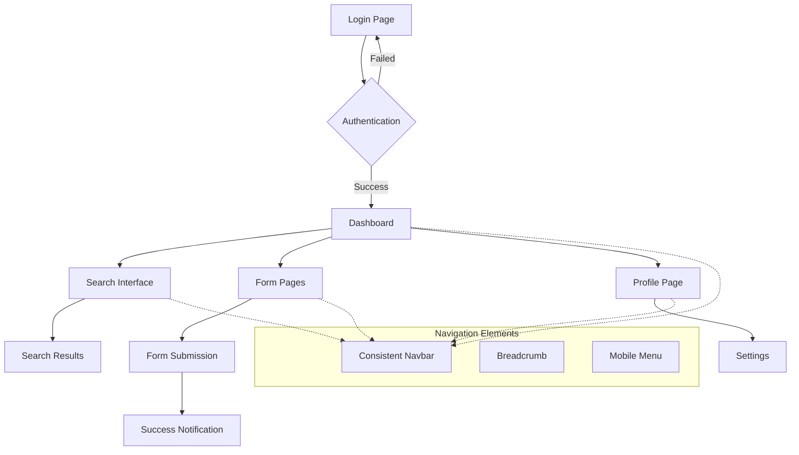

## 1. Product Overview
Aplikasi ini merupakan platform digital yang akan mengalami peningkatan signifikan dalam hal UI/UX untuk memberikan pengalaman pengguna yang lebih intuitif, konsisten, dan accessible. Fokus utama adalah pada konsistensi navigasi, desain mobile-first, dan kepatuhan terhadap standar aksesibilitas WCAG AA.

Proyek ini bertujuan memecahkan masalah navigasi yang tidak konsisten, kurangnya feedback visual, serta kurangnya optimalisasi untuk perangkat mobile yang menjadi mayoritas akses di Indonesia.

## 2. Core Features

### 2.1 User Roles
| Role | Registration Method | Core Permissions |
|------|---------------------|------------------|
| Regular User | Email registration, Social login (Google, Microsoft) | Browse content, submit forms, receive notifications |
| Premium User | Upgrade dari regular user | Akses fitur premium, dashboard analytics |
| Admin | Invitation-only | Manage users, konten, dan sistem |

### 2.2 Feature Module
Aplikasi ini terdiri dari halaman-halaman berikut:
1. **Login/Register**: Social login integration, form validation real-time, auto-save draft
2. **Dashboard**: Card-based layout, summary data, progress indicators
3. **Form Pages**: Auto-save functionality, real-time validation, visual feedback
4. **Search Interface**: Auto-suggest search, filter options, quick results
5. **Notification Center**: Toast messages, notification history, settings

### 2.3 Page Details
| Page Name | Module Name | Feature description |
|-----------|-------------|---------------------|
| Login Page | Social Login Integration | Integrasi login dengan Google dan Microsoft untuk akses cepat |
| Login Page | Form Validation | Validasi real-time untuk email dan password dengan feedback visual |
| Register Page | Auto-save Draft | Menyimpan data form secara otomatis untuk mencegah kehilangan data |
| Dashboard | Card Layout | Tampilan card-based dengan ikon dan ringkasan data penting |
| Dashboard | Progress Indicators | Visualisasi progress user dengan chart dan status indicators |
| Form Pages | Real-time Validation | Validasi input secara langsung dengan error messages |
| Form Pages | Visual Feedback | Loading spinner, success checkmark, error alerts |
| Search Page | Auto-suggest | Search bar dengan saran otomatis saat mengetik |
| Search Page | Filter Options | Filter hasil pencarian berdasarkan kategori dan relevance |
| All Pages | Consistent Navigation | Navbar konsisten dengan logo kiri dan menu kanan |
| All Pages | Breadcrumb Navigation | Indikator posisi user dalam hierarki halaman |
| All Pages | Mobile-first Design | Layout responsive dengan hamburger menu untuk mobile |
| All Pages | Accessibility Features | Kontras warna tinggi, keyboard navigation, alt text |
| All Pages | Micro-interactions | Hover effects, button ripple, smooth transitions |

## 3. Core Process

### Regular User Flow
1. User mengakses halaman login dengan opsi social login atau form tradisional
2. Setelah login, user diarahkan ke dashboard dengan card-based layout
3. User dapat mencari konten melalui search bar dengan auto-suggest
4. Saat mengisi form, data tersimpan otomatis dan divalidasi real-time
5. User menerima feedback visual melalui toast notifications
6. Navigasi yang konsisten memudahkan user berpindah antar halaman

### Admin Flow
1. Admin login dengan credential khusus
2. Akses ke admin dashboard dengan analytics dan user management
3. Manage konten dan user melalui interface yang konsisten
4. Monitor system performance dan user activities

## 4. User Interface Design

### 4.1 Design Style
- **Primary Colors**: Blue (#2563EB) untuk primary actions dan brand identity
- **Secondary Colors**: Gray (#6B7280) untuk teks sekunder dan borders
- **Accent Colors**: Green (#10B981) untuk success states dan positive feedback
- **Error Colors**: Red (#EF4444) untuk error states dan validation
- **Button Style**: Rounded corners (8px radius), consistent padding (12px 24px)
- **Typography**: Inter font family, 16px base size, proper hierarchy (14px, 16px, 20px, 24px, 32px)
- **Layout Style**: Card-based design dengan white space yang optimal
- **Icon Style**: Outline icons dengan 2px stroke width, konsisten dalam gaya
- **Shadow System**: Subtle shadows (0 1px 3px rgba(0,0,0,0.1)) untuk depth

### 4.2 Page Design Overview
| Page Name | Module Name | UI Elements |
|-----------|-------------|-------------|
| Login Page | Social Login | Google/Microsoft buttons dengan brand colors, 48px height, clear labels |
| Login Page | Form Input | 44px minimum height, placeholder text, helper text, error states |
| Dashboard | Card Layout | Grid 12-column system, card spacing 24px, hover effects |
| Dashboard | Progress Chart | SVG charts dengan animation, color-coded status indicators |
| Form Pages | Input Fields | Floating labels, real-time validation icons, character counters |
| Form Pages | Submit Button | Primary CTA dengan loading state, success animation |
| Search Page | Search Bar | 100% width mobile, 400px desktop, auto-suggest dropdown |
| Search Page | Filter Chips | Rounded tag style, active state dengan background color |
| Navigation | Navbar | Sticky header, 64px height, logo 32px, consistent menu items |
| Navigation | Mobile Menu | Hamburger icon, slide-in drawer, touch-friendly targets (48px) |
| Notifications | Toast Messages | Bottom-right position, 4px border radius, auto-dismiss 5s |
| Accessibility | High Contrast | WCAG AA compliant color ratios (4.5:1 for normal text, 3:1 for large text) |

### 4.3 Responsiveness
- **Desktop-first approach**: Tetapi dengan pertimbangan mobile-first dalam desain
- **Breakpoints**: 640px (mobile), 768px (tablet), 1024px (desktop), 1280px (large desktop)
- **Touch Optimization**: Minimum 44px touch targets, proper spacing untuk prevent accidental taps
- **Lazy Loading**: Gambar dimuat bertahap menggunakan Intersection Observer API
- **Performance**: Critical CSS inline, deferred JavaScript, optimized images (WebP format)
- **Mobile Navigation**: Hamburger menu dengan smooth transitions, bottom navigation untuk aplikasi mobile
- **Flexible Layout**: Container max-width 1280px, fluid grid system, proper gutters (16px mobile, 24px desktop)