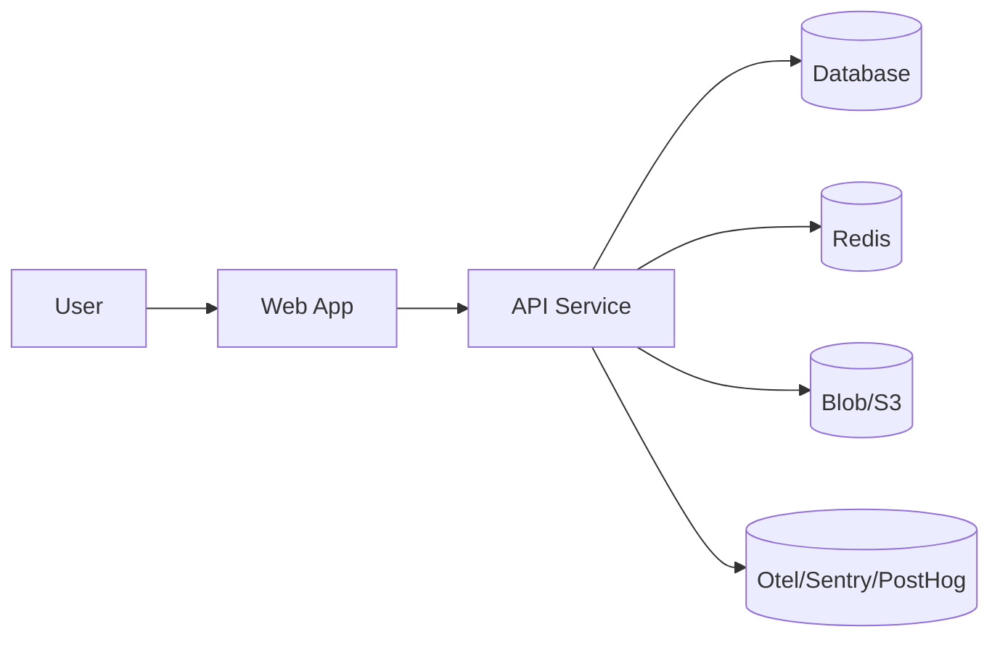

# Arsitektur Sistem SBA

## Diagram Konteks (Mermaid)

## Bounded Contexts (DDD)
- Conversation/Agent
- Knowledge (CMS/BaseHub)
- Document/Render
- Task/Workflow
- Tenant/Billing
- Observability/Security

## FSD (Frontend)
- app → processes → widgets → features → entities → shared

## Turbo Monorepo
- Tasks: build/dev/lint/test/typecheck; outputs `dist/**`/`.next/**`/`coverage/**`.

## Data Flow Utama
1. Chat → Tool Call
2. Knowledge Query → Render Document
3. Task Scheduling & Execution
4. Observability & Alerts

