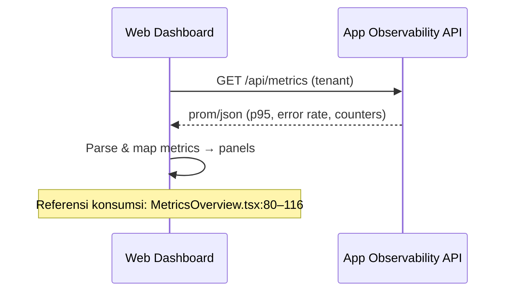

# Analisis Komparatif SBA-Agentic: apps/app vs apps/web

## Ringkasan Eksekutif

* `apps/app` berperan sebagai portal operasional agentic, kontrol eksekusi, dan sumber metrik observability; `apps/web` sebagai frontend modular berlapis (FSD/DDD/Atomic) yang menyatukan pengalaman pengguna dan konsumsi metrik.

* Keduanya selaras dengan visi Agentic (Reasoning, Multimodal, Interrupts, Meta Events) dan saling melengkapi: App menyediakan kontrol, keamanan, dan metrik; Web menyajikan UX terpadu dan fitur kolaborasi.

* KPI utama: latency p95/p99, error rate, throughput, health; diekspor oleh App dan dikonsumsi oleh Web.

## 1. Perbandingan Objective

* Tujuan Bisnis Utama

  * `apps/app`

    * Operasional agentic: kontrol `runs/agents`, observability terlabel tenant, RBAC, rate limit Upstash, Supabase integration

    * Siap canary go-live 5% dengan pengamatan aktif (p95 ≤ 500ms, error rate ≤ 0.5%)

    * Referensi: `/home/inbox/smart-ai/sba-agentic/README.md:141`, `/home/inbox/smart-ai/sba-agentic/README.md:162–166`

  * `apps/web`

    * UX/UI modular: dashboard agregasi, chat agentic, workflows builder, knowledge hub, integrasi

    * Health/telemetry, CSP report, aksesibilitas baseline

    * Referensi: `/home/inbox/smart-ai/sba-agentic/docs/README.md:50–55`

* Keselarasan Strategis

  * Kedua platform mengimplementasikan fitur Agentic (Reasoning, Multimodal, Interrupts, Meta Events)

  * Referensi: `/home/inbox/smart-ai/sba-agentic/README.md:22–35`, `/home/inbox/smart-ai/sba-agentic/docs/README.md:7–9`

* Metrik Keberhasilan (KPI)

  * App: ekspor `sba_latency_p95_seconds`, `sba_error_rate_percent`, `sba_throughput_rps` dan registry

    * Referensi: `/home/inbox/smart-ai/sba-agentic/apps/app/src/app/api/metrics/prometheus/route.ts:46–50`

  * Web: konsumsi metrik via `NEXT_PUBLIC_APP_URL` dan render panel

    * Referensi: `/home/inbox/smart-ai/sba-agentic/apps/web/src/features/dashboard/components/MetricsOverview.tsx:80–116`

* Evaluasi Pelengkap vs Tumpang Tindih

  * Pelengkap: App sebagai provider metrik & kontrol; Web sebagai consumer/UX

  * Tumpang tindih: dashboard, knowledge, integrations pada keduanya

## 2. Perbandingan Use Case

* Mapping Use Case & Aktor

  * `apps/app`

    * Auth/i18n, Dashboard analitik, Runs & kontrol agen, Observability/metrics, Knowledge (ingest/search), Integrations hub, Monitoring/Insights, Workspaces/Tasks, API docs

  * `apps/web`

    * Chat & Agentic runtime UI, Knowledge hub, Workflows builder, Dashboard agregasi, AI Copilot, Documents engine, Integrations hub, Admin meta-events

  * Aktor: Pengguna akhir, Admin/Operator, Developer/Integrator, Sistem/Agen, Tenant Admin

* Kesamaan & Perbedaan User Flow

  * Kesamaan: login → dashboard → navigasi fitur (knowledge/integrations)

  * Perbedaan: App mengalir ke kontrol runs/observability; Web mengalir ke percakapan/chat, builder workflows, meta-events

* Diagram Use Case (Sequence)

## 3. Perbandingan Functional Requirements

* Daftar Fitur & Prioritas

  * App: RBAC (tinggi), Rate Limit Upstash (tinggi), Tenant Header (tinggi), Metrics Registry (tinggi), Agents/Runs API (tinggi), Observability UI (sedang), Knowledge/Integrations API (sedang)

  * Web: Dashboard agregasi (tinggi), Chat runtime (tinggi), Knowledge Hub (sedang-tinggi), Workflows Builder (sedang-tinggi), Meta-events UI (sedang), Telemetry/CSP report (sedang)

* Perbedaan Implementasi Teknis

  * Observability: App ekspor prom text (runtime `nodejs`, `@supabase/ssr`), Web konsumsi via `NEXT_PUBLIC_APP_URL`

    * Referensi: `/home/inbox/smart-ai/sba-agentic/apps/app/src/app/api/metrics/prometheus/route.ts:64–71`, `/home/inbox/smart-ai/sba-agentic/apps/web/src/features/dashboard/components/MetricsOverview.tsx:77–86`

  * Keamanan: App `withRBAC` + `rate limit`; Web CSP report/sanitasi UI

    * Referensi: `/home/inbox/smart-ai/sba-agentic/apps/app/src/app/api/metrics/prometheus/route.ts:59–62`, `/home/inbox/smart-ai/sba-agentic/docs/README.md:33–39`

  * Data: App hitung `task_runs` via Supabase; Web gunakan adapter/clients untuk agregasi tampilan

    * Referensi: `/home/inbox/smart-ai/sba-agentic/apps/app/src/app/api/metrics/prometheus/route.ts:40–44`

* Matriks Konsistensi (ringkas)

  * KPI tersedia lintas platform, tenant header enforced (App), konsumsi aman (Web)

* Gap Fungsional

  * UI kontrol runs/agents lebih kuat di App; Web belum sepenuhnya menyetarakan kontrol eksekusi

  * Workflows builder lebih matang di Web dibanding halaman khusus di App

## 4. Analisis Integrasi

* Mekanisme Interaksi

  * Web → App untuk `metrics/health` menggunakan `base = NEXT_PUBLIC_APP_URL`, RBAC di App

    * Referensi: `/home/inbox/smart-ai/sba-agentic/docs/README.md:46–49`

* Titik Sinkronisasi Data

  * Pull-based fetch dashboard; label tenant wajib melalui `ensureTenantHeader`

    * Referensi: `/home/inbox/smart-ai/sba-agentic/apps/app/src/app/api/metrics/prometheus/route.ts:56–58`

* Konsistensi UX

  * Keduanya memakai `@sba/ui`; Web terstruktur FSD/Atomic untuk komposisi

* Keamanan & Performa

  * App: CSP nonce, rate limit, RBAC; Web: CSP report, a11y baseline

  * Target SLO: p95 ≤ 500ms, error rate ≤ 0.5% (canary)

    * Referensi: `/home/inbox/smart-ai/sba-agentic/README.md:141`, `/home/inbox/smart-ai/sba-agentic/docs/README.md:88–90`

## 5. SWOT

* App

  * Strengths: observability kuat, kontrol runs/agents, keamanan ketat, multi-tenant

  * Weaknesses: UX generik untuk sebagian fitur, ketergantungan runtime nodejs untuk prom

  * Opportunities: perluas UI kontrol agents/runs, expose SDK publik

  * Threats: beban metrik tinggi tanpa sampling, ketergantungan Supabase

* Web

  * Strengths: UX modular kaya fitur (chat, workflows, knowledge), konsistensi FSD/Atomic

  * Weaknesses: bergantung pada App untuk observability; potensi ketidakselarasan RBAC

  * Opportunities: integrasi lebih dalam ke kontrol eksekusi, unified UX lifecycle

  * Threats: risiko CSP/report pada edge, variasi performa lintas viewport

## 6. Benchmarking UX/UI

* Aksesibilitas: gunakan baseline a11y di kedua platform (Playwright/Jest Axe); cek fokus, ARIA, keyboard

* Performa: kumpulkan LCP/INP halaman utama; bandingkan render panel metrik Web vs App

* Konsistensi: audit penggunaan `@sba/ui` dan desain tokens

## 7. Data & Metodologi

* Analisis Kode: rute `metrics` & konsumsi dashboard (lihat referensi file-path:line di atas)

* Wawancara: Admin/Operator, Pengguna, Developer/Integrator, Tenant Admin; instrumen disertakan terpisah

* Analytics: `GET /api/metrics` dan health JSON untuk p95/error rate dan throughput, observasi ≥ 4 jam canary

## 8. Rekomendasi Strategis & Roadmap

* Standarisasi sumber metrik: App sebagai provider; Web konsumsi via SDK dengan tenant header otomatis

* Harmonisasi RBAC guard di Web untuk operasi sensitif

* Sediakan UI konsisten untuk kontrol runs/agents di Web atau deep-link ke App

* Target KPI lintas platform dan pipeline a11y/performa yang sama

* Roadmap kuartalan: konsolidasi observability SDK, harmonisasi RBAC, penyelarasan kontrol eksekusi, penguatan a11y

## Lampiran

* XRef Workspace: `/home/inbox/smart-ai/sba-agentic/workspace/_xref.md:45–70,98–127,158–185,215–239`

* Dokumentasi Operasional: `/home/inbox/smart-ai/sba-agentic/docs/README.md:41–55,67–93`

* Arsitektur Observability: `/home/inbox/smart-ai/sba-agentic/README.md:181–206`

