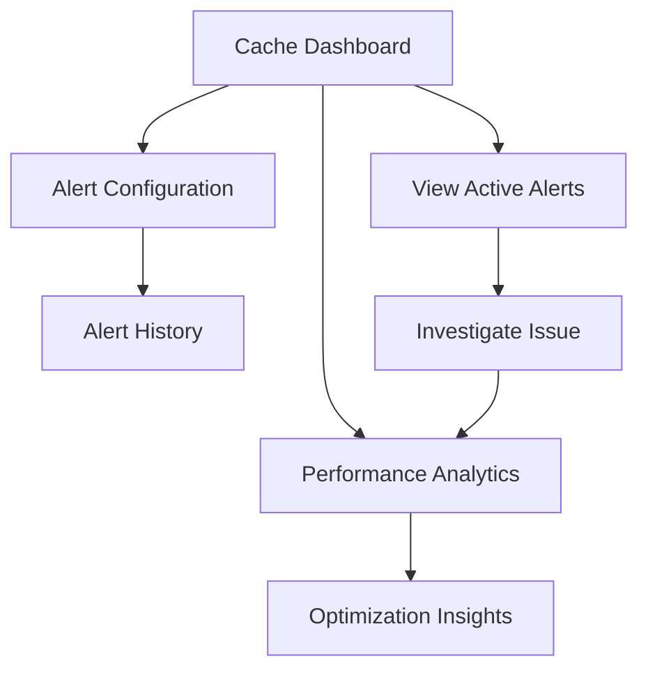

## 1. Product Overview
Cache Effectiveness monitoring page provides real-time visibility into cache performance metrics, hit ratios, and alerts for the SBA-Agentic system. This helps administrators and developers optimize cache usage and identify performance bottlenecks.

The page displays comprehensive cache metrics from existing Grafana endpoints and provides actionable alerts when cache performance degrades below acceptable thresholds.

## 2. Core Features

### 2.1 User Roles
| Role | Registration Method | Core Permissions |
|------|---------------------|------------------|
| System Administrator | Pre-configured | Full access to all cache metrics, configuration, and alerts |
| Developer | Email registration | View cache metrics, receive alerts, basic configuration |
| Viewer | Guest access | Read-only access to cache metrics dashboard |

### 2.2 Feature Module
Our cache effectiveness monitoring consists of the following main pages:
1. **Cache Dashboard**: Real-time metrics display, hit/miss ratios, response times, memory usage.
2. **Alert Configuration**: Threshold settings, notification preferences, alert history.
3. **Performance Analytics**: Historical trends, comparative analysis, optimization recommendations.

### 2.3 Page Details
| Page Name | Module Name | Feature description |
|-----------|-------------|---------------------|
| Cache Dashboard | Metrics Overview | Display current cache hit ratio, miss rate, response time, and memory utilization with real-time updates. |
| Cache Dashboard | Key Metrics Cards | Show top 5 cache instances with their performance indicators and status indicators. |
| Cache Dashboard | Trend Charts | Visualize cache performance over time with line graphs for hit ratios and response times. |
| Cache Dashboard | Alert Banner | Display active cache alerts with severity levels and quick action buttons. |
| Alert Configuration | Threshold Settings | Configure cache hit ratio, response time, and memory usage thresholds with validation. |
| Alert Configuration | Notification Rules | Set up email/webhook notifications for different alert severity levels. |
| Alert Configuration | Alert History | View historical alerts with filtering by time range, severity, and cache instance. |
| Performance Analytics | Historical Analysis | Compare cache performance across different time periods with detailed metrics. |
| Performance Analytics | Optimization Insights | Generate automated recommendations based on cache usage patterns and performance data. |

## 3. Core Process
**Administrator Flow**: Access dashboard → View real-time metrics → Configure alert thresholds → Monitor alert history → Analyze performance trends → Export reports.

**Developer Flow**: View dashboard → Receive alerts → Investigate issues → Check historical data → Apply optimizations → Monitor improvements.

## 4. User Interface Design
### 4.1 Design Style
- **Primary Colors**: Blue (#0066CC) for primary actions, Green (#28A745) for healthy metrics, Red (#DC3545) for alerts
- **Secondary Colors**: Gray (#6C757D) for neutral elements, Orange (#FD7E14) for warnings
- **Button Style**: Rounded corners (4px radius), subtle shadows, hover effects
- **Font**: Inter font family, 14px base size, clear hierarchy with font weights 400, 500, 600
- **Layout**: Card-based layout with consistent spacing (8px grid system)
- **Icons**: Feather Icons for consistency, colored status indicators

### 4.2 Page Design Overview
| Page Name | Module Name | UI Elements |
|-----------|-------------|-------------|
| Cache Dashboard | Metrics Overview | Grid layout with 4 large metric cards showing hit ratio percentage, miss count, avg response time, memory usage with trend arrows. |
| Cache Dashboard | Key Metrics Cards | Horizontal card list with cache instance name, status dot, hit ratio progress bar, and sparkline charts. |
| Cache Dashboard | Trend Charts | Full-width line charts with time range selector, legend, and hover tooltips showing exact values. |
| Alert Configuration | Threshold Settings | Form with numeric inputs, unit labels, validation messages, and save/cancel buttons. |
| Performance Analytics | Historical Analysis | Date range picker, comparison toggle, stacked area charts, and data table export options. |

### 4.3 Responsiveness
Desktop-first design with mobile adaptation. Breakpoints: 320px (mobile), 768px (tablet), 1024px (desktop), 1440px (large desktop). Touch interaction optimization for mobile devices with larger tap targets and swipe gestures for chart navigation.

### 4.4 Real-time Updates
WebSocket integration for live metric updates every 5 seconds. Smooth transitions for metric changes, pulsing indicators for active alerts, and subtle animations for chart updates.