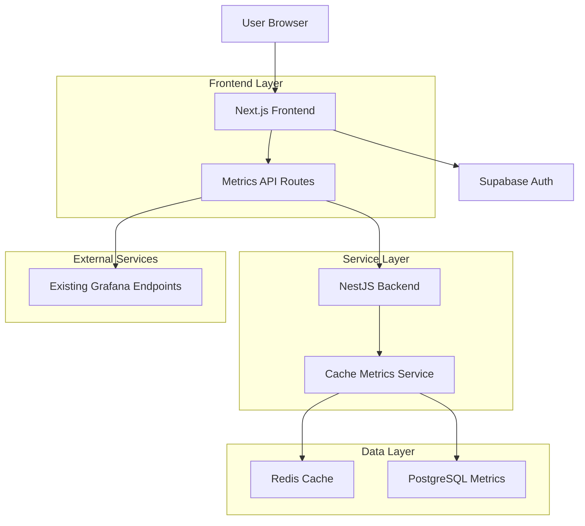
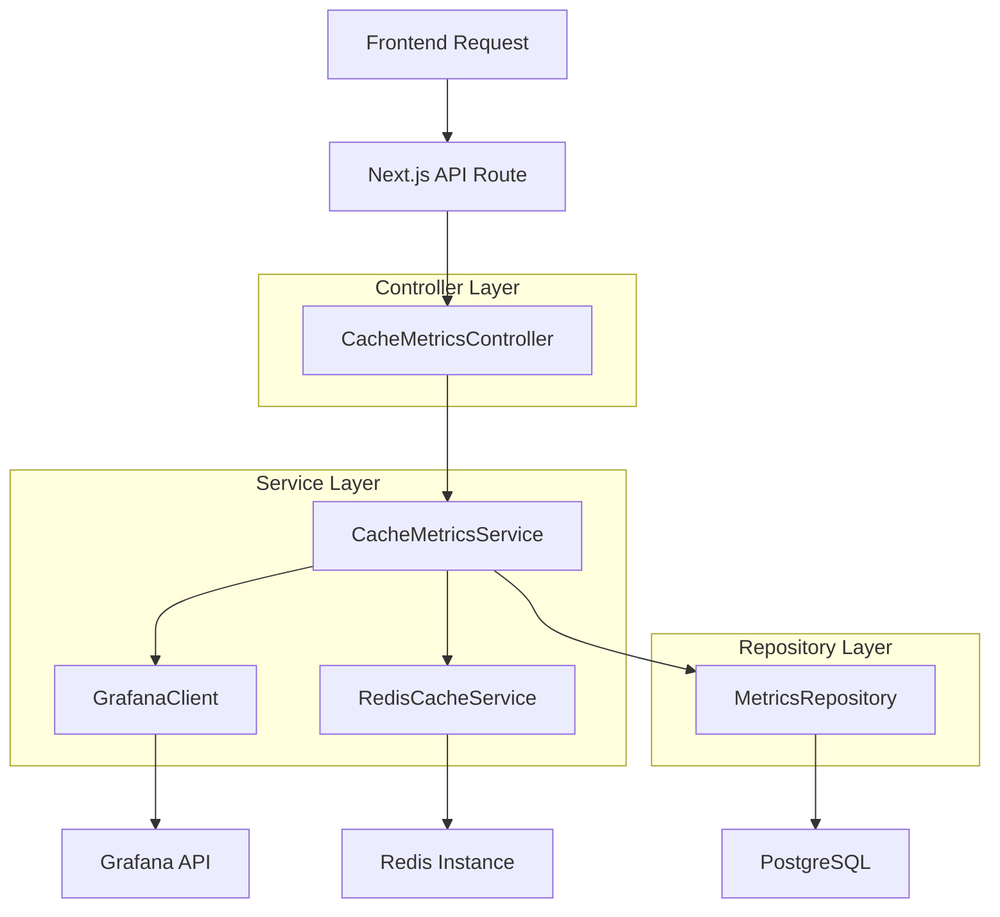
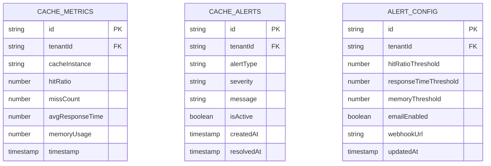

## 1. Architecture Design


## 2. Technology Description
- Frontend: Next.js@14 App Router, React@18, TailwindCSS@3, React Query@5, Zustand@4
- Initialization Tool: next-init (existing project structure)
- Backend: NestJS@10 (existing), Supabase (auth), Redis (cache), PostgreSQL (metrics)
- Real-time: Socket.IO for live metric updates
- Charts: Recharts@2 for data visualization
- WebSocket: Socket.IO client for real-time updates

## 3. Route Definitions
| Route | Purpose |
|-------|---------|
| /cache-dashboard | Main cache effectiveness dashboard with real-time metrics |
| /cache-alerts | Alert configuration and history management |
| /cache-analytics | Historical performance analytics and insights |
| /api/cache/metrics | API endpoint for fetching current cache metrics |
| /api/cache/alerts | API endpoint for alert configuration and history |
| /api/cache/analytics | API endpoint for historical analytics data |
| /api/cache/grafana-proxy | Proxy endpoint for existing Grafana metrics |

## 4. API Definitions

### 4.1 Cache Metrics API
```
GET /api/cache/metrics
```

Response:
| Param Name | Param Type | Description |
|------------|-------------|-------------|
| hitRatio | number | Cache hit ratio percentage (0-100) |
| missCount | number | Total cache misses in current period |
| avgResponseTime | number | Average cache response time in ms |
| memoryUsage | number | Current memory usage in MB |
| totalRequests | number | Total cache requests processed |
| cacheInstances | array | Array of individual cache instance metrics |

Example:
```json
{
  "hitRatio": 85.5,
  "missCount": 1250,
  "avgResponseTime": 45.2,
  "memoryUsage": 512.8,
  "totalRequests": 8543,
  "cacheInstances": [
    {
      "name": "user-session-cache",
      "hitRatio": 92.1,
      "status": "healthy"
    }
  ]
}
```

### 4.2 Alert Configuration API
```
POST /api/cache/alerts/configure
```

Request:
| Param Name | Param Type | isRequired | Description |
|------------|-------------|-------------|-------------|
| hitRatioThreshold | number | true | Minimum acceptable hit ratio percentage |
| responseTimeThreshold | number | true | Maximum acceptable response time in ms |
| memoryThreshold | number | true | Maximum acceptable memory usage in MB |
| emailNotifications | boolean | false | Enable email notifications |
| webhookUrl | string | false | Webhook URL for alerts |

### 4.3 Grafana Proxy API
```
GET /api/cache/grafana-proxy/metrics
```

Query Parameters:
| Param Name | Param Type | Description |
|------------|-------------|-------------|
| query | string | Grafana metrics query |
| timeRange | string | Time range for metrics (e.g., "1h", "24h") |

## 5. Server Architecture Diagram


## 6. Data Model

### 6.1 Cache Metrics Entity


### 6.2 Data Definition Language
```sql
-- Cache Metrics Table
create table cache_metrics (
  id uuid primary key default gen_random_uuid(),
  tenant_id varchar(255) not null,
  cache_instance varchar(100) not null,
  hit_ratio decimal(5,2) not null,
  miss_count integer not null default 0,
  avg_response_time decimal(10,2) not null,
  memory_usage decimal(10,2) not null,
  total_requests integer not null default 0,
  timestamp timestamp with time zone default now(),
  
  constraint fk_tenant foreign key (tenant_id) references tenants(id)
);

create index idx_cache_metrics_tenant_timestamp on cache_metrics(tenant_id, timestamp desc);
create index idx_cache_metrics_instance on cache_metrics(cache_instance);

-- Cache Alerts Table
create table cache_alerts (
  id uuid primary key default gen_random_uuid(),
  tenant_id varchar(255) not null,
  alert_type varchar(50) not null,
  severity varchar(20) not null check (severity in ('low', 'medium', 'high', 'critical')),
  message text not null,
  is_active boolean default true,
  created_at timestamp with time zone default now(),
  resolved_at timestamp with time zone,
  
  constraint fk_tenant_alert foreign key (tenant_id) references tenants(id)
);

create index idx_cache_alerts_active on cache_alerts(tenant_id, is_active);
create index idx_cache_alerts_severity on cache_alerts(severity);

-- Alert Configuration Table
create table alert_config (
  id uuid primary key default gen_random_uuid(),
  tenant_id varchar(255) unique not null,
  hit_ratio_threshold decimal(5,2) default 80.0,
  response_time_threshold decimal(10,2) default 100.0,
  memory_threshold decimal(10,2) default 1024.0,
  email_enabled boolean default false,
  webhook_url varchar(500),
  updated_at timestamp with time zone default now(),
  
  constraint fk_tenant_config foreign key (tenant_id) references tenants(id)
);

-- Grant permissions
grant select on cache_metrics to anon;
grant all privileges on cache_metrics to authenticated;
grant select on cache_alerts to anon;
grant all privileges on cache_alerts to authenticated;
grant select on alert_config to anon;
grant all privileges on alert_config to authenticated;
```

## 7. Integration with Existing System
- **Authentication**: Leverage existing JWT authentication from SBA-Agentic system
- **Tenancy**: Use existing `x-tenant-id` header validation
- **Metrics**: Integrate with existing Grafana endpoints via proxy API
- **WebSocket**: Extend existing Socket.IO implementation for real-time updates
- **Observability**: Use existing OpenTelemetry setup for monitoring
- **Database**: Extend existing PostgreSQL schema with cache-specific tables