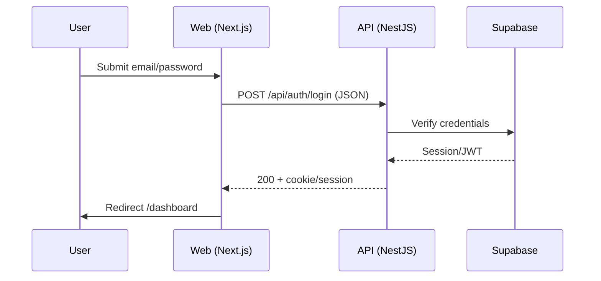
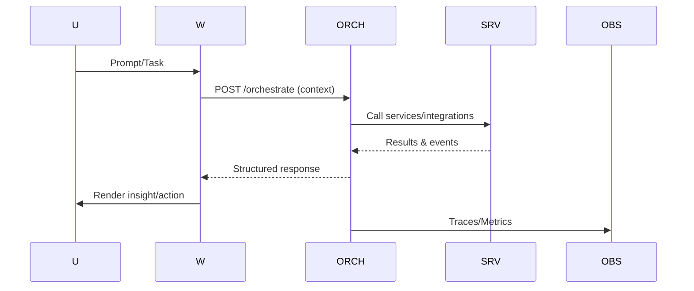

## Tujuan & Kriteria Non‑Fungsional

* Stabilitas pengujian ≥95% lintas Chromium/Firefox/WebKit (repeat‑run, flakiness ≤5%).

* Keamanan: JWT HS256, timestamp skew validation, opsional HMAC; RBAC pada route protected.

* Performa: p95/p99 terukur, throughput dan error rate tercatat; bundle guard di web.

* Observability: OpenTelemetry traces, Prometheus counters/histograms, Grafana dashboards.

## Arsitektur & Modul

* Frontend: `apps/web` (Next.js 14), `apps/app` (Next.js 15) konsumsi `@sba/ui`, `@sba/api-client`.

* Backend/API: `apps/api` (NestJS/Express) dengan `Prisma`, `BullMQ` (Redis), `Socket.IO`, Supabase.

* Orkestrasi: `apps/orchestrator` menggunakan `@sba/sdk`, `@sba/security` untuk agentic flows.

* Packages: `packages/*` (ui, api-client, api-types, security, observability, utils, realtime, supabase).

* Monitoring: `monitoring/docker-compose.yml`, `prometheus.yml`; OTel: `apps/api/src/infrastructure/observability/index.ts`.

## Blueprint Dokumen Implementasi

* Lokasi: `/home/inbox/smart-ai/sba-agentic/.trae/documents/Implementasi End‑to‑End SBA‑Agentic.md`.

* Isi ringkas:

  * Ringkasan arsitektur (Mermaid) dan jalur data frontend↔API↔DB↔Queue↔Realtime.

  * Matriks dependensi modul (apps ↔ packages ↔ infra).

  * Spesifikasi API internal (auth, health, metrics, orchestrate, runs) dan format data.

  * Standar keamanan (JWT/HMAC/timestamp), RBAC, audit.

  * Rencana pengujian (unit, integrasi, E2E, a11y) dan gates CI/CD.

## Daftar Aplikasi & Use Case

* `apps/web`: Login, Dashboard, Agentic Assist, Health/metrics UI.

* `apps/app`: Orkestrasi UI, SSE/WS klien, workflows.

* `apps/api`: Auth, Health (`/health`), Metrics (`/metrics`), Runs/Tools, Socket.IO gateway.

* `apps/orchestrator`: Engine tugas agentic, tool registry, meta‑events, tracing.

* Prioritas: Auth & Health (fondasi) → Agentic assist → Observability → Stabilitas E2E.

## Persyaratan Integrasi

* API kontrak: `apps/api/docs/openapi-baseline.yaml` dan `docs/technical/api/openapi.md`.

* Realtime: SSE/WS via `packages/realtime` dan klien `apps/app/src/shared/api/sse.ts`.

* Data layer: Supabase adapter `apps/web/src/entities/conversation/supabase-adapter.ts`; RLS sesuai `docs/db/db-rls.md`.

* Keamanan terpusat: helpers di `@sba/security` untuk verifikasi JWT/HMAC/timestamp; RBAC gating guard App Router.

## Kriteria Penyelesaian & Checklist Integrasi

* Auth berfungsi: login POST JSON, cookie/session terpasang, redirect ke `/dashboard`.

* Health: `GET /api/health` dengan Server‑Timing; `GET /api/health/metrics` Prometheus berformat teks.

* RBAC: route protected hanya dapat diakses oleh role yang valid; audit trail opsional.

* Observability: traces muncul di OTel exporter; metrics di Prometheus; dashboard Grafana aktif.

* E2E: repeat‑run ≥95% pass; a11y bebas error kritis (axe) dengan pengecualian yang dibenarkan.

* CI/CD: gates type‑check, lint, coverage, bundlesize, lighthouse; artefak summary.

## Dokumentasi Operasional

* Deployment: Compose untuk monitoring; start API dengan metrics; Next.js apps `build/start` dengan health.

* Troubleshooting: playbook observability, endpoints health/metrics, tracing IDs.

* Pemeliharaan: rotasi secrets, upgrade deps, pembersihan queues.

## Rencana Implementasi Bertahap

### Fase 1 — Fondasi & Guardrails

* Normalisasi imports ke `@sba/ui`; ketatkan tsconfig; perjelas typing handler.

* Health/metrics hardening di `apps/api` dan `apps/web` API routes; `jsonError`, dev bypass aman, Server‑Timing.

* Config validation: lengkapi `.env.example`, script config‑check.

### Fase 2 — Autentikasi & Proteksi

* Migrasi/penyatuan `LoginForm` di `apps/web`; endpoint JSON, cookie/session, layout `(authenticated)`.

* Middleware normalisasi path `/login`, not‑found page; RBAC gates App Router; audit webhook opsional.

### Fase 3 — Pengujian & Stabilitas

* Unit Vitest per paket/app; E2E login lengkap dengan timeouts/waits/retries dan `data-testid`.

* Repeat runner: gunakan `apps/web/scripts/e2e-repeat.js`; agregasi flakiness.

* A11y: stabilisasi `apps/web/e2e/ai-copilot-a11y.spec.ts` (penyusunan `SKIP_ERROR_PATTERNS` di baris sensitif, penandaan hanya error non‑blocking), integrasi `jest-axe`.

### Fase 4 — Observability & Monitoring

* Jalankan Prometheus/Grafana dengan `monitoring/docker-compose.yml`; sambungkan scrape target `/api/metrics`.

* Buat dashboard p95/p99, throughput, error rate; simpan screenshot artefak.

### Fase 5 — Performa & UX

* Optimasi render kritis, prefetching, lazy‑load, dynamic imports; guard bundlesize.

* Konsistensi komponen `@sba/ui`, ikon unified `Icon`.

### Fase 6 — Dokumentasi

* Lengkapi: `docs/SPEC.md`, `docs/ARCHITECTURE.md`, `docs/WORKFLOWS.md`, `docs/FEATURES.md`.

* Panduan E2E & observability; OpenAPI tersinkron.

### Fase 7 — CI/CD & Otomatisasi

* Perluas workflows: config‑check web/api, e2e repeat harian, auto‑rollback post‑deploy.

* Artefak `ci-artifacts/summary.json`, coverage gate.

## Detail Implementasi Teknis (Mapping)

* Health API: `apps/api/README_API.md` (kontrak), implementasi `apps/api/src/infrastructure/observability/index.ts` dan controller health.

* Prometheus: endpoint `GET /metrics` di API, scrape `monitoring/prometheus.yml`, dashboards Grafana.

* Queue & Redis: `apps/api/src/infrastructure/queue/BullMQModule.ts`, `queue.config.ts`, workers (`render`, `agent-supervisor`, `tool-execution`).

* SSE/WS: klien `apps/app/src/shared/api/sse.ts`, paket `packages/realtime`.

* A11y: Playwright + Axe di `apps/app/e2e/agui-a11y.spec.ts`; unit a11y `apps/web/src/features/ai/components/__tests__/AICopilot.a11y.spec.tsx`.

* E2E repeat: `apps/web/scripts/e2e-repeat.js`, scripts `apps/web/package.json` (`test:e2e:repeat`, `test:e2e:validate`).

## Traceability PRD ↔ UI ↔ API ↔ Agentic

* PRD RBAC: `workspace/01_PRD/rbac_access_control.md` → Guards App Router (web/app) → Policies API (`auth-rules.json`) → Orchestrator checks.

* Use case percakapan: UI `apps/web` + Supabase adapter → API runs/tools → Orchestrator events → Traces/metrics.

## Risiko & Mitigasi

* Flaky E2E: tingkatkan timeout, state waits, retries; gunakan repeat‑run gate.

* Missing deps: deteksi dan tambahkan devDeps aman (mis. `prom-client`, `pino`) dengan guard runtime.

* Secrets: wajib env, tanpa commit; audit di CI.

## Acceptance & Deliverables

* Dokumen: blueprint implementasi, arsitektur, workflows, features, OpenAPI.

* Kode: login terintegrasi, health/metrics hardened, observability exporters, UI konsisten.

* Pengujian: unit & E2E stabil ≥95%; artefak (screenshot, video, trace, summary).

* Monitoring: Grafana/Prometheus aktif, dashboards p95/p99, error rate.

* CI/CD: gate kualitas, repeat‑run E2E, laporan otomatis.

## Langkah Setelah Persetujuan
- Eksekusi bertahap sesuai fase: buat dokumen, implementasi kode modular, jalankan unit & E2E, setup monitoring, perluas CI gates hingga seluruh kriteria terpenuhi.

Catatan referensi cepat:
- A11y E2E: `apps/web/e2e/ai-copilot-a11y.spec.ts` (lihat konfigurasi `SKIP_ERROR_PATTERNS` sekitar baris 12 untuk penyusunan pengecualian yang aman).
- OpenAPI baseline: `apps/api/docs/openapi-baseline.yaml`.
- OTel: `apps/api/src/infrastructure/observability/index.ts`.
- Prom/Grafana: `monitoring/docker-compose.yml`, `monitoring/prometheus.yml`.

## Diagram Arsitektur & Alur Data

```mermaid
flowchart LR
  U[User] --> W[apps/web (Next.js 14)]
  U --> A[apps/app (Next.js 15)]
  W --> API[apps/api (NestJS/Express)]
  A --> API
  API --> DB[(PostgreSQL/Supabase)]
  API --> R[(Redis/BullMQ)]
  API --> RT[(Socket.IO/SSE)]
  API --> OBS[(OpenTelemetry)]
  OBS --> P[Prometheus]
  P --> G[Grafana]
```





## Matriks Dependencies Antar Modul

| Modul | Bergantung Pada | Catatan |
|---|---|---|
| apps/web | `@sba/ui`, `@sba/api-client`, `packages/realtime`, Supabase adapter | App Router, a11y, E2E |
| apps/app | `@sba/ui`, `packages/realtime`, `@sba/api-client` | SSE/WS klien, workflows |
| apps/api | Prisma, BullMQ (Redis), Socket.IO, `@sba/security`, `@sba/api-types` | Health/metrics, runs/tools |
| apps/orchestrator | `@sba/sdk`, `@sba/security`, `@sba/observability` | Agentic flows, meta‑events |
| packages/ui | Design tokens, komponen atomik | Konsistensi UI |
| packages/api-client | Zod/OpenAPI types, fetch | Kontrak API terpadu |
| packages/security | JWT/HMAC/timestamp, RBAC helpers | Verifikasi terpusat |
| packages/observability | OTel/Prom helpers | Traces/metrics |
| monitoring | Prometheus, Grafana | Dashboards p95/p99 |

## Matriks Use Case Antar Aplikasi

| Use Case | apps/web | apps/app | apps/api | orchestrator |
|---|---|---|---|---|
| Login & Session | ✓ | – | ✓ | – |
| Dashboard & Insight | ✓ | ✓ | – | ✓ |
| Agentic Assist | ✓ | ✓ | ✓ | ✓ |
| Health & Metrics UI | ✓ | – | ✓ | – |
| Queue‑based Jobs | – | – | ✓ | ✓ |
| Realtime Updates | ✓ | ✓ | ✓ | ✓ |

## Spesifikasi API Internal Antar Modul

- `POST /api/auth/login` — JSON body, response set‑cookie (JWT/session), HS256.
- `GET /api/health` — JSON + `Server‑Timing`; header `x-timestamp`, optional HMAC.
- `GET /api/metrics` — `text/plain` Prometheus format; counters/histograms.
- `POST /api/orchestrate` — konteks tugas agentic; menghasilkan events/traces.
- `GET /api/runs/:id` — status eksekusi; SSE/WS channel untuk streaming.

## Protokol Pertukaran Data & Format Standar

- JSON untuk request/response; Zod/OpenAPI sebagai tipe sumber.
- SSE/WS untuk streaming realtime (events, tokens, status).
- Server‑Timing untuk latensi; Trace‑ID/Span‑ID via OTel headers.

## Autentikasi & Otorisasi Terpusat

- JWT HS256, validasi `exp/iat` dan skew timestamp.
- Opsional HMAC untuk health/monitoring requests.
- RBAC gates pada App Router (web/app) dan policies API; audit trail opsional.

## Kriteria Keberhasilan per Aplikasi

- Web/App: ≥95% pass rate E2E, a11y bebas error kritis, bundlesize terjaga.
- API: endpoint `health/metrics` stabil, p95/p99 latensi terukur, error rate rendah.
- Orchestrator: alur agentic berjalan dengan traces/metrics lengkap.

## Skenario Pengujian Integrasi

- Login end‑to‑end: form → API → cookie → redirect → dashboard.
- Health/metrics: scrape Prometheus, verifikasi counters/histograms.
- Agentic orchestration: trigger tugas, pantau events, verifikasi SSE/WS.

## Checklist Verifikasi Lintas Aplikasi

- [ ] Endpoint auth/health/metrics sesuai kontrak.
- [ ] RBAC gates aktif pada rute protected.
- [ ] Traces OTel dan metrics Prometheus terlihat di Grafana.
- [ ] E2E repeat‑run ≥95% pass dan flakiness ≤5%.

### Detail Checklist Tambahan

- [ ] Validasi `Server‑Timing` pada response `GET /api/health`.
- [ ] Verifikasi counters/histograms Prometheus minimal: `http_requests_total`, `http_request_duration_seconds`.
- [ ] Uji a11y dengan axe: tidak ada `critical` violations; dokumentasi pengecualian aman via `SKIP_ERROR_PATTERNS`.
- [ ] RBAC negatif: akses rute protected ditolak untuk role tidak sah, tercatat di audit.

## Prosedur Deployment Terkoordinasi

- Build Next.js apps (`apps/web`, `apps/app`) dan API; jalankan API dengan `GET /metrics` aktif.
- Jalankan monitoring stack dari `monitoring/docker-compose.yml`; konfigurasikan scrape target.
- Publikasikan konfigurasi secrets/env tanpa komit; lakukan smoke test `health`.

### Langkah Rinci

- Persiapkan `.env` untuk web/app/api sesuai `.env.example`; pastikan keys tidak dikomit.
- `pnpm -C apps/api build && pnpm -C apps/api start` dengan variabel `OTEL_EXPORTER` dan `PROM_ENABLED=true`.
- `pnpm -C apps/web build && pnpm -C apps/web start`; verifikasi route `api/health` dan `api/health/metrics`.
- `docker compose -f monitoring/docker-compose.yml up -d` lalu akses Grafana; impor dashboard p95/p99.
- Konfigurasi Prometheus `monitoring/prometheus.yml` untuk scrape target API.

## Panduan Troubleshooting

- Gunakan `Server‑Timing` dan Trace‑ID untuk melacak latensi.
- Periksa queues BullMQ dan koneksi Redis; cek workers aktif.
- Validasi kebijakan RLS Supabase saat data tidak muncul.

### Kasus Umum

- Metrics kosong: periksa `GET /api/metrics`, env `PROM_ENABLED`, dan exporter OTel.
- E2E flakey: naikkan timeout, tambahkan `await expect(...).toBeVisible()` dan retries; jalankan `apps/web/scripts/e2e-repeat.js`.
- RBAC bocor: audit policies dan guard App Router; pastikan cookie/session role benar.

## Protokol Pemeliharaan & Pembaruan

- Rotasi secrets berkala; audit CI untuk kebocoran.
- Update dependencies dengan pengujian coverage dan E2E.
- Pembersihan queues dan retry jobs dengan pengawasan telemetry.

### Jadwal Rutin

- Mingguan: cek dashboards Grafana untuk p95/p99 dan error rate; review alerts.
- Bulanan: rotasi JWT secret; uji kembali health/metrics; refresh dashboards.
