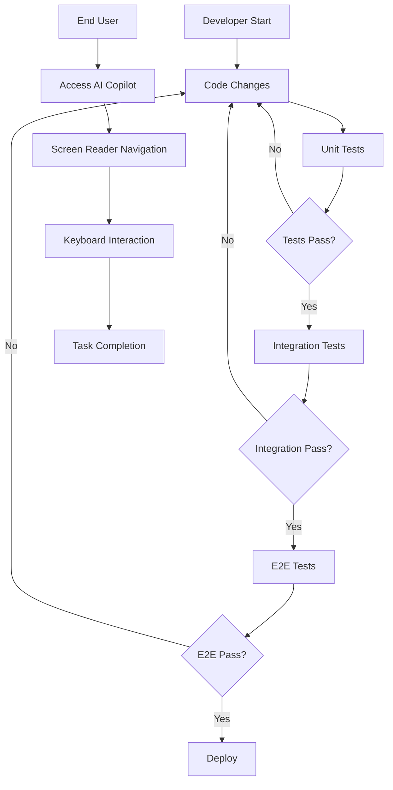

## 1. Product Overview
AI Copilot A11y Fix adalah proyek perbaikan aksesibilitas untuk komponen AI Copilot yang mengalami kegagalan tes E2E. Proyek ini bertujuan untuk memastikan komponen AI Copilot memenuhi standar aksesibilitas WCAG 2.1 AA dan menghilangkan semua pelanggaran kritis/serius yang menyebabkan kegagalan tes.

Produk ini akan digunakan oleh pengguna dengan disabilitas yang mengandalkan screen reader, keyboard navigation, dan teknologi assistive lainnya untuk berinteraksi dengan antarmuka AI Copilot.

## 2. Core Features

### 2.1 User Roles
| Role | Registration Method | Core Permissions |
|------|---------------------|------------------|
| End User | Tidak memerlukan registrasi | Mengakses AI Copilot dengan dukungan aksesibilitas penuh |
| Developer | Akses kode melalui repository | Mengembangkan dan menguji perbaikan aksesibilitas |
| QA Tester | Akses testing environment | Melakukan pengujian aksesibilitas dan verifikasi perbaikan |

### 2.2 Feature Module
Proyek perbaikan aksesibilitas AI Copilot terdiri dari fitur-fitur berikut:

1. **AI Copilot Interface**: Komponen chat utama dengan perbaikan ARIA landmarks, heading structure, dan keyboard navigation.
2. **Dashboard Layout**: Layout container dengan proper landmark structure dan navigation consistency.
3. **Accessibility Testing Dashboard**: Halaman pengujian untuk memverifikasi perbaikan aksesibilitas.

### 2.3 Page Details
| Page Name | Module Name | Feature description |
|-----------|-------------|---------------------|
| AI Copilot Interface | ARIA Landmark Structure | Implementasi proper ARIA roles (banner, navigation, main, region) dengan aria-label yang deskriptif |
| AI Copilot Interface | Heading Hierarchy | Struktur heading yang logis (h1-h6) untuk screen reader navigation |
| AI Copilot Interface | Keyboard Navigation | Full keyboard support dengan proper tab order dan focus management |
| AI Copilot Interface | Screen Reader Support | Announcements untuk perubahan konten dinamis dan status chat |
| Dashboard Layout | Landmark Consistency | Memastikan satu main landmark, proper navigation labels, dan consistent structure |
| Dashboard Layout | Component Integration | Integrasi AI Copilot dengan layout tanpa konflik aksesibilitas |
| Accessibility Testing | Test Runner | Eksekusi otomatis tes aksesibilitas dengan axe-core |
| Accessibility Testing | Violation Reporting | Identifikasi dan pelaporan pelanggaran dengan severity levels |
| Accessibility Testing | Performance Monitoring | Pemantauan waktu eksekusi tes dan performance metrics |

## 3. Core Process

### User Flow - End User dengan Assistive Technology
1. User mengakses halaman AI Copilot melalui screen reader
2. Screen reader mengumumkan struktur halaman dengan proper landmarks
3. User navigasi menggunakan keyboard (Tab, Shift+Tab, arrow keys)
4. Konten dinamis diumumkan kepada user melalui live regions
5. User dapat menyelesaikan task tanpa barrier aksesibilitas

### Developer Flow
1. Developer melakukan perubahan kode untuk perbaikan aksesibilitas
2. Menjalankan unit tests untuk memverifikasi perubahan
3. Menjalankan integration tests untuk memastikan tidak ada regression
4. Menjalankan E2E tests untuk final verification
5. Deploy perubahan setelah semua tes lolos

## 4. User Interface Design

### 4.1 Design Style
- **Primary Colors**: Warna existing tetap dipertahankan untuk konsistensi visual
- **Secondary Colors**: Tambahan kontras untuk memenuhi WCAG color contrast ratio (4.5:1 untuk normal text, 3:1 untuk large text)
- **Button Style**: Maintained existing style dengan tambahan focus indicators yang jelas (outline 2px solid dengan offset 2px)
- **Font**: Font existing digunakan dengan memastikan minimum size 16px untuk body text
- **Layout Style**: Card-based layout dengan proper heading structure dan whitespace
- **Icons**: Icons memiliki alternative text dan proper ARIA labels

### 4.2 Page Design Overview
| Page Name | Module Name | UI Elements |
|-----------|-------------|-------------|
| AI Copilot Interface | Chat Container | Region role dengan aria-label "AI Copilot Chat", heading level 2 untuk chat title, proper focus management pada input field |
| AI Copilot Interface | Message Area | Live region untuk announcements, proper semantic markup untuk messages, timestamp dengan semantic time element |
| AI Copilot Interface | Input Controls | Label yang jelas untuk input field, submit button dengan descriptive text, keyboard shortcuts yang documented |
| Dashboard Layout | Navigation | Nav landmark dengan aria-label descriptive, consistent navigation items dengan current page indication |
| Dashboard Layout | Main Content | Main landmark dengan proper heading hierarchy, skip links untuk navigasi cepat |
| Accessibility Testing | Test Results | Table dengan proper headers, status indicators dengan text alternatives, detailed violation reports |

### 4.3 Responsiveness
Proyek ini menggunakan pendekatan desktop-first dengan mobile-adaptive design:
- Breakpoints standard: 320px, 768px, 1024px, 1440px
- Touch interaction optimization untuk mobile devices
- Proper touch target size (minimum 44x44px)
- Responsive navigation dengan mobile menu yang accessible

### 4.4 Accessibility Features
- **Screen Reader Support**: Full ARIA implementation, semantic HTML, live regions
- **Keyboard Navigation**: Tab order yang logis, skip links, keyboard shortcuts
- **Focus Management**: Visible focus indicators, focus trap untuk modals, proper focus restoration
- **Color Accessibility**: WCAG compliant color contrast, tidak hanya mengandalkan warna untuk informasi
- **Error Handling**: Error messages yang descriptive dan properly associated dengan form fields