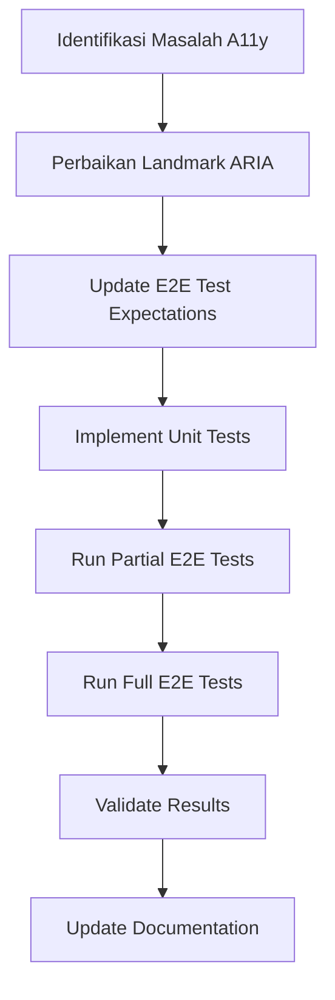

## 1. Product Overview
Perbaikan kegagalan Playwright E2E testing pada AI Copilot untuk memenuhi standar aksesibilitas (a11y) dengan 0 pelanggaran kritikal/serius dan eliminasi timeout.

Proyek ini menargetkan peningkatan kualitas kode dan kepatuhan aksesibilitas untuk memastikan AI Copilot dapat diakses oleh semua pengguna, termasuk pengguna dengan disabilitas.

## 2. Core Features

### 2.1 User Roles
Tidak ada perubahan pada user roles. Sistem tetap mendukung user yang sudah ada tanpa perubahan permission.

### 2.2 Feature Module
Perbaikan ini mencakup komponen-komponen berikut:
1. **AI Copilot Component**: Perbaikan landmark dan ARIA attributes
2. **E2E Testing Framework**: Penyesuaian ekspektasi test dan timeout handling
3. **Unit Testing Module**: Penambahan test aksesibilitas untuk komponen

### 2.3 Page Details
| Page Name | Module Name | Feature description |
|-----------|-------------|---------------------|
| AI Copilot | Chat Header | Ubah role dari "banner" menjadi "region" dengan aria-labelledby |
| AI Copilot | Main Content | Tambahkan aria-label "AI Copilot content" pada region |
| E2E Test | A11y Validation | Longgarkan ekspektasi untuk pelanggaran minor/moderate |
| Unit Test | A11y Component | Validasi struktur landmark dan nama region |

## 3. Core Process

### Development Flow
1. **Fase 1 - Perbaikan ARIA**: Update komponen AI Copilot untuk mematuhi standar landmark
2. **Fase 2 - Test Adjustment**: Sesuaikan ekspektasi E2E test dan tambahkan timeout
3. **Fase 3 - Unit Testing**: Implementasi test unit untuk validasi aksesibilitas
4. **Fase 4 - Integration**: Jalankan test secara bertahap dari parsial ke penuh
5. **Fase 5 - Quality Assurance**: Validasi hasil dan dokumentasi

## 4. User Interface Design

### 4.1 Design Style
Tidak ada perubahan pada UI visual. Perubahan hanya pada layer aksesibilitas:
- **ARIA Attributes**: Penambahan dan perbaikan atribut untuk screen readers
- **Landmark Structure**: Perbaikan struktur semantic HTML
- **Color Scheme**: Tidak berubah
- **Typography**: Tidak berubah

### 4.2 Page Design Overview
| Page Name | Module Name | UI Elements |
|-----------|-------------|-------------|
| AI Copilot | Chat Header | Struktur HTML tetap sama, hanya role attribute berubah |
| AI Copilot | Main Container | Penambahan aria-label untuk region identification |

### 4.3 Responsiveness
Desktop-first approach tetap dipertahankan. Perubahan aksesibilitas tidak mempengaruhi responsive design.

### 4.4 Accessibility Guidelines
- **Landmark Rules**: Hanya satu element dengan role="banner" per halaman
- **Region Naming**: Semua region harus memiliki nama yang deskriptif
- **Screen Reader Support**: Pastikan semua konten dapat diakses oleh screen readers