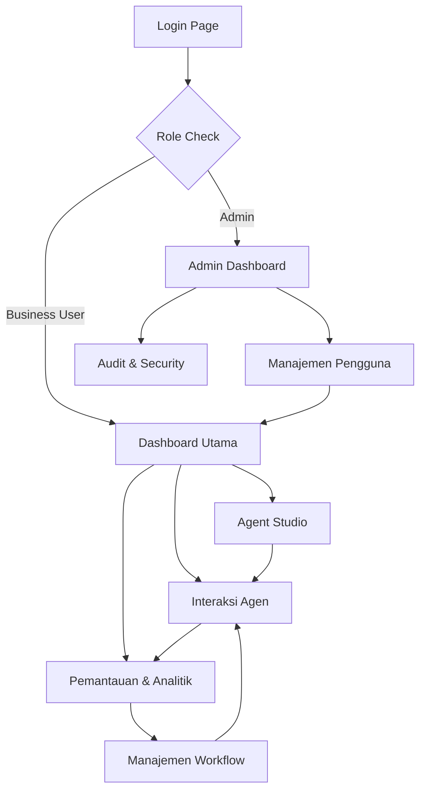

## 1. Product Overview
SBA-Agentic (Smart Business Assistant) adalah platform agentic AI untuk otomasi bisnis yang menyediakan asisten pintar berbasis AI yang dapat bertindak otonom, mengambil keputusan, dan beradaptasi untuk menyelesaikan tugas kompleks. Platform ini menggabungkan teknologi AG-UI (Agentic UI) dengan keamanan tingkat enterprise dan aksesibilitas WCAG AA.

Platform ini dirancang untuk membantu bisnis kecil dan menengah (SMB) mengotomasi alur kerja seperti penanganan pertanyaan pelanggan 24/7, eskalasi, personal shopping, pembuatan dokumentasi, penjadwalan, dan otomasi end-to-end.

## 2. Core Features

### 2.1 User Roles
| Role | Registration Method | Core Permissions |
|------|---------------------|------------------|
| Admin User | Email registration + role assignment | Full system access, user management, analytics |
| Business User | Email registration | Access to agent features, workflow automation |
| Guest User | No registration required | Limited access to demo features |

### 2.2 Feature Module
Platform SBA-Agentic terdiri dari halaman-halaman utama berikut:

1. **Dashboard Utama**: Tampilan metrik kinerja agen, daftar agen aktif, dan ringkasan aktivitas bisnis.
2. **Agent Studio**: Pembuatan dan konfigurasi agen AI, pengaturan alur kerja, dan manajemen perilaku agen.
3. **Interaksi Agen**: Antarmuka chat multimodal dengan dukungan teks, gambar, audio, dan file untuk interaksi real-time dengan agen.
4. **Pemantauan & Analitik**: Visualisasi metrik performa, heatmap interaksi, dan laporan kualitas interaksi.
5. **Manajemen Workflow**: Konfigurasi alur kerja bisnis, aturan eskalasi, dan otomasi proses.
6. **Pengaturan & Keamanan**: Manajemen pengguna, konfigurasi RBAC, dan pengaturan keamanan platform.

### 2.3 Page Details
| Page Name | Module Name | Feature description |
|-----------|-------------|---------------------|
| Dashboard Utama | Metrik Kinerja | Menampilkan grafik performa agen, waktu respons, dan tingkat keberhasilan |
| Dashboard Utama | Daftar Agen Aktif | Menampilkan status agen yang sedang berjalan dengan indikator real-time |
| Dashboard Utama | Ringkasan Aktivitas | Menampilkan log aktivitas terbaru dan notifikasi penting |
| Agent Studio | Pembuatan Agen | Membuat agen baru dengan template dan konfigurasi perilaku kustom |
| Agent Studio | Konfigurasi Multimodal | Mengatur kemampuan input/output teks, gambar, audio, dan file |
| Agent Studio | Pengaturan Interrupt | Mengonfigurasi titik pause untuk persetujuan manusia dan resume logic |
| Interaksi Agen | Chat Interface | Antarmuka chat dengan dukungan multiple input format dan typing indicators |
| Interaksi Agen | Generative UI | Menampilkan UI yang digenerasi AI secara real-time tanpa renderer khusus |
| Interaksi Agen | Meta Events | Memberikan feedback, reaksi, dan anotasi pada interaksi agen |
| Interaksi Agen | Reasoning Display | Menampilkan proses penalaran agen dengan konten terenkripsi |
| Pemantauan & Analitik | Heatmap Tracker | Visualisasi pola interaksi pengguna dengan data klik dan engagement |
| Pemantauan & Analitik | Metrik Latency | Menampilkan P95/P99 latency dalam format detik untuk monitoring performa |
| Pemantauan & Analitik | Kualitas Interaksi | Analisis sentimen dan efektivitas respons agen |
| Manajemen Workflow | Alur Kerja Bisnis | Mendefinisikan langkah-langkah otomasi dan kondisi eskalasi |
| Manajemen Workflow | Aturan Eskalasi | Mengatur kapan agen harus pause untuk persetujuan manusia |
| Pengaturan & Keamanan | Manajemen Pengguna | CRUD pengguna dengan role-based access control |
| Pengaturan & Keamanan | Konfigurasi RBAC | Mengatur permission berdasarkan role dan resource |
| Pengaturan & Keamanan | Audit Log | Mencatat semua aktivitas sistem untuk kepatuhan dan keamanan |

## 3. Core Process

### User Flow - Business User
1. User login ke platform melalui halaman autentikasi Supabase
2. User diarahkan ke Dashboard Utama untuk melihat overview sistem
3. User dapat membuat agen baru di Agent Studio dengan konfigurasi kustom
4. User berinteraksi dengan agen melalui Interaksi Agen dengan support multimodal
5. User memberikan feedback melalui Meta Events untuk meningkatkan kualitas agen
6. User memantau performa melalui Pemantauan & Analitik

### Admin Flow
1. Admin login dengan khusus role admin
2. Admin mengelola pengguna dan permission di Pengaturan & Keamanan
3. Admin memantau system-wide metrics dan audit logs
4. Admin mengonfigurasi global settings dan security policies

## 4. User Interface Design

### 4.1 Design Style
- **Primary Colors**: Biru profesional (#2563EB) untuk elemen utama, Abu-abu gelap (#1F2937) untuk teks
- **Secondary Colors**: Hijau sukses (#10B981), Merah error (#EF4444), Kuning peringatan (#F59E0B)
- **Button Style**: Rounded corners (8px radius) dengan shadow subtle, hover effects
- **Font**: Inter untuk heading, Roboto untuk body text (16px base size)
- **Layout Style**: Card-based layout dengan grid system, top navigation bar
- **Icons**: Heroicons untuk konsistensi, dengan dukungan emoji untuk meta events
- **Animation**: Smooth transitions (200-300ms), loading skeletons, pulse effects untuk real-time updates

### 4.2 Page Design Overview
| Page Name | Module Name | UI Elements |
|-----------|-------------|-------------|
| Dashboard Utama | Metrik Kinerja | Line charts dengan gradient fills, metric cards dengan icons, color-coded status indicators |
| Dashboard Utama | Daftar Agen | Data table dengan sorting, search filters, status badges dengan warna |
| Interaksi Agen | Chat Interface | Message bubbles dengan avatar, typing indicators, file upload drag-and-drop |
| Interaksi Agen | Generative UI | Dynamic component rendering, form elements yang digenerasi real-time |
| Pemantauan | Heatmap | Color-intensity grid, tooltip interaktif, time-based filtering |
| Agent Studio | Form Builder | Step-by-step wizard, validation real-time, preview mode |

### 4.3 Responsiveness
- **Desktop-first approach**: Optimal untuk layar 1920x1080 dan 1366x768
- **Mobile-adaptive**: Breakpoints di 768px dan 480px dengan hamburger menu
- **Touch optimization**: Touch-friendly buttons (min 44px), swipe gestures untuk navigation
- **WCAG AA compliance**: Kontras warna minimal 4.5:1, keyboard navigation, screen reader support
- **Performance**: Lazy loading untuk images, virtual scrolling untuk long lists

## 5. AG-UI Specific Requirements

### 5.1 Reasoning Visibility
- Tampilkan proses penalaran agen secara real-time
- Gunakan `ReasoningMessageStartEvent` untuk konten terenkripsi
- Support untuk expandable reasoning panels

### 5.2 Multimodal Messages
- Input: teks, gambar (drag & drop), audio (voice recording), file upload
- Output: respons teks, gambar yang dirender, audio playback
- Maintain compatibility dengan existing chat applications

### 5.3 Interrupt-Aware Lifecycle
- Pause button untuk interupsi manual
- Auto-pause untuk approval requirements
- Resume dengan payload approval yang aman
- Visual indicators untuk interrupted states

### 5.4 Generative UI
- Render UI components tanpa custom renderer
- Maintain semantic HTML untuk a11y
- Support untuk forms, buttons, cards yang digenerasi
- Real-time UI updates berdasarkan konteks

### 5.5 Meta Events
- Thumbs up/down reactions pada messages
- Feedback forms yang muncul secara contextual
- Quality tracking indicators
- Annotation system untuk training data