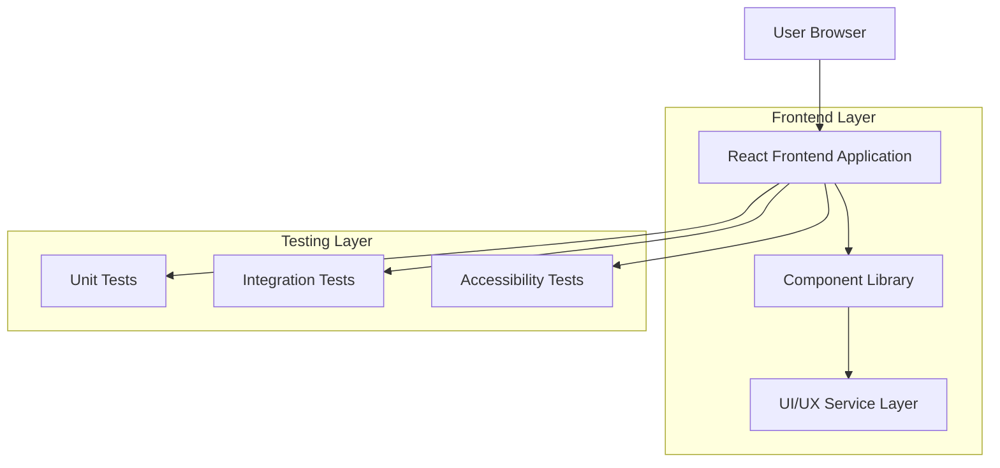
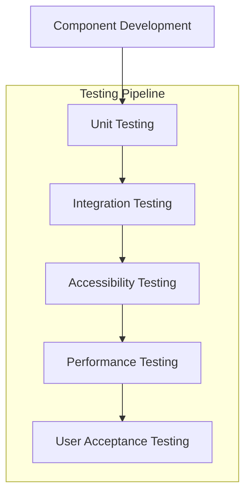

## 1. Architecture design



## 2. Technology Description

* Frontend: React\@18 + tailwindcss\@3 + vite

* Initialization Tool: vite-init

* Testing: Jest + React Testing Library + Cypress

* Backend: None (Frontend-only refactor)

* Build Tool: Vite with optimization plugins

## 3. Route definitions

| Route          | Purpose                                                   |
| -------------- | --------------------------------------------------------- |
| /              | Home page, menampilkan komponen UI yang telah di-refactor |
| /components    | Component library showcase                                |
| /accessibility | Panduan aksesibilitas dan testing                         |
| /performance   | Performance metrics dan optimization                      |

## 4. Component Structure

### 4.1 Core Component Types

```typescript
// Base Component Interface
interface BaseComponent {
  id: string;
  className?: string;
  children?: React.ReactNode;
  accessibility?: AccessibilityProps;
}

// Button Component Props
interface ButtonProps extends BaseComponent {
  variant: 'primary' | 'secondary' | 'danger';
  size: 'sm' | 'md' | 'lg';
  disabled?: boolean;
  onClick: () => void;
  loading?: boolean;
}

// Form Component Props
interface FormFieldProps extends BaseComponent {
  label: string;
  error?: string;
  required?: boolean;
  helperText?: string;
}
```

### 4.2 Folder Structure

```
src/
├── components/
│   ├── atoms/
│   │   ├── Button/
│   │   │   ├── Button.tsx
│   │   │   ├── Button.test.tsx
│   │   │   └── Button.stories.tsx
│   │   ├── Input/
│   │   └── Typography/
│   ├── molecules/
│   │   ├── FormField/
│   │   ├── Card/
│   │   └── Navigation/
│   └── organisms/
│       ├── Header/
│       ├── Footer/
│       └── Sidebar/
├── hooks/
│   ├── useAccessibility.ts
│   ├── usePerformance.ts
│   └── useTheme.ts
├── styles/
│   ├── globals.css
│   ├── variables.css
│   └── utilities/
├── utils/
│   ├── accessibility.ts
│   ├── performance.ts
│   └── validation.ts
└── tests/
    ├── unit/
    ├── integration/
    └── e2e/
```

## 5. Testing Architecture

### 5.1 Testing Strategy



### 5.2 Testing Guidelines

* **Unit Tests**: Coverage minimal 80% untuk setiap komponen

* **Integration Tests**: Testing interaksi antar komponen

* **Accessibility Tests**: WCAG 2.1 Level AA compliance

* **Performance Tests**: Lighthouse score minimal 90

* **Cross-browser Tests**: Chrome, Firefox, Safari, Edge

## 6. Performance Optimization

### 6.1 Optimization Strategies

* **Code Splitting**: Lazy loading untuk komponen besar

* **Tree Shaking**: Hapus unused code

* **Image Optimization**: WebP format dengan responsive images

* **CSS Optimization**: PurgeCSS untuk menghapus unused styles

* **Bundle Analysis**: Webpack Bundle Analyzer untuk monitoring

### 6.2 Performance Metrics

| Metric                   | Target | Measurement |
| ------------------------ | ------ | ----------- |
| First Contentful Paint   | < 1.5s | Lighthouse  |
| Largest Contentful Paint | < 2.5s | Lighthouse  |
| Time to Interactive      | < 3.5s | Lighthouse  |
| Cumulative Layout Shift  | < 0.1  | Lighthouse  |

## 7. Accessibility Standards

### 7.1 WCAG Compliance

* **Keyboard Navigation**: Semua fitur accessible via keyboard

* **Screen Reader Support**: ARIA labels dan semantic HTML

* **Color Contrast**: Minimal 4.5:1 untuk normal text

* **Focus Management**: Visible focus indicators

* **Error Handling**: Clear error messages dan instructions

### 7.2 Testing Tools

* axe DevTools untuk automated testing

* NVDA/JAWS untuk screen reader testing

* Keyboard-only navigation testing

* Color contrast analyzer tools

## 8. Development Workflow

### 8.1 Code Quality

* ESLint untuk code linting

* Prettier untuk code formatting

* Husky untuk pre-commit hooks

* SonarQube untuk code analysis

### 8.2 Documentation

* Storybook untuk component documentation

* JSDoc untuk inline documentation

* README files untuk setup instructions

* CHANGELOG untuk version tracking

