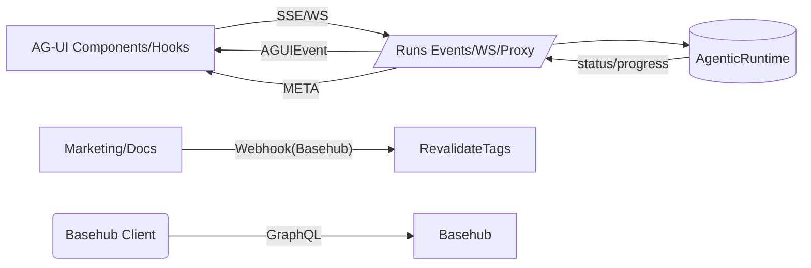

# Perkuat Reusable Packages & Integrasi AG‑UI + Basehub (SBA‑Agentic)

## Ringkasan Perubahan
- AG‑UI: Skema event terpadu dengan Zod (Reasoning, Multimodal, Interrupt, Meta) dan integrasi SSE/WS klien.
- Apps/API: SSE menyalurkan `META` event; `PUT /api/runs/{runId}` mendukung resume payload; OpenAPI diperbarui.
- Basehub: Klien GraphQL dengan timeout+retry; webhook verifikasi HMAC + window dan revalidate tags konsisten.
- Tooling: Logger menyaring secret; KV replay-window util; QA test dasar untuk validasi event.

## Arsitektur (Mermaid)

## Komponen Utama
- `packages/ui/src/ag-ui/schema/events.ts`: Zod schemas AG‑UI (Reasoning, Multimodal, Interrupt, Meta).
- `apps/app/src/shared/api/sse.ts`: SSE klien dukung event draft + META.
- `apps/app/src/app/api/runs/[runId]/events/route.ts`: SSE emit META via named event.
- `apps/app/src/app/api/runs/[runId]/route.ts`: Resume payload diterima saat `action=resume`.
- `packages/cms/src/basehub/client.ts`: timeout+retry; error handling.
- `apps/marketing/src/application/adapters/webhook/basehubWebhookController.ts`: verifikasi HMAC dengan window.
- `packages/logger/src/index.ts`: sanitasi meta dari secrets.
- `packages/kv/src/index.ts`: memory replay window util.

## Panduan Penggunaan
- Hooks: `useAGEvents` memvalidasi event berdasarkan schema; gunakan tipe yang terdokumentasi.
- SSE: tambahkan listener `META` untuk feedback/annotations; reasoning events otomatis tampil di stream.
- API Resume: kirim `PUT /api/runs/{runId}` body `{ action: "resume", resume: { interruptId, payload } }`.
- Basehub: gunakan opsi `{ timeoutMs, retry: { attempts, baseDelayMs } }` saat memanggil `graphql`.

## Test & Verifikasi
- Unit: `packages/ui/src/ag-ui/__tests__/events-schema.test.ts` memverifikasi schema.
- Integration: SSE klien menerima event draft & META tanpa error; webhook HMAC diverifikasi window.
- E2E: Docs/Marketing revalidate via webhook; runs SSE terlihat di UI.

## Catatan Migrasi
- Event baru bersifat additive; klien lama tetap berjalan (type fallback ke `agent:info`).
- Jika UI memfilter berdasarkan tipe, tambahkan tipe baru (Reasoning, META) ke daftar di klien.
- Webhook header kompatibel; pastikan env `BASEHUB_WEBHOOK_SECRET` dan allowlist origin.

## Next Steps
- Generative UI adapter dan renderer.
- OpenTelemetry instrumentation SSE/WS & dashboards.
- Perluasan test E2E Playwright untuk interrupts/resume form.

