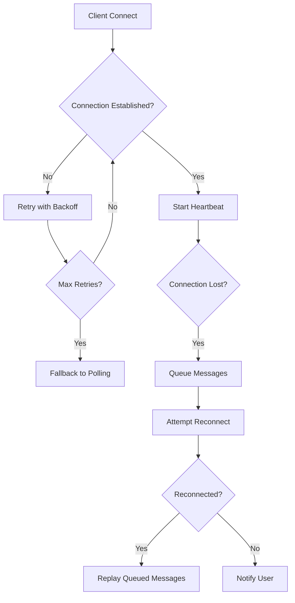
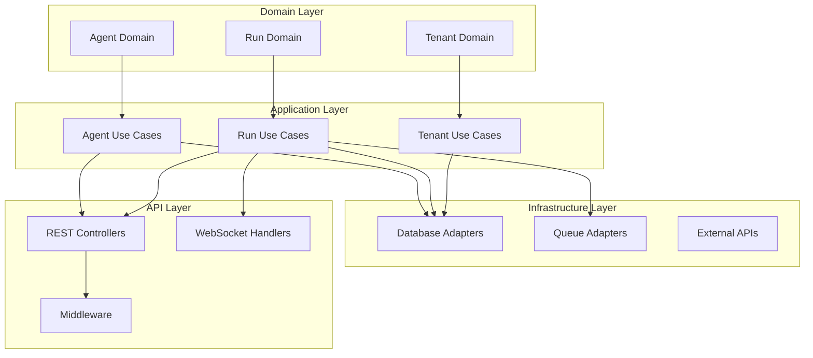

# RANCANGAN LENGKAP & MENDALAM — `apps/api` (SBA-Agentic Orchestrator)

Dokumen ini adalah blueprint implementasi terperinci untuk `apps/api` — Agentic Orchestrator backend dari Smart Business Assistant (SBA). Tujuan: menyediakan gambaran arsitektur, desain domain, kontrak API, skema data, mekanisme multitenancy, observability, security, testing, CI/CD, dan backlog implementasi yang dapat langsung dipakai tim engineering untuk membangun SBA-Agentic generasi selanjutnya.

> Output termasuk: arsitektur, folder structure, API surface (OpenAPI-like), Zod schemas, DB schema + RLS, sequence diagrams (Mermaid), worker & queue design, telemetry, security checklist, rollout roadmap, dan backlog tugas terperinci.

---

# 1. Gambaran Singkat & Tujuan

`apps/api` bertanggung jawab untuk:

* Menyediakan endpoint publik/internal untuk AG-UI dan service lain (session, streaming, tool execution).
* Mengelola lifecycle agentic runs (AgentBuilder → Orchestrator → Supervisor → Executor → Finalize).
* Menjadi Tool Registry: knowledge, render, task, vector, external connectors.
* Menyalurkan pekerjaan ke workers via queue (BullMQ/Redis) dan menyimpan audit, run state, dan hasil.
* Menegakkan isolation multi-tenant (RLS + tenant context).
* Menyediakan observability & billing metering (LLM tokens, tool calls per tenant).

Kriteria sukses awal: end-to-end demo — AG-UI → `POST /runs` → orchestrator melakukan knowledge lookup → streams tokens → create document artifact.

---

# 2. Ringkasan Arsitektur (High-Level)

```mermaid
flowchart LR
  subgraph CLIENT
    UI[AG-UI Client (Web/Mobile)]
  end

  subgraph API
    Gateway[API Gateway / apps/api]
    Auth[Auth Middleware]
    Orch[Orchestrator Service]
    Tools[Tool Registry]
    Repo[Repositories (Prisma/Supabase)]
  end

  subgraph WORKERS
    WorkerQueue[BullMQ / Redis]
    Workers[Render/Index/AgentSupervisor Workers]
  end

  subgraph DATA
    Postgres[(Postgres + pgvector)]
    Blob[S3 / R2]
    VectorDB[(optional)]
    BaseHub[BaseHub CMS]
  end

  UI -->|HTTP/WS| Gateway
  Gateway -->|auth| Auth
  Gateway -->|invoke| Orch
  Orch -->|tool call| Tools
  Tools -->|query| Repo
  Tools -->|enqueue| WorkerQueue
  WorkerQueue -->|jobs| Workers
  Workers -->|write| Postgres
  Workers -->|store| Blob
  Repo -->|ingest| BaseHub
```

---

# 3. Folder Structure (refined & prescriptive)

```
apps/api/
├─ src/
│  ├─ api/                      # controllers / routes / transport layer
│  │  ├─ sessions.controller.ts
│  │  ├─ runs.controller.ts
│  │  └─ tools.controller.ts
│  ├─ orchestrator/             # core orchestration engine
│  │  ├─ Orchestrator.ts
│  │  ├─ ToolRegistry.ts
│  │  ├─ workflows/
│  │  │  ├─ agentic.workflow.ts
│  │  │  └─ render.workflow.ts
│  │  └─ schemas.ts             # zod schemas for inputs
│  ├─ application/              # use cases (DDD application layer)
│  │  ├─ agent/
│  │  │  ├─ BuildAgentUseCase.ts
│  │  │  └─ SuperviseAgentUseCase.ts
│  │  ├─ task/
│  │  └─ knowledge/
│  ├─ domain/                   # entities, aggregates, value-objects
│  │  ├─ agent/
│  │  ├─ run/
│  │  └─ tenant/
│  ├─ infrastructure/           # adapters (supabase, prisma, queue)
│  │  ├─ db/
│  │  │  ├─ prismaClient.ts
│  │  │  └─ migrations/
│  │  ├─ supabase/
│  │  ├─ queue/
│  │  │  └─ bullClient.ts
│  │  └─ basehub/
│  ├─ tools/                    # actual tool implementations
│  │  ├─ KnowledgeTool.ts
│  │  ├─ RenderTool.ts
│  │  └─ TaskTool.ts
│  ├─ workers/                  # worker entrypoints / processors
│  │  ├─ render.worker.ts
│  │  └─ agent-supervisor.worker.ts
│  ├─ telemetry/                # OpenTelemetry + metrics
│  ├─ auth/                     # token parsing, tenant resolution
│  ├─ config/
│  ├─ utils/
│  └─ index.ts
├─ supabase/                     # functions (edge)
├─ scripts/
├─ tests/
└─ Dockerfile
```

---

# 4. Domain Model (core entities & aggregates)

## 4.1 Core aggregates

* **AgentRun** (aggregate root)

  * `id: uuid`
  * `tenantId: uuid`
  * `userId: uuid`
  * `status: enum { created, running, waiting_tool, paused, failed, completed }`
  * `steps: AgentStep[]`
  * `createdAt, updatedAt, endedAt`
  * Behavior: `start()`, `appendStep()`, `pause()`, `finalize()`

* **AgentStep**

  * `id`, `type: 'user'|'model'|'tool'|'system'`
  * `input`, `output`, `toolCallId?`, `startAt`, `endAt`

* **ToolCall**

  * `id`, `agentRunId`, `toolName`, `params`, `result`, `durationMs`, `success`

* **Tenant**

  * `id`, `name`, `plan`, `quotaTokens`, `config`

## 4.2 Value objects

* `TenantId`, `UserId`, `Locale`, `Money`, `IdempotencyKey`.

---

# 5. Database Schema (Postgres) — core tables (Prisma-style)

```sql
-- tenants
CREATE TABLE tenants (
  id uuid PRIMARY KEY,
  name text NOT NULL,
  plan text,
  created_at timestamptz DEFAULT now()
);

-- agent_runs
CREATE TABLE agent_runs (
  id uuid PRIMARY KEY,
  tenant_id uuid NOT NULL REFERENCES tenants(id),
  user_id uuid,
  status text NOT NULL,
  metadata jsonb,
  created_at timestamptz DEFAULT now(),
  updated_at timestamptz DEFAULT now(),
  ended_at timestamptz
);

-- agent_steps
CREATE TABLE agent_steps (
  id uuid PRIMARY KEY,
  run_id uuid REFERENCES agent_runs(id),
  step_type text,
  input jsonb,
  output jsonb,
  tool_call_id uuid,
  started_at timestamptz,
  ended_at timestamptz
);

-- tool_calls
CREATE TABLE tool_calls (
  id uuid PRIMARY KEY,
  run_id uuid REFERENCES agent_runs(id),
  tenant_id uuid REFERENCES tenants(id),
  tool_name text,
  params jsonb,
  result jsonb,
  duration_ms integer,
  success boolean,
  created_at timestamptz DEFAULT now()
);

-- audit_logs
CREATE TABLE audit_logs (
  id uuid PRIMARY KEY,
  tenant_id uuid,
  user_id uuid,
  action text,
  payload jsonb,
  created_at timestamptz DEFAULT now()
);

-- basehub_cache (optional)
CREATE TABLE basehub_cache (
  block_id text PRIMARY KEY,
  tenant_id uuid,
  title text,
  snippet text,
  embedding vector, -- pgvector extension
  updated_at timestamptz
);
```

---

# 6. Multitenancy: Enforcement & RLS

**Strategy:** Shared database with `tenant_id` + Postgres Row Level Security (RLS) for defense-in-depth.

### 6.1 Set tenant on connection

Implement middleware that sets `app.current_tenant` per DB session:

```sql
CREATE FUNCTION set_tenant(tenant uuid) RETURNS void AS $$
BEGIN
  PERFORM set_config('app.current_tenant', tenant::text, true);
END;
$$ LANGUAGE plpgsql;
```

Application must execute `SELECT set_tenant('tenant-uuid')` immediately after acquiring a connection.

### 6.2 Example RLS policy (agent_runs)

```sql
ALTER TABLE agent_runs ENABLE ROW LEVEL SECURITY;

CREATE POLICY tenant_isolation_agent_runs
  ON agent_runs
  USING (tenant_id = current_setting('app.current_tenant')::uuid);
```

Apply similar policies to `tool_calls`, `agent_steps`, `audit_logs`, `basehub_cache`.

---

# 7. API Surface (OpenAPI-style endpoints)

> All inputs validated via Zod schemas.

### 7.1 Session & Auth

* `POST /api/v1/sessions` — create session (returns `sessionId`, websocket url).
* `GET /api/v1/sessions/{id}` — get session info.

### 7.2 Agent Runs

* `POST /api/v1/runs` — start an agent run. Body: `{ tenantId, userId, prompt, options }`
* `GET /api/v1/runs/{runId}` — get run status & steps.
* `POST /api/v1/runs/{runId}/continue` — send user input to existing run.
* `POST /api/v1/runs/{runId}/cancel` — cancel run.

### 7.3 Streaming

* `WS /api/v1/runs/{runId}/stream` — bi-directional (events: token, tool_request, tool_result, done)

### 7.4 Tools (internal)

* `POST /api/v1/tools/execute` — internal tool executor (used by orchestrator/workers)

  * Body: `{ toolName, tenantId, params, idempotencyKey }` → returns `{ callId }`

### 7.5 Admin / Tenant

* `POST /api/v1/tenants` — provision tenant (admin)
* `GET /api/v1/tenants/{id}/usage` — usage metrics

---

# 8. Zod Schemas (examples)

```ts
import { z } from "zod";

export const StartRunSchema = z.object({
  tenantId: z.string().uuid(),
  userId: z.string().uuid(),
  prompt: z.string().min(1),
  options: z.object({
    locale: z.string().optional(),
    topK: z.number().int().positive().optional(),
    maxSteps: z.number().int().positive().optional(),
  }).optional()
});

export const ToolExecuteSchema = z.object({
  toolName: z.string(),
  tenantId: z.string().uuid(),
  params: z.record(z.any()),
  idempotencyKey: z.string().uuid().optional()
});
```

All controllers must validate incoming payloads with Zod and return 400 on validation errors.

---

# 9. Tool Registry & Interface

Define `IToolAdapter` interface that all tools implement:

```ts
export interface IToolAdapter {
  name: string;
  schema: ZodSchema; // for params validation
  execute(ctx: ToolExecutionContext, params: any): Promise<ToolResult>;
}

export type ToolExecutionContext = {
  tenantId: string;
  userId?: string;
  runId?: string;
  requestId: string;
  span?: Span; // OTEL span
};
```

Tool registry:

```ts
class ToolRegistry {
  private adapters = new Map<string, IToolAdapter>();
  register(adapter: IToolAdapter) { this.adapters.set(adapter.name, adapter); }
  get(name: string) { return this.adapters.get(name); }
}
```

Tools:

* `KnowledgeTool`: queries BaseHub cache / vector DB; returns hits.
* `RenderTool`: enqueues render job and returns artifact URL when done.
* `TaskTool`: creates tasks in task service / external system.

---

# 10. Workers & Queueing

**Queue choices:** BullMQ (Redis) or Cloud Tasks. Use BullMQ for local dev and k8s workers.

**Queues:**

* `render-queue`
* `index-queue`
* `agent-supervisor-queue`
* `tool-exec-queue` (for long-running tool calls)

**Worker responsibilities:**

* Execute job (with OTEL span)
* Update DB (tool_calls, agent_steps, agent_runs)
* Push streaming events via pub/sub (Redis channels / WebSocket server)
* Implement exponential backoff + DLQ

---

# 11. Streaming Protocol (WS) — events & shape

Use WebSocket for real-time token streaming. Event envelope:

```ts
type StreamEvent =
  | { type: 'token', payload: { text: string, index:number } }
  | { type: 'tool_request', payload: { toolName, params, callId } }
  | { type: 'tool_result', payload: { callId, result, success } }
  | { type: 'done', payload: { runId, status } }
  | { type: 'error', payload: { message, code } };
```

Server-side: orchestrator writes token events as it receives from LLM or synthesizer. Clients can send events (e.g., user edits) into WS.

Implement message authentication: JWT + per-session token.

---

# 12. Observability & Telemetry

* **Tracing**: Use OpenTelemetry. Each request sets span with attributes `{ tenant_id, user_id, run_id, request_id }`.
* **Metrics (Prometheus)**:

  * `orchestrator_requests_total`
  * `agent_run_duration_seconds` (histogram)
  * `tool_calls_total{toolName}`
  * `llm_tokens_total{tenantId}`
  * `queue_jobs_in_progress{queue}`
* **Logging**: structured JSON including `tenantId`, `requestId`, `runId`, `severity`.
* **Audit**: store immutable audit entries for content commits, render artifact creation, admin changes.

---

# 13. Security & Governance

**AuthN/AuthZ**

* OIDC provider (Clerk/Auth0/Keycloak)
* JWT tokens must include `tenantId`, `userId`, `roles`
* API Gateway must validate token and set tenant context

**Least privilege**

* Service tokens (BaseHub, LLM provider) stored in Vault per-environment
* Per-tenant BaseHub tokens optional for enterprise isolation

**Tool sandboxing**

* Tool adapters that call external endpoints run in outbound proxy with allowlist
* Prevent SSRF by disallowing arbitrary HTTP requests

**Idempotency**

* Side-effecting endpoints accept `idempotencyKey` and persist attempts to avoid duplicates

**Rate limiting / Quotas**

* Per-tenant rate limiting on:

  * LLM calls (tokens)
  * Tool calls
  * Concurrent agent runs

**Data protection**

* Encryption at rest for blob storage
* Audit trail retention policy configurable per tenant

---

# 14. Testing Strategy

**Unit tests**

* domain logic, use-cases, utilities (Vitest/Jest)

**Contract tests**

* Tool adapters ↔ Orchestrator using pact or simple schema-based contract tests

**Integration tests**

* Orchestrator + supabase/prisma + redis (use test containers)

**E2E tests**

* Playwright: user scenario (start run → tool call → render artifact)

**Load tests**

* k6 scripts for concurrent runs and LLM token throughput (simulate many tenants)

**Security tests**

* SAST + DAST scans
* RLS test suites ensuring tenant isolation (automated)

---

# 15. CI/CD & Deployment

**CI**

* Pipeline steps: lint → typecheck → unit tests → contract tests → build → create preview
* Use Turborepo caching for monorepo

**Preview environments**

* Deploy preview per PR: backend to ephemeral k8s namespace, frontend to Vercel preview

**CD**

* Staging: auto-deploy on merge to `main`
* Prod: manual approval from staging

**Kubernetes**

* Deploy orchestrator & workers with HPA
* Use PodDisruptionBudgets, resource limits/requests
* Secrets: Vault / cloud KMS

**Database migrations**

* Use Prisma/Migrate or Flyway. Migrations stored under `infrastructure/db/migrations/`

---

# 16. Migration & Refactor Plan (from current code)

**Phase A — Safety refactor (2 weeks)**

* Add tenant context middleware and wrapper for DB connections
* Centralize ToolRegistry interface and register existing tools
* Add Zod validations for existing controllers

**Phase B — Orchestrator state machine (2–3 weeks)**

* Replace ad-hoc orchestration with stateful `Orchestrator` class + workflows folder
* Persist run states on start & transitions

**Phase C — Workers & DLQ (2 weeks)**

* Introduce standardized queues and implement render worker + DLQ

**Phase D — Observability + RLS (2 weeks)**

* Integrate OTEL, metrics, logging
* Add Postgres RLS policies and test suite

**Phase E — Hardening & features (ongoing)**

* Rate limiting, quotas, billing, admin endpoints

---

# 17. Backlog — prioritized tasks & estimates (rough)

Sprint length: 2 weeks. Team: 1 TL, 2 BE, 1 DevOps, 1 QA.

**Sprint 1 (Foundation)**

1. Add tenant middleware & DB session tenant setter (2d)
2. Centralize config & env management (1d)
3. Add OpenTelemetry init + basic spans (2d)
4. Add Zod validation + error handler (2d)

**Sprint 2 (Orchestrator core)**
5. Implement `Orchestrator` skeleton + state machine (5d)
6. Implement `POST /runs` + `GET /runs/{id}` API (3d)
7. Implement WebSocket streaming skeleton (4d)

**Sprint 3 (Tools & Workers)**
8. Implement ToolRegistry + KnowledgeTool adapter (4d)
9. Add BullMQ + render queue worker (4d)
10. Persist `tool_calls` table updates (2d)

**Sprint 4 (Observability & Security)**
11. Full OTEL tracing for orchestrator & workers (3d)
12. Add RLS policies & tests (3d)
13. Implement idempotency store & logic for tools (2d)

**Sprint 5 (Testing & Hardening)**
14. Integration tests + E2E scenario (5d)
15. Load tests & tuning (3d)
16. CI pipeline integration & preview deploy (3d)

(Estimates per task approximate; refine in backlog grooming.)

---

# 18. Runbook snippets (incidents)

**LLM provider unavailable**

* Switch to fallback model via feature flag
* Cancel non-critical runs, notify tenants
* Route to cached answers if available

**Tool worker failure**

* Check DLQ; replay or mark runs `failed` with reason; notify SRE

**RLS breach detected**

* Isolate DB connections; rotate DB credentials; run forensic audit; notify security

---

# 19. API UX Design & Developer Experience

## 19.1 RESTful API Design Principles
* **Consistent naming**: kebab-case for URLs, snake_case for JSON fields
* **Versioning**: `/api/v1/` prefix for all endpoints
* **HTTP methods**: Proper use of GET, POST, PUT, DELETE semantics
* **Status codes**: 200 (success), 201 (created), 400 (bad request), 401 (unauthorized), 403 (forbidden), 404 (not found), 429 (rate limited), 500 (server error)
* **Error response format**: `{ error: { code: string, message: string, details?: any, request_id: string } }`
* **Pagination**: `{ data: T[], meta: { total: number, page: number, limit: number, has_next: boolean } }`

## 19.2 WebSocket UX & Real-time Experience
* **Connection management**: Automatic reconnection with exponential backoff
* **Heartbeat**: Ping-pong every 30 seconds to maintain connection
* **Message ordering**: Sequence numbers for event ordering guarantee
* **Error recovery**: Connection state preservation during reconnections
* **Rate limiting**: Client-side rate limiting for outgoing messages
* **Connection pooling**: Efficient connection reuse across browser tabs

## 19.3 Developer Experience Features
* **OpenAPI documentation**: Interactive Swagger UI at `/docs`
* **SDK generation**: Auto-generated TypeScript/JavaScript SDK
* **Postman collection**: Pre-configured collection with examples
* **API playground**: Interactive testing environment
* **Request/response examples**: Comprehensive examples for all endpoints
* **Error code reference**: Detailed error code documentation

# 20. WebSocket Resilience & Reliability

## 20.1 Connection Resilience Strategy


## 20.2 Message Delivery Guarantees
* **At-least-once delivery**: Message acknowledgment system
* **Message deduplication**: Idempotent message processing
* **Ordering preservation**: Strict message ordering per session
* **Offline queuing**: Message storage during disconnection
* **Delivery confirmation**: Client acknowledgment for critical messages

## 20.3 Performance Optimization
* **Binary protocol**: MessagePack for efficient serialization
* **Compression**: Per-message compression for large payloads
* **Batching**: Message batching for high-frequency updates
* **Throttling**: Adaptive throttling based on connection quality
* **Memory management**: Efficient memory usage for long-lived connections

# 21. Code Quality Standards & Best Practices

## 21.1 TypeScript Configuration
```json
{
  "compilerOptions": {
    "strict": true,
    "noImplicitAny": true,
    "strictNullChecks": true,
    "strictFunctionTypes": true,
    "noUnusedLocals": true,
    "noUnusedParameters": true,
    "noImplicitReturns": true,
    "noFallthroughCasesInSwitch": true,
    "esModuleInterop": true,
    "skipLibCheck": true,
    "forceConsistentCasingInFileNames": true
  }
}
```

## 21.2 Code Style & Linting
* **ESLint configuration**: Airbnb + TypeScript + Prettier integration
* **Import organization**: Automatic import sorting and grouping
* **Naming conventions**: PascalCase for classes, camelCase for functions/variables, UPPER_SNAKE_CASE for constants
* **File organization**: One class/interface per file, barrel exports
* **Documentation**: JSDoc for public APIs, inline comments for complex logic

## 21.3 Testing Standards
* **Unit test coverage**: Minimum 80% code coverage
* **Integration tests**: Critical path coverage for all APIs
* **E2E tests**: User journey testing for core workflows
* **Performance tests**: Load testing for high-traffic endpoints
* **Security tests**: OWASP Top 10 vulnerability scanning

## 21.4 Error Handling Patterns
```typescript
// Standardized error handling
class AppError extends Error {
  constructor(
    public code: string,
    public message: string,
    public statusCode: number = 500,
    public details?: any
  ) {
    super(message);
    this.name = 'AppError';
  }
}

// Async error wrapper
export const asyncHandler = (fn: Function) => (req: Request, res: Response, next: NextFunction) => {
  Promise.resolve(fn(req, res, next)).catch(next);
};
```

# 22. Code Mapping & Architecture Decision Records

## 22.1 Module Dependencies Map


## 22.2 Architecture Decision Records (ADRs)

### ADR-001: Queue Technology Choice
**Status**: Accepted  
**Context**: Need reliable job queue for async processing  
**Decision**: Use BullMQ with Redis  
**Rationale**: Mature, TypeScript support, good monitoring, fits our scale  
**Consequences**: Requires Redis infrastructure, adds operational complexity

### ADR-002: Database Selection
**Status**: Accepted  
**Context**: Need ACID compliance with vector search capabilities  
**Decision**: PostgreSQL with pgvector extension  
**Rationale**: Single database for structured and vector data, proven reliability  
**Consequences**: Requires pgvector setup, may need optimization for large vector datasets

### ADR-003: Authentication Strategy
**Status**: Accepted  
**Context**: Need secure, scalable authentication  
**Decision**: JWT with Supabase Auth  
**Rationale**: Industry standard, stateless, integrates well with our stack  
**Consequences**: Token management complexity, need refresh token strategy

# 23. Comprehensive Implementation Checklist

## 23.1 Pre-Development Setup
- [ ] Development environment setup guide
- [ ] Database schema migration scripts
- [ ] Environment variable configuration
- [ ] Docker development environment
- [ ] API documentation setup
- [ ] Testing framework configuration
- [ ] CI/CD pipeline setup
- [ ] Code quality tools configuration

## 23.2 Core API Implementation
- [ ] Authentication middleware
- [ ] Tenant context management
- [ ] Request validation (Zod schemas)
- [ ] Error handling middleware
- [ ] Rate limiting implementation
- [ ] Logging and monitoring setup
- [ ] API versioning structure
- [ ] CORS configuration

## 23.3 Agent Orchestrator
- [ ] Agent run state machine
- [ ] Tool registry implementation
- [ ] Workflow engine setup
- [ ] Step execution pipeline
- [ ] Result aggregation logic
- [ ] Error recovery mechanisms
- [ ] Progress tracking
- [ ] Cancellation support

## 23.4 WebSocket Infrastructure
- [ ] WebSocket server setup
- [ ] Connection management
- [ ] Message routing logic
- [ ] Error handling and recovery
- [ ] Performance optimization
- [ ] Security implementation
- [ ] Monitoring and metrics
- [ ] Load testing

## 23.5 Tool Integration
- [ ] Knowledge tool implementation
- [ ] Render tool development
- [ ] Task tool integration
- [ ] External API adapters
- [ ] Tool execution sandbox
- [ ] Result caching strategy
- [ ] Error handling for tools
- [ ] Tool versioning

## 23.6 Queue & Worker System
- [ ] BullMQ setup and configuration
- [ ] Worker process architecture
- [ ] Job scheduling logic
- [ ] Dead letter queue implementation
- [ ] Retry mechanism
- [ ] Worker monitoring
- [ ] Queue metrics collection
- [ ] Scaling configuration

## 23.7 Database & Storage
- [ ] PostgreSQL schema implementation
- [ ] Row Level Security policies
- [ ] Index optimization
- [ ] Backup strategy
- [ ] Connection pooling
- [ ] Migration management
- [ ] Vector storage setup
- [ ] File storage integration

## 23.8 Security Implementation
- [ ] Input validation and sanitization
- [ ] SQL injection prevention
- [ ] XSS protection
- [ ] CSRF protection
- [ ] Rate limiting per tenant
- [ ] API key management
- [ ] Audit logging
- [ ] Vulnerability scanning

## 23.9 Testing & Quality Assurance
- [ ] Unit test coverage (80%+)
- [ ] Integration test suite
- [ ] E2E test scenarios
- [ ] Performance benchmarks
- [ ] Security testing
- [ ] Load testing scenarios
- [ ] Chaos engineering tests
- [ ] User acceptance testing

## 23.10 Deployment & Operations
- [ ] Production deployment guide
- [ ] Monitoring dashboard setup
- [ ] Alert configuration
- [ ] Log aggregation
- [ ] Metrics collection
- [ ] Health check endpoints
- [ ] Rollback procedures
- [ ] Disaster recovery plan

## 23.11 Documentation
- [ ] API reference documentation
- [ ] Developer integration guide
- [ ] Deployment documentation
- [ ] Troubleshooting guide
- [ ] Architecture diagrams
- [ ] Code comments and docs
- [ ] Change log maintenance
- [ ] Training materials

# 24. Quality Gates & Definition of Done

## 24.1 Code Quality Gates
- [ ] All tests passing (unit, integration, E2E)
- [ ] Code coverage > 80%
- [ ] No linting errors
- [ ] TypeScript compilation successful
- [ ] Security scan passed
- [ ] Performance benchmarks met
- [ ] Documentation updated
- [ ] Code review approved

## 24.2 API Quality Gates
- [ ] All endpoints documented
- [ ] OpenAPI spec validated
- [ ] Error responses standardized
- [ ] Rate limiting tested
- [ ] Authentication verified
- [ ] Load testing completed
- [ ] Monitoring dashboards created
- [ ] SLA metrics defined

## 24.3 Deployment Quality Gates
- [ ] Infrastructure as code reviewed
- [ ] Environment variables configured
- [ ] Database migrations tested
- [ ] Health checks implemented
- [ ] Monitoring alerts configured
- [ ] Rollback procedure tested
- [ ] Security configuration verified
- [ ] Performance baseline established

---

# 25. Deliverables & Next Steps

## 25.1 Immediate Deliverables
1. **OpenAPI YAML** for `/api/v1` endpoints with enhanced UX design
2. **WebSocket Protocol Documentation** with resilience patterns
3. **TypeScript Code Templates** with quality standards
4. **Testing Strategy Document** with comprehensive coverage
5. **Deployment Checklist** with quality gates

## 25.2 Implementation Roadmap
**Week 1-2**: Core API infrastructure and authentication  
**Week 3-4**: Agent orchestrator and state management  
**Week 5-6**: WebSocket implementation and real-time features  
**Week 7-8**: Tool integration and worker system  
**Week 9-10**: Testing, security, and performance optimization  
**Week 11-12**: Documentation, deployment, and production readiness

## 25.3 Success Metrics
- API response time < 200ms for 95th percentile
- WebSocket connection success rate > 99.9%
- System availability > 99.9%
- Code coverage > 80%
- Zero critical security vulnerabilities
- Developer onboarding time < 1 day
- API documentation completeness > 95%

Dokumen ini sekarang mencakup implementasi lengkap untuk API SBA-Agentic Orchestrator dengan fokus pada UX yang superior, WebSocket yang resilien, kualitas kode yang tinggi, dan checklist komprehensif untuk memastikan semua aspek telah terpenuhi sebelum deployment.
