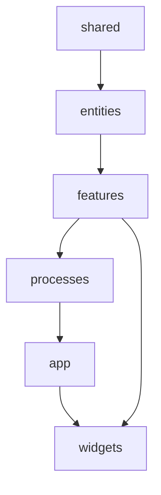
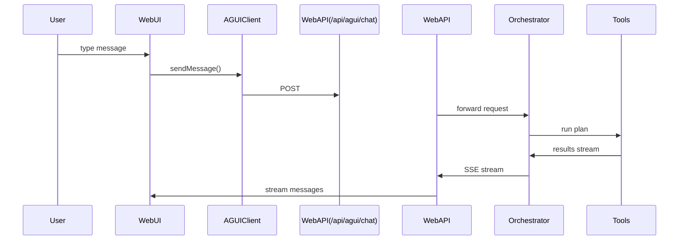
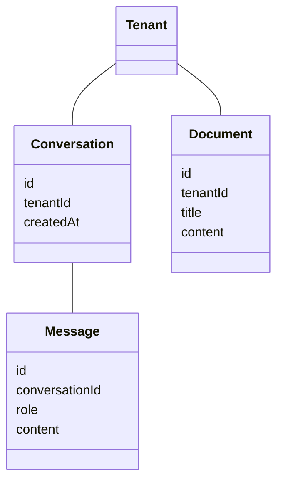

# Rancangan Lengkap & Mendalam — `apps/web` (SBA Agentic)

Dokumen ini menyajikan rancangan arsitektur mendalam untuk **apps/web** dalam monorepo SBA‑Agentic. Struktur disusun agar sepenuhnya selaras dengan prinsip: **FSD + Atomic Design + DDD entities + Agentic UI (AG‑UI) + Observability + Security‑First**.

---

# 1. Peran `apps/web` dalam Platform SBA

`apps/web` adalah **front‑end utama** untuk end‑user SBA yang menyediakan:

* Agentic UI (AI‑Copilot + Workflow + Tools)
* Dashboard insight bisnis
* Sistem chat‑to‑task, chat‑to‑workflow, chat‑to‑report
* Modul multi‑tenant (tenant switcher, konfigurasi tenant, akses role)
* Modul integrasi (hub integrasi berbasis provider)
* Dokumen (document engine)
* Knowledge (SOP, template, business rule manager)

`apps/web` dirancang untuk **production‑grade** dengan standar enterprise: CSP ketat, tidak ada inline scripts, error boundary terisolasi, telemetry bawaan, dan e2e coverage tinggi.

---

# 2. Arsitektur Utama `apps/web`

## 2.1 Prinsip Dasar

* **FSD (Feature‑Sliced Design)**
* **Atomic Design untuk UI internal & komponen packages/ui**
* **DDD Entities** untuk domain: Conversation, Message, Document, Workflow, Integration, Tenant, User
* **AG‑UI**: agentic components yang memanggil “tools” API di `apps/api`
* **Observability**: telemetry tracking + health/perf route
* **Multi-tenant aware**: setiap adapter & state harus menyertakan `tenantId`

---

# 3. Struktur High‑Level `apps/web`

```
apps/web
├── src
│   ├── app                → Next.js app router (routing, layouts, providers)
│   ├── entities           → DDD entities + model + repository
│   ├── features           → FSD features (chat, ai, dashboard, workflows)
│   ├── processes          → multi-step flows (auth, chat-to-report)
│   ├── shared             → ui, hooks, lib, api adapters
│   ├── widgets            → complex UI compositions
│   ├── components         → global components (rare; mostly tests)
│   ├── test               → test utils
│   └── types              → shims/zustand
│
├── e2e                    → e2e tests (Playwright)
├── docs                   → ADR, guidelines, security, deployment
├── middleware.ts          → auth, telemetry, security
└── next.config.js
```

---

# 4. Penjabaran Folder Kritis

## 4.1 `src/app/`

Mengelola:

* routing
* layouts
* providers
* server actions (opsional)
* API route handlers (`/api/agui/chat`, `/api/health`, `/api/telemetry`)

Routing selaras dengan domain:

```
app/
├── dashboard
├── chat
├── documents
├── integrations
├── knowledge
├── workflows
└── ai-copilot
```

## 4.2 `src/entities/` — DDD Entities

Contoh:

* `conversation`
* `message`
* `document`
* `workflow`
* `integration`
* `tenant`
* `user`

Pattern:

```
model.ts          → aggregate root (Conversation)
value-objects.ts   → VO (MessageText, DocTitle)
repository.ts      → interface repository
supabase-adapter.ts→ implementasi repository ke DB
```

Semua repository **multi-tenant aware** dengan param `tenantId`.

## 4.3 `src/features/` — Feature Sliced

Setiap fitur memiliki:

* components
* api
* hooks
* model
* types
* tests

Contoh: `features/chat/`

* `components/ChatWindow.tsx`
* `api/chat.api.ts`
* `model/chat.service.ts`
* `hooks/useChat.ts`
* `types.ts`
* `__tests__/` (unit + integration)

## 4.4 `src/processes/` — Multi-step Flows

Untuk proses kompleks/AI orchestrated. Contoh:

* `auth`
* `chat-to-report`
* `chat-to-workflow`
* `ai-copilot` orchestration (opsional)

Folder ini mewakili flow lintas features.

## 4.5 `src/shared/`

Berisi hal shared lintas proses dan features:

* **api** (adapters & client)
* **config** (architecture docs)
* **hooks** (a11y, theme)
* **lib** (supabase adapters, utilities)
* **ui** (ErrorBoundary, LoadingSpinner, Skeleton, dsb)

Pattern ini memastikan isolasi FSD tetap terjaga.

## 4.6 `src/widgets/`

Komposisi UI besar, seperti:

* `DashboardLayout`
* advanced panels
* multi-component composites

Widgets adalah komposisi dari features + shared.ui.

---

# 5. Integrasi AG‑UI dalam `apps/web`

`apps/web` mengonsumsi client AG‑UI dari package `@sba/agui-client` dan mengeksekusi tools melalui route:

```
/app/api/agui/chat/route.ts
```

Flow AG‑UI:

1. UI → memanggil `aguiClient.sendMessage` dengan metadata (tenantId, userId)
2. Route → proxy ke `apps/api` → Agent Orchestrator
3. Orchestrator → menjalankan tool plan (misal: search docs, generate report)
4. Web UI → menerima stream message kembali

---

# 6. Multi-Tenant Awareness di Frontend

### Dimana tenant dimasukkan?

* Auth provider → load tenant context
* Middleware → inject tenant
* Supabase adapters → require tenant scope
* Feature hooks → selalu param tenant

Patterns:

```
const { tenantId } = useTenant();
api.chat.send({ tenantId, ... })
```

Tenant config di-load via **`/api/tenant/config`** (server action atau route handler).

---

# 7. Observability & Telemetry

`apps/web` sudah memiliki:

* `api/health/metrics` (Prometheus)
* `api/telemetry` route
* Coverage artifacts (lcov, final JSON)
* E2E health/perf test

Enhancement SBA-Agentic:

* Track AG‑UI tool latency
* Track workflow-builder interactions
* Track chat-to-report performance

---

# 8. Security Architecture

Mengacu ke ADR-0001 + SECURITY-CSP-PERMISSIONS:

* CSP: NO inline javascript, strict-dynamic
* TrustedTypes
* Sanitization output AI
* Supabase adapters: RLS enforced
* Zod validation di boundaries
* ErrorBoundary untuk isolasi runtime
* Middleware rate‑limit untuk endpoint chat/tools

---

# 9. Testing Strategy

## 9.1 Unit Testing → `vitest`

* All features must include coverage minimal 80%

## 9.2 Integration Testing

* Repository → Supabase mock
* Feature hooks → real behavior

## 9.3 End-to-End (Playwright)

Folder lengkap sudah tersedia:

* A11y
* Chat
* Tools flow
* Workflow builder
* CSP
* Telemetry

## 9.4 Quality Gates

* ADR-0002: CI quality gates → coverage, lint, typecheck

---

# 10. Rencana Pengembangan untuk `apps/web`

## Fase 1 — Stabilizing Platform

* Perbaikan DDD entity boundaries
* Implementasi full tenant middleware
* Perbaikan UI tokens (theme)

## Fase 2 — Agentic UI Enhancement

* AG‑UI plan visualizer
* Realtime AI-copilot context
* Tool inspector

## Fase 3 — Knowledge Engine + Document Engine

* SOP builder
* Template suggestion engine
* Document generation with structured templates

## Fase 4 — Workflow Builder NG

* Drag/drop nodes improvement
* Execution trace view

## Fase 5 — Observability & Insights

* Full user journey heatmap
* Business insight dashboard

---

# 11. Deliverables `apps/web`

* FSD map + dependency rules
* Diagram arsitektur web layer
* Tenant middleware + config load
* AG‑UI integration blueprint
* UI/UX guidelines + design tokens
* Test suite (unit + integration + e2e)
* CI quality gates

---

# 12. Diagram (Konseptual)

## FSD Layering Diagram



## AG-UI Integration in Web



## Entity Relationship (Simplified)



---

# 13. Penutup

Rancangan ini memetakan secara lengkap seluruh aspek `apps/web` pada SBA‑Agentic agar siap untuk fase modernisasi Agentic UI. Semua pola disusun untuk:

* Skalabilitas
* Keamanan
* Multi-tenant strict
* Integrasi AG‑UI dan Orchestrator
* Clean architecture (FSD + Atomic + DDD)

Siap untuk disambungkan dengan `apps/api`, `apps/orchestrator`, dan packages.*.
