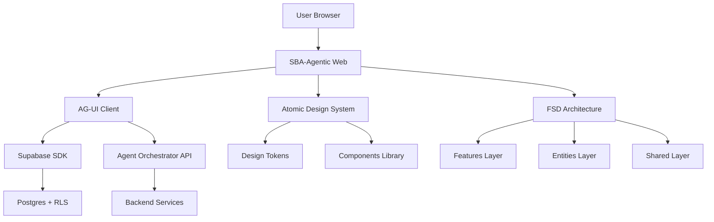

# RANCANGAN — apps/web (SBA-Agentic Web)

## 📋 Executive Summary

Dokumen ini merupakan spesifikasi teknis dan desain untuk aplikasi web SBA-Agentic yang mengimplementasikan arsitektur hybrid FSD (Feature-Sliced Design) + DDD (Domain-Driven Design) + Atomic Design. Aplikasi ini merupakan interface utama untuk Smart Business Assistant dengan kemampuan AG-UI streaming, multi-tenant support, dan aksesibilitas WCAG 2.1 AA.

## 🎯 Tujuan & Scope

**Tujuan Utama:**
- Membangun web client dengan performa optimal dan user experience superior
- Implementasi AG-UI streaming untuk real-time AI interaction
- Mendukung multi-tenant architecture dengan isolasi data yang aman
- Memastikan aksesibilitas penuh sesuai WCAG 2.1 AA standards

**Scope 90 Hari:**
1. ✅ Struktur FSD+DDD+Atomic yang konsisten
2. ✅ AG-UI streaming implementation
3. ✅ Multi-tenant UI dengan workspace switcher
4. ✅ Design system dengan 50+ komponen
5. ✅ QA automation (unit/integration/e2e)
6. ✅ CI/CD pipeline dengan TurboRepo

## 🏗️ Arsitektur Aplikasi

### High-Level Architecture



### FSD Layer Structure

```
apps/web/src/
├── 📂 app/                    # App Router (Next.js 14)
│   ├── (auth)/               # Auth routes group
│   ├── (dashboard)/          # Main app routes
│   ├── (marketing)/          # Public pages
│   └── api/                  # API routes
├── 📂 processes/              # Long business flows
│   ├── onboarding/           # User onboarding flow
│   ├── workspace-setup/      # Tenant creation flow
│   └── document-workflow/    # Document processing
├── 📂 widgets/               # Composite UI widgets
│   ├── chat-window/          # Main chat interface
│   ├── sidebar-navigation/   # Navigation component
│   ├── header-bar/          # Top navigation
│   └── workspace-switcher/  # Tenant selector
├── 📂 features/              # Feature modules (FSD)
│   ├── auth/                 # Authentication
│   ├── chat/                 # Chat functionality
│   ├── documents/            # Document management
│   ├── tasks/                # Task management
│   ├── tenant/               # Multi-tenancy
│   ├── users/                # User management
│   └── settings/             # App settings
├── 📂 entities/              # Domain entities
│   ├── conversation/         # Conversation entity
│   ├── message/              # Message entity
│   ├── user/                 # User entity
│   ├── tenant/               # Tenant entity
│   └── document/             # Document entity
└── 📂 shared/                # Shared utilities
    ├── api/                  # API clients
    ├── config/               # Configuration
    ├── hooks/                # Custom hooks
    ├── lib/                  # Utility libraries
    ├── types/                # TypeScript types
    └── ui/                   # Base UI components
```

## 🎨 UI/UX Design System

### Atomic Design Hierarchy

**1. Atoms (Basic Components)**
- Button, Input, Card, Badge, Icon, Avatar
- Typography, Color tokens, Spacing scale
- Loading states, Skeleton components

**2. Molecules (Component Groups)**
- SearchBar, FormGroup, ChatBubble
- UserProfile, StatusIndicator, Dropdown
- Breadcrumb, PageHeader, FilterBar

**3. Organisms (Complex Components)**
- ChatWindow, DocumentEditor, TaskPanel
- NavigationMenu, DataTable, FormWizard
- DashboardCard, ActivityFeed

**4. Templates (Page Layouts)**
- DashboardLayout, AuthLayout, SettingsLayout
- ChatLayout, DocumentLayout, OnboardingLayout

**5. Pages (Complete Views)**
- ChatPage, DocumentsPage, TasksPage
- SettingsPage, ProfilePage, AnalyticsPage

### Design Tokens

```json
{
  "colors": {
    "primary": {
      "50": "#eff6ff",
      "500": "#3b82f6",
      "600": "#2563eb",
      "700": "#1d4ed8"
    },
    "secondary": {
      "50": "#f5f3ff",
      "500": "#8b5cf6",
      "600": "#7c3aed",
      "700": "#6d28d9"
    },
    "semantic": {
      "success": "#10b981",
      "warning": "#f59e0b",
      "error": "#ef4444",
      "info": "#3b82f6"
    }
  },
  "typography": {
    "fontFamily": {
      "sans": ["Inter", "ui-sans-serif", "system-ui"],
      "mono": ["JetBrains Mono", "ui-monospace", "monospace"]
    },
    "fontSize": {
      "xs": "0.75rem",
      "sm": "0.875rem",
      "base": "1rem",
      "lg": "1.125rem",
      "xl": "1.25rem",
      "2xl": "1.5rem"
    }
  },
  "spacing": {
    "scale": [0, 0.25, 0.5, 0.75, 1, 1.25, 1.5, 2, 2.5, 3, 4, 5, 6, 8],
    "unit": "0.25rem"
  },
  "borderRadius": {
    "none": "0",
    "sm": "0.125rem",
    "base": "0.25rem",
    "md": "0.375rem",
    "lg": "0.5rem",
    "xl": "0.75rem",
    "full": "9999px"
  }
}
```

### Accessibility Standards (WCAG 2.1 AA)

**Color & Contrast:**
- Minimum contrast ratio 4.5:1 for normal text
- Minimum contrast ratio 3:1 for large text
- Color-blind friendly palette
- Support for high contrast mode

**Keyboard Navigation:**
- Full keyboard accessibility
- Logical tab order
- Skip navigation links
- Focus indicators visible

**Screen Reader Support:**
- Semantic HTML structure
- ARIA labels and descriptions
- Live regions for dynamic content
- Alternative text for images

**Responsive Design:**
- Mobile-first approach
- Touch-friendly targets (minimum 44x44px)
- Scalable text up to 200%
- Flexible layouts

## 🧩 Core Features & Components

### 1. Chat Feature (AG-UI Streaming)

**Core Components:**
- `ChatWindow` - Main chat interface
- `MessageBubble` - Individual messages
- `TypingIndicator` - AI typing status
- `StreamingText` - Progressive text rendering
- `ToolExecution` - Tool call visualization
- `HumanInTheLoop` - User confirmation dialogs

**Key Features:**
- Real-time message streaming
- Tool execution with visual feedback
- Message history with pagination
- File upload support
- Emoji reactions and threading
- Export conversation

### 2. Document Management

**Core Components:**
- `DocumentList` - File browser
- `DocumentEditor` - Rich text editor
- `DocumentViewer` - File preview
- `TemplateSelector` - Document templates
- `VersionHistory` - Document versions
- `CollaborativeCursor` - Multi-user editing

**Key Features:**
- Drag & drop file upload
- Real-time collaborative editing
- Version control system
- Template-based generation
- Export multiple formats
- Integration with knowledge base

### 3. Task & Workflow Management

**Core Components:**
- `TaskBoard` - Kanban board
- `TaskList` - List view
- `TaskCard` - Individual tasks
- `WorkflowDesigner` - Visual workflow builder
- `ProgressTracker` - Task progress
- `AutomationRules` - Rule engine

**Key Features:**
- Drag & drop task management
- Custom workflow creation
- Automated task assignment
- Progress tracking
- Deadline management
- Team collaboration

### 4. Multi-Tenant UI

**Core Components:**
- `WorkspaceSwitcher` - Tenant selector
- `TenantDashboard` - Tenant overview
- `UserManagement` - User administration
- `BillingSettings` - Subscription management
- `TeamSettings` - Team configuration
- `SecuritySettings` - Security preferences

**Key Features:**
- Seamless workspace switching
- Tenant-specific branding
- Role-based access control
- Resource usage monitoring
- Team invitation system
- Billing integration

### 5. Navigation & Layout

**Core Components:**
- `SidebarNavigation` - Main navigation
- `HeaderBar` - Top header
- `Breadcrumb` - Navigation trail
- `PageHeader` - Page title and actions
- `CommandPalette` - Quick actions
- `NotificationCenter` - System notifications

**Key Features:**
- Collapsible sidebar
- Responsive navigation
- Keyboard shortcuts
- Global search
- Notification system
- Quick actions menu

## 🔧 Technical Implementation

### Technology Stack

**Frontend Framework:**
- Next.js 14+ (App Router)
- React 18+ with TypeScript 5+
- Tailwind CSS 3.4+
- PostCSS with custom plugins

**State Management:**
- TanStack Query for server state
- Zustand for client state
- React Hook Form for forms
- Zod for validation

**Real-time Features:**
- Supabase Realtime
- WebSocket connections
- Server-Sent Events
- AG-UI streaming protocol

**UI Libraries:**
- Radix UI primitives
- Framer Motion for animations
- React Aria for accessibility
- Lucide React for icons

### Component Props Interface

**PageHeader Component:**
```typescript
interface PageHeaderProps {
  title: string;
  description?: string;
  actions?: React.ReactNode[];
  breadcrumbs?: BreadcrumbItem[];
  backButton?: boolean;
  className?: string;
}
```

**Breadcrumb Component:**
```typescript
interface BreadcrumbItem {
  label: string;
  href?: string;
  icon?: React.ComponentType<{ className?: string }>;
}

interface BreadcrumbProps {
  items: BreadcrumbItem[];
  separator?: React.ReactNode;
  className?: string;
}
```

**ChatWindow Component:**
```typescript
interface ChatWindowProps {
  conversationId: string;
  onMessageSend: (message: string) => void;
  onFileUpload?: (file: File) => void;
  streaming?: boolean;
  showTools?: boolean;
  className?: string;
}
```

### API Integration

**REST API Endpoints:**
```typescript
// Conversations
GET    /api/v1/conversations
POST   /api/v1/conversations
GET    /api/v1/conversations/:id
PUT    /api/v1/conversations/:id
DELETE /api/v1/conversations/:id

// Messages
GET    /api/v1/conversations/:id/messages
POST   /api/v1/conversations/:id/messages
PUT    /api/v1/messages/:id
DELETE /api/v1/messages/:id

// Documents
GET    /api/v1/documents
POST   /api/v1/documents
GET    /api/v1/documents/:id
PUT    /api/v1/documents/:id
DELETE /api/v1/documents/:id

// Tasks
GET    /api/v1/tasks
POST   /api/v1/tasks
GET    /api/v1/tasks/:id
PUT    /api/v1/tasks/:id
DELETE /api/v1/tasks/:id
```

**WebSocket Events:**
```typescript
// Chat Events
chat:message:received
chat:message:stream
chat:message:update
chat:typing:start
chat:typing:stop

// Agent Events
agent:status:change
agent:tool:start
agent:tool:complete
agent:tool:error

// Document Events
document:update
document:collaborate
document:version:new

// Task Events
task:created
task:updated
task:completed
task:assigned
```

## 🧪 Quality Assurance Plan

### Testing Strategy

**Unit Testing:**
- Component testing with React Testing Library
- Hook testing with React Hooks Testing Library
- Utility function testing with Jest
- API client testing with MSW
- Target coverage: >80%

**Integration Testing:**
- Feature integration tests
- API integration tests
- Database integration tests
- Third-party service integration
- Target coverage: >70%

**End-to-End Testing:**
- Critical user flows with Playwright
- Cross-browser compatibility
- Mobile responsiveness
- Accessibility testing
- Performance testing
- Target: All critical flows covered

### Test Structure

```
apps/web/
├── __tests__/
│   ├── unit/
│   │   ├── components/
│   │   ├── hooks/
│   │   ├── utils/
│   │   └── api/
│   ├── integration/
│   │   ├── features/
│   │   ├── api/
│   │   └── auth/
│   └── e2e/
│       ├── flows/
│       ├── accessibility/
│       └── performance/
└── src/
    └── **/*.test.ts
    └── **/*.test.tsx
```

### Accessibility Testing

**Automated Testing:**
- axe-core integration
- jest-axe for unit tests
- Playwright accessibility tests
- Lighthouse CI integration

**Manual Testing:**
- Screen reader testing (NVDA, JAWS, VoiceOver)
- Keyboard navigation testing
- Color contrast verification
- Focus management testing

## 🚀 CI/CD Pipeline

### GitHub Actions Workflows

**Pull Request Workflow:**
```yaml
name: PR Checks
on: [pull_request]
jobs:
  lint:
    runs-on: ubuntu-latest
    steps:
      - uses: actions/checkout@v4
      - uses: pnpm/action-setup@v2
      - run: pnpm install
      - run: pnpm lint
  
  type-check:
    runs-on: ubuntu-latest
    steps:
      - uses: actions/checkout@v4
      - uses: pnpm/action-setup@v2
      - run: pnpm install
      - run: pnpm type-check
  
  test:
    runs-on: ubuntu-latest
    steps:
      - uses: actions/checkout@v4
      - uses: pnpm/action-setup@v2
      - run: pnpm install
      - run: pnpm test
  
  build:
    runs-on: ubuntu-latest
    steps:
      - uses: actions/checkout@v4
      - uses: pnpm/action-setup@v2
      - run: pnpm install
      - run: pnpm build
  
  e2e:
    runs-on: ubuntu-latest
    steps:
      - uses: actions/checkout@v4
      - uses: pnpm/action-setup@v2
      - run: pnpm install
      - run: pnpm e2e
```

**Deployment Workflow:**
```yaml
name: Deploy
on:
  push:
    branches: [main]
jobs:
  deploy-staging:
    runs-on: ubuntu-latest
    steps:
      - uses: actions/checkout@v4
      - uses: pnpm/action-setup@v2
      - run: pnpm install
      - run: pnpm build
      - run: pnpm deploy:staging
  
  deploy-production:
    needs: deploy-staging
    runs-on: ubuntu-latest
    if: github.ref == 'refs/heads/main'
    steps:
      - uses: actions/checkout@v4
      - uses: pnpm/action-setup@v2
      - run: pnpm install
      - run: pnpm build
      - run: pnpm deploy:production
```

### TurboRepo Pipeline Configuration

```json
{
  "globalDependencies": ["pnpm-lock.yaml"],
  "pipeline": {
    "build": {
      "dependsOn": ["^build"],
      "outputs": [".next/**", "dist/**", "!.next/cache/**"]
    },
    "lint": {
      "cache": true,
      "outputs": ["eslint-report.json"]
    },
    "type-check": {
      "cache": true,
      "outputs": ["tsc-output.json"]
    },
    "test": {
      "dependsOn": ["build"],
      "outputs": ["coverage/**"],
      "inputs": ["src/**/*.test.{ts,tsx}", "jest.config.js"]
    },
    "e2e": {
      "dependsOn": ["build"],
      "cache": false,
      "outputs": ["playwright-report/**", "test-results/**"]
    },
    "storybook": {
      "outputs": ["storybook-static/**"]
    },
    "dev": {
      "cache": false,
      "persistent": true
    }
  }
}
```

## 📊 Performance & Monitoring

### Performance Metrics

**Core Web Vitals:**
- LCP (Largest Contentful Paint): < 2.5s
- FID (First Input Delay): < 100ms
- CLS (Cumulative Layout Shift): < 0.1
- TTFB (Time to First Byte): < 600ms

**Application Metrics:**
- Page load time: < 3s
- API response time: < 200ms
- Chat message latency: < 100ms
- File upload speed: Optimized for 10MB+ files

### Monitoring Setup

**Frontend Monitoring:**
- Sentry for error tracking
- PostHog for analytics
- Web Vitals tracking
- Real User Monitoring (RUM)

**Performance Monitoring:**
- Lighthouse CI integration
- Bundle size monitoring
- Memory usage tracking
- Network request monitoring

## 🔒 Security Implementation

### Security Measures

**Authentication:**
- JWT-based authentication
- Refresh token rotation
- Multi-factor authentication support
- Session management

**Authorization:**
- Role-based access control (RBAC)
- Resource-level permissions
- Tenant isolation
- API rate limiting

**Data Protection:**
- Input validation with Zod
- XSS prevention
- CSRF protection
- SQL injection prevention
- Encryption at rest and in transit

**Audit & Compliance:**
- Audit logging for all changes
- GDPR compliance features
- Data retention policies
- Privacy controls

## 📚 Documentation

### Component Documentation

**Storybook Setup:**
- Interactive component playground
- Design tokens showcase
- Accessibility testing
- Visual regression testing
- Documentation generation

**API Documentation:**
- OpenAPI specification
- TypeScript definitions
- Code examples
- Integration guides

### Development Guidelines

**Code Standards:**
- TypeScript strict mode
- ESLint configuration
- Prettier formatting
- Conventional commits
- Branch naming conventions

**Component Guidelines:**
- Atomic design principles
- Accessibility requirements
- Performance optimization
- Testing requirements
- Documentation standards

## 🎯 Success Metrics & KPIs

### Technical Metrics

**Performance:**
- Page load time: < 3 seconds
- Time to Interactive: < 5 seconds
- API response time: < 200ms
- Bundle size: < 500KB (initial)

**Quality:**
- Test coverage: > 80%
- Bug density: < 0.5 per KLOC
- Code review coverage: 100%
- Accessibility score: > 95%

**Developer Experience:**
- Build time: < 2 minutes
- Development setup: < 10 minutes
- Hot reload: < 1 second
- Type checking: < 30 seconds

### Business Metrics

**User Experience:**
- User satisfaction score: > 4.5/5
- Task completion rate: > 90%
- Error rate: < 1%
- Feature adoption rate: > 70%

**Operational:**
- Deployment frequency: Daily
- Mean time to recovery: < 1 hour
- System availability: > 99.9%
- Feature delivery time: < 2 weeks

## 🔄 Continuous Improvement

### Iteration Cycles

**Weekly Reviews:**
- Performance metrics review
- User feedback analysis
- Bug triage and prioritization
- Technical debt assessment

**Monthly Planning:**
- Feature roadmap updates
- Architecture review
- Security audit
- Team retrospectives

**Quarterly Assessment:**
- Technology stack evaluation
- Performance optimization
- Security compliance review
- Team skill development

### Feedback Loops

**User Feedback:**
- In-app feedback collection
- User interviews and surveys
- Analytics data analysis
- Support ticket analysis

**Technical Feedback:**
- Code review process
- Automated testing results
- Performance monitoring
- Error tracking and analysis

---

**Dokumen ini akan terus diperbarui sesuai perkembangan proyek dan feedback dari tim development serta pengguna.**

**Last Updated:** December 2025
**Next Review:** January 2026
**Document Owner:** Product & Engineering Team