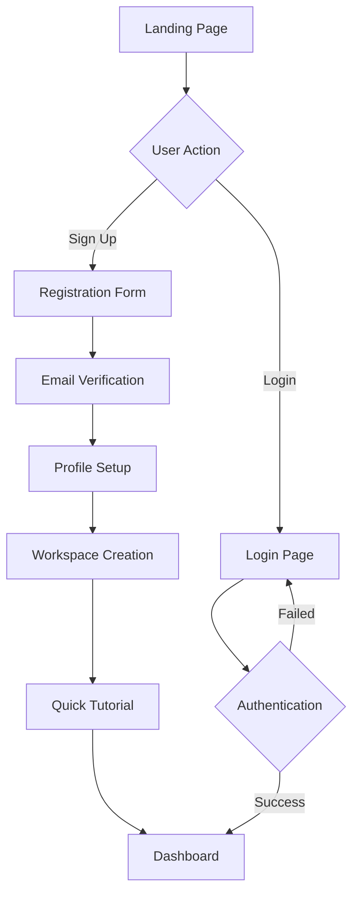
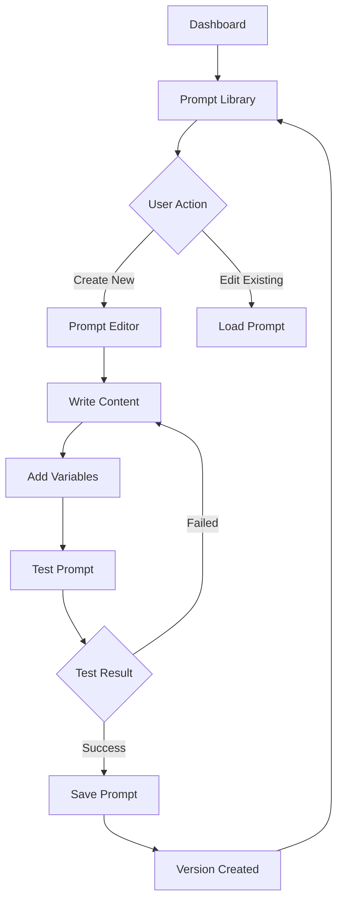
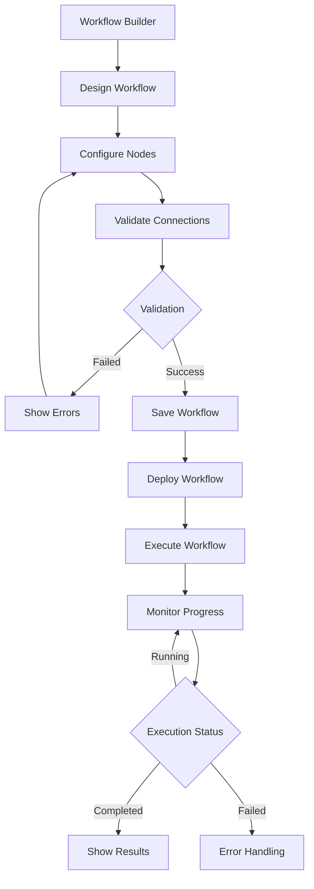

# RANCANGAN — SBA-Agentic Web App (Enhanced Edition)

## 1. Visi & Strategi Produk

**SBA-Agentic Web App** adalah platform AI-agentik terdepan yang menghubungkan pengguna dengan sistem AI canggih melalui antarmuka web intuitif. Platform ini dirancang untuk memberikan pengalaman pengguna yang seamless dalam berinteraksi dengan berbagai model AI, manajemen prompt, dan kolaborasi tim.

### Tujuan Utama:
- Menyediakan antarmuka web yang responsif dan user-friendly untuk AI-agentik
- Memungkinkan kolaborasi tim dalam pengelolaan prompt dan workflow AI
- Meningkatkan produktivitas melalui otomasi dan asistensi AI
- Memastikan aksesibilitas sesuai standar WCAG 2.1 Level AA

### Target Pasar:
- Developer dan AI Engineer yang membutuhkan platform AI-agentik
- Tim produk yang ingin mengintegrasikan AI dalam workflow
- Enterprise yang memerlukan solusi AI dengan governance yang baik

## 2. Core Features

### 2.1 User Roles
| Role | Registration Method | Core Permissions |
|------|---------------------|------------------|
| Guest User | No registration required | Browse public prompts, view documentation |
| Free User | Email registration | Create 10 prompts, basic workflows, 100 AI calls/month |
| Pro User | Subscription upgrade | Unlimited prompts, advanced workflows, 10K AI calls/month |
| Enterprise User | Contact sales | Custom limits, team collaboration, priority support |
| Admin | System assignment | Full system access, user management, analytics |

### 2.2 Feature Module
Aplikasi SBA-Agentic terdiri dari fitur utama berikut:

1. **Dashboard Page**: Overview workspace, quick actions, recent activities, analytics summary
2. **Workspace Management**: Create/edit workspaces, member invitation, role management
3. **Prompt Library**: Browse, create, edit, version control, categorization, search & filter
4. **Workflow Builder**: Visual workflow designer, node-based programming, execution monitoring
5. **AI Chat Interface**: Multi-model chat, conversation history, real-time collaboration
6. **Analytics & Reporting**: Usage metrics, performance insights, cost tracking
7. **Settings & Configuration**: User preferences, API keys, billing, security settings
8. **Team Collaboration**: Real-time editing, comments, notifications, activity feed

### 2.3 Page Details
| Page Name | Module Name | Feature description |
|-----------|-------------|---------------------|
| Landing Page | Hero Section | Showcase platform value proposition with animated AI demonstrations |
| Landing Page | Feature Showcase | Interactive feature cards with hover effects and live previews |
| Landing Page | CTA Section | Compelling call-to-action with pricing tiers and testimonials |
| Login Page | Authentication Form | Secure login with email/password, OAuth providers, 2FA support |
| Register Page | Registration Form | User onboarding with progressive profiling and email verification |
| Dashboard | Workspace Overview | Display active workspaces, recent activities, and quick stats |
| Dashboard | Quick Actions | One-click access to create prompts, workflows, or start chats |
| Dashboard | Analytics Cards | Visual charts showing usage trends, costs, and performance metrics |
| Workspace | Workspace List | Grid/list view of workspaces with search, filter, and sort options |
| Workspace | Create Workspace | Multi-step form with templates, settings, and member invitation |
| Workspace | Member Management | Role assignment, permission settings, and activity tracking |
| Prompt Library | Prompt Gallery | Card-based layout with preview, ratings, and usage statistics |
| Prompt Library | Prompt Editor | Rich text editor with syntax highlighting, variables, and testing |
| Prompt Library | Version Control | Git-like versioning with diff viewer and rollback capabilities |
| Workflow Builder | Canvas Interface | Drag-and-drop interface with zoom, pan, and grid snapping |
| Workflow Builder | Node Palette | Categorized nodes with search and custom node creation |
| Workflow Builder | Property Panel | Dynamic configuration forms based on node type |
| AI Chat | Chat Interface | Message threading, typing indicators, and markdown support |
| AI Chat | Model Selector | Real-time model switching with cost estimation |
| AI Chat | File Upload | Drag-drop file support with preview and processing status |
| Analytics | Usage Dashboard | Interactive charts with date range selection and export options |
| Analytics | Cost Analysis | Detailed cost breakdown by model, user, and time period |
| Analytics | Performance Metrics | Response time, success rates, and error tracking |
| Settings | Profile Settings | Avatar upload, notification preferences, and language settings |
| Settings | API Management | API key generation, rate limiting, and usage monitoring |
| Settings | Billing | Subscription management, payment history, and usage alerts |

## 3. Core Process

### 3.1 User Onboarding Flow


### 3.2 Prompt Creation & Management Flow


### 3.3 Workflow Execution Flow


## 4. User Interface Design

### 4.1 Design Style
**Visual Identity:**
- **Primary Colors**: Deep blue gradient (#1e40af → #3b82f6) for primary actions
- **Secondary Colors**: Cool gray palette (#64748b, #94a3b8) for secondary elements
- **Semantic Colors**: Green (#10b981) success, Orange (#f59e0b) warning, Red (#ef4444) error
- **Background**: Light mode (#ffffff, #f8fafc), Dark mode (#0f172a, #1e293b)

**Typography:**
- **Primary Font**: Inter (Sans-serif) for body text, headings, and UI elements
- **Mono Font**: Fira Code for code snippets, terminal output, and technical content
- **Font Sizes**: 12px captions, 14px body, 16px headings, 18px+ for display text
- **Line Heights**: 1.25 for tight, 1.5 for normal, 1.75 for relaxed readability

**Component Styling:**
- **Buttons**: Rounded corners (8px), subtle shadows, hover animations (200ms)
- **Inputs**: Border focus states, error highlighting, helper text integration
- **Cards**: 12px border radius, soft shadows (0 4px 6px -1px rgba(0,0,0,0.1))
- **Modals**: Backdrop blur, smooth entrance animations, keyboard navigation

**Iconography:**
- **Style**: Outlined icons (Lucide React) for consistency and clarity
- **Sizes**: 16px for inline, 20px for buttons, 24px for navigation, 32px+ for features
- **Animation**: Micro-interactions on hover, loading spinners, state transitions

### 4.2 Page Design Overview
| Page Name | Module Name | UI Elements & Specifications |
|-----------|-------------|------------------------------|
| Landing | Hero Section | Full-screen gradient background with animated particles, centered headline with typewriter effect, CTA buttons with hover animations, scroll indicator |
| Landing | Feature Cards | 3-column responsive grid, icon animations on scroll, gradient borders, hover lift effect with shadow enhancement |
| Dashboard | Stats Overview | 4-column metric cards with progress rings, sparkline graphs, color-coded indicators, real-time updates via WebSocket |
| Dashboard | Activity Feed | Timeline layout with avatar stacks, action tooltips, infinite scroll loading, filter chips |
| Prompt Editor | Rich Text Editor | Syntax-highlighted code blocks, variable placeholders with pill styling, real-time character count, markdown preview toggle |
| Workflow Builder | Canvas Area | Grid background with snap-to-grid, minimap navigation, zoom controls (10%-200%), connection lines with animated flow |
| Chat Interface | Message Thread | Bubbles with gradient backgrounds, typing indicators with pulsing dots, message status icons, timestamp tooltips |
| Analytics | Charts | Interactive line/bar charts with hover details, date range picker, export dropdown, legend toggles |

### 4.3 Responsiveness & Mobile Design
**Breakpoint System:**
- **Mobile**: 320px - 768px (Single column, touch-optimized)
- **Tablet**: 768px - 1024px (Two columns, hybrid navigation)
- **Desktop**: 1024px - 1440px (Multi-column, full features)
- **Large Desktop**: 1440px+ (Maximum content width, enhanced layouts)

**Mobile-Specific Adaptations:**
- **Navigation**: Bottom tab bar with hamburger menu, swipe gestures
- **Touch Targets**: Minimum 44px tap areas, thumb-friendly button placement
- **Gestures**: Pull-to-refresh, swipe actions, pinch-to-zoom on canvas
- **Performance**: Reduced animations, optimized images, lazy loading
- **Input**: Native date pickers, numeric keyboards, voice input support

### 4.4 Accessibility Features
**WCAG 2.1 Level AA Compliance:**
- **Color Contrast**: 4.5:1 for normal text, 3:1 for large text
- **Keyboard Navigation**: Full tab order, skip links, keyboard shortcuts
- **Screen Reader**: Semantic HTML, ARIA labels, live regions for updates
- **Focus Management**: Visible focus indicators, logical focus order
- **Alternative Text**: Descriptive alt text for images, icons, and charts
- **Motion Preferences**: Respect reduced motion settings, provide animation toggle

## 5. User Experience (UX) Strategy

### 5.1 Information Architecture
```
SBA-Agentic Web App
├── Public Area
│   ├── Landing Page
│   ├── Pricing
│   ├── Documentation
│   └── Contact
├── Authentication Area
│   ├── Login
│   ├── Register
│   ├── Forgot Password
│   └── Email Verification
├── Application Area
│   ├── Dashboard (Home)
│   ├── Workspaces
│   │   ├── My Workspaces
│   │   ├── Shared Workspaces
│   │   └── Archived Workspaces
│   ├── Prompts
│   │   ├── My Prompts
│   │   ├── Team Prompts
│   │   ├── Public Gallery
│   │   └── Categories
│   ├── Workflows
│   │   ├── Active Workflows
│   │   ├── Templates
│   │   └── Execution History
│   ├── Analytics
│   │   ├── Usage Overview
│   │   ├── Cost Analysis
│   │   └── Performance Metrics
│   └── Settings
│       ├── Profile
│       ├── Preferences
│       ├── API Keys
│       └── Billing
```

### 5.2 User Journey Mapping
**Primary User Personas:**

1. **AI Developer** (Primary User)
   - **Goals**: Quick prompt prototyping, workflow automation, team collaboration
   - **Pain Points**: Complex setup, slow iteration cycles, version control issues
   - **Journey**: Discovery → Quick Start → Prompt Creation → Testing → Iteration → Deployment

2. **Product Manager** (Secondary User)
   - **Goals**: Monitor team usage, analyze ROI, manage budgets
   - **Pain Points**: Lack of visibility, complex reporting, budget overruns
   - **Journey**: Onboarding → Team Setup → Usage Monitoring → Cost Optimization → Reporting

3. **Enterprise Admin** (Tertiary User)
   - **Goals**: User management, security compliance, governance
   - **Pain Points**: Security concerns, compliance requirements, scalability
   - **Journey**: Evaluation → Implementation → Governance Setup → Monitoring → Optimization

### 5.3 Interaction Design Patterns
**Common Interaction Patterns:**
- **Create Flow**: Floating action button → Modal/Drawer → Multi-step form → Success notification
- **Edit Flow**: Inline edit → Save indicator → Validation → Confirmation
- **Delete Flow**: Warning dialog → Confirmation → Soft delete → Undo option
- **Search Flow**: Search bar → Real-time suggestions → Filter panel → Results grid
- **Navigation Flow**: Breadcrumb → Contextual menus → Keyboard shortcuts

**Loading States:**
- **Skeleton Screens**: Content placeholders matching final layout
- **Progress Indicators**: Determinate for known duration, indeterminate for unknown
- **Optimistic Updates**: Immediate UI feedback with rollback on error
- **Background Sync**: Silent updates with conflict resolution

**Error Handling:**
- **Inline Validation**: Real-time form validation with helpful messages
- **Toast Notifications**: Non-intrusive error/success messages with actions
- **Error Boundaries**: Graceful degradation with recovery options
- **Network Errors**: Retry mechanisms with exponential backoff

## 6. Performance & Optimization

### 6.1 Core Web Vitals Targets
- **LCP (Largest Contentful Paint)**: < 2.5s
- **FID (First Input Delay)**: < 100ms
- **CLS (Cumulative Layout Shift)**: < 0.1
- **FCP (First Contentful Paint)**: < 1.8s
- **TTI (Time to Interactive)**: < 3.8s

### 6.2 Performance Optimization Strategies
**Code Optimization:**
- **Code Splitting**: Route-based and component-based lazy loading
- **Tree Shaking**: Remove unused code from bundles
- **Bundle Analysis**: Regular analysis with webpack-bundle-analyzer
- **Compression**: Gzip and Brotli compression for all assets

**Image Optimization:**
- **Format Selection**: WebP with PNG fallback, AVIF for modern browsers
- **Responsive Images**: Multiple sizes with srcset and sizes attributes
- **Lazy Loading**: Intersection observer for below-fold images
- **CDN Delivery**: Global CDN with edge caching

**Runtime Performance:**
- **Virtual Scrolling**: For large lists and data tables
- **Memoization**: React.memo, useMemo, useCallback for expensive operations
- **Debouncing**: Search inputs, resize handlers, scroll events
- **Web Workers**: Heavy computations off main thread

### 6.3 Monitoring & Measurement
**Performance Monitoring:**
- **Real User Monitoring**: Web Vitals tracking with actual user data
- **Synthetic Monitoring**: Automated performance testing in CI/CD
- **Error Tracking**: Sentry integration for performance-related errors
- **Analytics**: Google Analytics with enhanced ecommerce tracking

## 7. Testing Strategy

### 7.1 Testing Pyramid
```
Testing Strategy
├── E2E Tests (10%)
│   ├── Critical User Flows
│   ├── Cross-browser Testing
│   └── Mobile Testing
├── Integration Tests (30%)
│   ├── API Integration
│   ├── Component Integration
│   └── State Management
└── Unit Tests (60%)
    ├── Utility Functions
    ├── React Components
    └── Business Logic
```

### 7.2 Test Coverage Requirements
- **Unit Tests**: Minimum 80% code coverage
- **Integration Tests**: All API endpoints and critical user flows
- **E2E Tests**: Critical paths (signup, login, core features)
- **Accessibility Tests**: Automated a11y testing with jest-axe
- **Performance Tests**: Lighthouse CI for performance regression

### 7.3 Testing Tools & Framework
**Testing Stack:**
- **Unit Testing**: Vitest + React Testing Library
- **Component Testing**: Storybook + Chromatic for visual regression
- **E2E Testing**: Playwright for cross-browser testing
- **API Testing**: MSW (Mock Service Worker) for API mocking
- **Accessibility**: jest-axe + manual testing with screen readers
- **Performance**: Lighthouse CI + WebPageTest integration

## 8. Quality Assurance (QA)

### 8.1 Definition of Done
**Development Complete:**
- [ ] Code follows project style guide and conventions
- [ ] Unit tests written and passing (minimum 80% coverage)
- [ ] Integration tests for API endpoints
- [ ] Component documented in Storybook
- [ ] Accessibility audit passed (WCAG 2.1 AA)
- [ ] Performance budget met (bundle size, load time)
- [ ] Cross-browser testing completed (Chrome, Firefox, Safari, Edge)
- [ ] Mobile responsive testing completed
- [ ] Code review approved by minimum 2 reviewers
- [ ] Documentation updated (JSDoc, README, API docs)

**Deployment Ready:**
- [ ] Environment variables configured
- [ ] Database migrations tested
- [ ] Health check endpoints working
- [ ] Monitoring and alerting configured
- [ ] Rollback plan documented
- [ ] Feature flags implemented (if applicable)

### 8.2 QA Checklist Per Fitur

**Authentication System:**
- [ ] Registration with valid/invalid data
- [ ] Email verification flow
- [ ] Login with correct/incorrect credentials
- [ ] Password reset functionality
- [ ] Session management (timeout, remember me)
- [ ] OAuth provider integration
- [ ] Two-factor authentication
- [ ] Account lockout after failed attempts

**Workspace Management:**
- [ ] Create workspace with valid data
- [ ] Workspace naming validation
- [ ] Member invitation via email
- [ ] Role-based permissions
- [ ] Workspace switching
- [ ] Archive/delete workspace
- [ ] Transfer ownership
- [ ] Workspace templates

**Prompt Management:**
- [ ] Create prompt with rich content
- [ ] Variable placeholder validation
- [ ] Version control functionality
- [ ] Search and filtering
- [ ] Category management
- [ ] Import/export prompts
- [ ] Prompt sharing permissions
- [ ] Usage analytics per prompt

**Workflow Builder:**
- [ ] Drag-and-drop node placement
- [ ] Connection validation
- [ ] Node configuration forms
- [ ] Workflow execution
- [ ] Error handling and recovery
- [ ] Execution history
- [ ] Performance monitoring
- [ ] Template functionality

**AI Chat Interface:**
- [ ] Multi-model conversation
- [ ] Real-time message updates
- [ ] File upload and processing
- [ ] Message formatting (Markdown)
- [ ] Conversation history
- [ ] Export conversations
- [ ] Cost tracking per message
- [ ] Rate limiting handling

### 8.3 Bug Severity Classification

**Critical (P0) - Immediate Resolution:**
- Application crash or inability to access
- Data loss or corruption
- Security vulnerability
- Complete feature failure
- Payment processing issues

**High (P1) - Within 24 Hours:**
- Major feature malfunction
- Significant performance degradation
- Data inconsistency
- User workflow blocker
- Accessibility violation

**Medium (P2) - Within 1 Week:**
- Minor functionality issues
- UI/UX inconsistencies
- Performance optimization
- Edge case bugs
- Documentation gaps

**Low (P3) - Next Sprint:**
- Cosmetic issues
- Typos or grammar errors
- Minor UI misalignment
- Enhancement suggestions
- Code cleanup

## 9. Security & Privacy

### 9.1 Security Measures
**Authentication & Authorization:**
- JWT tokens with short expiration
- Refresh token rotation
- Rate limiting on auth endpoints
- Account lockout mechanisms
- Session management

**Data Protection:**
- Encryption at rest and in transit
- Input validation and sanitization
- SQL injection prevention
- XSS protection
- CSRF tokens

**API Security:**
- API key management
- Request signing
- CORS configuration
- Content Security Policy
- Security headers

### 9.2 Privacy Compliance
**GDPR Compliance:**
- User consent management
- Data portability
- Right to erasure
- Privacy by design
- Data minimization

**Data Handling:**
- Clear data retention policies
- Anonymization where possible
- Audit logging
- Access controls
- Regular security audits

## 10. Deployment & DevOps

### 10.1 CI/CD Pipeline
```yaml
# Deployment Pipeline
stages:
  - build
  - test
  - security-scan
  - deploy-staging
  - integration-tests
  - deploy-production

build:
  script:
    - npm ci
    - npm run build
    - npm run analyze-bundle

test:
  script:
    - npm run test:unit
    - npm run test:integration
    - npm run test:coverage

security-scan:
  script:
    - npm audit
    - docker scout cves

deploy-staging:
  script:
    - docker build -t $IMAGE_TAG .
    - kubectl apply -f k8s/staging/

integration-tests:
  script:
    - npm run test:e2e
    - npm run test:performance

deploy-production:
  script:
    - kubectl apply -f k8s/production/
  only:
    - main
```

### 10.2 Environment Configuration
**Development Environment:**
- Hot module replacement
- Source maps enabled
- Detailed error messages
- Mock API responses
- Development tools

**Staging Environment:**
- Production-like data
- Feature flags enabled
- Performance monitoring
- Error tracking
- Load testing

**Production Environment:**
- Optimized bundles
- CDN distribution
- Health checks
- Monitoring alerts
- Backup procedures

## 11. Monitoring & Analytics

### 11.1 Application Monitoring
**Performance Metrics:**
- Page load times
- API response times
- Error rates
- User engagement
- Feature usage

**Infrastructure Monitoring:**
- Server health
- Database performance
- Memory usage
- Disk space
- Network latency

### 11.2 User Analytics
**Behavioral Analytics:**
- User journey tracking
- Feature adoption
- Conversion funnels
- Retention analysis
- Cohort analysis

**Privacy-First Approach:**
- Anonymous tracking
- Consent management
- Data minimization
- Right to deletion
- Transparent policies

## 12. Maintenance & Support

### 12.1 Regular Maintenance Tasks
**Daily:**
- Monitor error logs
- Check system health
- Review performance metrics
- Handle user support tickets

**Weekly:**
- Security updates
- Performance optimization
- Database maintenance
- Backup verification

**Monthly:**
- Dependency updates
- Security audits
- Performance reviews
- Feature usage analysis

### 12.2 Support Strategy
**User Support Channels:**
- In-app help center
- Email support
- Community forum
- Video tutorials
- Documentation

**SLA Commitments:**
- Critical issues: 1 hour response
- High priority: 4 hours response
- Medium priority: 1 business day
- Low priority: 2 business days

## 13. Future Enhancements

### 13.1 Phase 2 Features
- **Advanced Analytics**: Predictive analytics, custom dashboards
- **API Marketplace**: Third-party integrations, plugin system
- **Mobile App**: Native iOS/Android applications
- **Voice Interface**: Speech-to-text, voice commands
- **Advanced Collaboration**: Real-time editing, video calls

### 13.2 Technology Roadmap
- **AI/ML Enhancements**: Custom model training, federated learning
- **Edge Computing**: CDN edge functions, distributed processing
- **Blockchain Integration**: Decentralized storage, smart contracts
- **AR/VR Support**: Immersive interfaces, 3D visualizations

This enhanced documentation provides a comprehensive blueprint for developing the SBA-Agentic Web Application with strong emphasis on user experience, accessibility, performance, and quality assurance.