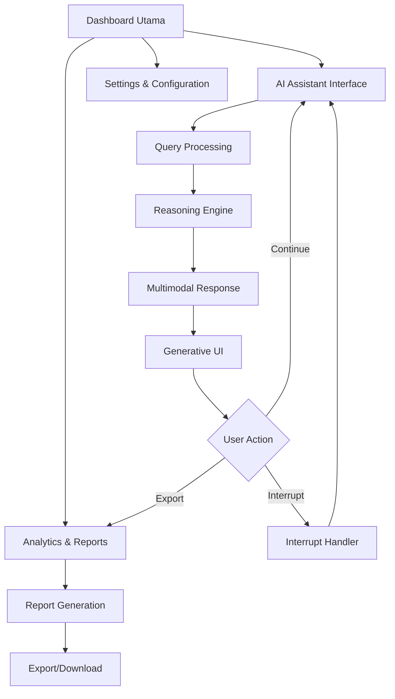

# SBA-Agentic (Smart Business Assistant) - Product Requirements Document

## 1. Product Overview

SBA-Agentic adalah asisten bisnis cerdas berbasis AI yang menyediakan antarmuka generatif, kemampuan reasoning, dan komunikasi multimodal untuk membantu pengguna dalam pengambilan keputusan bisnis. Produk ini dirancang untuk memberikan pengalaman interaktif yang intuitif dengan dukungan interrupts dan meta-events untuk meningkatkan efisiensi operasional bisnis.

**Target Market:** Pemilik usaha kecil-menengah, manajer, dan profesional bisnis yang membutuhkan asisten pintar untuk analisis, perencanaan, dan eksekusi tugas-tugas bisnis.

## 2. Core Features

### 2.1 User Roles

| Role | Registration Method | Core Permissions |
|------|---------------------|------------------|
| Free User | Email registration | Akses basic reasoning, 10 queries/hari, UI sederhana |
| Premium User | Pembayaran berlangganan | Akses unlimited queries, multimodal messages, custom UI, advanced analytics |
| Enterprise User | Kontak sales team | Akses API, white-label, custom integration, dedicated support |

### 2.2 Feature Module

Aplikasi SBA-Agentic terdiri dari halaman-halaman utama berikut:

1. **Dashboard Utama**: Overview bisnis, quick actions, notifikasi penting
2. **AI Assistant Interface**: Chat interface dengan reasoning capabilities, multimodal input/output
3. **Analytics & Reports**: Visualisasi data, KPI tracking, business insights
4. **Settings & Configuration**: User preferences, integration settings, billing

### 2.3 Page Details

| Page Name | Module Name | Feature description |
|-----------|-------------|---------------------|
| Dashboard Utama | Business Overview | Menampilkan ringkasan KPI utama, grafik performa, dan notifikasi penting |
| Dashboard Utama | Quick Actions | Tombol cepat untuk fungsi umum: new query, export report, schedule meeting |
| Dashboard Utama | Recent Activity | Daftar aktivitas terbaru termasuk queries dan responses |
| AI Assistant Interface | Chat Interface | Tampilan chat modern dengan support text, voice, image input |
| AI Assistant Interface | Reasoning Display | Visualisasi proses reasoning AI dengan langkah-langkah yang transparan |
| AI Assistant Interface | Interrupt Controls | Tombol pause, stop, dan modify untuk mengontrol proses AI |
| AI Assistant Interface | Multimodal Messages | Support kirim/terima text, gambar, audio, dan file dokumen |
| AI Assistant Interface | Generative UI | UI yang adaptif berdasarkan konteks percakapan |
| Analytics & Reports | KPI Dashboard | Chart dan grafik untuk tracking key performance indicators |
| Analytics & Reports | Report Generator | Generate custom reports dengan berbagai format export |
| Analytics & Reports | Meta-Events Log | Log semua events system untuk audit dan troubleshooting |
| Settings & Configuration | User Profile | Edit informasi pribadi dan preferensi |
| Settings & Configuration | Integration Hub | Connect dengan tools bisnis eksternal (CRM, ERP, dll) |
| Settings & Configuration | Billing & Subscription | Manage langganan dan payment history |

## 3. Core Process

### User Flow - Basic Query
1. User masuk ke Dashboard Utama
2. Klik "New Query" atau langsung ke AI Assistant Interface
3. Masukkan pertanyaan via text, voice, atau upload file
4. Sistem memproses dengan reasoning engine
5. Tampilkan response dengan generative UI yang sesuai
6. User dapat melanjutkan conversation atau export hasil

### User Flow - Analytics & Reporting
1. Navigasi ke Analytics & Reports page
2. Pilih KPI yang ingin dianalisis
3. System generate visualisasi otomatis
4. User dapat customize timeframe dan parameters
5. Export report dalam format yang diinginkan

### User Flow - Interrupt Handling
1. Saat AI sedang memproses, user dapat klik interrupt
2. System pause current operation
3. User dapat modify query atau cancel completely
4. System resume dengan instruksi baru atau stop sepenuhnya

## 4. User Interface Design

### 4.1 Design Style
- **Primary Colors**: Deep Blue (#1E40AF) untuk professional trust, Accent Orange (#F59E0B) untuk CTAs
- **Secondary Colors**: Light Gray (#F3F4F6) untuk background, Dark Gray (#374151) untuk text
- **Button Style**: Rounded corners (8px radius), shadow subtle untuk depth
- **Typography**: Inter font family, 14px base size, proper hierarchy (12px small, 16px medium, 20px large)
- **Layout**: Card-based design dengan proper spacing (8px grid system)
- **Icons**: Heroicons untuk konsistensi, emoji untuk conversational elements

### 4.2 Page Design Overview

| Page Name | Module Name | UI Elements |
|-----------|-------------|-------------|
| Dashboard Utama | Business Overview | Card layout dengan metric tiles, line charts untuk trends, color-coded status indicators |
| Dashboard Utama | Quick Actions | Floating action button, icon-based menu dengan labels |
| AI Assistant Interface | Chat Interface | Message bubbles dengan avatar, typing indicators, timestamp |
| AI Assistant Interface | Reasoning Display | Step-by-step cards dengan progress indicators, collapsible sections |
| AI Assistant Interface | Interrupt Controls | Floating toolbar dengan pause/stop icons, keyboard shortcuts |
| Analytics & Reports | KPI Dashboard | Interactive charts (Chart.js), filter dropdowns, date range picker |
| Settings & Configuration | User Profile | Form dengan validation states, profile picture upload, save indicators |

### 4.3 Responsiveness
- **Desktop-first approach** dengan breakpoint: 1920px, 1440px, 1024px
- **Mobile adaptive** untuk 768px dan 375px
- **Touch optimization** untuk tablet (hover states fallback)
- **Progressive enhancement** untuk fitur browser modern

## 5. Key Performance Indicators (KPI)

### Business KPIs
- **User Acquisition**: 1000 sign-ups dalam 3 bulan pertama
- **Conversion Rate**: 15% dari free ke premium
- **User Retention**: 60% monthly active users
- **Average Session Duration**: 8 menit per session

### Technical KPIs
- **Response Time**: <2 detik untuk simple queries, <5 detik untuk complex reasoning
- **System Uptime**: 99.9% availability
- **Query Success Rate**: >95% successful processing
- **Multimodal Processing**: Support 10+ file formats

### User Experience KPIs
- **Customer Satisfaction**: >4.5/5 rating
- **Task Completion Rate**: >80% untuk core workflows
- **Support Ticket Volume**: <5% dari active users
- **Feature Adoption**: >70% users menggunakan multimodal features

## 6. Acceptance Criteria

### Functional Requirements
- [ ] User dapat register/login dengan email
- [ ] AI Assistant merespon dalam <2 detik untuk queries sederhana
- [ ] Support input text, voice, image, dan document files
- [ ] Visualisasi reasoning steps untuk transparansi
- [ ] Interrupt functionality bekerja untuk semua operations
- [ ] KPI dashboard update real-time
- [ ] Export reports dalam PDF, Excel, dan CSV formats
- [ ] Meta-events logging untuk audit trail

### Non-Functional Requirements
- [ ] Mobile responsive di iOS dan Android
- [ ] Support 5 bahasa utama (ID, EN, CN, JP, KR)
- [ ] WCAG 2.1 AA accessibility compliance
- [ ] Data encryption untuk sensitive information
- [ ] GDPR dan local data privacy compliance
- [ ] Support 10,000+ concurrent users

### Performance Requirements
- [ ] Page load time <3 detik di 3G connection
- [ ] 99.9% uptime selama business hours
- [ ] Database queries <100ms untuk dashboard data
- [ ] File upload support sampai 100MB
- [ ] Real-time sync untuk collaborative features

## 7. Dependencies

### External Services
- **AI/ML Platform**: OpenAI GPT-4, Anthropic Claude, atau Google Bard
- **Speech Recognition**: Google Speech-to-Text, Azure Speech Services
- **Image Processing**: Google Vision API, AWS Rekognition
- **File Storage**: AWS S3, Google Cloud Storage
- **Analytics**: Google Analytics, Mixpanel
- **Payment Gateway**: Stripe, Midtrans (untuk ID)

### Internal Dependencies
- **Authentication Service**: Supabase Auth atau Firebase Auth
- **Database**: PostgreSQL dengan Supabase
- **Real-time Communication**: WebSocket atau Server-Sent Events
- **Caching**: Redis untuk session dan frequent queries
- **CDN**: Cloudflare untuk asset delivery

### Third-Party Integrations
- **CRM Systems**: Salesforce, HubSpot, Zoho CRM
- **ERP Platforms**: SAP, Oracle NetSuite, Odoo
- **Communication Tools**: Slack, Microsoft Teams, WhatsApp Business API
- **Calendar Systems**: Google Calendar, Outlook Calendar
- **Document Management**: Google Drive, Dropbox, OneDrive

## 8. Risiko dan Mitigasi

### Technical Risks
**Risk**: AI Model Latency atau Timeout
- **Impact**: User experience buruk, churn rate meningkat
- **Mitigation**: Implement edge caching, request queuing, fallback ke model yang lebih cepat

**Risk**: Data Privacy Breach
- **Impact**: Legal consequences, loss of user trust
- **Mitigation**: End-to-end encryption, regular security audits, GDPR compliance

**Risk**: System Overload saat Peak Usage
- **Impact**: Service downtime, revenue loss
- **Mitigation**: Auto-scaling infrastructure, load balancing, circuit breakers

### Business Risks
**Risk**: Low User Adoption
- **Impact**: Tidak mencapai ROI target
- **Mitigation**: Extensive user research, iterative design improvements, referral programs

**Risk**: Competitor Feature Parity
- **Impact**: Loss of competitive advantage
- **Mitigation**: Focus on unique value proposition, continuous innovation, patent protection

**Risk**: Regulatory Changes
- **Impact**: Need for major system changes
- **Mitigation**: Legal monitoring, flexible architecture, compliance-first design

### Operational Risks
**Risk**: Key Personnel Turnover
- **Impact**: Development delays, knowledge loss
- **Mitigation**: Documentation standards, knowledge sharing sessions, competitive compensation

**Risk**: Third-Party Service Outages
- **Impact**: Feature unavailability
- **Mitigation**: Service redundancy, fallback providers, SLA agreements

## 9. Future Enhancements

### Phase 2 (6-12 bulan)
- Advanced predictive analytics dengan machine learning
- White-label solution untuk enterprise clients
- Mobile native apps (iOS/Android)
- Voice-first interface untuk hands-free operation
- Integration dengan IoT devices untuk business monitoring

### Phase 3 (12-18 bulan)
- Multi-language support dengan real-time translation
- Computer vision untuk document processing
- Advanced workflow automation
- Blockchain integration untuk audit trails
- AR/VR interface untuk immersive data visualization

---

*Dokumen ini merupakan panduan utama untuk pengembangan SBA-Agentic dan akan diupdate secara berkala sesuai dengan perkembangan produk dan kebutuhan pasar.*