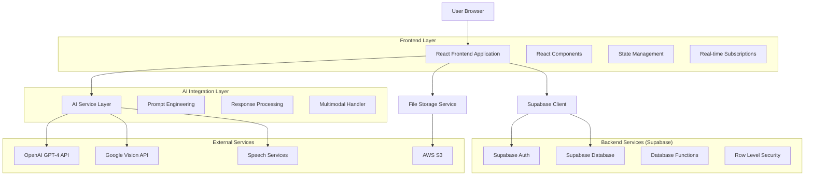
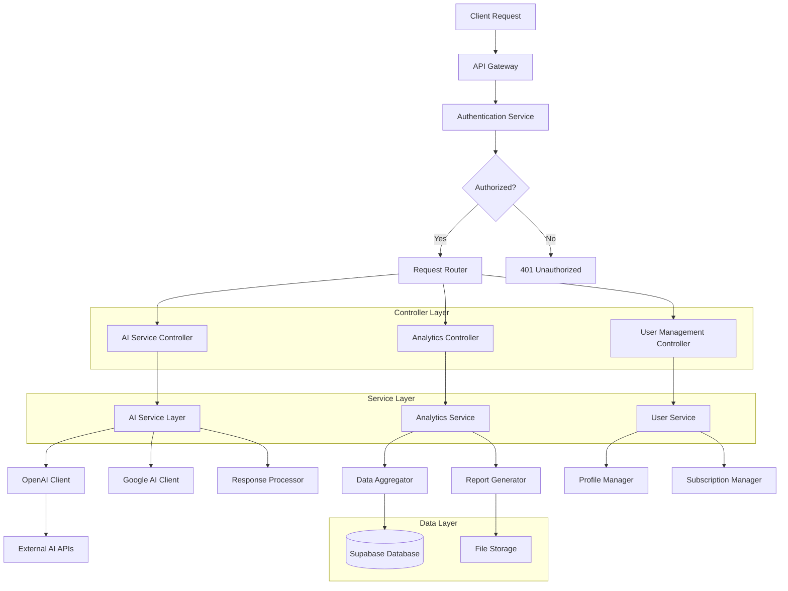
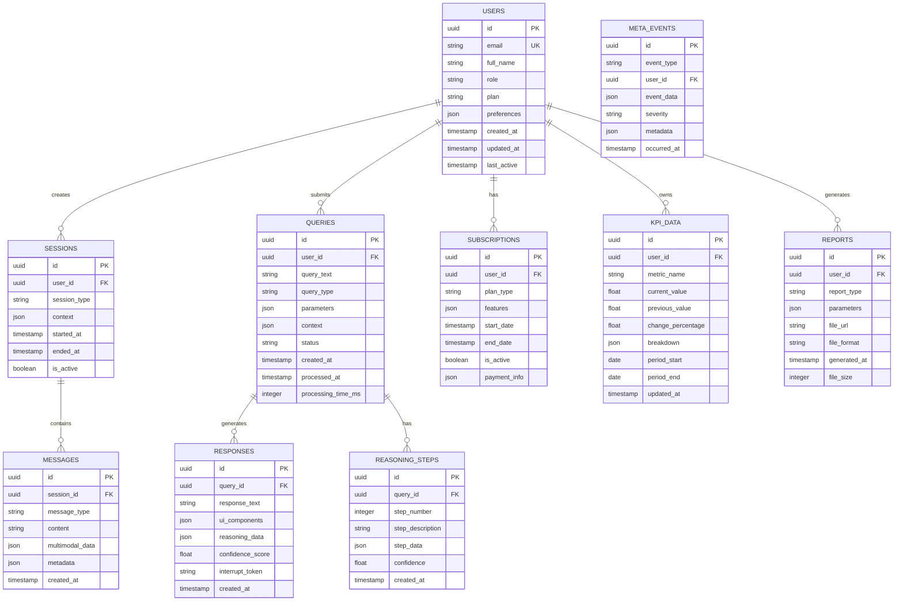

# SBA-Agentic (Smart Business Assistant) - Technical Architecture Document

## 1. Architecture Design



## 2. Technology Description

- **Frontend**: React@18 + TypeScript@5 + Vite
- **UI Framework**: TailwindCSS@3 + HeadlessUI
- **State Management**: Zustand + React Query
- **Real-time**: Supabase Realtime + WebSocket
- **Authentication**: Supabase Auth (Magic Link + OAuth)
- **Database**: Supabase (PostgreSQL@15)
- **File Storage**: Supabase Storage + AWS S3
- **AI Services**: OpenAI GPT-4 API, Google Cloud AI
- **Analytics**: PostHog + Mixpanel
- **Initialization Tool**: vite-init

## 3. Route Definitions

| Route | Purpose | Protection Level |
|-------|---------|------------------|
| `/` | Landing page dengan product overview | Public |
| `/auth/login` | Login page dengan magic link | Public |
| `/auth/register` | Registration page | Public |
| `/dashboard` | Main dashboard dengan business overview | Authenticated |
| `/assistant` | AI chat interface dengan multimodal support | Authenticated |
| `/analytics` | Analytics dashboard dengan KPI charts | Authenticated |
| `/reports` | Report generation dan export | Authenticated |
| `/settings/profile` | User profile management | Authenticated |
| `/settings/integrations` | Third-party integrations | Authenticated |
| `/settings/billing` | Subscription dan payment management | Authenticated |
| `/admin/users` | User management (Admin only) | Admin Role |
| `/admin/analytics` | System-wide analytics | Admin Role |

## 4. API Definitions

### 4.1 Authentication APIs

**Login dengan Magic Link**
```
POST /auth/v1/magiclink
```

Request:
```json
{
  "email": "user@example.com",
  "redirectTo": "https://sba-agentic.com/dashboard"
}
```

Response:
```json
{
  "success": true,
  "message": "Check your email for the magic link"
}
```

**OAuth Login**
```
GET /auth/v1/authorize?provider=google
```

### 4.2 AI Assistant APIs

**Process Query**
```
POST /api/assistant/query
```

Request:
```json
{
  "query": "What is my sales performance this month?",
  "context": {
    "userId": "uuid",
    "sessionId": "session-uuid",
    "previousMessages": []
  },
  "mode": "reasoning",
  "multimodal": {
    "type": "text",
    "content": ""
  }
}
```

Response:
```json
{
  "responseId": "resp-uuid",
  "content": "Based on your data...",
  "reasoningSteps": [
    {
      "step": 1,
      "description": "Analyzing sales data...",
      "confidence": 0.95
    }
  ],
  "uiComponents": [
    {
      "type": "chart",
      "data": {},
      "config": {}
    }
  ],
  "processingTime": 1200,
  "interruptToken": "token-uuid"
}
```

**Interrupt Processing**
```
POST /api/assistant/interrupt
```

Request:
```json
{
  "interruptToken": "token-uuid",
  "action": "pause|stop|modify",
  "newQuery": "Updated query if modify"
}
```

### 4.3 Analytics APIs

**Get KPI Data**
```
GET /api/analytics/kpi?timeframe=30d&metrics=sales,revenue,conversion
```

Response:
```json
{
  "kpiData": {
    "sales": {
      "current": 125000,
      "previous": 110000,
      "change": 13.6,
      "trend": "up"
    },
    "revenue": {
      "current": 2500000,
      "previous": 2200000,
      "change": 13.6,
      "trend": "up"
    }
  },
  "timeframe": "30d",
  "generatedAt": "2025-12-05T10:00:00Z"
}
```

**Generate Report**
```
POST /api/analytics/report
```

Request:
```json
{
  "reportType": "sales_performance",
  "dateRange": {
    "start": "2025-11-01",
    "end": "2025-11-30"
  },
  "format": "pdf|excel|csv",
  "includeCharts": true
}
```

## 5. Server Architecture Diagram



## 6. Data Model

### 6.1 Entity Relationship Diagram



### 6.2 Data Definition Language

**Users Table**
```sql
-- Create users table
CREATE TABLE users (
    id UUID PRIMARY KEY DEFAULT gen_random_uuid(),
    email VARCHAR(255) UNIQUE NOT NULL,
    full_name VARCHAR(255) NOT NULL,
    role VARCHAR(50) DEFAULT 'user' CHECK (role IN ('user', 'admin', 'enterprise')),
    plan VARCHAR(50) DEFAULT 'free' CHECK (plan IN ('free', 'premium', 'enterprise')),
    preferences JSONB DEFAULT '{}',
    created_at TIMESTAMP WITH TIME ZONE DEFAULT NOW(),
    updated_at TIMESTAMP WITH TIME ZONE DEFAULT NOW(),
    last_active TIMESTAMP WITH TIME ZONE DEFAULT NOW()
);

-- Create indexes
CREATE INDEX idx_users_email ON users(email);
CREATE INDEX idx_users_role ON users(role);
CREATE INDEX idx_users_plan ON users(plan);
CREATE INDEX idx_users_last_active ON users(last_active DESC);
```

**Sessions Table**
```sql
-- Create sessions table
CREATE TABLE sessions (
    id UUID PRIMARY KEY DEFAULT gen_random_uuid(),
    user_id UUID REFERENCES users(id) ON DELETE CASCADE,
    session_type VARCHAR(50) NOT NULL,
    context JSONB DEFAULT '{}',
    started_at TIMESTAMP WITH TIME ZONE DEFAULT NOW(),
    ended_at TIMESTAMP WITH TIME ZONE,
    is_active BOOLEAN DEFAULT true
);

-- Create indexes
CREATE INDEX idx_sessions_user_id ON sessions(user_id);
CREATE INDEX idx_sessions_active ON sessions(is_active) WHERE is_active = true;
CREATE INDEX idx_sessions_started_at ON sessions(started_at DESC);
```

**Queries Table**
```sql
-- Create queries table
CREATE TABLE queries (
    id UUID PRIMARY KEY DEFAULT gen_random_uuid(),
    user_id UUID REFERENCES users(id) ON DELETE CASCADE,
    query_text TEXT NOT NULL,
    query_type VARCHAR(50) DEFAULT 'general',
    parameters JSONB DEFAULT '{}',
    context JSONB DEFAULT '{}',
    status VARCHAR(50) DEFAULT 'pending' CHECK (status IN ('pending', 'processing', 'completed', 'failed', 'interrupted')),
    created_at TIMESTAMP WITH TIME ZONE DEFAULT NOW(),
    processed_at TIMESTAMP WITH TIME ZONE,
    processing_time_ms INTEGER
);

-- Create indexes
CREATE INDEX idx_queries_user_id ON queries(user_id);
CREATE INDEX idx_queries_status ON queries(status);
CREATE INDEX idx_queries_created_at ON queries(created_at DESC);
CREATE INDEX idx_queries_type ON queries(query_type);
```

**KPI Data Table**
```sql
-- Create KPI data table
CREATE TABLE kpi_data (
    id UUID PRIMARY KEY DEFAULT gen_random_uuid(),
    user_id UUID REFERENCES users(id) ON DELETE CASCADE,
    metric_name VARCHAR(100) NOT NULL,
    current_value DECIMAL(15,2),
    previous_value DECIMAL(15,2),
    change_percentage DECIMAL(8,2),
    breakdown JSONB DEFAULT '{}',
    period_start DATE NOT NULL,
    period_end DATE NOT NULL,
    updated_at TIMESTAMP WITH TIME ZONE DEFAULT NOW()
);

-- Create indexes
CREATE INDEX idx_kpi_user_id ON kpi_data(user_id);
CREATE INDEX idx_kpi_metric_name ON kpi_data(metric_name);
CREATE INDEX idx_kpi_period ON kpi_data(period_start, period_end);
CREATE INDEX idx_kpi_updated_at ON kpi_data(updated_at DESC);
```

**Row Level Security (RLS) Policies**
```sql
-- Enable RLS
ALTER TABLE users ENABLE ROW LEVEL SECURITY;
ALTER TABLE sessions ENABLE ROW LEVEL SECURITY;
ALTER TABLE queries ENABLE ROW LEVEL SECURITY;
ALTER TABLE kpi_data ENABLE ROW LEVEL SECURITY;

-- Users policies
CREATE POLICY "Users can view own profile" ON users
    FOR SELECT USING (auth.uid() = id);

CREATE POLICY "Admin can view all users" ON users
    FOR SELECT USING (EXISTS (
        SELECT 1 FROM users WHERE id = auth.uid() AND role = 'admin'
    ));

-- Sessions policies
CREATE POLICY "Users can manage own sessions" ON sessions
    FOR ALL USING (auth.uid() = user_id);

-- Queries policies
CREATE POLICY "Users can view own queries" ON queries
    FOR SELECT USING (auth.uid() = user_id);

CREATE POLICY "Users can create queries" ON queries
    FOR INSERT WITH CHECK (auth.uid() = user_id);

-- KPI data policies
CREATE POLICY "Users can view own KPI data" ON kpi_data
    FOR SELECT USING (auth.uid() = user_id);

-- Grant permissions
GRANT SELECT ON users TO anon;
GRANT ALL ON users TO authenticated;
GRANT SELECT ON sessions TO authenticated;
GRANT ALL ON sessions TO authenticated;
GRANT SELECT ON queries TO authenticated;
GRANT ALL ON queries TO authenticated;
GRANT SELECT ON kpi_data TO authenticated;
GRANT ALL ON kpi_data TO authenticated;
```

## 7. Security Considerations

### Authentication & Authorization
- JWT tokens dengan 15-menit expiry
- Refresh tokens dengan 7-hari expiry
- Rate limiting: 100 requests per menit per user
- OAuth2 integration untuk Google, Microsoft, GitHub

### Data Protection
- Enkripsi AES-256 untuk data sensitive
- SSL/TLS untuk semua komunikasi
- Field-level encryption untuk payment data
- Regular security audits dan penetration testing

### API Security
- API key rotation setiap 90 hari
- Request signing untuk sensitive operations
- CORS policy yang strict
- Input validation dan sanitization

### Privacy Compliance
- GDPR compliance untuk EU users
- CCPA compliance untuk California users
- Data anonymization untuk analytics
- User consent management system

## 8. Performance Optimization

### Caching Strategy
- **Browser Cache**: Static assets dengan 1-year expiry
- **CDN Cache**: Global distribution untuk media files
- **Application Cache**: Redis untuk frequent queries
- **Database Cache**: Query result caching

### Database Optimization
- Index pada frequently queried columns
- Query optimization dengan EXPLAIN ANALYZE
- Connection pooling dengan PgBouncer
- Regular VACUUM dan ANALYZE operations

### Frontend Optimization
- Code splitting dengan dynamic imports
- Lazy loading untuk images dan components
- Service workers untuk offline functionality
- Bundle size optimization dengan tree shaking

## 9. Monitoring & Logging

### Application Monitoring
- **Error Tracking**: Sentry untuk real-time error monitoring
- **Performance Monitoring**: New Relic atau DataDog
- **User Analytics**: PostHog untuk user behavior tracking
- **Uptime Monitoring**: Pingdom atau StatusCake

### Logging Strategy
- Structured logging dengan JSON format
- Log levels: ERROR, WARN, INFO, DEBUG
- Centralized logging dengan ELK stack
- Log retention: 30 hari untuk application logs, 90 hari untuk audit logs

### Alerting
- Slack notifications untuk critical errors
- Email alerts untuk system downtime
- SMS alerts untuk security incidents
- PagerDuty integration untuk 24/7 on-call

## 10. Deployment Strategy

### Environment Setup
- **Development**: Local development dengan Docker
- **Staging**: Staging environment untuk testing
- **Production**: Production environment dengan auto-scaling
- **Disaster Recovery**: Backup environment di region berbeda

### CI/CD Pipeline
- **Source Control**: Git dengan GitHub/GitLab
- **Build Process**: Vite untuk frontend builds
- **Testing**: Automated testing dengan Jest dan Cypress
- **Deployment**: GitHub Actions atau GitLab CI
- **Rollback**: Automated rollback untuk failed deployments

### Infrastructure
- **Hosting**: Vercel untuk frontend, Supabase untuk backend
- **CDN**: Cloudflare untuk global distribution
- **DNS**: Cloudflare DNS dengan DDoS protection
- **SSL**: Let's Encrypt untuk SSL certificates

---

*Dokumen ini merupakan panduan teknis utama untuk implementasi SBA-Agentic dan akan diupdate secara berkala sesuai dengan perkembangan teknologi dan kebutuhan sistem.*