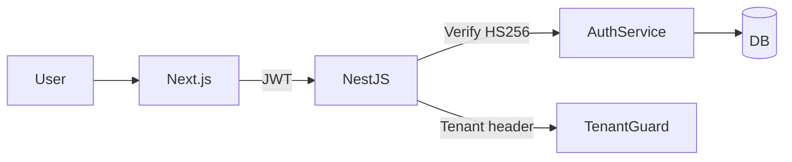
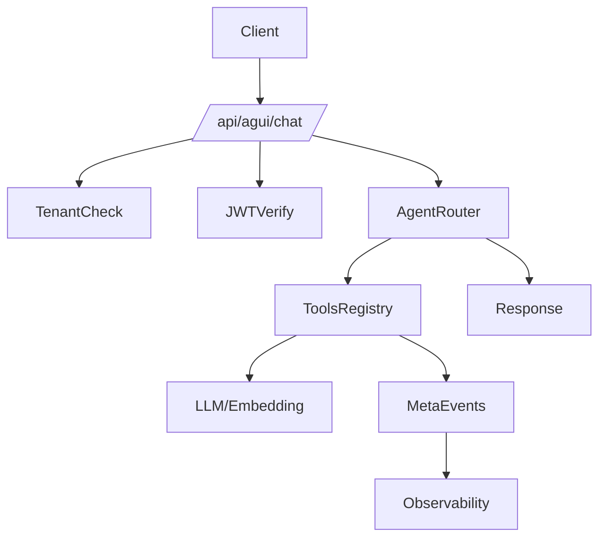
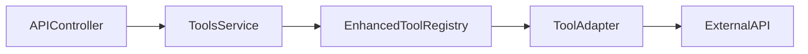
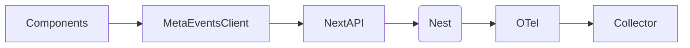

# Tujuan & Ruang Lingkup
- Mewujudkan sba-agentic (smart business assistant) end-to-end: frontend Next.js, backend NestJS, paket bersama, observabilitas, keamanan, dan otomatisasi.
- Menyelesaikan seluruh siklus: perencanaan, implementasi modular, pengujian unit/integrasi/e2e, optimasi performa, penanganan error, dan dokumentasi.

## Arsitektur Sistem
- Monorepo `pnpm` + `turbo`: workspaces `apps/*` dan `packages/*`.
- Frontend (`apps/web`): Next.js App Router (React 18), Tailwind, React Query, Zustand, Zod; API routes untuk integrasi ringan (AGUI chat, metrics, audit, telemetry).
- Backend (`apps/api`): NestJS (controller, service, guard, interceptor, filter), Prisma (DB), Auth (JWT), Rate limit, Tools registry, WebSocket/Queue.
- Packages inti: `@sba/ui`, `@sba/entities`, `@sba/services`, `@sba/auth`, `@sba/utils`, `@sba/shared-utils`, `@sba/observability`, `@sba/api-client`, `@sba/agui-client`, dll.
- Observabilitas: OpenTelemetry (HTTP metrics/interceptors), logging (Winston), metrics endpoint.
- Penyimpanan: presigned upload (S3/Azure/GCS), webhook audit.
- Keamanan: header `x-tenant-id`, JWT HS256, guards (JwtAuthGuard, RolesGuard, TenantGuard), CORS, Helmet, compression.

## Diagram Alur Kerja
### Autentikasi & Tenancy


### AGUI Chat & Orkestrasi


### Intake Dokumen & Audit
```mermaid
flowchart TD
Uploader-->NextAPI[/api/storage/upload/]
NextAPI-->Presign-->ObjectStore[(S3/Azure/GCS)]
ObjectStore-->Webhook-->NextAPI[/api/audit/webhook/]
NextAPI-->AuditStore[@sba/shared-audit/stub]
AuditStore-->API(Nest)/DB
```

### Eksekusi Tools (Backend)


### Meta-Events & Telemetri


## Fitur Utama
- Autentikasi JWT + Tenancy multi-tenant.
- Agent Orchestrator & Tools Registry (eksekusi terkoordinasi).
- Chat/AGUI dengan reasoning, meta-events, dan telemetry.
- Intake dokumen, presign uploads, audit webhook & history.
- Dashboard, integrasi, knowledge base, notifikasi, preferences.
- Observabilitas: metrics, tracing, logs; keamanan: rate limit & guards.

## Persyaratan Teknis
- Runtime: Node >= 18, pnpm >= 8.
- Frontend: Next 14 App Router; Tailwind/PostCSS; React Query; a11y.
- Backend: NestJS, Prisma; Redis (opsional untuk queue/rate limit), BullMQ.
- Env: `.env` per app; jangan commit secrets; gunakan `.env.example`.
- Kualitas: ESLint, Prettier, TypeScript strict; CI lint/build/test/type-check.
- Observabilitas: `OTEL_*` env; metrics endpoint; k6 untuk uji beban.

## Pengembangan Bertahap
### Gelombang 0: Stabilkan Build Web (baseline)
- Pastikan `apps/web` build bersih (Next, alias, stubs) dan script yang konsisten.
- Jaga exclusions TypeScript (tests) dan alias ke stubs.

### Gelombang 1: Auth + Prisma
- Backend: implementasi `AuthService` ↔ Prisma User, JWT HS256, refresh token, guards.
- Frontend: halaman login, session state, protected routes, token storage (httpOnly cookie), tenancy header.
- Test: unit AuthService, e2e login-flow (Playwright), supertest endpoint `/auth`.

### Gelombang 2: Agent Orchestrator & Tools Registry
- Backend: `EnhancedToolRegistry`, adapters, policy/guards, task runner.
- API: endpoints `/api/v1/tools/*`, `/api/v1/solo/builder` untuk orkestrasi.
- Frontend: UI builder (drag-to-compose), run status, logs.
- Test: unit registry/adapters, e2e tool-run (mock adapters), k6 perf untuk tools.

### Gelombang 3: Chat/AGUI + Reasoning + Meta-Events
- Next API route `/api/agui/chat`: validasi, rate limit, tenant, JWT; panggil API backend.
- Backend: session storage, reasoning pipeline, meta-events emit.
- UI: komponen chat, markdown rendering, syntax highlight, streaming.
- Test: unit komponen, integrasi pipeline, e2e chat streaming.

### Gelombang 4: Storage/Uploads + Documents + Notifications
- Presign upload (S3/Azure/GCS), webhook audit, daftar dokumen, templates notifikasi.
- API: `/storage`, `/audit`, `/notifications/*`.
- UI: pages upload, history, preferences.
- Test: unit storage service (mocks), integrasi webhook, e2e upload.

### Gelombang 5: Observability & Error Handling
- Backend: global filters/interceptors, konsolidasi error codes, structured logging.
- Frontend: error boundaries, toasts, retry policy (React Query), tracing client.
- Metrics: Prometheus format, dashboards; k6 scenario.

### Gelombang 6: UI Polish, A11y, Performa
- Komponen `@sba/ui`, tokens konsisten, keyboard navigation, aria labels.
- Performa: code-splitting, memoization, React Query cache, ISR/SSR.
- Bundle guards root scripts untuk mencegah kebocoran keys di client.

### Gelombang 7: CI/CD, Versioning, Otomatisasi
- Turbo pipelines (lint, type-check, build, test, e2e) per app.
- CI (GitHub Actions): matrix jobs; artifacts; k6 perf gate.
- Versioning: semantic commits; rilis workspace (Changesets jika disetujui).
- Staging scripts: `staging:*` terintegrasi; health checks otomatis.

## Pengujian
- Unit (Vitest): services, guards, utils; mock Prisma/Redis/AWS/Azure/GC.
- Integrasi (supertest/Vitest): controllers endpoints; rate limit & tenancy.
- E2E (Playwright): login, dashboard, chat, uploads.
- Perf (k6): tools throughput, API latency; threshold SLA.
- Coverage target: backend >= 80%, frontend >= 70% (menaik bertahap).

## Dokumentasi Teknis
- `docs/specs/*`: spesifikasi fitur, ADR penting, arsitektur, sequence diagrams.
- OpenAPI sinkron: generate dari Nest decorators; publikasi `docs/openapi.yaml`.
- Runbooks: operasi staging/rollback, env setup, troubleshooting.
- README per app/paket: cara dev, build, test, env.

## Otomatisasi & Pemantauan
- Guard scripts root: cek impor `@supabase`, entities, dan bundle keys untuk keamanan.
- Telemetry dashboard: metrics & traces; alerting dasar di staging.
- Progress monitoring: status pipeline CI, test coverage report, build size.

## Standar Kode & Keamanan
- ESLint + Prettier; TypeScript strict; formatting konsisten.
- Tidak log secrets; tidak commit keys; validasi input (Zod/Nest pipes).
- CORS/Helmet; rate limit; tenancy guards; JWT expire/refresh.

## Kriteria Penerimaan
- Build bersih untuk `apps/web` dan `apps/api` di CI.
- Test unit/integrasi/e2e lulus dengan coverage target.
- Fitur inti berfungsi: auth, chat, orchestrator, uploads, metrics.
- Observabilitas aktif; error handling konsisten; dokumen lengkap.

## Risiko & Mitigasi
- Ketergantungan paket berat → gunakan stubs/alias di web.
- Perbedaan ESM/CJS → konsisten `next.config.mjs` dan bundler.
- Secret management → `.env.example`, vault eksternal (opsional) di staging.

## Langkah Berikutnya (Implementasi)
- Eksekusi Gelombang 1–7 secara bertahap dengan commit terstruktur, menjaga non-regresi build web dan API, melengkapi test dan dokumentasi setiap gelombang.
