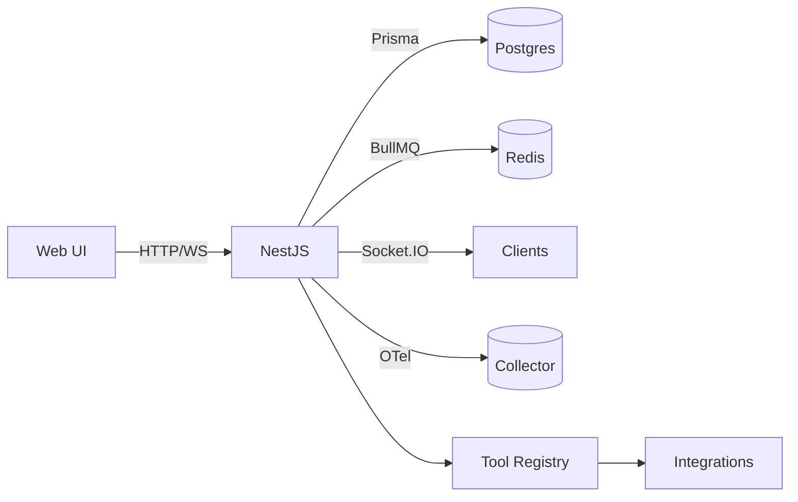
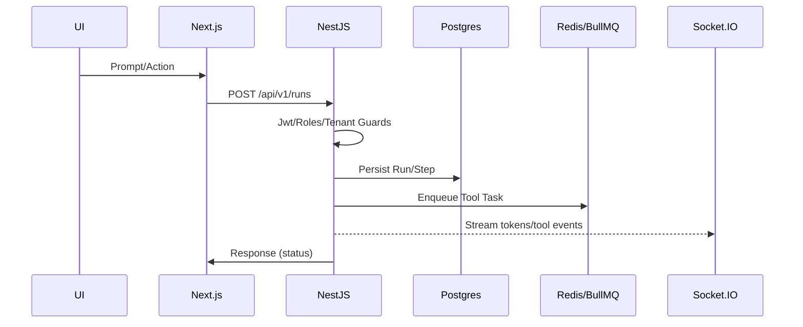

# SBA-Agentic — Spesifikasi Teknis & Rencana Implementasi End-to-End

## Ikhtisar
SBA-Agentic (Smart Business Assistant) adalah solusi multi-tenant yang memadukan aplikasi web (Next.js), API (NestJS), orkestrasi agent, integrasi tools, observabilitas, dan standard keamanan modern untuk kebutuhan bisnis cerdas.

## Arsitektur Sistem
- Monorepo `pnpm` workspaces: `apps/web` (Next.js App Router), `apps/api` (NestJS), `packages/*` untuk modul bersama.
- Frontend: Next.js, Tailwind CSS, React Query, Zustand, Zod, Supabase SDK; API Routes untuk fungsi khusus.
- Backend: NestJS modular dengan Guards, Interceptors, Filters; Prisma (Postgres), Redis (BullMQ/ioredis), Socket.IO (WS), OpenTelemetry.
- Multi-tenant: validasi header `x-tenant-id`, JWT RBAC, guard/filters per endpoint.
- Observabilitas: tracing, metrics, logging terstruktur; health/metrics endpoint; guard CI untuk mencegah kebocoran secrets.

## Diagram Alur Kerja
1. Client mengirim request → Next.js (UI/Route API) → NestJS Controller.
2. Guard: verifikasi JWT + `x-tenant-id`, RBAC; apply rate-limit, metrics interceptor.
3. Agent Orchestrator: buat/run `AgentRun` → panggil tools → stream events via WS.
4. Persist: Prisma ke Postgres; status/riwayat; queue untuk pekerjaan latar.
5. Observabilitas: tracing, metrics; logging terstruktur; health/metrics endpoint.

## Fitur Utama
- Chat AI multi-tenant: histori, konteks, AG-UI.
- Agent Orchestrator: runs, tool calls, reasoning trace, meta-events.
- Dokumen/Knowledge: unggah, parsing, indexing (opsional), pencarian.
- Integrasi: storage (AWS/Azure/GCS), email/notifications, analytics, jobs.
- Observabilitas: health/metrics, tracing, logging, rate-limit, CSP report.
- Admin/ops: dashboard jobs/metrics/tools; audit trail.

## Persyaratan Teknis
- Node >= 18, pnpm >= 8, Next.js ^14, NestJS ^10, TypeScript ^5.
- DB: Postgres (Prisma), Cache/Queue: Redis (BullMQ/ioredis).
- Env minimal: `DATABASE_URL`, `REDIS_URL`, `JWT_SECRET`, `OTEL_EXPORTER_OTLP_ENDPOINT` (opsional), `SUPABASE_*` jika dipakai.
- Keamanan: JWT HS256, header tenant, CSP, input validation (Zod/class-validator), secrets management.

## Kontrak API (Ringkas)
- Auth: `POST /api/v1/auth/register|login|refresh`, `GET /api/v1/auth/me`, `POST /api/v1/auth/logout`.
- Runs: `POST /api/v1/runs`, `GET /api/v1/runs/:id`, `POST /api/v1/runs/:id/continue`, `POST /api/v1/runs/:id/cancel`.
- Tools: `POST /api/v1/tools/execute`, `POST /api/v1/tools/:id/cancel`.
- Observabilitas: `GET /health`, `GET /metrics`.
- Storage: `POST /api/v1/storage/presign|upload`, `GET /api/v1/documents`.

## Skema Data (Ringkas)
- User: `{ id, tenantId, email, passwordHash, roles[], createdAt, updatedAt }`.
- AgentRun: `{ id, tenantId, userId, status, steps[], createdAt, updatedAt }`.
- ToolCall: `{ id, runId, name, parameters, status, result, error, startedAt, endedAt }`.

## Rencana Pengembangan Bertahap
1. Auth + Prisma + Tenant: sambungkan register/login/refresh; guards; audit login.
2. Agent Orchestrator: model Run/Step/ToolCall; eksekusi tools; stream events.
3. Stabilitas Frontend: alias/stub isolasi, a11y, halaman login/dashboard/chat; API routes.
4. Observabilitas & Error Handling: OTel, metrics interceptor, global filters, alerting.
5. Dokumen/Knowledge: presign/upload, parser, indexing/pencarian.
6. Realtime & Notifications: Socket.IO stream; email/jobs.
7. Analytics & Admin: dashboard admin; audit trail.

## Implementasi Kode Terstruktur
- Backend: service-repository (Prisma), DTO+validator, idempotensi endpoint, retry/backoff, graceful shutdown.
- Frontend: hooks (`useAuth`, `useRun`, `useMetrics`), error boundary, skeleton/loading, a11y.

## Pengujian
- Unit: Vitest untuk services/guards/utils (coverage ≥80%).
- Integration: supertest untuk controller; Playwright untuk UI inti.
- Perf: k6 untuk runs/tools; snapshot metrics; a11y linting.

## CI/CD & Otomasi
- Turbo pipelines: lint → type-check → test → build.
- Husky + lint-staged; Conventional Commits + changesets; guard skrip untuk impor sensitif.

## Observabilitas & Error Handling
- Tracing per controller/DB; metrics custom; logging terstruktur dengan correlation id.
- Global exception filter, domain error mapping; circuit breaker ringan.

## Runbooks
- Staging/deploy/rollback, health check, rotasi secrets.
- Prosedur incident: rollback cepat, analisis log/trace, notifikasi.

## Kriteria Selesai
- Endpoint utama berfungsi, diuji, terobservasi; UI inti stabil dan accessible.
- Orchestrator mengeksekusi tools dengan trace/stream; CI hijau; dokumentasi lengkap.

