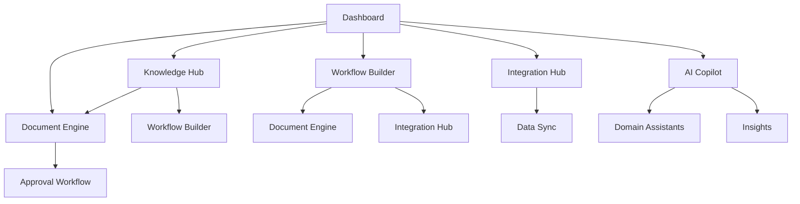

## 1. Product Overview
Smart Business Assistant (SBA) adalah platform AI-native SaaS multi-tenant yang menggabungkan AG-UI (Agentic UI) dan BaseHub (Headless CMS) untuk menciptakan business copilots yang mengotomatisasi proses operasional dan menyediakan decision support berbasis AI.

Platform ini menjadi pusat operasional (OS) bisnis bagi organisasi skala kecil hingga besar, memungkinkan mereka memiliki struktur operasional dan SOP profesional tanpa biaya berat membangun infrastruktur internal.

## 2. Core Features

### 2.1 User Roles
| Role | Registration Method | Core Permissions |
|------|---------------------|------------------|
| Owner | Email registration + tenant setup | Full tenant management, billing, configuration |
| Admin | Owner invitation | Configure workflows, manage connectors, SOP management |
| Operator | Admin invitation | Execute workflows, manage documents, run automations |
| Viewer | Admin invitation | Read-only access to dashboard and reports |

### 2.2 Feature Module
Platform SBA terdiri dari halaman-halaman utama berikut:

1. **Dashboard**: Business observability, real-time metrics, anomaly alerts
2. **Knowledge Hub**: SOP management, document templates, business rules
3. **Workflow Builder**: No-code automation, agentic workflows, approval processes
4. **Document Engine**: Smart document creation, template management, approval workflows
5. **Integration Hub**: Connector management, data synchronization, schema mapping
6. **AI Copilot**: Domain-specific assistants (Finance, HR, Sales, Admin)
7. **Settings**: Tenant configuration, user management, billing, security

### 2.3 Page Details
| Page Name | Module Name | Feature description |
|-----------|-------------|---------------------|
| Dashboard | Metrics Overview | Display real-time business metrics: sales, stock, finance, tasks, risks |
| Dashboard | Insight Panels | Show AI-generated insights with actionable recommendations |
| Dashboard | Alert System | Display anomaly alerts and suggested mitigation workflows |
| Knowledge Hub | SOP Library | Browse, search, and manage standard operating procedures |
| Knowledge Hub | Template Manager | Create and manage document templates with version control |
| Knowledge Hub | Business Rules | Configure automation rules and decision criteria |
| Workflow Builder | Visual Designer | Drag-and-drop workflow creation with agentic nodes |
| Workflow Builder | Template Gallery | Pre-built workflow templates for common business processes |
| Workflow Builder | Execution Monitor | Real-time workflow execution status and logs |
| Document Engine | Smart Editor | AI-assisted document creation with auto-completion |
| Document Engine | Template Engine | Generate documents from structured templates |
| Document Engine | Approval Workflow | Multi-step document review and approval process |
| Integration Hub | Connector Library | Browse and configure available integrations |
| Integration Hub | Data Mapping | Visual schema mapping for data synchronization |
| Integration Hub | Sync Monitor | Monitor integration status and error handling |
| AI Copilot | Finance Assistant | Cash flow analysis, financial forecasting, cost recommendations |
| AI Copilot | HR Assistant | Employee onboarding, performance analysis, retention insights |
| AI Copilot | Sales Assistant | Lead qualification, proposal generation, sales pipeline insights |
| AI Copilot | Admin Assistant | Task automation, reminder management, document processing |
| Settings | Tenant Configuration | Brand customization, workspace management, quota settings |
| Settings | User Management | Invite users, assign roles, manage permissions |
| Settings | Billing | Subscription management, usage analytics, payment methods |
| Settings | Security | API keys, audit logs, data privacy settings |

## 3. Core Process

### User Onboarding Flow
1. User registers and creates tenant workspace
2. Selects industry template (Retail, Manufacturing, Services)
3. Configures brand settings and business information
4. Completes wizard setup for initial integrations
5. Accesses guided tour of main features

### Workflow Execution Flow
1. User selects or creates workflow template
2. Agent guides through configuration steps
3. System executes automation with real-time monitoring
4. AI provides suggestions and handles exceptions
5. Results are stored and analytics updated

### Document Creation Flow
1. User selects document template from library
2. AI assistant helps populate content with business data
3. Document goes through approval workflow
4. Final document is generated and stored
5. Notifications sent to relevant stakeholders

## 4. User Interface Design

### 4.1 Design Style
- **Primary Colors**: Professional blue (#2563eb) with green accents (#10b981)
- **Secondary Colors**: Neutral grays for backgrounds and text
- **Button Style**: Rounded corners with subtle shadows, primary actions in blue
- **Font System**: Inter for headings, system-ui for body text
- **Layout Style**: Card-based layout with consistent spacing
- **Icon Style**: Minimalist line icons with consistent stroke width

### 4.2 Page Design Overview
| Page Name | Module Name | UI Elements |
|-----------|-------------|-------------|
| Dashboard | Metrics Overview | Grid layout with metric cards, sparkline charts, color-coded indicators |
| Dashboard | Insight Panels | Collapsible panels with AI avatar, recommendation badges |
| Knowledge Hub | SOP Library | Searchable card grid with category filters, version badges |
| Workflow Builder | Visual Designer | Canvas-based drag-drop interface with node library sidebar |
| Document Engine | Smart Editor | Split view: template preview + AI chat panel |
| Integration Hub | Connector Library | Grid of integration cards with status indicators |
| AI Copilot | Finance Assistant | Conversational interface with data visualization panels |

### 4.3 Responsiveness
- **Desktop-first** approach with mobile adaptation
- **Breakpoints**: 640px (mobile), 768px (tablet), 1024px (desktop)
- **Touch optimization** for mobile workflow interactions
- **Responsive tables** with horizontal scrolling on mobile
- **Collapsible navigation** for smaller screens

## 5. Additional Specifications

### Performance Requirements
- Page load time < 3 seconds
- Real-time updates with WebSocket connections
- Search results within 500ms
- Document generation within 2 seconds

### Security Requirements
- Multi-tenant data isolation
- Role-based access control (RBAC)
- Audit logging for all actions
- API rate limiting per tenant
- Data encryption at rest and in transit

### Integration Requirements
- RESTful APIs for external integrations
- Webhook support for real-time notifications
- OAuth 2.0 for third-party authentication
- CSV/Excel import/export capabilities