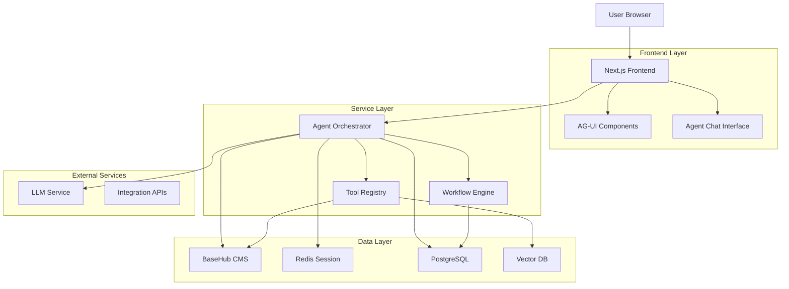
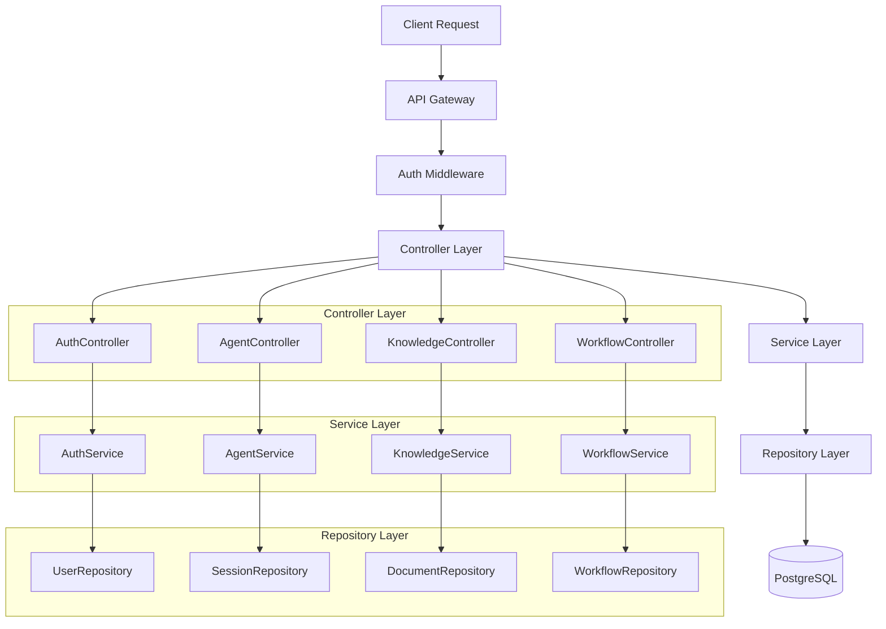
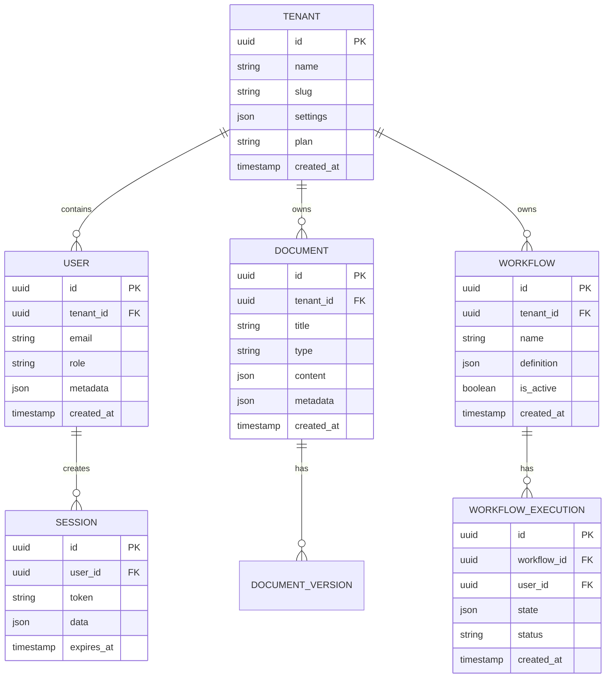
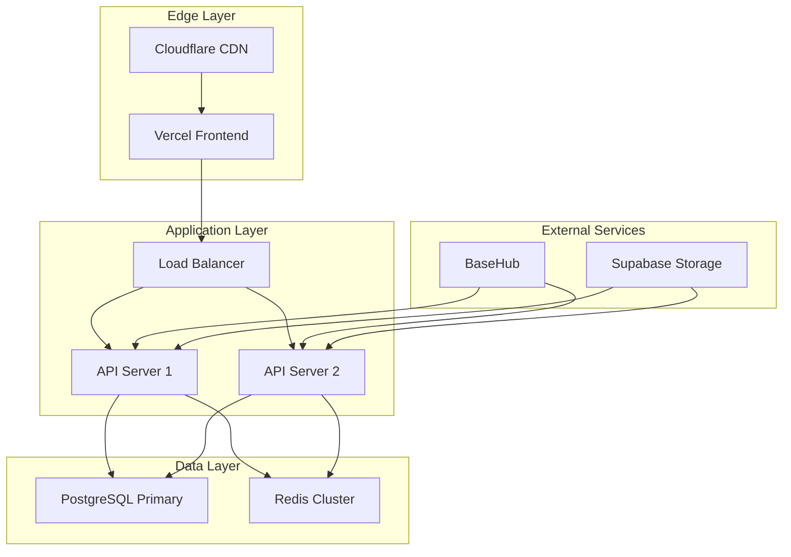

## 1. Architecture Design



## 2. Technology Description

- **Frontend**: Next.js 14 + React 18 + TypeScript + Tailwind CSS
- **Initialization Tool**: create-next-app
- **Backend**: Node.js + Express (Agent Orchestrator)
- **Database**: PostgreSQL (primary) + Redis (session/cache)
- **CMS**: BaseHub (GraphQL API)
- **Vector Search**: Pinecone/Qdrant (optional)
- **Authentication**: Supabase Auth
- **Real-time**: WebSocket (Socket.io)
- **File Storage**: Supabase Storage / AWS S3

## 3. Route Definitions

| Route | Purpose |
|-------|---------|
| / | Landing page with product overview |
| /dashboard | Main dashboard with business metrics |
| /knowledge | Knowledge hub for SOPs and templates |
| /workflows | Workflow builder and management |
| /documents | Document creation and management |
| /integrations | Integration hub and connectors |
| /copilot | AI assistant interface |
| /settings | Tenant and user settings |
| /auth/* | Authentication pages (login, register, etc.) |

## 4. API Definitions

### 4.1 Authentication APIs

```
POST /api/auth/login
```

Request:
| Param | Type | Required | Description |
|-------|------|----------|-------------|
| email | string | true | User email address |
| password | string | true | User password |

Response:
```json
{
  "token": "jwt_token",
  "user": {
    "id": "uuid",
    "email": "user@example.com",
    "role": "owner",
    "tenantId": "tenant_uuid"
  }
}
```

### 4.2 Agent APIs

```
POST /api/agent/session
```

Request:
| Param | Type | Required | Description |
|-------|------|----------|-------------|
| tenantId | string | true | Tenant identifier |
| userId | string | true | User identifier |

Response:
```json
{
  "sessionId": "session_uuid",
  "wsUrl": "wss://api.sba.com/agent/ws"
}
```

### 4.3 Knowledge APIs

```
GET /api/knowledge/search
```

Query Parameters:
| Param | Type | Required | Description |
|-------|------|----------|-------------|
| q | string | true | Search query |
| type | string | false | Filter by type (sop, template, rule) |
| limit | number | false | Result limit (default: 20) |

Response:
```json
{
  "results": [
    {
      "id": "doc_uuid",
      "title": "Employee Onboarding SOP",
      "type": "sop",
      "content": "...",
      "metadata": {}
    }
  ]
}
```

### 4.4 Workflow APIs

```
POST /api/workflows
```

Request:
```json
{
  "name": "Employee Onboarding",
  "description": "Automated onboarding workflow",
  "nodes": [
    {
      "id": "node_1",
      "type": "trigger",
      "config": {}
    }
  ],
  "edges": []
}
```

## 5. Server Architecture Diagram



## 6. Data Model

### 6.1 Entity Relationship Diagram



### 6.2 Database Schema

```sql
-- Tenants table
CREATE TABLE tenants (
    id UUID PRIMARY KEY DEFAULT gen_random_uuid(),
    name VARCHAR(255) NOT NULL,
    slug VARCHAR(100) UNIQUE NOT NULL,
    settings JSONB DEFAULT '{}',
    plan VARCHAR(20) DEFAULT 'starter' CHECK (plan IN ('starter', 'growth', 'pro')),
    created_at TIMESTAMP WITH TIME ZONE DEFAULT NOW(),
    updated_at TIMESTAMP WITH TIME ZONE DEFAULT NOW()
);

-- Users table
CREATE TABLE users (
    id UUID PRIMARY KEY DEFAULT gen_random_uuid(),
    tenant_id UUID NOT NULL REFERENCES tenants(id) ON DELETE CASCADE,
    email VARCHAR(255) UNIQUE NOT NULL,
    password_hash VARCHAR(255) NOT NULL,
    role VARCHAR(20) DEFAULT 'viewer' CHECK (role IN ('owner', 'admin', 'operator', 'viewer')),
    metadata JSONB DEFAULT '{}',
    created_at TIMESTAMP WITH TIME ZONE DEFAULT NOW(),
    updated_at TIMESTAMP WITH TIME ZONE DEFAULT NOW()
);

-- Documents table
CREATE TABLE documents (
    id UUID PRIMARY KEY DEFAULT gen_random_uuid(),
    tenant_id UUID NOT NULL REFERENCES tenants(id) ON DELETE CASCADE,
    title VARCHAR(255) NOT NULL,
    type VARCHAR(50) NOT NULL,
    content JSONB NOT NULL,
    metadata JSONB DEFAULT '{}',
    created_at TIMESTAMP WITH TIME ZONE DEFAULT NOW(),
    updated_at TIMESTAMP WITH TIME ZONE DEFAULT NOW()
);

-- Workflows table
CREATE TABLE workflows (
    id UUID PRIMARY KEY DEFAULT gen_random_uuid(),
    tenant_id UUID NOT NULL REFERENCES tenants(id) ON DELETE CASCADE,
    name VARCHAR(255) NOT NULL,
    description TEXT,
    definition JSONB NOT NULL,
    is_active BOOLEAN DEFAULT true,
    created_at TIMESTAMP WITH TIME ZONE DEFAULT NOW(),
    updated_at TIMESTAMP WITH TIME ZONE DEFAULT NOW()
);

-- Workflow executions table
CREATE TABLE workflow_executions (
    id UUID PRIMARY KEY DEFAULT gen_random_uuid(),
    workflow_id UUID NOT NULL REFERENCES workflows(id) ON DELETE CASCADE,
    user_id UUID NOT NULL REFERENCES users(id) ON DELETE CASCADE,
    state JSONB DEFAULT '{}',
    status VARCHAR(20) DEFAULT 'pending' CHECK (status IN ('pending', 'running', 'completed', 'failed')),
    created_at TIMESTAMP WITH TIME ZONE DEFAULT NOW(),
    updated_at TIMESTAMP WITH TIME ZONE DEFAULT NOW()
);

-- Sessions table
CREATE TABLE sessions (
    id UUID PRIMARY KEY DEFAULT gen_random_uuid(),
    user_id UUID NOT NULL REFERENCES users(id) ON DELETE CASCADE,
    token VARCHAR(255) UNIQUE NOT NULL,
    data JSONB DEFAULT '{}',
    expires_at TIMESTAMP WITH TIME ZONE NOT NULL,
    created_at TIMESTAMP WITH TIME ZONE DEFAULT NOW()
);

-- Indexes
CREATE INDEX idx_users_tenant_id ON users(tenant_id);
CREATE INDEX idx_users_email ON users(email);
CREATE INDEX idx_documents_tenant_id ON documents(tenant_id);
CREATE INDEX idx_documents_type ON documents(type);
CREATE INDEX idx_workflows_tenant_id ON workflows(tenant_id);
CREATE INDEX idx_workflow_executions_workflow_id ON workflow_executions(workflow_id);
CREATE INDEX idx_workflow_executions_user_id ON workflow_executions(user_id);
CREATE INDEX idx_sessions_user_id ON sessions(user_id);
CREATE INDEX idx_sessions_token ON sessions(token);
CREATE INDEX idx_sessions_expires_at ON sessions(expires_at);
```

## 7. Security & Multi-Tenancy

### Row Level Security (RLS)
```sql
-- Enable RLS on all tenant-scoped tables
ALTER TABLE users ENABLE ROW LEVEL SECURITY;
ALTER TABLE documents ENABLE ROW LEVEL SECURITY;
ALTER TABLE workflows ENABLE ROW LEVEL SECURITY;

-- Create policies
CREATE POLICY users_tenant_isolation ON users FOR ALL TO authenticated 
USING (tenant_id = current_setting('app.current_tenant')::uuid);

CREATE POLICY documents_tenant_isolation ON documents FOR ALL TO authenticated 
USING (tenant_id = current_setting('app.current_tenant')::uuid);

-- Grant permissions
GRANT SELECT ON users TO anon;
GRANT ALL PRIVILEGES ON users TO authenticated;
GRANT SELECT ON documents TO anon;
GRANT ALL PRIVILEGES ON documents TO authenticated;
```

## 8. Deployment Architecture



## 9. Monitoring & Observability

### Metrics Collection
- **Application Metrics**: Response time, error rates, throughput
- **Business Metrics**: Active users, workflow executions, document creations
- **Infrastructure Metrics**: CPU, memory, disk usage, network I/O

### Logging Strategy
- **Structured Logging**: JSON format with correlation IDs
- **Log Levels**: ERROR, WARN, INFO, DEBUG
- **Retention**: 30 days for application logs, 90 days for audit logs

### Alerting
- **SLA Monitoring**: 99.9% uptime target
- **Error Rate**: >1% error rate triggers alert
- **Response Time**: >3s average response time triggers alert