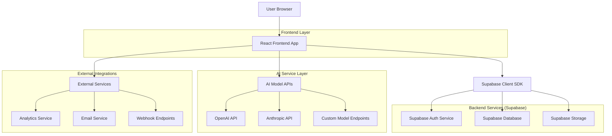
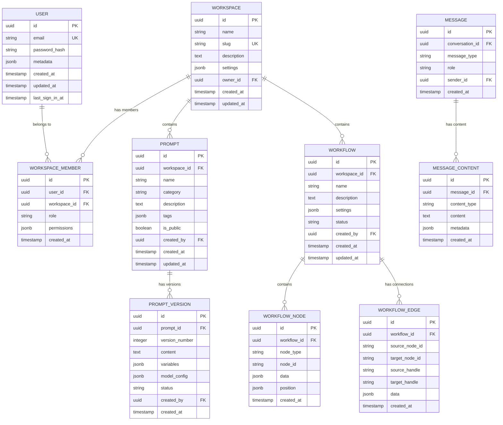

# Technical Architecture - SBA-Agentic Web Application

## 1. Architecture Overview



## 2. Technology Stack

### Frontend Technologies
- **React 18.3+**: UI library dengan concurrent features
- **TypeScript 5.0+**: Type safety dan developer experience
- **Vite 5.0+**: Build tool yang cepat untuk development
- **Tailwind CSS 3.4+**: Utility-first CSS framework
- **Zustand 4.5+**: Lightweight state management
- **React Router 6.21+**: Client-side routing
- **React Hook Form 7.48+**: Performant form handling
- **Zod 3.22+**: Schema validation
- **Supabase Client 2.38+**: Backend service integration

### Development Tools
- **ESLint 8.56+**: Code linting dengan custom rules
- **Prettier 3.1+**: Code formatting
- **Husky 8.0+**: Git hooks untuk quality gates
- **Vitest 1.1+**: Unit testing framework
- **React Testing Library 14.1+**: Component testing
- **Playwright 1.40+**: E2E testing
- **Storybook 7.6+**: Component documentation

### UI Component Libraries
- **Radix UI**: Headless accessible components
- **Headless UI**: Transition dan interactive components
- **Lucide React**: Icon library yang consistent
- **Framer Motion**: Animation library
- **React Textarea Autosize**: Auto-resizing textarea

## 3. Project Structure & Module Organization

### Directory Structure (Feature-Sliced Design)
```
src/
├── app/                    # Application layer
│   ├── providers/         # App providers (theme, auth, query)
│   ├── styles/           # Global styles and CSS variables
│   ├── config/           # App configuration
│   ├── router/           # Route definitions
│   └── index.tsx         # App entry point
│
├── processes/             # Complex business processes
│   ├── auth-flow/        # Multi-step authentication
│   ├── onboarding/       # User onboarding workflow
│   └── workspace-setup/  # Workspace initialization
│
├── pages/                 # Page components (routing)
│   ├── home/
│   ├── dashboard/
│   ├── workspace/
│   ├── prompts/
│   ├── workflows/
│   ├── settings/
│   └── auth/
│
├── widgets/               # Composed UI components
│   ├── app-shell/        # Main app layout
│   ├── navigation/       # Navigation components
│   ├── prompt-editor/   # Prompt editing interface
│   ├── workflow-canvas/ # Visual workflow builder
│   └── analytics-dashboard/
│
├── features/              # Business feature modules
│   ├── auth/
│   │   ├── model/        # Domain models and types
│   │   ├── api/          # API integration layer
│   │   ├── lib/          # Business logic
│   │   ├── hooks/        # Feature-specific hooks
│   │   └── ui/           # Feature UI components
│   ├── prompts/
│   ├── workflows/
│   ├── chat/
│   ├── analytics/
│   └── collaboration/
│
├── entities/              # Domain entities
│   ├── user/
│   ├── workspace/
│   ├── prompt/
│   ├── workflow/
│   └── message/
│
└── shared/                # Shared utilities
    ├── api/               # API client setup
    ├── config/            # Shared configuration
    ├── lib/               # Utility functions
    ├── ui/                # UI primitives
    ├── hooks/             # Shared hooks
    ├── types/             # Global types
    └── constants/         # App constants
```

### Module Dependencies Rules
```
app → can import from → all layers
processes → can import from → widgets, features, entities, shared
pages → can import from → widgets, features, entities, shared
widgets → can import from → features, entities, shared
features → can import from → entities, shared
entities → can import from → shared
shared → can only import from → shared
```

## 4. Data Architecture

### Database Schema (Supabase PostgreSQL)



### Data Access Layer

```typescript
// Base repository interface
interface BaseRepository<T> {
  findById(id: string): Promise<T | null>;
  findAll(filters?: Record<string, any>): Promise<T[]>;
  create(data: Partial<T>): Promise<T>;
  update(id: string, data: Partial<T>): Promise<T>;
  delete(id: string): Promise<void>;
}

// Supabase repository implementation
class SupabaseRepository<T> implements BaseRepository<T> {
  constructor(
    protected supabase: SupabaseClient,
    protected tableName: string
  ) {}

  async findById(id: string): Promise<T | null> {
    const { data, error } = await this.supabase
      .from(this.tableName)
      .select('*')
      .eq('id', id)
      .single();
    
    if (error) throw error;
    return data;
  }

  async findAll(filters: Record<string, any> = {}): Promise<T[]> {
    let query = this.supabase.from(this.tableName).select('*');
    
    Object.entries(filters).forEach(([key, value]) => {
      if (Array.isArray(value)) {
        query = query.in(key, value);
      } else {
        query = query.eq(key, value);
      }
    });

    const { data, error } = await query;
    if (error) throw error;
    return data || [];
  }

  async create(data: Partial<T>): Promise<T> {
    const { data: created, error } = await this.supabase
      .from(this.tableName)
      .insert(data)
      .select()
      .single();
    
    if (error) throw error;
    return created;
  }

  async update(id: string, data: Partial<T>): Promise<T> {
    const { data: updated, error } = await this.supabase
      .from(this.tableName)
      .update(data)
      .eq('id', id)
      .select()
      .single();
    
    if (error) throw error;
    return updated;
  }

  async delete(id: string): Promise<void> {
    const { error } = await this.supabase
      .from(this.tableName)
      .delete()
      .eq('id', id);
    
    if (error) throw error;
  }
}
```

## 5. State Management Architecture

### Global State Structure
```typescript
interface AppState {
  auth: AuthState;
  workspace: WorkspaceState;
  ui: UIState;
  preferences: PreferencesState;
}

interface AuthState {
  user: User | null;
  session: Session | null;
  isLoading: boolean;
  error: string | null;
}

interface WorkspaceState {
  currentWorkspace: Workspace | null;
  workspaces: Workspace[];
  members: WorkspaceMember[];
  isLoading: boolean;
  error: string | null;
}

interface UIState {
  theme: 'light' | 'dark' | 'system';
  sidebarCollapsed: boolean;
  notifications: Notification[];
  modals: ModalState[];
  loadingStates: Record<string, boolean>;
}

interface PreferencesState {
  language: string;
  timezone: string;
  dateFormat: string;
  timeFormat: '12h' | '24h';
  notifications: NotificationPreferences;
}
```

### Zustand Store Implementation
```typescript
// Auth store
const useAuthStore = create<AuthStore>((set, get) => ({
  user: null,
  session: null,
  isLoading: true,
  error: null,

  signIn: async (email: string, password: string) => {
    set({ isLoading: true, error: null });
    try {
      const { data, error } = await supabase.auth.signInWithPassword({
        email,
        password,
      });
      
      if (error) throw error;
      
      set({
        user: data.user,
        session: data.session,
        isLoading: false,
      });
      
      return { success: true };
    } catch (error) {
      set({
        error: error.message,
        isLoading: false,
      });
      return { success: false, error: error.message };
    }
  },

  signOut: async () => {
    set({ isLoading: true });
    try {
      await supabase.auth.signOut();
      set({
        user: null,
        session: null,
        isLoading: false,
      });
    } catch (error) {
      set({ isLoading: false });
      throw error;
    }
  },
}));

// Workspace store
const useWorkspaceStore = create<WorkspaceStore>((set, get) => ({
  currentWorkspace: null,
  workspaces: [],
  members: [],
  isLoading: false,
  error: null,

  fetchWorkspaces: async () => {
    set({ isLoading: true, error: null });
    try {
      const workspaces = await workspaceRepository.findAll();
      set({
        workspaces,
        isLoading: false,
      });
      return workspaces;
    } catch (error) {
      set({
        error: error.message,
        isLoading: false,
      });
      throw error;
    }
  },

  createWorkspace: async (data: CreateWorkspaceData) => {
    set({ isLoading: true, error: null });
    try {
      const workspace = await workspaceRepository.create(data);
      set((state) => ({
        workspaces: [...state.workspaces, workspace],
        currentWorkspace: workspace,
        isLoading: false,
      }));
      return workspace;
    } catch (error) {
      set({
        error: error.message,
        isLoading: false,
      });
      throw error;
    }
  },
}));
```

## 6. API Integration Architecture

### API Client Setup
```typescript
// Base API client with interceptors
class ApiClient {
  private client: AxiosInstance;

  constructor(baseURL: string) {
    this.client = axios.create({
      baseURL,
      timeout: 30000,
      headers: {
        'Content-Type': 'application/json',
      },
    });

    this.setupInterceptors();
  }

  private setupInterceptors() {
    // Request interceptor untuk auth token
    this.client.interceptors.request.use(
      (config) => {
        const token = useAuthStore.getState().session?.access_token;
        if (token) {
          config.headers.Authorization = `Bearer ${token}`;
        }
        return config;
      },
      (error) => Promise.reject(error)
    );

    // Response interceptor untuk error handling
    this.client.interceptors.response.use(
      (response) => response,
      async (error) => {
        if (error.response?.status === 401) {
          // Handle unauthorized access
          await useAuthStore.getState().signOut();
          window.location.href = '/auth/login';
        }
        return Promise.reject(error);
      }
    );
  }

  async get<T>(url: string, params?: Record<string, any>): Promise<T> {
    const response = await this.client.get(url, { params });
    return response.data;
  }

  async post<T>(url: string, data?: any): Promise<T> {
    const response = await this.client.post(url, data);
    return response.data;
  }

  async put<T>(url: string, data?: any): Promise<T> {
    const response = await this.client.put(url, data);
    return response.data;
  }

  async delete<T>(url: string): Promise<T> {
    const response = await this.client.delete(url);
    return response.data;
  }
}

// API service instances
export const apiClient = new ApiClient(import.meta.env.VITE_API_URL);
export const supabaseClient = createClient(
  import.meta.env.VITE_SUPABASE_URL,
  import.meta.env.VITE_SUPABASE_ANON_KEY
);
```

### Service Layer Pattern
```typescript
// Base service class
abstract class BaseService {
  protected api: ApiClient;
  protected supabase: SupabaseClient;

  constructor(api: ApiClient, supabase: SupabaseClient) {
    this.api = api;
    this.supabase = supabase;
  }
}

// Prompt service implementation
class PromptService extends BaseService {
  async getPrompts(workspaceId: string): Promise<Prompt[]> {
    return this.api.get<Prompt[]>(`/workspaces/${workspaceId}/prompts`);
  }

  async getPrompt(id: string): Promise<Prompt> {
    return this.api.get<Prompt>(`/prompts/${id}`);
  }

  async createPrompt(data: CreatePromptData): Promise<Prompt> {
    return this.api.post<Prompt>('/prompts', data);
  }

  async updatePrompt(id: string, data: UpdatePromptData): Promise<Prompt> {
    return this.api.put<Prompt>(`/prompts/${id}`, data);
  }

  async deletePrompt(id: string): Promise<void> {
    await this.api.delete(`/prompts/${id}`);
  }

  async executePrompt(id: string, variables: Record<string, any>): Promise<PromptResult> {
    return this.api.post<PromptResult>(`/prompts/${id}/execute`, { variables });
  }
}

// Workflow service implementation
class WorkflowService extends BaseService {
  async getWorkflows(workspaceId: string): Promise<Workflow[]> {
    return this.api.get<Workflow[]>(`/workspaces/${workspaceId}/workflows`);
  }

  async getWorkflow(id: string): Promise<Workflow> {
    return this.api.get<Workflow>(`/workflows/${id}`);
  }

  async createWorkflow(data: CreateWorkflowData): Promise<Workflow> {
    return this.api.post<Workflow>('/workflows', data);
  }

  async updateWorkflow(id: string, data: UpdateWorkflowData): Promise<Workflow> {
    return this.api.put<Workflow>(`/workflows/${id}`, data);
  }

  async executeWorkflow(id: string, input: any): Promise<WorkflowExecution> {
    return this.api.post<WorkflowExecution>(`/workflows/${id}/execute`, { input });
  }
}
```

## 7. Component Architecture

### Atomic Design Implementation

#### Atoms (Basic UI Elements)
```typescript
// Button atom
interface ButtonProps {
  variant?: 'primary' | 'secondary' | 'outline' | 'ghost' | 'danger';
  size?: 'sm' | 'md' | 'lg';
  disabled?: boolean;
  loading?: boolean;
  fullWidth?: boolean;
  icon?: React.ReactNode;
  iconPosition?: 'left' | 'right';
  children: React.ReactNode;
  onClick?: () => void;
  type?: 'button' | 'submit' | 'reset';
  className?: string;
  ariaLabel?: string;
}

export const Button = forwardRef<HTMLButtonElement, ButtonProps>(
  ({ 
    variant = 'primary', 
    size = 'md', 
    disabled = false,
    loading = false,
    fullWidth = false,
    icon,
    iconPosition = 'left',
    children,
    className,
    ariaLabel,
    ...props 
  }, ref) => {
    const baseClasses = cn(
      'inline-flex items-center justify-center font-medium rounded-md transition-colors',
      'focus:outline-none focus:ring-2 focus:ring-offset-2',
      {
        'px-4 py-2 text-sm': size === 'sm',
        'px-4 py-2 text-base': size === 'md',
        'px-6 py-3 text-lg': size === 'lg',
        'w-full': fullWidth,
        'opacity-50 cursor-not-allowed': disabled || loading,
      },
      getVariantClasses(variant),
      className
    );

    return (
      <button
        ref={ref}
        className={baseClasses}
        disabled={disabled || loading}
        aria-label={ariaLabel}
        {...props}
      >
        {loading && (
          <Loader2 className="mr-2 h-4 w-4 animate-spin" />
        )}
        {!loading && icon && iconPosition === 'left' && (
          <span className="mr-2">{icon}</span>
        )}
        {children}
        {!loading && icon && iconPosition === 'right' && (
          <span className="ml-2">{icon}</span>
        )}
      </button>
    );
  }
);

// Input atom
interface InputProps {
  type?: 'text' | 'email' | 'password' | 'number' | 'search';
  size?: 'sm' | 'md' | 'lg';
  variant?: 'outline' | 'filled' | 'flushed';
  placeholder?: string;
  value?: string;
  defaultValue?: string;
  onChange?: (value: string) => void;
  onBlur?: () => void;
  onFocus?: () => void;
  disabled?: boolean;
  readOnly?: boolean;
  required?: boolean;
  error?: string;
  label?: string;
  helperText?: string;
  leftIcon?: React.ReactNode;
  rightIcon?: React.ReactNode;
  className?: string;
  id?: string;
  name?: string;
  autoComplete?: string;
  autoFocus?: boolean;
}

export const Input = forwardRef<HTMLInputElement, InputProps>(
  ({ 
    type = 'text',
    size = 'md', 
    variant = 'outline',
    error,
    label,
    helperText,
    leftIcon,
    rightIcon,
    className,
    id,
    ...props 
  }, ref) => {
    const inputId = id || useId();
    
    return (
      <div className="w-full">
        {label && (
          <label htmlFor={inputId} className="block text-sm font-medium mb-1">
            {label}
            {props.required && <span className="text-red-500 ml-1">*</span>}
          </label>
        )}
        <div className="relative">
          {leftIcon && (
            <div className="absolute inset-y-0 left-0 pl-3 flex items-center pointer-events-none">
              {leftIcon}
            </div>
          )}
          <input
            ref={ref}
            id={inputId}
            type={type}
            className={cn(
              'block w-full rounded-md border-0 py-1.5 shadow-sm ring-1 ring-inset placeholder:text-gray-400',
              'focus:ring-2 focus:ring-inset focus:ring-indigo-600',
              {
                'pl-10': leftIcon,
                'pr-10': rightIcon,
                'pl-3': !leftIcon,
                'pr-3': !rightIcon,
                'text-sm py-1.5': size === 'sm',
                'text-base py-2': size === 'md',
                'text-lg py-2.5': size === 'lg',
                'ring-red-300 text-red-900 placeholder:text-red-300 focus:ring-red-500': error,
                'ring-gray-300 focus:ring-indigo-600': !error,
              },
              className
            )}
            {...props}
          />
          {rightIcon && (
            <div className="absolute inset-y-0 right-0 pr-3 flex items-center pointer-events-none">
              {rightIcon}
            </div>
          )}
        </div>
        {error && (
          <p className="mt-1 text-sm text-red-600">{error}</p>
        )}
        {helperText && !error && (
          <p className="mt-1 text-sm text-gray-500">{helperText}</p>
        )}
      </div>
    );
  }
);
```

#### Molecules (Component Compositions)
```typescript
// Search bar molecule
interface SearchBarProps {
  placeholder?: string;
  value: string;
  onChange: (value: string) => void;
  onSearch?: () => void;
  className?: string;
}

export const SearchBar: React.FC<SearchBarProps> = ({
  placeholder = 'Search...',
  value,
  onChange,
  onSearch,
  className,
}) => {
  const handleKeyPress = (e: React.KeyboardEvent) => {
    if (e.key === 'Enter' && onSearch) {
      onSearch();
    }
  };

  return (
    <div className={cn('relative', className)}>
      <Input
        type="search"
        placeholder={placeholder}
        value={value}
        onChange={(e) => onChange(e.target.value)}
        onKeyPress={handleKeyPress}
        leftIcon={<Search className="h-4 w-4 text-gray-400" />}
        rightIcon={
          value && (
            <Button
              variant="ghost"
              size="sm"
              onClick={() => onChange('')}
              className="p-0 h-auto"
            >
              <X className="h-4 w-4" />
            </Button>
          )
        }
      />
    </div>
  );
};

// Form field molecule
interface FormFieldProps {
  name: string;
  label: string;
  type?: 'text' | 'email' | 'password' | 'textarea' | 'select';
  placeholder?: string;
  required?: boolean;
  disabled?: boolean;
  options?: { value: string; label: string }[];
  validation?: RegisterOptions;
}

export const FormField: React.FC<FormFieldProps> = ({
  name,
  label,
  type = 'text',
  placeholder,
  required = false,
  disabled = false,
  options = [],
  validation,
}) => {
  const {
    register,
    formState: { errors },
  } = useFormContext();

  const error = errors[name]?.message as string;

  return (
    <div>
      <Label htmlFor={name}>
        {label}
        {required && <span className="text-red-500 ml-1">*</span>}
      </Label>
      
      {type === 'textarea' ? (
        <Textarea
          id={name}
          placeholder={placeholder}
          disabled={disabled}
          error={error}
          {...register(name, validation)}
        />
      ) : type === 'select' ? (
        <Select
          id={name}
          disabled={disabled}
          error={error}
          {...register(name, validation)}
        >
          <option value="">{placeholder}</option>
          {options.map((option) => (
            <option key={option.value} value={option.value}>
              {option.label}
            </option>
          ))}
        </Select>
      ) : (
        <Input
          id={name}
          type={type}
          placeholder={placeholder}
          disabled={disabled}
          error={error}
          {...register(name, validation)}
        />
      )}
      
      {error && (
        <p className="mt-1 text-sm text-red-600">{error}</p>
      )}
    </div>
  );
};
```

## 8. Performance Optimization

### Code Splitting Strategy
```typescript
// Route-based code splitting
const routes = [
  {
    path: '/',
    component: lazy(() => import('./pages/home').then(m => ({ default: m.HomePage }))),
  },
  {
    path: '/dashboard',
    component: lazy(() => import('./pages/dashboard').then(m => ({ default: m.DashboardPage }))),
  },
  {
    path: '/workflows',
    component: lazy(() => import('./pages/workflows').then(m => ({ default: m.WorkflowsPage }))),
  },
  {
    path: '/workflows/builder',
    component: lazy(() => import('./pages/workflow-builder').then(m => ({ default: m.WorkflowBuilderPage }))),
  },
];

// Component-based lazy loading
const HeavyComponent = lazy(() => 
  import('./components/heavy-component')
    .then(m => ({ default: m.HeavyComponent }))
);

// Preload critical components
const preloadCriticalComponents = () => {
  import('./components/navigation');
  import('./components/sidebar');
  import('./components/header');
};
```

### Image Optimization
```typescript
// Image component with optimization
interface OptimizedImageProps {
  src: string;
  alt: string;
  width?: number;
  height?: number;
  className?: string;
  loading?: 'lazy' | 'eager';
  priority?: boolean;
}

export const OptimizedImage: React.FC<OptimizedImageProps> = ({
  src,
  alt,
  width,
  height,
  className,
  loading = 'lazy',
  priority = false,
}) => {
  const [imageSrc, setImageSrc] = useState(src);
  const [isLoading, setIsLoading] = useState(true);

  useEffect(() => {
    setImageSrc(src);
    setIsLoading(true);
  }, [src]);

  const handleLoad = () => {
    setIsLoading(false);
  };

  const handleError = () => {
    setImageSrc('/images/placeholder.png');
  };

  return (
    <div className={cn('relative overflow-hidden', className)}>
      {isLoading && (
        <div className="absolute inset-0 bg-gray-200 animate-pulse" />
      )}
      
    </div>
  );
};
```

### Virtual Scrolling untuk Large Lists
```typescript
// Virtual list component
interface VirtualListProps<T> {
  items: T[];
  itemHeight: number;
  containerHeight: number;
  renderItem: (item: T, index: number) => React.ReactNode;
  keyExtractor: (item: T) => string;
  onScrollEnd?: () => void;
}

export function VirtualList<T>({
  items,
  itemHeight,
  containerHeight,
  renderItem,
  keyExtractor,
  onScrollEnd,
}: VirtualListProps<T>) {
  const [scrollTop, setScrollTop] = useState(0);
  const containerRef = useRef<HTMLDivElement>(null);

  const totalHeight = items.length * itemHeight;
  const startIndex = Math.floor(scrollTop / itemHeight);
  const endIndex = Math.min(
    startIndex + Math.ceil(containerHeight / itemHeight) + 1,
    items.length
  );

  const visibleItems = items.slice(startIndex, endIndex);
  const offsetY = startIndex * itemHeight;

  const handleScroll = (e: React.UIEvent<HTMLDivElement>) => {
    const scrollTop = e.currentTarget.scrollTop;
    setScrollTop(scrollTop);

    // Check if scrolled to bottom
    if (
      onScrollEnd &&
      scrollTop + containerHeight >= totalHeight - itemHeight
    ) {
      onScrollEnd();
    }
  };

  return (
    <div
      ref={containerRef}
      className="overflow-auto"
      style={{ height: containerHeight }}
      onScroll={handleScroll}
    >
      <div style={{ height: totalHeight, position: 'relative' }}>
        <div style={{ transform: `translateY(${offsetY}px)` }}>
          {visibleItems.map((item, index) => (
            <div
              key={keyExtractor(item)}
              style={{ height: itemHeight }}
            >
              {renderItem(item, startIndex + index)}
            </div>
          ))}
        </div>
      </div>
    </div>
  );
}
```

## 9. Security Implementation

### Authentication Security
```typescript
// Secure token storage
class TokenManager {
  private readonly TOKEN_KEY = 'sba_auth_token';
  private readonly REFRESH_KEY = 'sba_refresh_token';

  async storeTokens(session: Session): Promise<void> {
    // Encrypt tokens before storing
    const encryptedToken = await this.encrypt(session.access_token);
    const encryptedRefresh = await this.encrypt(session.refresh_token);
    
    localStorage.setItem(this.TOKEN_KEY, encryptedToken);
    localStorage.setItem(this.REFRESH_KEY, encryptedRefresh);
  }

  async getTokens(): Promise<{ token: string; refresh: string } | null> {
    const encryptedToken = localStorage.getItem(this.TOKEN_KEY);
    const encryptedRefresh = localStorage.getItem(this.REFRESH_KEY);
    
    if (!encryptedToken || !encryptedRefresh) return null;
    
    try {
      const token = await this.decrypt(encryptedToken);
      const refresh = await this.decrypt(encryptedRefresh);
      return { token, refresh };
    } catch {
      this.clearTokens();
      return null;
    }
  }

  clearTokens(): void {
    localStorage.removeItem(this.TOKEN_KEY);
    localStorage.removeItem(this.REFRESH_KEY);
  }

  private async encrypt(data: string): Promise<string> {
    // Implement encryption using Web Crypto API
    const encoder = new TextEncoder();
    const dataBuffer = encoder.encode(data);
    
    const key = await crypto.subtle.generateKey(
      { name: 'AES-GCM', length: 256 },
      true,
      ['encrypt', 'decrypt']
    );
    
    const iv = crypto.getRandomValues(new Uint8Array(12));
    const encrypted = await crypto.subtle.encrypt(
      { name: 'AES-GCM', iv },
      key,
      dataBuffer
    );
    
    return btoa(String.fromCharCode(...new Uint8Array(encrypted)));
  }

  private async decrypt(encryptedData: string): Promise<string> {
    // Implement decryption
    const encrypted = Uint8Array.from(atob(encryptedData), c => c.charCodeAt(0));
    
    // Implementation details...
    return decrypted;
  }
}
```

### Input Validation & Sanitization
```typescript
// Input validation utilities
export const validators = {
  email: (value: string): boolean => {
    const emailRegex = /^[^\s@]+@[^\s@]+\.[^\s@]+$/;
    return emailRegex.test(value);
  },

  password: (value: string): ValidationResult => {
    const minLength = 8;
    const hasUpperCase = /[A-Z]/.test(value);
    const hasLowerCase = /[a-z]/.test(value);
    const hasNumbers = /\d/.test(value);
    const hasSpecialChar = /[!@#$%^&*(),.?":{}|<>]/.test(value);

    const errors: string[] = [];
    
    if (value.length < minLength) {
      errors.push(`Minimum ${minLength} characters`);
    }
    if (!hasUpperCase) {
      errors.push('One uppercase letter');
    }
    if (!hasLowerCase) {
      errors.push('One lowercase letter');
    }
    if (!hasNumbers) {
      errors.push('One number');
    }
    if (!hasSpecialChar) {
      errors.push('One special character');
    }

    return {
      isValid: errors.length === 0,
      errors,
      strength: calculatePasswordStrength(value),
    };
  },

  sanitizeHtml: (html: string): string => {
    return DOMPurify.sanitize(html, {
      ALLOWED_TAGS: ['b', 'i', 'em', 'strong', 'p', 'br'],
      ALLOWED_ATTR: [],
    });
  },

  xssPrevention: (input: string): string => {
    return input
      .replace(/&/g, '&amp;')
      .replace(/</g, '&lt;')
      .replace(/>/g, '&gt;')
      .replace(/"/g, '&quot;')
      .replace(/'/g, '&#x27;')
      .replace(/\//g, '&#x2F;');
  },
};
```

## 10. Monitoring & Observability

### Error Tracking
```typescript
// Error boundary implementation
class ErrorBoundary extends Component<ErrorBoundaryProps, ErrorBoundaryState> {
  constructor(props: ErrorBoundaryProps) {
    super(props);
    this.state = { hasError: false, error: null };
  }

  static getDerivedStateFromError(error: Error): ErrorBoundaryState {
    return { hasError: true, error };
  }

  componentDidCatch(error: Error, errorInfo: ErrorInfo) {
    // Log to error tracking service
    this.logError(error, errorInfo);
  }

  async logError(error: Error, errorInfo: ErrorInfo) {
    const errorData = {
      message: error.message,
      stack: error.stack,
      componentStack: errorInfo.componentStack,
      url: window.location.href,
      userAgent: navigator.userAgent,
      timestamp: new Date().toISOString(),
      userId: useAuthStore.getState().user?.id,
    };

    // Send to error tracking service
    await fetch('/api/errors', {
      method: 'POST',
      headers: { 'Content-Type': 'application/json' },
      body: JSON.stringify(errorData),
    });
  }

  render() {
    if (this.state.hasError) {
      return this.props.fallback || <ErrorFallback />;
    }

    return this.props.children;
  }
}

// Performance monitoring hook
export const usePerformanceMonitor = (componentName: string) => {
  const startTime = useRef(performance.now());
  const [metrics, setMetrics] = useState<PerformanceMetrics | null>(null);

  useEffect(() => {
    const endTime = performance.now();
    const renderTime = endTime - startTime.current;

    setMetrics({
      componentName,
      renderTime,
      timestamp: new Date().toISOString(),
    });

    // Log performance metrics
    if (renderTime > 100) { // Slow component warning
      console.warn(`Slow component detected: ${componentName} took ${renderTime}ms`);
    }
  }, [componentName]);

  return metrics;
};
```

### Analytics Implementation
```typescript
// Privacy-compliant analytics
class Analytics {
  private static instance: Analytics;
  private userId: string | null = null;
  private sessionId: string;

  private constructor() {
    this.sessionId = this.generateSessionId();
  }

  static getInstance(): Analytics {
    if (!Analytics.instance) {
      Analytics.instance = new Analytics();
    }
    return Analytics.instance;
  }

  identify(userId: string, traits?: Record<string, any>) {
    this.userId = userId;
    this.track('identify', { userId, traits });
  }

  track(event: string, properties?: Record<string, any>) {
    if (this.shouldTrack()) {
      const data = {
        event,
        properties: {
          ...properties,
          sessionId: this.sessionId,
          timestamp: new Date().toISOString(),
          url: window.location.href,
          userAgent: navigator.userAgent,
        },
        userId: this.userId,
      };

      // Send to analytics endpoint
      this.sendAnalytics(data);
    }
  }

  page(properties?: Record<string, any>) {
    this.track('page', {
      name: document.title,
      path: window.location.pathname,
      ...properties,
    });
  }

  private shouldTrack(): boolean {
    // Check if user has opted out
    return localStorage.getItem('analytics-opt-out') !== 'true';
  }

  private generateSessionId(): string {
    return `${Date.now()}-${Math.random().toString(36).substr(2, 9)}`;
  }

  private async sendAnalytics(data: any) {
    try {
      await fetch('/api/analytics', {
        method: 'POST',
        headers: { 'Content-Type': 'application/json' },
        body: JSON.stringify(data),
      });
    } catch (error) {
      console.error('Analytics error:', error);
    }
  }

  optOut() {
    localStorage.setItem('analytics-opt-out', 'true');
  }

  optIn() {
    localStorage.removeItem('analytics-opt-out');
  }
}

export const analytics = Analytics.getInstance();
```

## 11. Deployment Configuration

### Environment Configuration
```typescript
// Environment validation
const envSchema = z.object({
  VITE_API_URL: z.string().url(),
  VITE_SUPABASE_URL: z.string().url(),
  VITE_SUPABASE_ANON_KEY: z.string().min(1),
  VITE_APP_ENV: z.enum(['development', 'staging', 'production']),
  VITE_SENTRY_DSN: z.string().url().optional(),
  VITE_ANALYTICS_ID: z.string().optional(),
});

export const env = envSchema.parse(import.meta.env);

// Feature flags
export const featureFlags = {
  enableAIChat: env.VITE_APP_ENV !== 'development',
  enableWorkflowBuilder: true,
  enableAnalytics: env.VITE_APP_ENV === 'production',
  enableErrorTracking: env.VITE_APP_ENV === 'production',
  enablePerformanceMonitoring: env.VITE_APP_ENV === 'production',
};
```

### Build Configuration
```typescript
// Vite configuration
export default defineConfig({
  plugins: [
    react({
      babel: {
        plugins: [
          'babel-plugin-macros',
          '@emotion/babel-plugin',
        ],
      },
    }),
    viteCompression({
      algorithm: 'gzip',
      ext: '.gz',
    }),
    viteCompression({
      algorithm: 'brotliCompress',
      ext: '.br',
    }),
  ],
  
  build: {
    target: 'es2015',
    minify: 'terser',
    terserOptions: {
      compress: {
        drop_console: env.VITE_APP_ENV === 'production',
        drop_debugger: env.VITE_APP_ENV === 'production',
      },
    },
    rollupOptions: {
      output: {
        manualChunks: {
          'react-vendor': ['react', 'react-dom'],
          'ui-vendor': ['@radix-ui/react-dialog', '@radix-ui/react-dropdown-menu'],
          'utils-vendor': ['date-fns', 'lodash-es'],
        },
      },
    },
    chunkSizeWarningLimit: 1000,
  },
  
  optimizeDeps: {
    include: [
      'react',
      'react-dom',
      'react-router-dom',
      '@supabase/supabase-js',
    ],
  },
});
```

### Docker Configuration
```dockerfile
# Multi-stage build untuk optimasi size
FROM node:18-alpine AS builder

WORKDIR /app

# Copy dependency files
COPY package*.json ./
COPY yarn.lock ./

# Install dependencies
RUN yarn install --frozen-lockfile --production=false

# Copy source code
COPY . .

# Build application
RUN yarn build

# Production stage
FROM nginx:alpine AS production

# Copy built assets
COPY --from=builder /app/dist /usr/share/nginx/html

# Copy nginx configuration
COPY nginx.conf /etc/nginx/nginx.conf

# Copy entrypoint script
COPY docker-entrypoint.sh /docker-entrypoint.sh
RUN chmod +x /docker-entrypoint.sh

EXPOSE 80

ENTRYPOINT ["/docker-entrypoint.sh"]
CMD ["nginx", "-g", "daemon off;"]
```

## 12. Testing Architecture

### Unit Testing Setup
```typescript
// Test utilities
export const renderWithProviders = (
  ui: React.ReactElement,
  {
    initialState = {},
    store = createStore(() => initialState),
    ...renderOptions
  }: ExtendedRenderOptions = {}
) => {
  function Wrapper({ children }: PropsWithChildren<{}>): JSX.Element {
    return (
      <Provider store={store}>
        <ThemeProvider theme="light">
          <MemoryRouter>
            {children}
          </MemoryRouter>
        </ThemeProvider>
      </Provider>
    );
  }

  return {
    store,
    ...render(ui, { wrapper: Wrapper, ...renderOptions }),
  };
};

// Mock service worker setup
export const server = setupServer(
  // Auth endpoints
  rest.post('/api/auth/login', (req, res, ctx) => {
    return res(
      ctx.json({
        user: mockUser,
        token: 'mock-token',
        refreshToken: 'mock-refresh-token',
      })
    );
  }),

  rest.post('/api/auth/logout', (req, res, ctx) => {
    return res(ctx.json({ success: true }));
  }),

  // Workspace endpoints
  rest.get('/api/workspaces', (req, res, ctx) => {
    return res(ctx.json(mockWorkspaces));
  }),

  rest.post('/api/workspaces', (req, res, ctx) => {
    return res(ctx.json(mockWorkspace));
  }),
);

beforeAll(() => server.listen({ onUnhandledRequest: 'error' }));
afterAll(() => server.close());
afterEach(() => server.resetHandlers());
```

### Component Testing Examples
```typescript
// Button component test
describe('Button', () => {
  it('renders with correct text', () => {
    render(<Button>Click me</Button>);
    expect(screen.getByRole('button', { name: /click me/i })).toBeInTheDocument();
  });

  it('handles click events', () => {
    const handleClick = vi.fn();
    render(<Button onClick={handleClick}>Click me</Button>);
    
    fireEvent.click(screen.getByRole('button'));
    expect(handleClick).toHaveBeenCalledTimes(1);
  });

  it('shows loading state', () => {
    render(<Button loading>Submit</Button>);
    expect(screen.getByRole('button')).toBeDisabled();
    expect(screen.getByRole('status')).toBeInTheDocument();
  });

  it('applies variant styles correctly', () => {
    const { rerender } = render(<Button variant="primary">Button</Button>);
    expect(screen.getByRole('button')).toHaveClass('bg-blue-600');
    
    rerender(<Button variant="danger">Button</Button>);
    expect(screen.getByRole('button')).toHaveClass('bg-red-600');
  });
});

// Form testing
import { FormProvider, useForm } from 'react-hook-form';
import { zodResolver } from '@hookform/resolvers/zod';
import { z } from 'zod';

const formSchema = z.object({
  email: z.string().email('Invalid email address'),
  password: z.string().min(8, 'Password must be at least 8 characters'),
});

type FormData = z.infer<typeof formSchema>;

const TestForm: React.FC = () => {
  const methods = useForm<FormData>({
    resolver: zodResolver(formSchema),
  });

  const onSubmit = (data: FormData) => {
    console.log(data);
  };

  return (
    <FormProvider {...methods}>
      <form onSubmit={methods.handleSubmit(onSubmit)}>
        <FormField
          name="email"
          label="Email"
          type="email"
          placeholder="Enter your email"
          required
        />
        <FormField
          name="password"
          label="Password"
          type="password"
          placeholder="Enter your password"
          required
        />
        <Button type="submit">Submit</Button>
      </form>
    </FormProvider>
  );
};

describe('TestForm', () => {
  it('validates email field', async () => {
    render(<TestForm />);
    
    const emailInput = screen.getByLabelText(/email/i);
    const submitButton = screen.getByRole('button', { name: /submit/i });
    
    fireEvent.change(emailInput, { target: { value: 'invalid-email' } });
    fireEvent.click(submitButton);
    
    await waitFor(() => {
      expect(screen.getByText(/invalid email address/i)).toBeInTheDocument();
    });
  });

  it('submits form with valid data', async () => {
    const consoleSpy = vi.spyOn(console, 'log');
    render(<TestForm />);
    
    fireEvent.change(screen.getByLabelText(/email/i), {
      target: { value: 'test@example.com' },
    });
    fireEvent.change(screen.getByLabelText(/password/i), {
      target: { value: 'password123' },
    });
    
    fireEvent.click(screen.getByRole('button', { name: /submit/i }));
    
    await waitFor(() => {
      expect(consoleSpy).toHaveBeenCalledWith({
        email: 'test@example.com',
        password: 'password123',
      });
    });
  });
});
```

### E2E Testing Strategy
```typescript
// Playwright E2E test
test.describe('Authentication Flow', () => {
  test('user can log in successfully', async ({ page }) => {
    await page.goto('/auth/login');
    
    // Fill login form
    await page.fill('input[name="email"]', 'test@example.com');
    await page.fill('input[name="password"]', 'password123');
    
    // Submit form
    await page.click('button[type="submit"]');
    
    // Wait for redirect to dashboard
    await page.waitForURL('/dashboard');
    
    // Verify user is logged in
    await expect(page.locator('text=Welcome back')).toBeVisible();
  });

  test('user can create workspace', async ({ page }) => {
    // Login first
    await page.goto('/auth/login');
    await page.fill('input[name="email"]', 'test@example.com');
    await page.fill('input[name="password"]', 'password123');
    await page.click('button[type="submit"]');
    
    // Navigate to workspaces
    await page.click('text=Workspaces');
    await page.click('text=Create Workspace');
    
    // Fill workspace form
    await page.fill('input[name="name"]', 'Test Workspace');
    await page.fill('textarea[name="description"]', 'A test workspace');
    
    // Submit form
    await page.click('button[type="submit"]');
    
    // Verify workspace creation
    await expect(page.locator('text=Test Workspace')).toBeVisible();
  });
});
```

## 13. Performance Metrics & KPIs

### Core Web Vitals Targets
- **LCP (Largest Contentful Paint)**: < 2.5s
- **FID (First Input Delay)**: < 100ms
- **CLS (Cumulative Layout Shift)**: < 0.1
- **FCP (First Contentful Paint)**: < 1.8s
- **TTI (Time to Interactive)**: < 3.8s

### Application Performance Metrics
- **Initial Bundle Size**: < 200KB (gzipped)
- **Code Splitting Chunks**: < 50KB per chunk
- **API Response Time**: < 200ms (p95)
- **Page Load Time**: < 3s (3G network)
- **Time to First Byte**: < 600ms

### Business Metrics
- **User Engagement**: Session duration > 5 minutes
- **Feature Adoption**: 80% users use core features
- **Error Rate**: < 0.1% (client-side errors)
- **Conversion Rate**: > 15% (signup to active user)

## 14. Conclusion

Technical architecture ini menyediakan fondasi yang solid untuk mengembangkan SBA-Agentic Web App dengan pendekatan yang scalable, maintainable, dan performant. Implementasi menggabungkan best practices dari modern web development dengan teknologi terkini.

Key takeaways:
1. **Scalable Architecture**: FSD + Atomic Design untuk maintainability
2. **Type Safety**: TypeScript untuk reduce bugs dan improve DX
3. **Performance**: Code splitting, lazy loading, dan optimization
4. **Security**: Authentication, authorization, dan data protection
5. **Testing**: Comprehensive testing strategy untuk quality assurance
6. **Monitoring**: Observability untuk proactive issue detection

Dokumentasi ini akan terus diupdate seiring dengan evolusi project dan requirement baru.