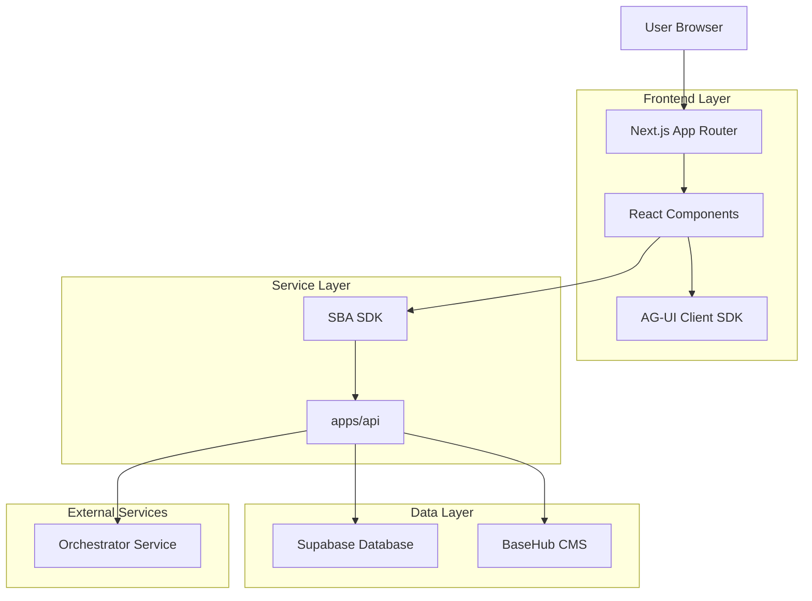
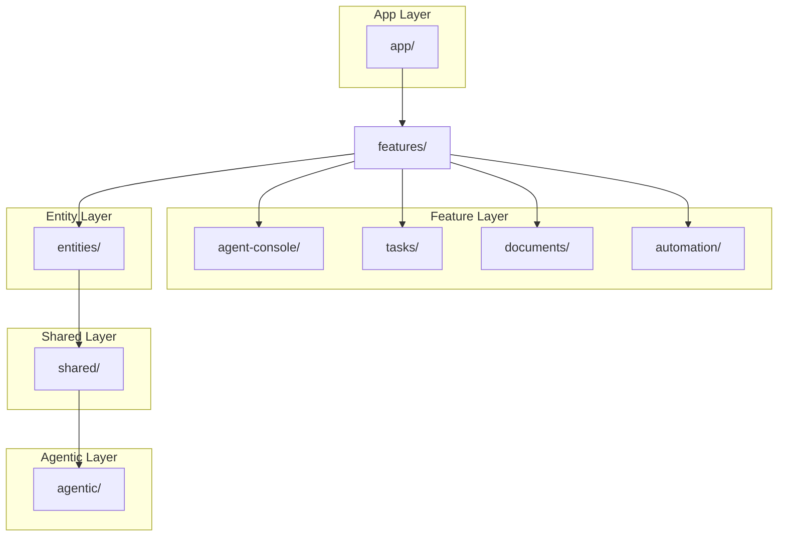
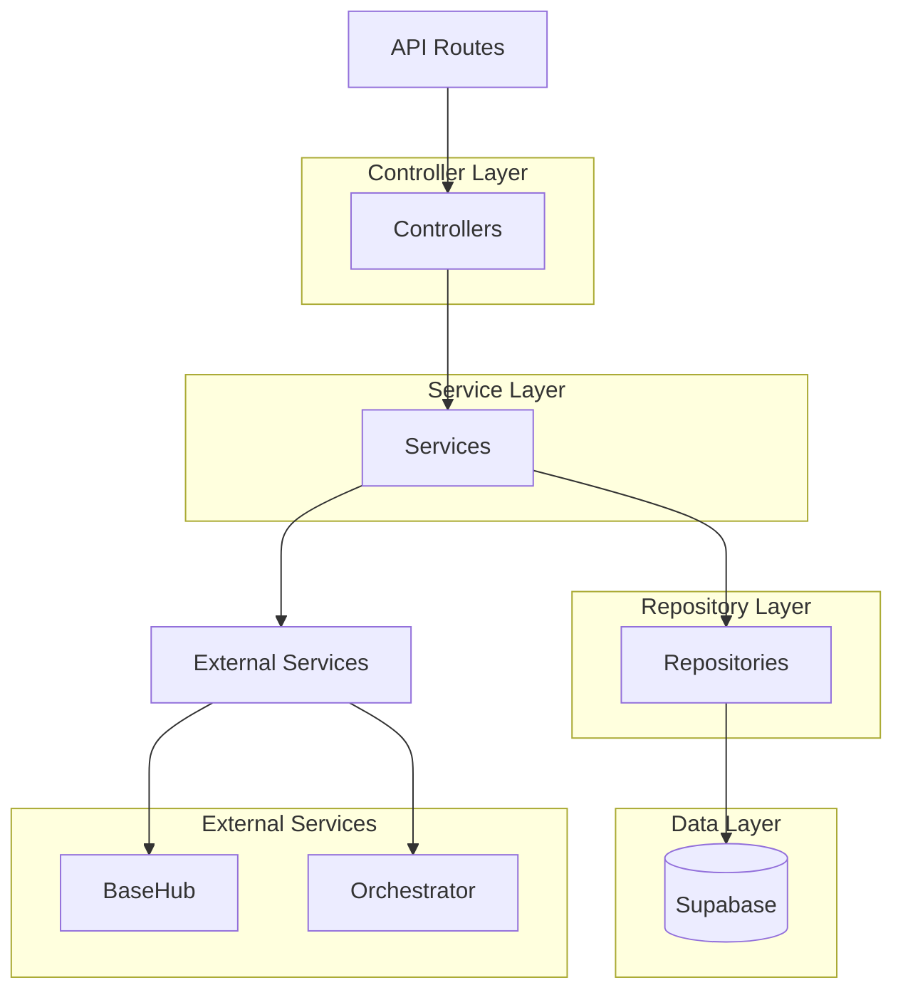
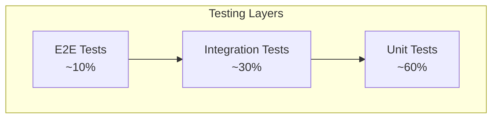

# **TECHNICAL ARCHITECTURE — `apps/app` (SBA-Agentic)**

Dokumen ini menjelaskan arsitektur teknis lengkap untuk SBA-Agentic Workspace App, termasuk stack teknologi, patterns, testing strategy, dan implementation guidelines.

**Status**: 🔄 *Active Development* | **Version**: 2.0 | **Last Updated**: Desember 2025

---

# **1. ARCHITECTURE DESIGN**

## **1.1 High-Level System Architecture**



## **1.2 Component Architecture (FSD Pattern)**



---

# **2. TECHNOLOGY STACK**

## **2.1 Frontend Technologies**

| Technology | Version | Purpose |
|------------|---------|---------|
| Next.js | 15.x | React framework dengan App Router |
| React | 18.x | UI library |
| TypeScript | 5.x | Type safety |
| Tailwind CSS | 3.4+ | Utility-first CSS |
| ShadCN UI | Latest | Component library |
| Radix UI | Latest | Headless UI primitives |
| Framer Motion | Latest | Animations |
| Zustand | Latest | State management |
| TanStack Query | 5.x | Server state management |
| React Hook Form | Latest | Form handling |
| Zod | Latest | Schema validation |

## **2.2 Development Tools**

| Tool | Purpose |
|------|---------|
| Vite | Build tool & dev server |
| ESLint | Code linting |
| Prettier | Code formatting |
| Husky | Git hooks |
| Commitizen | Conventional commits |
| Storybook | Component documentation |
| Playwright | E2E testing |
| Vitest | Unit testing |
| MSW | API mocking |

## **2.3 External Services**

| Service | Purpose |
|---------|---------|
| Supabase | Database, Auth, Real-time |
| BaseHub | Headless CMS |
| Vercel | Hosting & Edge Functions |
| Cloudflare | CDN & Edge caching |

---

# **3. ROUTE DEFINITIONS**

## **3.1 App Router Structure**

| Route | Purpose | Layout |
|-------|---------|--------|
| `/` | Landing page | Public |
| `/auth/*` | Authentication pages | Auth layout |
| `/app/[workspaceId]` | Workspace dashboard | Workspace layout |
| `/app/[workspaceId]/console` | Agent console | Workspace layout |
| `/app/[workspaceId]/tasks` | Task management | Workspace layout |
| `/app/[workspaceId]/documents` | Document workspace | Workspace layout |
| `/app/[workspaceId]/automation` | Workflow builder | Workspace layout |
| `/app/[workspaceId]/timeline` | Activity timeline | Workspace layout |
| `/app/[workspaceId]/settings` | Workspace settings | Workspace layout |
| `/app/[workspaceId]/members` | Team management | Workspace layout |

## **3.2 API Routes**

| Route | Method | Purpose |
|-------|--------|---------|
| `/api/auth/*` | GET/POST | Authentication handlers |
| `/api/webhooks/*` | POST | External service webhooks |
| `/api/edge/*` | GET/POST | Edge function handlers |

---

# **4. DATA MODELS**

## **4.1 Database Schema (Supabase)**

```mermaid
erDiagram
    WORKSPACE ||--o{ USER_WORKSPACE : contains
    WORKSPACE ||--o{ TASK : has
    WORKSPACE ||--o{ DOCUMENT : contains
    WORKSPACE ||--o{ AUTOMATION : contains
    WORKSPACE ||--o{ ACTIVITY : logs
    USER ||--o{ USER_WORKSPACE : belongs
    USER ||--o{ TASK : creates
    USER ||o{--o{ TASK : assigned
    
    WORKSPACE {
        uuid id PK
        string name
        string slug
        jsonb settings
        boolean is_active
        timestamp created_at
        timestamp updated_at
    }
    
    USER {
        uuid id PK
        string email
        string full_name
        jsonb metadata
        timestamp created_at
        timestamp updated_at
    }
    
    USER_WORKSPACE {
        uuid id PK
        uuid user_id FK
        uuid workspace_id FK
        string role
        jsonb permissions
        timestamp created_at
    }
    
    TASK {
        uuid id PK
        uuid workspace_id FK
        uuid creator_id FK
        uuid assignee_id FK
        string title
        text description
        string status
        jsonb metadata
        timestamp due_date
        timestamp created_at
        timestamp updated_at
    }
    
    DOCUMENT {
        uuid id PK
        uuid workspace_id FK
        uuid creator_id FK
        string title
        string content_type
        jsonb content
        jsonb metadata
        timestamp created_at
        timestamp updated_at
    }
    
    AUTOMATION {
        uuid id PK
        uuid workspace_id FK
        uuid creator_id FK
        string name
        jsonb workflow_config
        boolean is_active
        timestamp created_at
        timestamp updated_at
    }
    
    ACTIVITY {
        uuid id PK
        uuid workspace_id FK
        uuid user_id FK
        string action_type
        jsonb metadata
        timestamp created_at
    }
```

## **4.2 TypeScript Interfaces**

```typescript
// Core types shared between frontend and backend
export interface Workspace {
  id: string;
  name: string;
  slug: string;
  settings: WorkspaceSettings;
  isActive: boolean;
  createdAt: string;
  updatedAt: string;
}

export interface User {
  id: string;
  email: string;
  fullName: string;
  metadata: Record<string, any>;
  createdAt: string;
  updatedAt: string;
}

export interface Task {
  id: string;
  workspaceId: string;
  creatorId: string;
  assigneeId?: string;
  title: string;
  description?: string;
  status: 'todo' | 'in-progress' | 'completed' | 'cancelled';
  metadata: TaskMetadata;
  dueDate?: string;
  createdAt: string;
  updatedAt: string;
}

export interface Document {
  id: string;
  workspaceId: string;
  creatorId: string;
  title: string;
  contentType: 'markdown' | 'json' | 'html';
  content: any;
  metadata: DocumentMetadata;
  createdAt: string;
  updatedAt: string;
}

export interface Automation {
  id: string;
  workspaceId: string;
  creatorId: string;
  name: string;
  workflowConfig: WorkflowConfig;
  isActive: boolean;
  createdAt: string;
  updatedAt: string;
}
```

---

# **5. API DEFINITIONS**

## **5.1 Authentication APIs**

### **Login**
```
POST /api/auth/login
```

**Request Body:**
```typescript
{
  email: string;
  password: string;
  workspaceId?: string;
}
```

**Response:**
```typescript
{
  user: User;
  workspace: Workspace;
  token: string;
  refreshToken: string;
}
```

### **Register**
```
POST /api/auth/register
```

**Request Body:**
```typescript
{
  email: string;
  password: string;
  fullName: string;
  workspaceName?: string;
}
```

## **5.2 Task Management APIs**

### **Create Task**
```
POST /api/tasks
```

**Request Body:**
```typescript
{
  workspaceId: string;
  title: string;
  description?: string;
  assigneeId?: string;
  dueDate?: string;
  metadata?: TaskMetadata;
}
```

### **Update Task**
```
PATCH /api/tasks/:id
```

**Request Body:**
```typescript
{
  title?: string;
  description?: string;
  status?: TaskStatus;
  assigneeId?: string;
  dueDate?: string;
  metadata?: TaskMetadata;
}
```

### **List Tasks**
```
GET /api/tasks?workspaceId={workspaceId}&status={status}&assigneeId={assigneeId}
```

**Response:**
```typescript
{
  tasks: Task[];
  total: number;
  page: number;
  pageSize: number;
}
```

## **5.3 Document APIs**

### **Create Document**
```
POST /api/documents
```

### **Get Document**
```
GET /api/documents/:id
```

### **Update Document**
```
PATCH /api/documents/:id
```

### **List Documents**
```
GET /api/documents?workspaceId={workspaceId}&type={type}
```

## **5.4 Automation APIs**

### **Create Automation**
```
POST /api/automations
```

### **Execute Automation**
```
POST /api/automations/:id/execute
```

### **List Automations**
```
GET /api/automations?workspaceId={workspaceId}
```

---

# **6. SERVER ARCHITECTURE**

## **6.1 Service Layer Design**



## **6.2 Service Responsibilities**

### **Controller Layer**
- Request validation
- Response formatting
- Error handling
- Authentication middleware

### **Service Layer**
- Business logic
- Data transformation
- External service integration
- Event publishing

### **Repository Layer**
- Database queries
- Data mapping
- Transaction management
- Caching logic

---

# **7. TESTING STRATEGY**

## **7.1 Testing Pyramid**



## **7.2 Unit Testing**

### **Framework Setup**
```typescript
// vitest.config.ts
import { defineConfig } from 'vitest/config';
import react from '@vitejs/plugin-react';

export default defineConfig({
  plugins: [react()],
  test: {
    environment: 'jsdom',
    setupFiles: ['./src/test/setup.ts'],
    coverage: {
      provider: 'v8',
      reporter: ['text', 'json', 'html'],
      exclude: [
        'node_modules/',
        'src/test/',
        '**/*.d.ts',
        '**/*.config.*',
        '**/mockData.ts',
      ],
      thresholds: {
        lines: 80,
        functions: 80,
        branches: 70,
        statements: 80,
      },
    },
  },
});
```

### **Component Testing Example**
```typescript
// TaskCard.test.tsx
import { render, screen, fireEvent } from '@testing-library/react';
import { TaskCard } from './TaskCard';
import { vi } from 'vitest';

describe('TaskCard', () => {
  const mockTask = {
    id: '1',
    title: 'Test Task',
    status: 'todo',
    createdAt: '2024-01-01T00:00:00Z',
  };

  it('renders task information', () => {
    render(<TaskCard task={mockTask} />);
    expect(screen.getByText('Test Task')).toBeInTheDocument();
  });

  it('calls onStatusChange when status is updated', () => {
    const onStatusChange = vi.fn();
    render(<TaskCard task={mockTask} onStatusChange={onStatusChange} />);
    
    fireEvent.click(screen.getByRole('button', { name: /update status/i }));
    expect(onStatusChange).toHaveBeenCalledWith('1', 'in-progress');
  });
});
```

## **7.3 Integration Testing**

### **API Testing**
```typescript
// tasks.api.test.ts
import { describe, it, expect, beforeEach } from 'vitest';
import { createTask, updateTask } from './tasks.api';
import { server } from '@/test/mocks/server';
import { rest } from 'msw';

describe('Tasks API', () => {
  it('creates a new task', async () => {
    const newTask = {
      workspaceId: 'ws-1',
      title: 'New Task',
      description: 'Task description',
    };

    const result = await createTask(newTask);
    expect(result).toMatchObject({
      id: expect.any(String),
      title: 'New Task',
      status: 'todo',
    });
  });

  it('handles API errors', async () => {
    server.use(
      rest.post('/api/tasks', (req, res, ctx) => {
        return res(ctx.status(400), ctx.json({ error: 'Invalid data' }));
      })
    );

    await expect(createTask({} as any)).rejects.toThrow('Invalid data');
  });
});
```

## **7.4 E2E Testing**

### **Playwright Configuration**
```typescript
// playwright.config.ts
import { defineConfig, devices } from '@playwright/test';

export default defineConfig({
  testDir: './e2e',
  fullyParallel: true,
  forbidOnly: !!process.env.CI,
  retries: process.env.CI ? 2 : 0,
  workers: process.env.CI ? 1 : undefined,
  reporter: 'html',
  use: {
    baseURL: process.env.PLAYWRIGHT_TEST_BASE_URL || 'http://localhost:3000',
    trace: 'on-first-retry',
  },
  projects: [
    {
      name: 'chromium',
      use: { ...devices['Desktop Chrome'] },
    },
    {
      name: 'firefox',
      use: { ...devices['Desktop Firefox'] },
    },
    {
      name: 'webkit',
      use: { ...devices['Desktop Safari'] },
    },
    {
      name: 'Mobile Chrome',
      use: { ...devices['Pixel 5'] },
    },
    {
      name: 'Mobile Safari',
      use: { ...devices['iPhone 12'] },
    },
  ],
});
```

### **E2E Test Example**
```typescript
// e2e/task-creation.spec.ts
import { test, expect } from '@playwright/test';

test.describe('Task Creation', () => {
  test('user can create a new task', async ({ page }) => {
    await page.goto('/app/test-workspace/tasks');
    
    // Click create task button
    await page.getByRole('button', { name: /create task/i }).click();
    
    // Fill task form
    await page.getByLabel(/title/i).fill('New E2E Task');
    await page.getByLabel(/description/i).fill('Task created by E2E test');
    
    // Submit form
    await page.getByRole('button', { name: /save task/i }).click();
    
    // Verify task was created
    await expect(page.getByText('New E2E Task')).toBeVisible();
    await expect(page.getByText('Task created by E2E test')).toBeVisible();
  });
});
```

---

# **8. PERFORMANCE OPTIMIZATION**

## **8.1 Core Web Vitals Targets**

| Metric | Target | Measurement |
|--------|--------|-------------|
| LCP | < 2.5s | 75th percentile |
| FID | < 100ms | 75th percentile |
| CLS | < 0.1 | 75th percentile |
| FCP | < 1.8s | 75th percentile |
| TTFB | < 800ms | 75th percentile |

## **8.2 Optimization Strategies**

### **Code Splitting**
```typescript
// Dynamic imports untuk heavy components
const WorkflowBuilder = dynamic(
  () => import('@/features/automation/components/WorkflowBuilder'),
  {
    loading: () => <Skeleton className="h-96" />,
    ssr: false,
  }
);
```

### **Image Optimization**
```typescript
// Next.js Image component
import Image from 'next/image';

<Image
  src="/workflow-illustration.png"
  alt="Workflow illustration"
  width={800}
  height={600}
  priority={false} // Lazy load by default
  placeholder="blur"
  blurDataURL={blurDataURL}
/>
```

### **Bundle Size Monitoring**
```typescript
// next.config.js
const withBundleAnalyzer = require('@next/bundle-analyzer')({
  enabled: process.env.ANALYZE === 'true',
});

module.exports = withBundleAnalyzer({
  // Next.js config
  webpack: (config, { isServer }) => {
    if (!isServer) {
      config.resolve.fallback = {
        ...config.resolve.fallback,
        fs: false,
      };
    }
    return config;
  },
});
```

---

# **9. SECURITY IMPLEMENTATION**

## **9.1 Authentication & Authorization**

### **Supabase RLS Policies**
```sql
-- Enable RLS
ALTER TABLE tasks ENABLE ROW LEVEL SECURITY;

-- Create policy for workspace isolation
CREATE POLICY "Users can only view tasks in their workspace" ON tasks
  FOR ALL USING (
    workspace_id IN (
      SELECT workspace_id FROM user_workspaces WHERE user_id = auth.uid()
    )
  );

-- Create policy for task creation
CREATE POLICY "Users can create tasks in their workspace" ON tasks
  FOR INSERT WITH CHECK (
    workspace_id IN (
      SELECT workspace_id FROM user_workspaces WHERE user_id = auth.uid()
    )
  );
```

### **Client-Side Security**
```typescript
// Secure API client
class SecureAPIClient {
  private supabase: SupabaseClient;
  
  constructor(supabase: SupabaseClient) {
    this.supabase = supabase;
  }
  
  async createTask(taskData: CreateTaskData) {
    const { data: { user } } = await this.supabase.auth.getUser();
    
    if (!user) {
      throw new Error('User not authenticated');
    }
    
    // Additional client-side validation
    if (!taskData.workspaceId || !taskData.title) {
      throw new Error('Missing required fields');
    }
    
    return this.supabase
      .from('tasks')
      .insert({
        ...taskData,
        creator_id: user.id,
      })
      .select()
      .single();
  }
}
```

## **9.2 Input Validation**

### **Zod Schemas**
```typescript
// schemas/task.schema.ts
import { z } from 'zod';

export const createTaskSchema = z.object({
  workspaceId: z.string().uuid(),
  title: z.string().min(1).max(255),
  description: z.string().optional(),
  assigneeId: z.string().uuid().optional(),
  dueDate: z.string().datetime().optional(),
  metadata: z.record(z.any()).optional(),
});

export const updateTaskSchema = createTaskSchema.partial().extend({
  status: z.enum(['todo', 'in-progress', 'completed', 'cancelled']).optional(),
});

export type CreateTaskData = z.infer<typeof createTaskSchema>;
export type UpdateTaskData = z.infer<typeof updateTaskSchema>;
```

---

# **10. DEPLOYMENT & DEVOPS**

## **10.1 Environment Configuration**

### **Environment Variables**
```bash
# .env.local
NEXT_PUBLIC_SUPABASE_URL=https://your-project.supabase.co
NEXT_PUBLIC_SUPABASE_ANON_KEY=your-anon-key
SUPABASE_SERVICE_ROLE_KEY=your-service-role-key
BASEHub_TOKEN=your-basehub-token
NEXT_PUBLIC_APP_URL=https://your-app.com
```

### **Build Configuration**
```typescript
// next.config.js
/** @type {import('next').NextConfig} */
const nextConfig = {
  experimental: {
    appDir: true,
    serverComponentsExternalPackages: ['@supabase/supabase-js'],
  },
  images: {
    domains: ['your-cdn.com', 'supabase.co'],
  },
  env: {
    CUSTOM_KEY: process.env.CUSTOM_KEY,
  },
  async headers() {
    return [
      {
        source: '/(.*)',
        headers: [
          {
            key: 'X-Frame-Options',
            value: 'DENY',
          },
          {
            key: 'X-Content-Type-Options',
            value: 'nosniff',
          },
        ],
      },
    ];
  },
};

module.exports = nextConfig;
```

## **10.2 CI/CD Pipeline**

### **GitHub Actions Workflow**
```yaml
# .github/workflows/ci-cd.yml
name: CI/CD Pipeline

on:
  push:
    branches: [main, develop]
  pull_request:
    branches: [main]

jobs:
  test:
    runs-on: ubuntu-latest
    steps:
      - uses: actions/checkout@v4
      - uses: actions/setup-node@v4
        with:
          node-version: '18'
          cache: 'npm'
      
      - name: Install dependencies
        run: npm ci
      
      - name: Run linter
        run: npm run lint
      
      - name: Run type check
        run: npm run type-check
      
      - name: Run unit tests
        run: npm run test:unit
      
      - name: Run integration tests
        run: npm run test:integration
      
      - name: Run E2E tests
        run: npm run test:e2e

  deploy:
    needs: test
    runs-on: ubuntu-latest
    if: github.ref == 'refs/heads/main'
    steps:
      - uses: actions/checkout@v4
      - uses: amondnet/vercel-action@v25
        with:
          vercel-token: ${{ secrets.VERCEL_TOKEN }}
          vercel-org-id: ${{ secrets.ORG_ID }}
          vercel-project-id: ${{ secrets.PROJECT_ID }}
```

---

# **11. MONITORING & OBSERVABILITY**

## **11.1 Application Monitoring**

### **Error Tracking**
```typescript
// lib/monitoring/sentry.ts
import * as Sentry from '@sentry/nextjs';

Sentry.init({
  dsn: process.env.NEXT_PUBLIC_SENTRY_DSN,
  environment: process.env.NODE_ENV,
  tracesSampleRate: 1.0,
  integrations: [
    new Sentry.Integrations.Http({ tracing: true }),
  ],
});
```

### **Performance Monitoring**
```typescript
// lib/monitoring/vercel-analytics.ts
import { inject } from '@vercel/analytics';
import { injectSpeedInsights } from '@vercel/speed-insights';

export function initAnalytics() {
  inject();
  injectSpeedInsights();
}
```

## **11.2 Logging Strategy**

### **Structured Logging**
```typescript
// lib/logger/index.ts
import pino from 'pino';

const logger = pino({
  level: process.env.LOG_LEVEL || 'info',
  transport: process.env.NODE_ENV === 'development' ? {
    target: 'pino-pretty',
    options: {
      colorize: true,
    },
  } : undefined,
});

export default logger;
```

---

# **12. DEVELOPMENT GUIDELINES**

## **12.1 Code Style & Conventions**

### **File Naming**
- Components: `PascalCase.tsx`
- Utilities: `camelCase.ts`
- Hooks: `useCamelCase.ts`
- Tests: `ComponentName.test.tsx`
- Stories: `ComponentName.stories.tsx`

### **Component Structure**
```typescript
// components/TaskCard.tsx
import { useState } from 'react';
import { cn } from '@/lib/utils';
import type { Task } from '@/types/task';

interface TaskCardProps {
  task: Task;
  onStatusChange?: (taskId: string, status: TaskStatus) => void;
  className?: string;
}

export function TaskCard({ task, onStatusChange, className }: TaskCardProps) {
  const [isUpdating, setIsUpdating] = useState(false);
  
  const handleStatusChange = async (newStatus: TaskStatus) => {
    setIsUpdating(true);
    try {
      await onStatusChange?.(task.id, newStatus);
    } finally {
      setIsUpdating(false);
    }
  };
  
  return (
    <div className={cn('p-4 rounded-lg border', className)}>
      {/* Component implementation */}
    </div>
  );
}
```

## **12.2 Git Workflow**

### **Branch Naming**
- Feature: `feature/AGENT-123-add-task-management`
- Bugfix: `bugfix/AGENT-456-fix-login-error`
- Hotfix: `hotfix/AGENT-789-critical-security-patch`

### **Commit Messages**
```
type(scope): description

[optional body]

[optional footer]
```

Examples:
```
feat(tasks): add task creation functionality

- Implement task form with validation
- Add API endpoint for task creation
- Include unit tests for new components

Closes AGENT-123
```

---

# **13. TROUBLESHOOTING GUIDE**

## **13.1 Common Issues**

### **Build Errors**
```bash
# Clear cache and rebuild
rm -rf .next node_modules
npm install
npm run build
```

### **Database Connection Issues**
```bash
# Check Supabase connection
npx supabase status
npx supabase db reset --linked
```

### **Type Errors**
```bash
# Regenerate types
npm run type-generate
npm run type-check
```

## **13.2 Performance Issues**

### **Bundle Analysis**
```bash
# Analyze bundle size
npm run build:analyze
```

### **Performance Profiling**
```bash
# Run with profiling
npm run dev:profile
```

---

# **14. RESOURCES & REFERENCES**

## **14.1 Documentation**
- [Next.js Documentation](https://nextjs.org/docs)
- [React Documentation](https://react.dev/)
- [TypeScript Documentation](https://www.typescriptlang.org/docs/)
- [Tailwind CSS Documentation](https://tailwindcss.com/docs)
- [Supabase Documentation](https://supabase.com/docs)

## **14.2 Best Practices**
- [React Best Practices](https://react.dev/learn)
- [Next.js Best Practices](https://nextjs.org/docs/pages/building-your-application/deploying/production-checklist)
- [TypeScript Best Practices](https://www.typescriptlang.org/docs/handbook/declaration-files/do-s-and-don-ts.html)

## **14.3 Tools & Extensions**
- [React Developer Tools](https://chrome.google.com/webstore/detail/react-developer-tools/fmkadmapgofadopljbjfkapdkoienihi)
- [Next.js DevTools](https://nextjs.org/docs/architecture/nextjs-devtools)
- [TypeScript Hero](https://marketplace.visualstudio.com/items?itemName=rbbit.typescript-hero)

---

**Dokumen ini akan terus diperbarui sesuai perkembangan teknologi dan kebutuhan project. Pastikan selalu merujuk ke versi terbaru.**