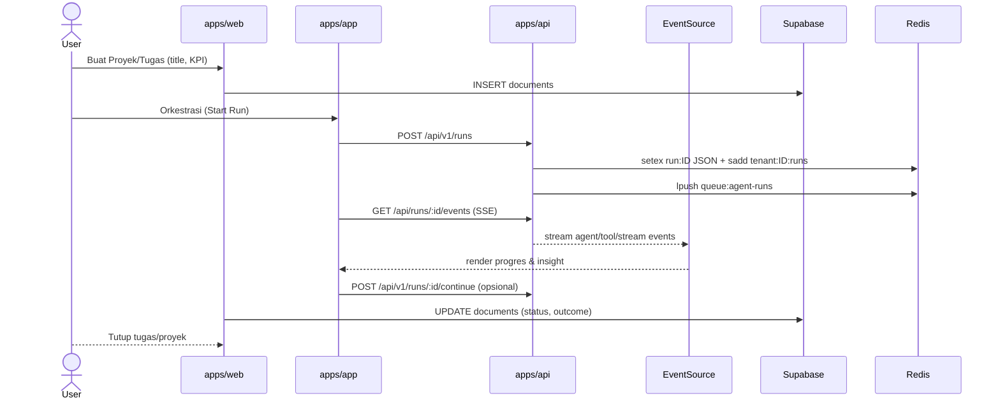
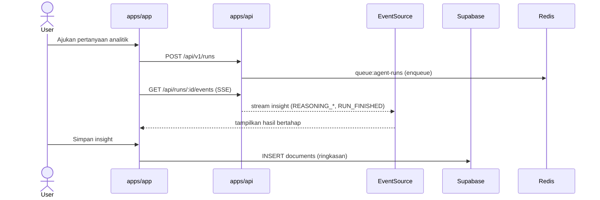
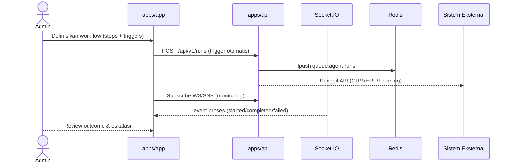
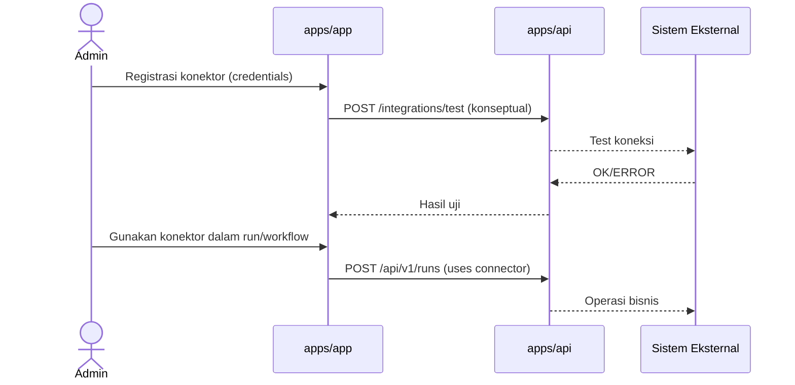

# Penambahan Sequence Diagram Per Use Case

## Tujuan
- Menyediakan file sequence diagram terpisah untuk tiap use case utama SBA agar pengembang dapat langsung memetakan endpoint, event SSE/WS, operasi Supabase, dan komponen yang terlibat.
- Menjaga konsistensi dengan arsitektur saat ini (apps/app, apps/web, apps/api, Supabase, Redis Queue, WS/SSE).

## File yang Akan Ditambahkan
1. `docs/use-cases/sequence-tasks-projects.mmd`
2. `docs/use-cases/sequence-analytics.mmd`
3. `docs/use-cases/sequence-automation.mmd`
4. `docs/use-cases/sequence-integrations.mmd`

Setiap file berformat Mermaid `sequenceDiagram` dengan partisipan standar:
- `User` (aktor manusia)
- `Web` (`apps/web`)
- `App` (`apps/app`)
- `API` (`apps/api` – REST/WS)
- `SSE` (alur EventSource di `apps/app`)
- `WS` (gateway Socket.IO di backend)
- `SB` (Supabase: Postgres + Realtime)
- `Redis` (Queue antrean run & continuation)

## Konten Diagram Per Use Case

### 1) Manajemen Tugas & Proyek
- Aktor: Admin, Pengguna.
- Endpoint & Stream:
  - Start run: `POST /api/v1/runs` (`apps/api/src/api/runs.controller.ts:32`)
  - Get run: `GET /api/v1/runs/:runId` (`apps/api/src/api/runs.controller.ts:163`)
  - SSE events: `GET /api/runs/:runId/events` (`apps/app/src/app/api/runs/[runId]/events/route.ts`)
  - Supabase docs: `INSERT/UPDATE documents` (`apps/web/src/shared/api/client.ts:268-315`)
- Diagram (isi file `sequence-tasks-projects.mmd`):

### 2) Analisis Data Bisnis
- Aktor: Pengguna (analyst), Admin.
- Endpoint & Stream:
  - Start/continue/cancel run (REST) – referensi sama seperti di atas
  - SSE events untuk insight
  - Simpan insight ke dokumen (Supabase)
- Diagram (isi file `sequence-analytics.mmd`):

### 3) Otomatisasi Proses Bisnis
- Aktor: Admin, Sistem Eksternal, Pengguna.
- Endpoint & Stream:
  - Workflow trigger (jadwal/event) di UI → Start run
  - Integrasi eksternal via adapter (`@sba/integrations`) di backend/SDK
  - WS/SSE untuk monitoring proses
- Diagram (isi file `sequence-automation.mmd`):

### 4) Integrasi dengan Sistem Eksternal
- Aktor: Admin, Sistem Eksternal.
- Endpoint & Stream:
  - Registrasi konektor & uji koneksi
  - Penggunaan konektor dalam run/workflow
  - Observability per layanan (metrics)
- Diagram (isi file `sequence-integrations.mmd`):

## Konsistensi & Referensi Kode
- REST Runs: `apps/api/src/api/runs.controller.ts:32, 163, 273, 428, 589`
- SSE Events: `apps/app/src/app/api/runs/[runId]/events/route.ts` dan klien SSE `apps/app/src/shared/api/sse.ts:64,135-156`
- WS Gateway: modul gateway di `apps/api/src/api/gateway/*`
- Supabase repos: `apps/web/src/shared/api/client.ts:173-337 (conversations/messages/documents/tenants)`

## Penempatan Link Navigasi
- Tambahkan tautan ke keempat file sequence di `docs/README.md` bagian Use Cases.

## Validasi
- Buka masing-masing file `.mmd` untuk memastikan Mermaid merender dengan benar.
- Cek konsistensi nama endpoint dengan implementasi saat ini.

## Rencana Eksekusi
1. Buat keempat file `.mmd` sesuai konten di atas.
2. Tambahkan entri link ke `docs/README.md`.
3. Review cepat terhadap jalur endpoint dan event names.
4. Kirim PR internal atau commit sesuai alur repo Anda.

## Catatan
- Jika ditemukan perbedaan nama path (mis. prefix App Router Next.js), akan disesuaikan pada saat implementasi dengan format route aktual (mis. `/api/runs/:runId/events`).