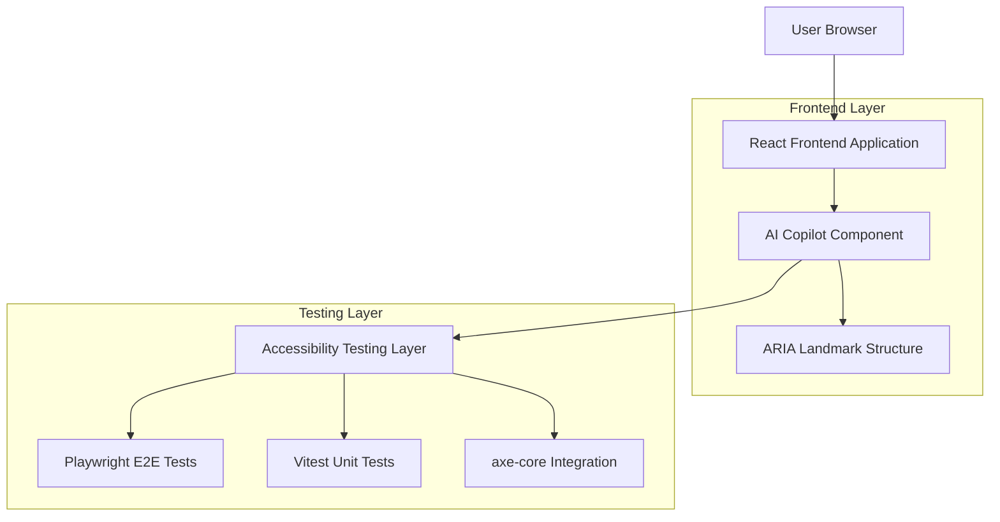
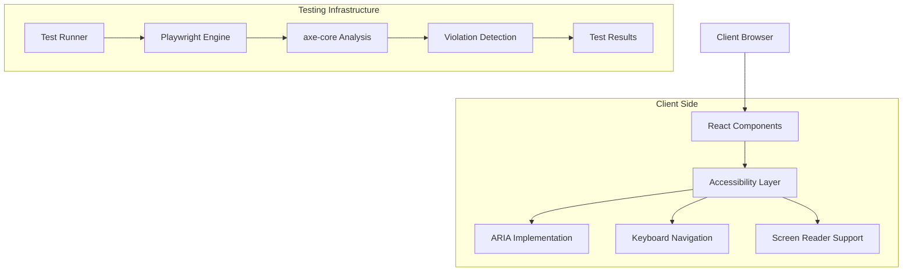
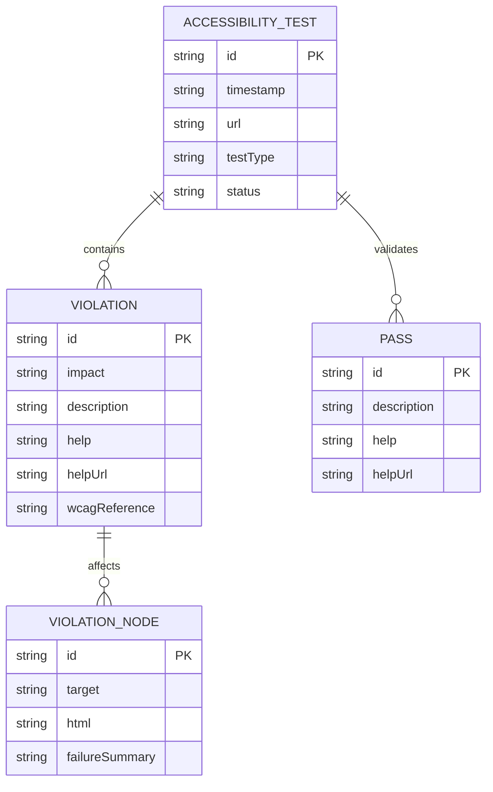

## 1. Architecture design



## 2. Technology Description

- Frontend: React@18 + TypeScript + TailwindCSS
- Testing Framework: Playwright + Vitest + jest-axe
- Accessibility Engine: axe-core + axe DevTools
- Build Tool: Vite
- Package Manager: pnpm
- Development Environment: Node.js@18+

## 3. Route definitions

| Route | Purpose |
|-------|---------|
| /ai-copilot | Main AI Copilot interface with accessibility improvements |
| /dashboard | Dashboard layout with proper ARIA landmarks |
| /test-accessibility | Development route for accessibility testing |

## 4. API definitions

### 4.1 Accessibility Test API

```typescript
// Test Configuration Interface
interface AccessibilityTestConfig {
  timeout: number;
  allowedViolations: ViolationLevel[];
  screenshotOnFailure: boolean;
}

// Violation Level Enum
enum ViolationLevel {
  CRITICAL = 'critical',
  SERIOUS = 'serious',
  MODERATE = 'moderate',
  MINOR = 'minor'
}

// Test Result Interface
interface AccessibilityTestResult {
  violations: AccessibilityViolation[];
  passes: AccessibilityPass[];
  incomplete: AccessibilityIncomplete[];
  timestamp: string;
}
```

### 4.2 Component Props Interface

```typescript
interface AICopilotProps {
  ariaLabelledBy?: string;
  ariaLabel?: string;
  role?: ARIARole;
  isMounted?: boolean;
  onMount?: () => void;
  onUnmount?: () => void;
}

type ARIARole = 'region' | 'banner' | 'main' | 'navigation' | 'complementary';
```

## 5. Server architecture diagram



## 6. Data model

### 6.1 Accessibility Violation Model



### 6.2 Data Definition Language

```sql
-- Accessibility Test Results Table
CREATE TABLE accessibility_tests (
    id UUID PRIMARY KEY DEFAULT gen_random_uuid(),
    test_name VARCHAR(255) NOT NULL,
    test_type VARCHAR(50) NOT NULL,
    url VARCHAR(500) NOT NULL,
    total_violations INTEGER DEFAULT 0,
    critical_violations INTEGER DEFAULT 0,
    serious_violations INTEGER DEFAULT 0,
    moderate_violations INTEGER DEFAULT 0,
    minor_violations INTEGER DEFAULT 0,
    test_status VARCHAR(50) DEFAULT 'pending',
    execution_time_ms INTEGER,
    created_at TIMESTAMP WITH TIME ZONE DEFAULT NOW(),
    updated_at TIMESTAMP WITH TIME ZONE DEFAULT NOW()
);

-- Violations Detail Table
CREATE TABLE accessibility_violations (
    id UUID PRIMARY KEY DEFAULT gen_random_uuid(),
    test_id UUID REFERENCES accessibility_tests(id),
    impact VARCHAR(20) NOT NULL,
    description TEXT NOT NULL,
    help TEXT,
    help_url VARCHAR(500),
    wcag_reference VARCHAR(100),
    target_selector VARCHAR(500),
    html_snippet TEXT,
    failure_summary TEXT,
    created_at TIMESTAMP WITH TIME ZONE DEFAULT NOW()
);

-- Create indexes for performance
CREATE INDEX idx_accessibility_tests_created_at ON accessibility_tests(created_at DESC);
CREATE INDEX idx_accessibility_tests_status ON accessibility_tests(test_status);
CREATE INDEX idx_accessibility_violations_test_id ON accessibility_violations(test_id);
CREATE INDEX idx_accessibility_violations_impact ON accessibility_violations(impact);

-- Grant permissions
GRANT SELECT ON accessibility_tests TO anon;
GRANT SELECT ON accessibility_violations TO anon;
GRANT ALL PRIVILEGES ON accessibility_tests TO authenticated;
GRANT ALL PRIVILEGES ON accessibility_violations TO authenticated;
```

## 7. Component Architecture

### 7.1 AICopilot Component Structure

```typescript
// Core Component with Accessibility
export const AICopilot: React.FC<AICopilotProps> = ({
  ariaLabelledBy = 'chat-title',
  role = 'region',
  ...props
}) => {
  const [isMounted, setIsMounted] = useState(false);
  
  useEffect(() => {
    setIsMounted(true);
    return () => setIsMounted(false);
  }, []);

  return (
    <div 
      role={role}
      aria-labelledby={ariaLabelledBy}
      aria-label="AI Copilot Chat Interface"
    >
      <h2 id="chat-title" className="sr-only">AI Copilot Assistant</h2>
      {/* Component content */}
    </div>
  );
};
```

### 7.2 Testing Utilities

```typescript
// Accessibility Test Utilities
export const runAccessibilityTest = async (
  container: HTMLElement,
  config: AccessibilityTestConfig
): Promise<AccessibilityTestResult> => {
  const results = await axe(container, {
    rules: {
      'color-contrast': { enabled: true },
      'landmark-one-main': { enabled: true },
      'page-has-heading-one': { enabled: true }
    }
  });
  
  return filterViolationsByLevel(results, config.allowedViolations);
};
```

## 8. Performance Optimization

### 8.1 Test Execution Strategy
- Implement parallel test execution
- Use selective testing for critical paths
- Apply lazy loading for accessibility checks
- Implement caching for repeated accessibility scans

### 8.2 Component Optimization
- Memoize accessibility calculations
- Use Intersection Observer for lazy landmark detection
- Implement debounced accessibility updates
- Apply code splitting for test utilities