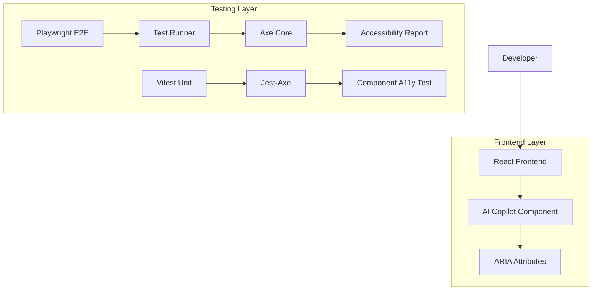
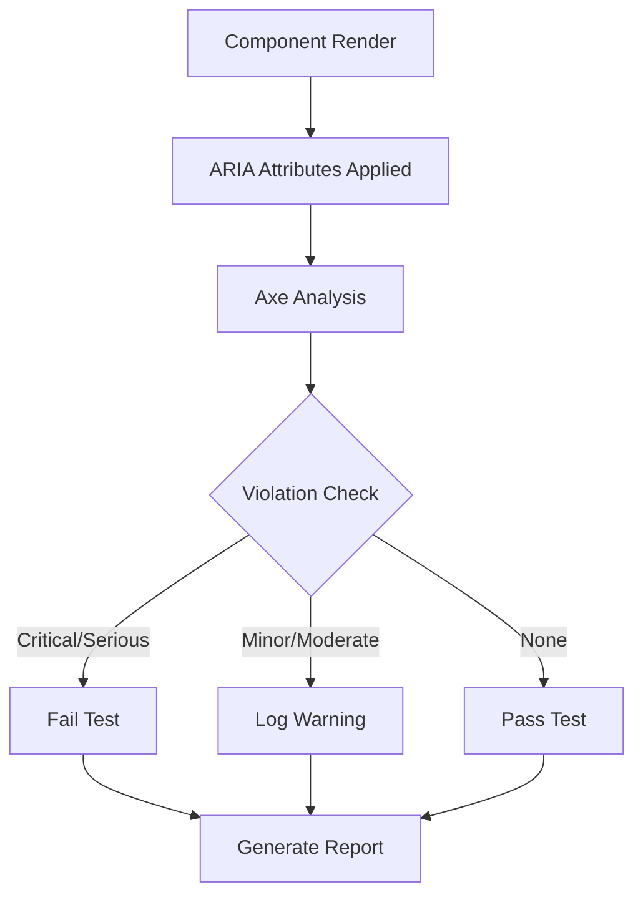

## 1. Architecture Design



## 2. Technology Description

- **Frontend**: React@18 + TypeScript + TailwindCSS
- **Testing Framework**: Playwright (E2E), Vitest (Unit)
- **Accessibility**: Axe Core, Jest-Axe
- **Build Tool**: Vite
- **Package Manager**: Pnpm (monorepo)

## 3. Route Definitions

| Route | Purpose |
|-------|---------|
| /ai-copilot | Halaman utama AI Copilot yang akan diperbaiki aksesibilitasnya |
| /e2e-test | Testing endpoint untuk validasi E2E (development only) |

## 4. Component Structure

### 4.1 AI Copilot Component Changes
```typescript
// File: apps/web/src/features/ai/components/AICopilot.tsx
// Line 597: Change role from "banner" to "region"
// Before: role="banner"
// After: role="region" aria-labelledby="chat-title"

// Line 293: Add mounted guard
// Add isMounted flag to prevent state updates after unmount
```

### 4.2 Page Component Changes
```typescript
// File: apps/web/src/app/ai-copilot/page.tsx
// Line 10: Add aria-label to region
// Add: aria-label="AI Copilot content"
```

## 5. Testing Architecture

### 5.1 E2E Test Modifications
```typescript
// File: apps/web/e2e/ai-copilot-a11y.spec.ts
// Changes:
// - Remove assertions for minor/moderate violations
// - Keep assertions for critical/serious violations (must be 0)
// - Add test.setTimeout(60_000) for stability
// - Enhance error handling and artifacts
```

### 5.2 Unit Test Implementation
```typescript
// New files:
// apps/web/src/features/ai/components/__tests__/AICopilot.a11y.spec.tsx
// apps/web/src/widgets/__tests__/DashboardLayout.a11y.spec.tsx

// Test coverage:
// - Validate single banner landmark per page
// - Validate named regions
// - Test ARIA attribute presence
```

## 6. Data Flow



## 7. Quality Assurance

### 7.1 Code Quality Checks
- **Linting**: ESLint dengan aturan aksesibilitas
- **Type Checking**: TypeScript strict mode
- **Format**: Prettier untuk konsistensi kode

### 7.2 Performance Metrics
- **Test Execution Time**: < 60 detik per test suite
- **Memory Usage**: Minimal overhead dari perubahan aksesibilitas
- **Bundle Size**: Tidak ada peningkatan signifikan

## 8. Deployment Strategy

### 8.1 Development Phase
1. Implementasi perubahan kode lokal
2. Jalankan unit tests untuk validasi komponen
3. Jalankan E2E tests secara parsial
4. Perbaiki issues yang ditemukan

### 8.2 Staging Validation
1. Deploy ke environment staging
2. Jalankan full E2E test suite
3. Validasi hasil aksesibilitas
4. Generate laporan akhir

### 8.3 Production Deployment
1. Merge perubahan ke main branch
2. Deploy ke production
3. Monitor hasil E2E tests
4. Dokumentasikan hasil akhir