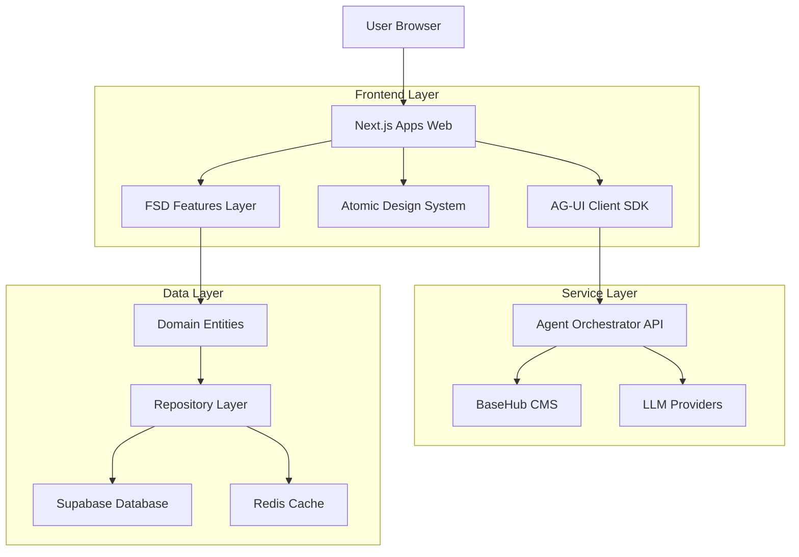
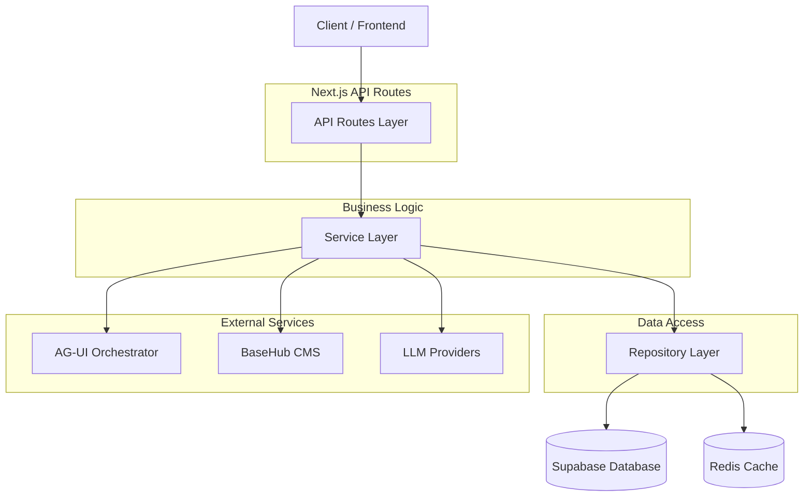
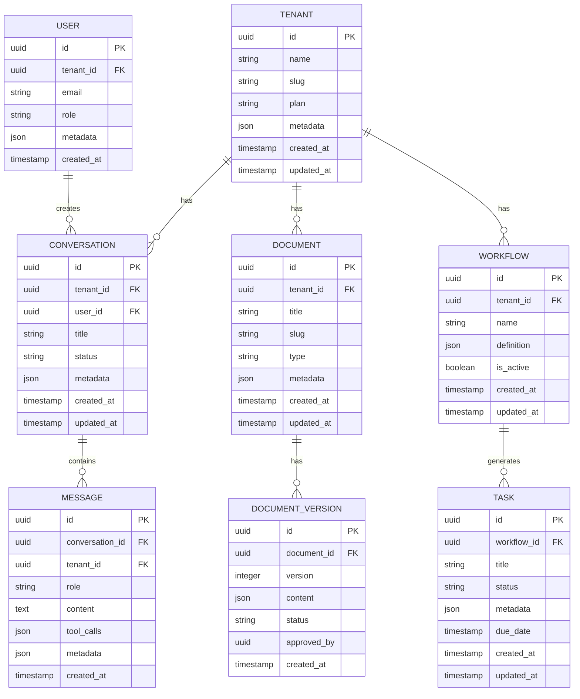

## 1. Architecture Design



## 2. Technology Description

**Frontend Stack:**
- Next.js 14+ (App Router) dengan React 18+
- TypeScript dengan strict mode dan path aliases
- Tailwind CSS untuk styling dengan design tokens
- TanStack Query untuk state management dan caching
- Zod untuk runtime validation dan type safety

**Backend Integration:**
- Supabase untuk database, auth, dan real-time subscriptions
- AG-UI Client SDK untuk agent orchestration
- BaseHub untuk headless CMS dan content management

**Development Tools:**
- Turborepo untuk monorepo management
- Vitest untuk unit testing dengan coverage ≥80%
- Playwright untuk E2E testing
- ESLint dan Prettier untuk code quality

**Initialization Tool:** vite-init (untuk packages yang membutuhkan dev server)

## 3. Route Definitions

| Route | Purpose |
|-------|---------|
| / | Landing page dengan hero section dan feature overview |
| /dashboard | Main dashboard dengan business metrics dan quick actions |
| /chat | AI conversation interface dengan streaming support |
| /documents | Document management dan template generator |
| /workflows | Visual workflow builder dan automation |
| /integrations | Third-party connector configuration |
| /ai-copilot | Intelligent assistant dengan recommendations |
| /settings | User dan tenant configuration |
| /api/agui/chat | AG-UI agent communication endpoint |
| /api/health | Health check dan system status |
| /api/telemetry | Analytics dan error reporting |

## 4. API Definitions

### 4.1 Core API - AG-UI Chat Integration

```
POST /api/agui/chat
```

**Request:**
```typescript
interface ChatRequest {
  conversationId: string;
  message: string;
  tenantId: string;
  userId: string;
  context?: {
    previousMessages?: Message[];
    tools?: ToolConfig[];
  };
}
```

**Response:**
```typescript
interface ChatResponse {
  response: string;
  model: string;
  tokens: number;
  processingTime: number;
  toolsUsed: ToolCall[];
  metadata?: Record<string, any>;
}
```

**Error Response:**
```typescript
interface ErrorResponse {
  error: {
    code: string;
    message: string;
    details?: any;
  };
}
```

### 4.2 Health Check API

```
GET /api/health
```

**Response:**
```typescript
interface HealthResponse {
  status: 'healthy' | 'degraded' | 'unhealthy';
  timestamp: string;
  version: string;
  checks: {
    database: HealthCheck;
    cache: HealthCheck;
    agui: HealthCheck;
  };
}

interface HealthCheck {
  status: 'up' | 'down';
  latency?: number;
  lastCheck: string;
}
```

### 4.3 Telemetry API

```
POST /api/telemetry
```

**Request:**
```typescript
interface TelemetryEvent {
  type: 'error' | 'vital' | 'metric';
  name: string;
  value: number;
  meta?: Record<string, any>;
}
```

## 5. Server Architecture Diagram



## 6. Data Model

### 6.1 Data Model Definition



### 6.2 Data Definition Language

**Tenant Table (tenants)**
```sql
-- create table
CREATE TABLE tenants (
    id UUID PRIMARY KEY DEFAULT gen_random_uuid(),
    name VARCHAR(255) NOT NULL,
    slug VARCHAR(100) UNIQUE NOT NULL,
    plan VARCHAR(50) DEFAULT 'free' CHECK (plan IN ('free', 'growth', 'pro', 'enterprise')),
    metadata JSONB DEFAULT '{}',
    created_at TIMESTAMP WITH TIME ZONE DEFAULT NOW(),
    updated_at TIMESTAMP WITH TIME ZONE DEFAULT NOW()
);

-- create index
CREATE INDEX idx_tenants_slug ON tenants(slug);
CREATE INDEX idx_tenants_plan ON tenants(plan);

-- RLS policies
ALTER TABLE tenants ENABLE ROW LEVEL SECURITY;

CREATE POLICY tenant_isolation ON tenants
    USING (id = current_setting('app.current_tenant')::uuid);

-- Grant permissions
GRANT SELECT ON tenants TO anon;
GRANT ALL PRIVILEGES ON tenants TO authenticated;
```

**Conversation Table (conversations)**
```sql
-- create table
CREATE TABLE conversations (
    id UUID PRIMARY KEY DEFAULT gen_random_uuid(),
    tenant_id UUID NOT NULL REFERENCES tenants(id),
    user_id UUID NOT NULL,
    title VARCHAR(255),
    status VARCHAR(50) DEFAULT 'active' CHECK (status IN ('active', 'archived', 'deleted')),
    metadata JSONB DEFAULT '{}',
    created_at TIMESTAMP WITH TIME ZONE DEFAULT NOW(),
    updated_at TIMESTAMP WITH TIME ZONE DEFAULT NOW()
);

-- create index
CREATE INDEX idx_conversations_tenant_id ON conversations(tenant_id);
CREATE INDEX idx_conversations_user_id ON conversations(user_id);
CREATE INDEX idx_conversations_status ON conversations(status);
CREATE INDEX idx_conversations_created_at ON conversations(created_at DESC);

-- RLS policies
ALTER TABLE conversations ENABLE ROW LEVEL SECURITY;

CREATE POLICY tenant_isolation ON conversations
    USING (tenant_id = current_setting('app.current_tenant')::uuid);

CREATE POLICY user_access ON conversations
    USING (user_id = auth.uid() OR EXISTS (
        SELECT 1 FROM tenants WHERE id = tenant_id 
        AND EXISTS (
            SELECT 1 FROM users WHERE id = auth.uid() AND role IN ('admin', 'owner')
        )
    ));

-- Grant permissions
GRANT SELECT ON conversations TO anon;
GRANT ALL PRIVILEGES ON conversations TO authenticated;
```

**Message Table (messages)**
```sql
-- create table
CREATE TABLE messages (
    id UUID PRIMARY KEY DEFAULT gen_random_uuid(),
    conversation_id UUID NOT NULL REFERENCES conversations(id),
    tenant_id UUID NOT NULL,
    user_id UUID,
    role VARCHAR(50) NOT NULL CHECK (role IN ('user', 'assistant', 'system', 'tool')),
    content TEXT NOT NULL,
    tool_calls JSONB DEFAULT '[]',
    metadata JSONB DEFAULT '{}',
    created_at TIMESTAMP WITH TIME ZONE DEFAULT NOW()
);

-- create index
CREATE INDEX idx_messages_conversation_id ON messages(conversation_id);
CREATE INDEX idx_messages_tenant_id ON messages(tenant_id);
CREATE INDEX idx_messages_role ON messages(role);
CREATE INDEX idx_messages_created_at ON messages(created_at ASC);

-- RLS policies
ALTER TABLE messages ENABLE ROW LEVEL SECURITY;

CREATE POLICY tenant_isolation ON messages
    USING (tenant_id = current_setting('app.current_tenant')::uuid);

-- Grant permissions
GRANT SELECT ON messages TO anon;
GRANT ALL PRIVILEGES ON messages TO authenticated;
```

## 7. FSD (Feature-Sliced Design) Implementation

### 7.1 Layer Structure
```
src/
├── app/                    # Next.js App Router
│   ├── layout.tsx         # Root layout dengan providers
│   ├── page.tsx           # Home page
│   ├── globals.css        # Global styles
│   └── providers.tsx      # App-wide providers
├── processes/             # Long business flows
│   ├── onboarding/        # User onboarding flow
│   ├── document-generation/ # Document creation workflow
│   └── chat-to-report/    # Conversation analysis flow
├── widgets/                # Composite UI widgets
│   ├── DashboardLayout/   # Main dashboard shell
│   ├── ChatWindow/        # Chat interface container
│   └── DocumentEditor/    # Document editing widget
├── features/               # Feature modules (FSD)
│   ├── chat/              # Chat functionality
│   │   ├── model/         # State management
│   │   ├── ui/           # UI components
│   │   ├── api/          # API integration
│   │   └── lib/          # Business logic
│   ├── documents/         # Document management
│   ├── workflows/         # Workflow automation
│   ├── integrations/      # Third-party connectors
│   └── ai-copilot/        # AI assistant features
├── entities/               # Domain entities
│   ├── conversation/      # Conversation domain
│   ├── document/         # Document domain
│   ├── tenant/           # Tenant domain
│   └── user/             # User domain
└── shared/                # Shared utilities
    ├── ui/               # Atomic design components
    ├── api/              # API clients dan adapters
    ├── lib/              # Utility functions
    └── config/           # Configuration
```

### 7.2 Import Rules
- `app` → `processes` → `widgets` → `features` → `entities` → `shared`
- No circular dependencies
- Features hanya boleh import entities dan shared
- Widgets boleh import features, entities, dan shared

## 8. Atomic Design System

### 8.1 Component Hierarchy
```
packages/ui/
├── tokens/                 # Design tokens
│   ├── colors.ts         # Color palette
│   ├── spacing.ts        # Spacing scale
│   ├── typography.ts     # Font definitions
│   └── shadows.ts        # Shadow definitions
├── atoms/                 # Basic components
│   ├── Button/           # Button variants
│   ├── Input/            # Input fields
│   ├── Card/             # Card containers
│   └── Icon/             # Icon components
├── molecules/             # Component groups
│   ├── SearchBar/        # Search with input dan button
│   ├── FormGroup/        # Label + input + error
│   └── ChatBubble/       # Message bubble dengan avatar
├── organisms/             # Complex components
│   ├── ChatWindow/       # Complete chat interface
│   ├── DocumentEditor/ # Rich text editor
│   └── MetricsCard/      # KPI display card
├── templates/             # Page layouts
│   ├── DashboardLayout/  # Dashboard scaffolding
│   ├── AuthLayout/       # Authentication layout
│   └── SettingsLayout/   # Settings page layout
└── pages/                 # Full page components
    ├── ChatPage/         # Chat interface page
    ├── DocumentsPage/    # Document management
    └── DashboardPage/    # Main dashboard
```

### 8.2 Design Tokens
```typescript
// Color tokens
export const colors = {
  primary: {
    50: '#eff6ff',
    500: '#3b82f6',
    600: '#2563eb',
    700: '#1d4ed8',
  },
  secondary: {
    50: '#f5f3ff',
    500: '#8b5cf6',
    600: '#7c3aed',
    700: '#6d28d9',
  },
  semantic: {
    success: '#10b981',
    warning: '#f59e0b',
    error: '#ef4444',
    info: '#06b6d4',
  },
};

// Spacing tokens
export const spacing = {
  unit: 4,
  scale: [0, 4, 8, 12, 16, 20, 24, 32, 40, 48, 64, 80, 96],
};

// Typography tokens
export const typography = {
  fontFamily: {
    sans: ['Inter', 'system-ui', 'sans-serif'],
    mono: ['JetBrains Mono', 'monospace'],
  },
  fontSize: {
    xs: '0.75rem',
    sm: '0.875rem',
    base: '1rem',
    lg: '1.125rem',
    xl: '1.25rem',
    '2xl': '1.5rem',
  },
};
```

## 9. Quality Assurance & Testing

### 9.1 Testing Strategy
- **Unit Tests**: ≥80% coverage untuk business logic
- **Integration Tests**: API endpoints dan repository layer
- **E2E Tests**: Critical user journeys dengan Playwright
- **Contract Tests**: API schema validation dengan Zod
- **Accessibility Tests**: WCAG 2.1 AA compliance

### 9.2 Test Structure
```
src/
├── __tests__/             # Unit tests
│   ├── entities/         # Domain logic tests
│   ├── features/         # Feature tests
│   └── shared/           # Utility tests
e2e/                       # End-to-end tests
├── chat/                 # Chat flow tests
├── documents/            # Document workflow tests
├── workflows/            # Automation tests
└── a11y/                 # Accessibility tests
```

### 9.3 Coverage Requirements
- Statements: ≥80%
- Branches: ≥75%
- Functions: ≥80%
- Lines: ≥80%

## 10. CI/CD Pipeline

### 10.1 GitHub Actions Workflow
```yaml
name: CI/CD Pipeline
on:
  push:
    branches: [main, develop]
  pull_request:
    branches: [main, develop]

jobs:
  lint-and-type-check:
    runs-on: ubuntu-latest
    steps:
      - uses: actions/checkout@v4
      - uses: pnpm/action-setup@v2
      - run: pnpm install
      - run: pnpm lint
      - run: pnpm type-check

  test:
    runs-on: ubuntu-latest
    steps:
      - uses: actions/checkout@v4
      - uses: pnpm/action-setup@v2
      - run: pnpm install
      - run: pnpm test --coverage
      - uses: codecov/codecov-action@v3

  e2e:
    runs-on: ubuntu-latest
    steps:
      - uses: actions/checkout@v4
      - uses: pnpm/action-setup@v2
      - run: pnpm install
      - run: pnpm build
      - run: pnpm test:e2e

  build:
    runs-on: ubuntu-latest
    needs: [lint-and-type-check, test]
    steps:
      - uses: actions/checkout@v4
      - uses: pnpm/action-setup@v2
      - run: pnpm install
      - run: pnpm build
      - uses: actions/upload-artifact@v3
        with:
          name: build-artifacts
          path: .next/**
```

### 10.2 Deployment Strategy
- **Development**: Automatic deployment dari branch develop
- **Staging**: Manual deployment untuk testing
- **Production**: Manual deployment dengan approval
- **Rollback**: Automatic rollback jika health check gagal

## 11. Security & Compliance

### 11.1 Security Measures
- Row Level Security (RLS) di database
- JWT-based authentication dengan refresh tokens
- API rate limiting per tenant
- Input validation dengan Zod schemas
- Content Security Policy (CSP) headers
- XSS dan CSRF protection

### 11.2 Data Privacy
- GDPR compliance untuk data EU
- Data encryption at rest dan in transit
- Audit logging untuk semua perubahan data
- Right to deletion implementation
- Data portability features

### 11.3 Multi-Tenant Isolation
- Tenant-scoped queries dengan RLS
- Separate schema per tenant (opsional)
- Resource quotas dan rate limiting
- Isolated caching per tenant
- Tenant-specific encryption keys