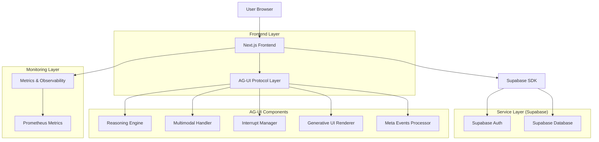
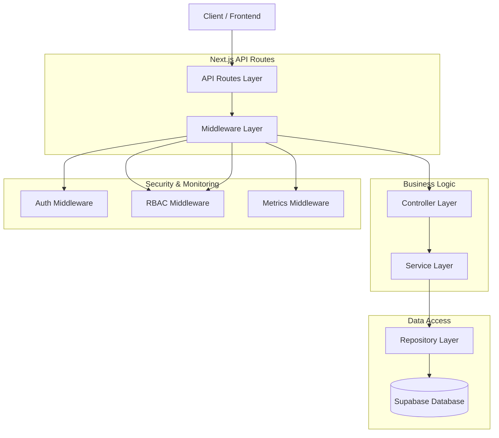
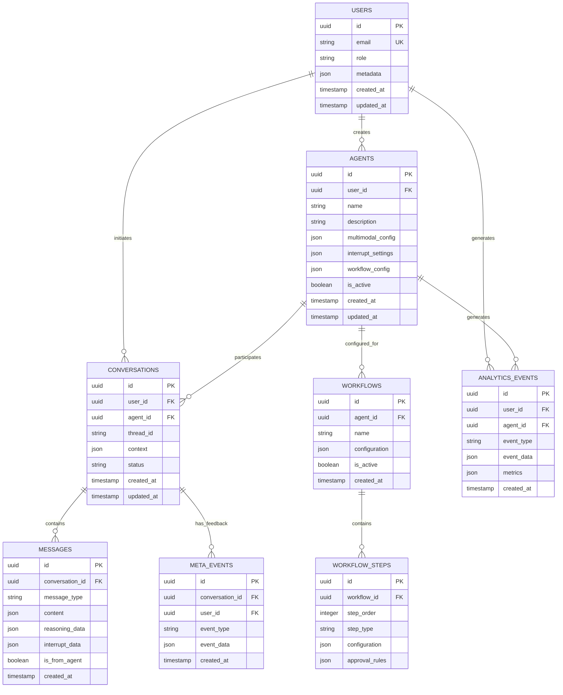

## 1. Architecture design



## 2. Technology Description

* **Frontend**: Next.js 15 + React 18 + TypeScript + Tailwind CSS

* **Initialization Tool**: create-next-app

* **Backend**: Supabase (PostgreSQL + Auth + Storage)

* **State Management**: React Context + Zustand for complex state

* **UI Components**: Custom components dengan Radix UI primitives

* **Styling**: Tailwind CSS dengan custom design tokens

* **Testing**: Vitest (unit), Playwright (e2e)

* **Linting**: ESLint dengan TypeScript dan import rules

* **Package Manager**: pnpm untuk monorepo management

## 3. Route definitions

| Route              | Purpose                                |
| ------------------ | -------------------------------------- |
| /                  | Dashboard utama dengan metrik performa |
| /auth/login        | Halaman login dengan Supabase auth     |
| /auth/register     | Registrasi user baru                   |
| /agents            | Daftar dan manajemen agen              |
| /agents/new        | Form pembuatan agen baru               |
| /agents/\[id]      | Detail dan konfigurasi agen spesifik   |
| /agents/\[id]/chat | Interface interaksi dengan agen        |
| /analytics         | Dashboard analitik dan metrik          |
| /analytics/heatmap | Visualisasi heatmap interaksi          |
| /workflows         | Manajemen alur kerja bisnis            |
| /settings          | Pengaturan user dan preferensi         |
| /admin/users       | Admin panel untuk user management      |
| /admin/audit       | Audit log dan security monitoring      |
| /api/auth/\*       | Supabase auth endpoints                |
| /api/agents/\*     | CRUD operations untuk agen             |
| /api/chat/\*       | Chat dan interaksi endpoints           |
| /api/analytics/\*  | Analytics dan metrics endpoints        |
| /api/workflows/\*  | Workflow management endpoints          |

## 4. API definitions

### 4.1 Authentication APIs

```
POST /api/auth/login
```

Request:

| Param Name | Param Type | isRequired | Description        |
| ---------- | ---------- | ---------- | ------------------ |
| email      | string     | true       | User email address |
| password   | string     | true       | User password      |

Response:

| Param Name    | Param Type | Description                           |
| ------------- | ---------- | ------------------------------------- |
| user          | object     | User data dengan role dan permissions |
| session       | object     | Supabase session token                |
| access\_token | string     | JWT access token                      |

Example:

```json
{
  "email": "user@example.com",
  "password": "securepassword"
}
```

### 4.2 Agent Management APIs

```
POST /api/agents/create
```

Request:

| Param Name          | Param Type | isRequired | Description            |
| ------------------- | ---------- | ---------- | ---------------------- |
| name                | string     | true       | Nama agen              |
| description         | string     | false      | Deskripsi agen         |
| multimodal\_config  | object     | false      | Konfigurasi multimodal |
| interrupt\_settings | object     | false      | Pengaturan interrupt   |
| workflow\_config    | object     | false      | Konfigurasi workflow   |

Response:

| Param Name | Param Type | Description                       |
| ---------- | ---------- | --------------------------------- |
| agent\_id  | string     | Unique identifier untuk agen      |
| status     | string     | Status creation (active/inactive) |
| config     | object     | Full configuration object         |

### 4.3 Chat Interaction APIs

```
POST /api/chat/send-message
```

Request:

| Param Name | Param Type | isRequired | Description                                         |
| ---------- | ---------- | ---------- | --------------------------------------------------- |
| agent\_id  | string     | true       | Target agen ID                                      |
| message    | object     | true       | Message content dengan type (text/image/audio/file) |
| thread\_id | string     | false      | Thread ID untuk conversation continuity             |
| context    | object     | false      | Additional context data                             |

Response:

| Param Name   | Param Type | Description                          |
| ------------ | ---------- | ------------------------------------ |
| response\_id | string     | Unique response identifier           |
| content      | object     | Response content dengan type         |
| reasoning    | object     | Reasoning data jika available        |
| interrupt    | object     | Interrupt data jika perlu approval   |
| meta\_events | array      | Available meta events untuk feedback |

### 4.4 Analytics APIs

```
GET /api/analytics/metrics
```

Query Parameters:

| Param Name   | Param Type | isRequired | Description                                  |
| ------------ | ---------- | ---------- | -------------------------------------------- |
| time\_range  | string     | false      | Time range (24h, 7d, 30d)                    |
| agent\_id    | string     | false      | Filter by specific agent                     |
| metric\_type | string     | false      | Type of metric (latency, success\_rate, etc) |

Response:

| Param Name    | Param Type | Description                 |
| ------------- | ---------- | --------------------------- |
| metrics       | array      | Array of metric data points |
| p95\_latency  | number     | 95th percentile latency     |
| p99\_latency  | number     | 99th percentile latency     |
| success\_rate | number     | Overall success rate        |

## 5. Server architecture diagram



## 6. Data model

### 6.1 Data model definition



### 6.2 Data Definition Language

Users Table (users)

```sql
-- create table
CREATE TABLE users (
    id UUID PRIMARY KEY DEFAULT gen_random_uuid(),
    email VARCHAR(255) UNIQUE NOT NULL,
    role VARCHAR(50) DEFAULT 'user' CHECK (role IN ('user', 'admin')),
    metadata JSONB DEFAULT '{}',
    created_at TIMESTAMP WITH TIME ZONE DEFAULT NOW(),
    updated_at TIMESTAMP WITH TIME ZONE DEFAULT NOW()
);

-- create index
CREATE INDEX idx_users_email ON users(email);
CREATE INDEX idx_users_role ON users(role);

-- RLS policies
ALTER TABLE users ENABLE ROW LEVEL SECURITY;
CREATE POLICY "Users can view own profile" ON users FOR SELECT USING (auth.uid() = id);
CREATE POLICY "Admin can view all users" ON users FOR SELECT USING (EXISTS (
  SELECT 1 FROM users WHERE id = auth.uid() AND role = 'admin'
));
```

Agents Table (agents)

```sql
-- create table
CREATE TABLE agents (
    id UUID PRIMARY KEY DEFAULT gen_random_uuid(),
    user_id UUID REFERENCES users(id) ON DELETE CASCADE,
    name VARCHAR(255) NOT NULL,
    description TEXT,
    multimodal_config JSONB DEFAULT '{"text": true, "image": false, "audio": false, "file": false}',
    interrupt_settings JSONB DEFAULT '{"enabled": true, "approval_required": []}',
    workflow_config JSONB DEFAULT '{"steps": [], "escalation_rules": []}',
    is_active BOOLEAN DEFAULT true,
    created_at TIMESTAMP WITH TIME ZONE DEFAULT NOW(),
    updated_at TIMESTAMP WITH TIME ZONE DEFAULT NOW()
);

-- create index
CREATE INDEX idx_agents_user_id ON agents(user_id);
CREATE INDEX idx_agents_is_active ON agents(is_active);

-- RLS policies
ALTER TABLE agents ENABLE ROW LEVEL SECURITY;
CREATE POLICY "Users can manage own agents" ON agents FOR ALL USING (auth.uid() = user_id);
CREATE POLICY "Admin can manage all agents" ON agents FOR ALL USING (EXISTS (
  SELECT 1 FROM users WHERE id = auth.uid() AND role = 'admin'
));

-- Grant permissions
GRANT SELECT ON agents TO anon;
GRANT ALL PRIVILEGES ON agents TO authenticated;
```

Conversations Table (conversations)

```sql
-- create table
CREATE TABLE conversations (
    id UUID PRIMARY KEY DEFAULT gen_random_uuid(),
    user_id UUID REFERENCES users(id) ON DELETE CASCADE,
    agent_id UUID REFERENCES agents(id) ON DELETE CASCADE,
    thread_id VARCHAR(255) UNIQUE NOT NULL,
    context JSONB DEFAULT '{}',
    status VARCHAR(50) DEFAULT 'active' CHECK (status IN ('active', 'paused', 'completed', 'interrupted')),
    created_at TIMESTAMP WITH TIME ZONE DEFAULT NOW(),
    updated_at TIMESTAMP WITH TIME ZONE DEFAULT NOW()
);

-- create index
CREATE INDEX idx_conversations_user_id ON conversations(user_id);
CREATE INDEX idx_conversations_agent_id ON conversations(agent_id);
CREATE INDEX idx_conversations_thread_id ON conversations(thread_id);
CREATE INDEX idx_conversations_status ON conversations(status);

-- RLS policies
ALTER TABLE conversations ENABLE ROW LEVEL SECURITY;
CREATE POLICY "Users can view own conversations" ON conversations FOR SELECT USING (auth.uid() = user_id);

-- Grant permissions
GRANT SELECT ON conversations TO anon;
GRANT ALL PRIVILEGES ON conversations TO authenticated;
```

Messages Table (messages)

```sql
-- create table
CREATE TABLE messages (
    id UUID PRIMARY KEY DEFAULT gen_random_uuid(),
    conversation_id UUID REFERENCES conversations(id) ON DELETE CASCADE,
    message_type VARCHAR(50) NOT NULL CHECK (message_type IN ('text', 'image', 'audio', 'file')),
    content JSONB NOT NULL,
    reasoning_data JSONB,
    interrupt_data JSONB,
    is_from_agent BOOLEAN DEFAULT false,
    created_at TIMESTAMP WITH TIME ZONE DEFAULT NOW()
);

-- create index
CREATE INDEX idx_messages_conversation_id ON messages(conversation_id);
CREATE INDEX idx_messages_created_at ON messages(created_at DESC);
CREATE INDEX idx_messages_message_type ON messages(message_type);

-- RLS policies
ALTER TABLE messages ENABLE ROW LEVEL SECURITY;
CREATE POLICY "Users can view messages in own conversations" ON messages FOR SELECT USING (
  EXISTS (
    SELECT 1 FROM conversations 
    WHERE conversations.id = messages.conversation_id 
    AND conversations.user_id = auth.uid()
  )
);

-- Grant permissions
GRANT SELECT ON messages TO anon;
GRANT ALL PRIVILEGES ON messages TO authenticated;
```

Analytics Events Table (analytics\_events)

```sql
-- create table
CREATE TABLE analytics_events (
    id UUID PRIMARY KEY DEFAULT gen_random_uuid(),
    user_id UUID REFERENCES users(id) ON DELETE CASCADE,
    agent_id UUID REFERENCES agents(id) ON DELETE CASCADE,
    event_type VARCHAR(100) NOT NULL,
    event_data JSONB DEFAULT '{}',
    metrics JSONB DEFAULT '{}',
    created_at TIMESTAMP WITH TIME ZONE DEFAULT NOW()
);

-- create index
CREATE INDEX idx_analytics_events_user_id ON analytics_events(user_id);
CREATE INDEX idx_analytics_events_agent_id ON analytics_events(agent_id);
CREATE INDEX idx_analytics_events_event_type ON analytics_events(event_type);
CREATE INDEX idx_analytics_events_created_at ON analytics_events(created_at DESC);

-- RLS policies
ALTER TABLE analytics_events ENABLE ROW LEVEL SECURITY;
CREATE POLICY "Users can view own analytics" ON analytics_events FOR SELECT USING (auth.uid() = user_id);
CREATE POLICY "Admin can view all analytics" ON analytics_events FOR SELECT USING (EXISTS (
  SELECT 1 FROM users WHERE id = auth.uid() AND role = 'admin'
));

-- Grant permissions
GRANT SELECT ON analytics_events TO anon;
GRANT ALL PRIVILEGES ON analytics_events TO authenticated;
```

## 7. Security Implementation

### 7.1 CSP Headers

```javascript
// Middleware implementation
const cspHeader = `
  default-src 'self';
  script-src 'self' 'nonce-${nonce}' 'strict-dynamic';
  style-src 'self' 'nonce-${nonce}';
  img-src 'self' blob: data: https:;
  font-src 'self';
  connect-src 'self' https://api.supabase.io;
  frame-ancestors 'none';
  upgrade-insecure-requests;
`;
```

### 7.2 Rate Limiting

```javascript
// Upstash Redis rate limiting
const rateLimit = {
  public: { limit: 100, window: '1h' },
  authenticated: { limit: 1000, window: '1h' },
  api: { limit: 60, window: '1m' }
};
```

### 7.3 RBAC Implementation

```javascript
// Role-based access control
const permissions = {
  user: ['read:own_data', 'write:own_data'],
  admin: ['read:all_data', 'write:all_data', 'manage:users']
};
```

## 8. WCAG AA Compliance

### 8.1 Color Contrast

* Minimum contrast ratio: 4.5:1 untuk normal text

* Minimum contrast ratio: 3:1 untuk large text

* Color-blind friendly palette

### 8.2 Keyboard Navigation

* Full keyboard accessibility untuk semua interactive elements

* Focus indicators yang jelas

* Skip navigation links

### 8.3 Screen Reader Support

* Semantic HTML structure

* ARIA labels dan descriptions

* Live regions untuk dynamic content

* Alt text untuk semua images

### 8.4 Testing Framework

```javascript
// Accessibility testing setup
const a11yConfig = {
  rules: {
    'color-contrast': { enabled: true },
    'keyboard-navigation': { enabled: true },
    'aria-valid': { enabled: true }
  }
};
```

