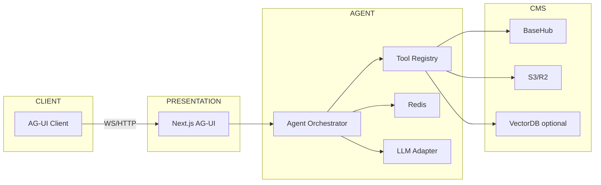
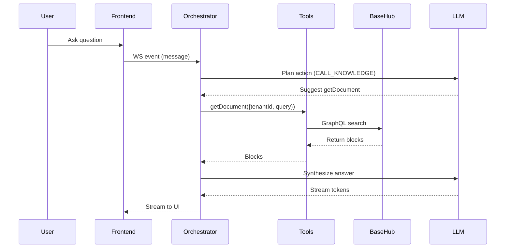

**use-case dan ide SaaS** yang memadukan **AG-UI (Agentic UI)** + **BaseHub (Headless CMS + structured content + API-first)** untuk platform **Smart Business Assistant (SBA)** gaya SaaS multi-tenant.
Saya susun sangat mendalam agar bisa langsung menjadi dasar arsitektur, backlog, dan positioning produk.

---

## Use-Case & Ide SaaS untuk Smart Business Assistant (SBA)

**Platform:** AI-native SaaS multi-tenant
**Komponen utama:**

* **AG-UI** — untuk agentic workflows (UI interaktif, langkah otomatis, suggestion-driven)
* **BaseHub** — headless CMS + structured content + API-first
* **Multi-Tenant Architecture** — segmentasi tenant (UMKM, Startup, Enterprise), isolasi data, konfigurasi tenant

**Visi Utama:**
Menciptakan *business copilots* yang mengotomatisasi proses operasional, menyediakan decision support berbasis AI, dan menjadi pusat operasional (OS) bisnis bagi organisasi skala kecil hingga besar.

---

## 1. Use-Case Kunci SBA

Berikut use-case paling strategis dan berdampak untuk SBA, yang memanfaatkan kekuatan AG-UI + BaseHub + AI.

### A. Business Knowledge Hub & Smart Operating System

* **Knowledge Base Terstruktur**: gunakan BaseHub untuk menyimpan SOP, kebijakan, playbook, template dokumen (HR, finance, ops) dalam bentuk koleksi terstruktur.
* **Guided Workflow lewat AG-UI**: setiap bisnis dapat menjalankan panduan SOP interaktif — misal onboarding karyawan, prosedur operasional, approval — dengan agent yang memandu langkah demi langkah dan memberi sugesti.
* **AI Coach / Decision Advice**: berdasarkan data dan knowledge base, agent bisa memberikan rekomendasi operasional real-time (mis. “ingat persediaan menipis”, “cuti tim melebihi ambang”, “kas mingguan negatif”).
* **Automasi Tugas**: agent bisa membuat otomatis tugas, pengingat, approval, dan mengirim notifikasi sesuai SOP.

**Manfaat utama**:

* Bisnis (terutama UMKM) bisa memiliki struktur operasional dan SOP profesional tanpa biaya berat membangun infrastruktur internal.
* Pemimpin bisnis dan manajer operasional dapat melihat status operasional dengan cepat dan mengambil keputusan berdasarkan insight “business OS”.

**Monetisasi potensial**:

* Paket template industri (mis. ritel, manufaktur, jasa) sebagai add-on premium.
* Automation / agent premium (workflow advanced, AI coach).
* Model multi-workspace (bisnis dengan departemen): tambahkan biaya per workspace.

---

### B. Smart Workflow Automation (AI-First Workflow Builder)

* **Agentic Workflow Nodes**: setiap “node” dalam workflow automation dapat dijalankan lewat agent yang punya UI, menampilkan status, log, rekomendasi, dan kemampuan intervensi.
* **State & Definition di BaseHub**: desain workflow, definisi state, aturan branching, dan template disimpan di BaseHub; bisa dikelola non-teknis.
* **Eksekusi dengan Konteks Live**: saat menjalankan workflow, pengguna bisa menyuntikkan konteks tambahan (komentar, nilai, exception) dan agent bisa menyesuaikan alur.

**Use-case**:

* Onboarding karyawan → pembuatan kontrak + dokumen HR + approval
* Izin cuti → pengajuan, persetujuan / penolakan, notifikasi
* Invoice → reminder → follow-up → eskalasi ke agen
* Intake proyek → generate project plan otomatis → assign task

**Value proposition**:

* No-code / low-code automation, tapi dengan kekuatan AI untuk adaptasi dan interaksi manusia.
* Tenant bisa memiliki automatisasi mereka sendiri, dengan state dan definisi di BaseHub — sangat fleksibel dan dapat disesuaikan.

---

### C. AI Copilot untuk Operasional (Finance, HR, Admin, Marketing)

SBA sebagai copilot operasional di berbagai domain:

* **Finance Copilot**:

  * Generate laporan keuangan (cash flow, P&L)
  * Analisis tren keuangan & forecasting
  * Rekomendasi tindakan (mis. cut cost, invest, reorder stok)

* **HR Copilot**:

  * Menjadwalkan wawancara / interview
  * Membuat dokumen HR otomatis (kontrak, NDAs, SP)
  * Analisis performa, engagement, retensi

* **Admin Copilot**:

  * Buat invois / quotation
  * Follow-up klien via email / WhatsApp template
  * Pengingat tugas administratif rutin

* **Marketing Ops Copilot**:

  * Generate rencana mingguan (konten, kampanye)
  * Buat konten posting (artikel, sosial media)
  * Atur jadwal publikasi & automasi

**Mekanisme**:

* AG-UI menyajikan panel asisten berbasis tugas (task-driven), agent menyarankan langkah dan memungkinkan pengguna menyetujui / mengedit / menjalankan tindakan.
* BaseHub menyimpan data konten agent (template, rules, histori) dan knowledge terkait domain.

---

### D. Data Integration Hub (SBA Connector)

SBA sebagai “hub integrasi” untuk data bisnis:

* **Konfigurasi Connector di BaseHub**: tenant menyimpan schema mapping, credential provider, aturan sinkronisasi di BaseHub sebagai koleksi terstruktur.
* **Workflow Agentic untuk Import / Export**: AG-UI menampilkan UI untuk proses setup integrasi (setting koneksi, mapping field, scheduling) dan agent memandu dan mengautomasi alur sinkronisasi.

**Integrasi target**:

* Marketplace: Tokopedia, Shopee
* Accounting / Finance: Jurnal, Accurate, Kledo, QuickBooks
* Payment: Midtrans, Xendit
* CRM: HubSpot, Pipedrive
* Messaging / Notifikasi: WhatsApp Cloud API, Email

**Monetisasi**:

* Charge connector per penggunaan (sync volume)
* Biaya setup / premium connector (mis. connector enterprise, custom mapping)

---

### E. Smart Document Engine

Mengautomasi pembuatan dokumen bisnis melalui AI + template:

* **Template di BaseHub**: SOP, kontrak, quotation, invoice, form HR, perjanjian, dll. disimpan sebagai konten terstruktur.
* **Agentic Editor UI**: AG-UI panel untuk membuat dokumen — pengguna mengisi dengan panduan agen, agent menyarankan teks, mengisi otomatis, dan menyesuaikan dengan data tenant.
* **Approval Workflow**: Setelah draft dibuat, agentic workflow untuk review, persetujuan, revisi, dan penerbitan.

**Use-case**:

* Onboarding HR → generate kontrak kerja + NDA
* Penawaran sales → buat quotation otomatis berdasarkan data produk
* Dokumen legal reguler (SOP internal, kebijakan)
* Form internal seperti formulir cuti, reimbursement

---

### F. Intelligent Dashboard & Business Observability

* **Real-time Business Pulse**: dashboard interaktif yang menunjukkan metrik operasional penting: sales, stok, keuangan, tugas, risiko.
* **Agentic Insight Panels**: agent di AG-UI menyajikan analisis (mis. “cash diprediksi negatif minggu depan”, “stok X mendekati minimum”), dengan rekomendasi langkah (mis. reorder, penghematan, kampanye penjualan).
* **Anomaly Alerts & Fix Workflow**: ketika ada anomali (penurunan pendapatan, stok habis), agent bisa menyuguhkan workflow step-by-step untuk mitigasi (ex: buat task reorder, kirim notifikasi supplier).

---

## 2. Modul Vertikal / Produk Turunan (SaaS Vertikal)

Berikut modul atau vertikal yang dapat dikembangkan di atas platform inti SBA untuk segmen berbeda:

1. **SBA-HR**

   * Automasi onboarding, form HR, attendance reconciliation, dokumen HR, performance insights, payroll advisor.

2. **SBA-Finance**

   * Ledger importer, cash-flow advisor, invoice automation, ringkasan harian, forecasting.

3. **SBA-SalesOps**

   * Mini CRM, lead health assessment, qualification AI, automated proposal, playbook sales (SOP + konten BaseHub).

4. **SBA-Ops / SBOps**

   * Smart SOP builder, task orchestration, scoring operasional (efisiensi, risiko), incident business responder (mis. operasional, bukan IT).

5. **SBA-Docs**

   * Hub template dokumen, agentic document creation, form completion automatis, document approval workflows.

6. **SBA-Integration Hub**

   * Portal connector: no-code schema mapping + per-tenant data flows + sync management.

---

## 3. Keunggulan Arsitektur (Kombinasi AG-UI + BaseHub)

| **Fitur**              | **Kekuatan AG-UI**                           | **Kekuatan BaseHub**              |
| ---------------------- | -------------------------------------------- | --------------------------------- |
| Alur Dinamis           | Ya — UI agentic, interaktif                  | —                                 |
| Orkestrasi Agen        | Ya — agent step-by-step, intervensi pengguna | —                                 |
| Konten Bisnis / Aturan | —                                            | Ya — SOP, template, aturan, state |
| Persistensi State      | UI-run state                                 | Koleksi state + logs di BaseHub   |
| Multi-Tenant           | Isolasi agent UI per tenant                  | Konten + konfigurasi per tenant   |
| Konfigurasi            | UI-driven agent / run                        | Config di CMS, bisa versioning    |

Kombinasi ini memungkinkan SBA menjadi platform yang adaptif, kontekstual, dan berpengetahuan, sekaligus menyimpan memori bisnis di BaseHub.

---

## 4. Positioning & Segmentasi Pasar

**Target Segmen:**

1. **UMKM** — belum punya sistem operasi internal, butuh SOP, workflow, dokumentasi tanpa tim IT besar.
2. **Startup** — butuh automasi dan integrasi cepat, workflow untuk HR, finance, penjualan.
3. **Enterprise Lite** — departemen kecil di perusahaan besar yang butuh copilots & dashboard operasional.
4. **Skala Internasional** — BaseHub API-first dan AG-UI fleksibel mendukung multi-bahasa dan konfigurasi lintas-region.

**Nilai Kompetitif Unik:**

* “AI Copilot + OS bisnis” (lebih dari sekadar dokumentasi / workflow engine)
* Modular vertikal (HR, Finance, Sales) yang dibangun di atas satu platform
* Integrasi data + tool dengan UI adaptif untuk setup integrasi (AG-UI + BaseHub)
* Memory bisnis terstruktur: SOP, hasil keputusan, state workflow tersimpan dan bisa digunakan ulang

---

## 5. Tantangan & Mitigasi

1. **Isolasi Multi-Tenant**

   * Pastikan konten BaseHub, agent run, state agent benar-benar scoped per tenant
   * Role-based access control (RBAC) kuat untuk konfigurasi dan agent execution

2. **Integrasi Connector**

   * API provider bisa berubah → desain connector adapter layer yang mudah di-update
   * Logging dan observability untuk semua sinkronisasi integrasi

3. **Agent Hallucination / Keandalan AI**

   * Gunakan BaseHub sebagai ground truth: agent refer ke konten BaseHub untuk rekomendasi
   * Validasi user-intervensi di alur UI (user approve suggestions)
   * Simpan histori tindakan + keputusan agent untuk audit dan pembelajaran ulang

4. **UX Kompleksitas**

   * Meski agentic UI powerful, harus tetap intuitif dan dapat diprediksi
   * Desain template UI agar pengguna dapat mengikuti dengan mudah (mis. wizard, panel step-by-step)

---

## 6. Ide Tambahan untuk Diferensiasi

* **Business Memory Graph**
  Bangun knowledge graph dari: dokumen SOP, email, workflow, tugas, keputusan → membuat “riwayat bisnis pintar” yang bisa ditanyakan agent.

* **Operational Playbook Generator**
  Pengguna masukkan masalah (“cash flow rendah”, “penjualan stagnan”, “turnover karyawan tinggi”) → agent menyusun playbook taktikal untuk perbaikan operasional lengkap dengan SOP, tugas, rekomendasi.

* **Panel AG-UI Adaptif**
  UI panel berubah sendirinya saat event penting: mis. forecast cash negatif → panel rekomendasi “buat rencana penghematan” atau “cari pendanaan”, stok rendah → “hubungi pemasok / reorder”.

* **Behavioral Model Tenant**
  Agent belajar dari pola tenant: berapa sering mereka menjalankan workflow, tipe dokumen yang sering dibuat, prioritas integrasi → lalu bisa menyarankan automasi baru yang spesifik untuk tenant tersebut.

---

## 7. Roadmap Tingkat Tinggi (Contoh Prioritas Produk)

* **MVP (0-3 bulan):**

  * Membuat BaseHub untuk koleksi SOP, template dokumen, automation rules
  * AG-UI dasar: agent run viewer + wizard workflow
  * AI planner agen sederhana (task + step suggestion)
  * Modul dokumentasi (template invoice, form HR)

* **Fase 2 (3-6 bulan):**

  * Integrasi connector dasar (contoh: spreadsheet / API)
  * Workflow automation no-code (onboarding, izin, invoice)
  * Dashboard operasional (pulse untuk keuangan dan tugas)
  * Copilot HR dasar (agent membuat dokumen HR)

* **Fase 3 (6-12 bulan):**

  * Insight & rekomendasi AI (forecast keuangan, risiko)
  * Modul vertikal: Finance Copilot, SalesOps Copilot
  * Memory graph & playbook generator
  * Automasi lanjutan + approval workflow

---

Jika mau, saya bisa transformasi ide ini **menjadi dokumen arsitektur (C4)** + **backlog Epic/User Story** agar bisa langsung diintegrasikan ke dalam roadmap teknis tim Anda. Mau saya buat sekarang?

---

## 8. Arsitektur Hybrid (FSD/DDD + Atomic Design)

- Frontend mengikuti FSD: `app → processes → widgets → features → entities → shared` dengan lint boundary ketat dan dependency satu arah.
- Backend mengikuti DDD: bounded contexts Conversation, Knowledge/CMS, Document, Workflow/Task, Tenant/Billing, Observability/Security; aggregate roots dan repository interfaces jelas.
- UI menggunakan Atomic Design: atoms → molecules → organisms → templates; design tokens dan theming per-tenant.
- Multi-tenant: JWT + RBAC + Postgres RLS; BaseHub namespacing per-tenant; observability bertag `tenantId`.

### Diagram Alur Data (Mermaid)

### Sequence AG-UI → BaseHub (Mermaid)

---

## 9. Struktur Folder Dokumentasi

- `.trae/documents/Smart Business Assistant/core` — domain models, bounded contexts, ADR singkat.
- `.trae/documents/Smart Business Assistant/features` — use-case AG-UI: chat, document engine, workflow, integration, dashboards.
- `.trae/documents/Smart Business Assistant/shared` — authN/authZ, multi-tenant, observability, error handling, idempotency, konvensi refactoring.
- `.trae/documents/Smart Business Assistant/apps` — panduan app-level (web/admin/api/worker), peta dependensi.
- `.trae/documents/Smart Business Assistant/docs` — diagram, OpenAPI, test plan, contribution guide, runbooks.

---

## 10. Spesifikasi API & Kontrak Antar-Modul

- Orchestrator:
  - `POST /api/v1/session` → `{ sessionId }`
  - `WS /api/v1/session/{sessionId}` → streaming events AG-UI
- Tool interfaces:
  - KnowledgeTool: `searchBlocks(query, tenantId, topK?)`
  - RenderTool: `renderDocument(templateId, data) → { url, commitId }`
  - TaskTool: `createTask({ tenantId, title, assignee, metadata })`
  - VectorTool (opsional): `upsertEmbeddings`, `semanticSearch`
- Validasi: Zod schemas di boundary; idempotency-key untuk side effects; OpenAPI + SDK generated.
- Observability: OpenTelemetry tracing; Prometheus metrics `tool_calls_total{tool}`, `session_active`, `llm_tokens` bertag `tenant`.

---

## 11. UI/UX Requirements

- Konsistensi design system dengan Atomic Design; aksesibilitas (WCAG, keyboard, ARIA).
- Responsive mobile-first; theming per-tenant via design tokens.
- Prototype interaktif alur utama: chat → tool call → document generation → approval → storage.
- Dokumentasi pola interaksi: streaming tokens, interrupts/human-in-loop, undo windows.

---

## 12. Deliverables & Artefak

- Diagram dataflow, sequence, dan topology deployment (Mermaid).
- Spesifikasi API & kontrak tools (OpenAPI + Zod + SDK) dan model error.
- Panduan pengembangan & kontribusi: lint boundaries, TS/Zod-first, PR checklist.
- Test plan & acceptance: unit/contract/integration/E2E/perf/security.
- Boilerplate monorepo: struktur apps/packages, scripts dev/build/test, env samples, docker-compose local stack.
- Konfigurasi TurboRepo optimal: pipeline build/test/type-check/lint/dev, outputs `.next/**`, `dist/**`, cache & persistent dev.

Referensi repo: konfigurasi TurboRepo di `turbo.json` (`build`, `dev` persistent, `type-check`, `test`, outputs `.next/**`, `dist/**`, exclude `.next/cache/**`) selaras dengan rekomendasi.

---

## 13. Proses Implementasi

- Setup workspace: TypeScript strict, pnpm, `tsconfig.base.json` dengan alias `@sba/*`.
- CI/CD: workflows PR (install/lint/test/build/preview), preview deploy (frontend Vercel/edge; backend k8s ephemeral), CD staging→prod canary.
- Dokumentasi otomatis: generate OpenAPI→SDK; publish docs ke `/docs` + Storybook; ADR template.
- Contoh fitur kunci: demo E2E AG-UI chat → getDocument(BaseHub) → renderDocument → approval (mock/sandbox).

---

## 14. Testing & Kriteria Penerimaan

- Unit: packages (entities/services/tools) dengan coverage target ≥80%.
- Contract: tools ↔ orchestrator via OpenAPI/Zod; negative paths & idempotency.
- Integration: BaseHub sandbox & Postgres/Redis test containers.
- E2E: Playwright untuk chat→tool→render; perf: k6 throughput token & latensi tool; security: RLS tests.
- Acceptance: demo berjalan, metrik observability tampil, error rate rendah, artefak lengkap.

---

## 15. Timeline & Metodologi

- Phase A — Foundation: scaffold monorepo, TurboRepo, packages & CI dasar.
- Phase B — Core MVP: AG-UI chat + KnowledgeTool + streaming WS + logging.
- Phase C — Docs & Workflow: render worker, task service, approvals, audit.
- Phase D — Multi-Tenant Harden: RLS, provisioning, billing, quotas & rate-limit.
- Pendekatan Agile/RAD: iterasi cepat dengan prototyping; refactoring berkala sesuai prinsip clean code.

---

## 16. Verification Summary (Implementasi Saat Ini)

- Pola UI/UX dan aksesibilitas (ARIA labels, live regions, keyboard navigation) telah diterapkan pada halaman Chat dan komponen UI.
- Unit tests `apps/web`: 97/97 lulus; lint dan type-check hijau.
- E2E Playwright (Chromium/Firefox/WebKit) untuk alur Chat lulus: verifikasi landmark, input terlabel, tombol “Go to latest”, dan shortcut `g`.
- Dokumen pendukung:
  - UI/UX pola dan checklist: `.trae/documents/Smart Business Assistant/UI_UX.md`
  - Acceptance criteria: `.trae/documents/Smart Business Assistant/Acceptance.md`
  - User manual ringkas: `.trae/documents/Smart Business Assistant/USER_MANUAL.md`
  - Coverage: Vitest coverage diaktifkan dengan threshold `lines/statements/functions ≥ 80%`, `branches ≥ 70%` untuk `apps/web`.

Catatan teknis: konfigurasi `viewport` Next telah dipindah ke ekspor `viewport` di `apps/web/src/app/layout.tsx` untuk menghilangkan peringatan dan mengikuti pedoman resmi.

---

## 17. SaaS Pricing, Onboarding, dan Roles

- Pricing tiers:
  - Starter (UMKM): batas workspace, agent dasar, template umum.
  - Growth (Startup): multi-workspace, integrasi dasar, automasi workflow, prioritas dukungan.
  - Pro (Enterprise Lite): RBAC lengkap, audit trail, connectors premium, SLA.
- Onboarding alur:
  - Provisioning tenant → pilih template industri → wizard konfigurasi (brand, tokens, connectors) → panduan first-run di AG-UI.
  - Checklist a11y dalam onboarding: semua input berlabel, keyboard navigable, live region untuk status provisioning.
- Roles (RBAC): Owner, Admin, Operator, Viewer.
  - Owner: billing, provisioning tenant, quota.
  - Admin: konfigurasi connectors, SOP, workflows.
  - Operator: menjalankan workflows, mengelola dokumen.
  - Viewer: akses read-only dashboard & laporan.
Smart Business Assistant (SBA) – Use‑Case, Arsitektur, dan Implementasi UI/UX

Ringkasan
- SBA memadukan client event‑driven AG‑UI, komponen UI React, dan monitoring real‑time.
- Transport didukung HTTP, SSE, dan WebSocket untuk chat, streaming reasoning, dan notifikasi.
- Fokus UI/UX: interaksi streaming halus, indikator koneksi, status tugas, dan observabilitas.

Use‑Case Utama
- Customer Support: agen menjawab pertanyaan, meringkas percakapan, dan membuat tiket.
- Sales Copilot: agen menyarikan prospek, menyusun email follow‑up, dan mencatat CRM.
- Operations: agen memantau metrik sistem, mengirim alert, dan menyarankan aksi otomatis.

Alur Interaksi
- Pengguna mengirim pesan; client (`AguiClient`) menyalurkan ke API dan/atau stream SSE.
- Event reasoning dikirim via SSE/WS: `REASONING_MESSAGE_CONTENT` (delta), `REASONING_MESSAGE_END` (final).
- UI menampilkan delta secara progresif pada dialog agen; selesai event memindahkan delta ke daftar pesan.

Komponen & Modul
- AGAgentDialog: dialog interaksi agen dengan streaming delta dan status (processing/completed/error).
- MonitoringDashboard: panel kesehatan sistem dan alert dengan pembaruan berkala.
- DecisionEngine: evaluasi rule sederhana dan eksekusi tindakan (scale up/down, reset, alert).
- WebSocketProvider: heartbeat ping/pong, backoff, subscribe/publish, metrik koneksi.

Kontrak Event
- Sumber kebenaran tipe event memakai `EventSchema` (Zod) AG‑UI untuk konsistensi lintas paket.
- Message input memakai `UserMessageSchema` untuk payload user.
- Event utama: `REASONING_*`, `RUN_FINISHED`, `META`, `agent:*`, `tool:*`, `stream:*`.

Implementasi Client
- HTTP: `sendMessage(message, context)` untuk respons sinkron.
- SSE: `streamEventsSSE(userMessage)` untuk event terstruktur; parser aman `data:` dengan validasi Zod.
- WS: `connectWS(token)` dan `onEvent(cb)` untuk event real‑time dan heartbeat.

Prinsip UI/UX
- Streaming: tampilkan delta instan; gabungkan pada akhir menjadi satu pesan final.
- Status Koneksi: indikator Connected/Disconnected, retry backoff, dan latency.
- Error Handling: pesan jelas, retry yang aman, tanpa kebocoran listener.
- A11y: tombol dan daftar dengan role/aria, keyboard operable.

Testing
- Unit: parser SSE, hooks event, komponen dialog.
- Integrasi: validasi kontrak event terhadap `EventSchema` dan rendering delta.
- Target coverage ≥ 85% untuk modul client dan AG‑UI inti.

Operasional
- Skrip monorepo: `type-check`, `lint`, `test:ci` dengan Turborepo.
- Storybook untuk eksplorasi UI (paket `packages/ui`).

Roadmap
- Integrasi agent Mastra sesuai quickstart AG‑UI untuk CLI mode.
- Pengayaan Monitoring (grafik performa, circuit breaker nyata, autoscaling dinamis).
- Penguatan keamanan: kontrol token WS/SSE, sanitasi payload, rate limit event.
