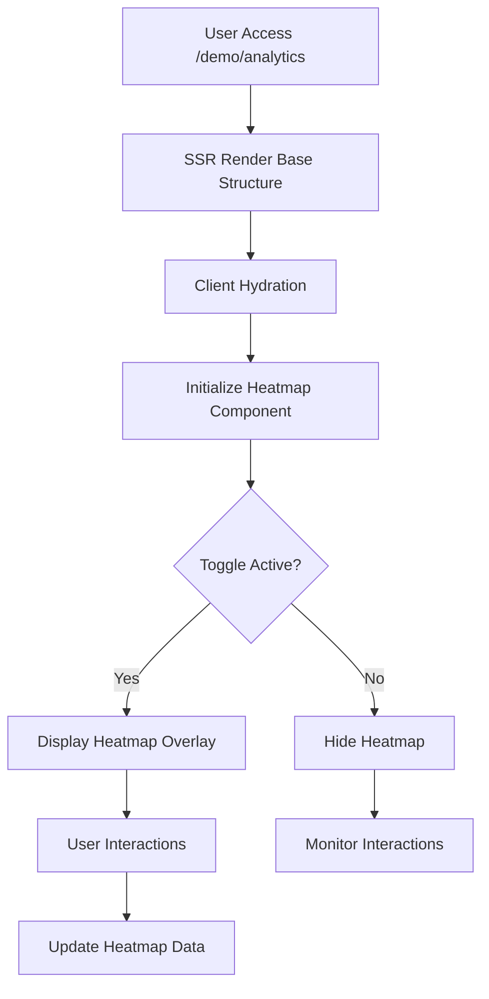

## 1. Product Overview
Fitur Analytics Heatmap menyediakan visualisasi interaksi pengguna pada halaman web melalui peta warna (heatmap). Toggle memungkinkan pengguna mengaktifkan/menonaktifkan fitur ini, dan desain SSR-safe memastikan kompatibilitas dengan server-side rendering untuk performa optimal dan SEO yang baik.

Target pengguna: Developer, product manager, dan UX researcher yang ingin memahami pola interaksi pengguna pada website mereka.

## 2. Core Features

### 2.1 User Roles
| Role | Registration Method | Core Permissions |
|------|---------------------|------------------|
| Viewer | Auto-assigned | Melihat heatmap, toggle fitur |
| Admin | Backend assignment | Konfigurasi heatmap, akses data mentah |

### 2.2 Feature Module
Fitur Analytics Heatmap terdiri dari halaman berikut:
1. **Demo Analytics Page**: Menampilkan heatmap overlay, toggle kontrol, dan informasi metrik.
2. **Heatmap Configuration**: Panel untuk mengatur sensitivity dan jenis heatmap (click, move, scroll).

### 2.3 Page Details
| Page Name | Module Name | Feature description |
|-----------|-------------|---------------------|
| Demo Analytics | Heatmap Display | Menampilkan overlay heatmap dengan gradasi warna berdasarkan intensitas interaksi pengguna |
| Demo Analytics | Toggle Control | Switch on/off untuk mengaktifkan/menonaktifkan tampilan heatmap secara real-time |
| Demo Analytics | SSR Wrapper | Komponen wrapper yang memastikan heatmap hanya dirender di client untuk kompatibilitas SSR |
| Demo Analytics | Metric Panel | Menampilkan statistik interaksi: total clicks, unique interactions, heat intensity |
| Demo Analytics | Heatmap Type Selector | Dropdown untuk memilih jenis heatmap: click, mouse movement, atau scroll depth |
| Demo Analytics | Sensitivity Slider | Slider untuk mengatur sensitivitas warna heatmap (low, medium, high) |

## 3. Core Process
**User Flow:**
1. Pengguna mengunjungi halama /demo/analytics
2. Sistem melakukan SSR untuk struktur dasar halaman
3. Di client, komponen heatmap diinisialisasi secara dinamis
4. Pengguna dapat men-toggle heatmap visibility menggunakan switch
5. Pengguna dapat mengubah tipe heatmap dan sensitivity melalui kontrol panel
6. Heatmap di-update secara real-time berdasarkan interaksi yang terekam

## 4. User Interface Design

### 4.1 Design Style
- **Primary Color**: #FF6B35 (orange untuk heatmap intensity tinggi)
- **Secondary Color**: #F7931E (orange-yellow untuk intensity medium)
- **Button Style**: Rounded corners (8px radius), flat design
- **Font**: Inter, 14px untuk kontrol, 16px untuk metrik
- **Layout**: Overlay absolute positioning, card-based control panel
- **Icon Style**: Material Design icons, outline style

### 4.2 Page Design Overview
| Page Name | Module Name | UI Elements |
|-----------|-------------|-------------|
| Demo Analytics | Heatmap Overlay | Canvas semi-transparent dengan gradient warna dari transparan ke orange/red berdasarkan intensity |
| Demo Analytics | Toggle Switch | Switch modern dengan animasi smooth, warna hijau saat active, ukuran 44x24px |
| Demo Analytics | Control Panel | Card putih dengan shadow medium, position: fixed di kanan bawah, padding 16px |
| Demo Analytics | Metric Display | Text monospace untuk angka, warna abu-abu gelap, update real-time dengan animasi fade |
| Demo Analytics | Type Selector | Native select dropdown dengan custom arrow, warna border #E5E7EB |

### 4.3 Responsiveness
Desktop-first design dengan mobile-adaptive breakpoints:
- Desktop: Control panel di kanan bawah, heatmap full viewport
- Tablet: Control panel tetap di kanan bawah, ukuran lebih kecil
- Mobile: Control panel menjadi bottom sheet yang dapat di-collapse
- Touch interaction: Toggle dan slider dioptimalkan untuk sentuhan dengan area klik minimum 44x44px