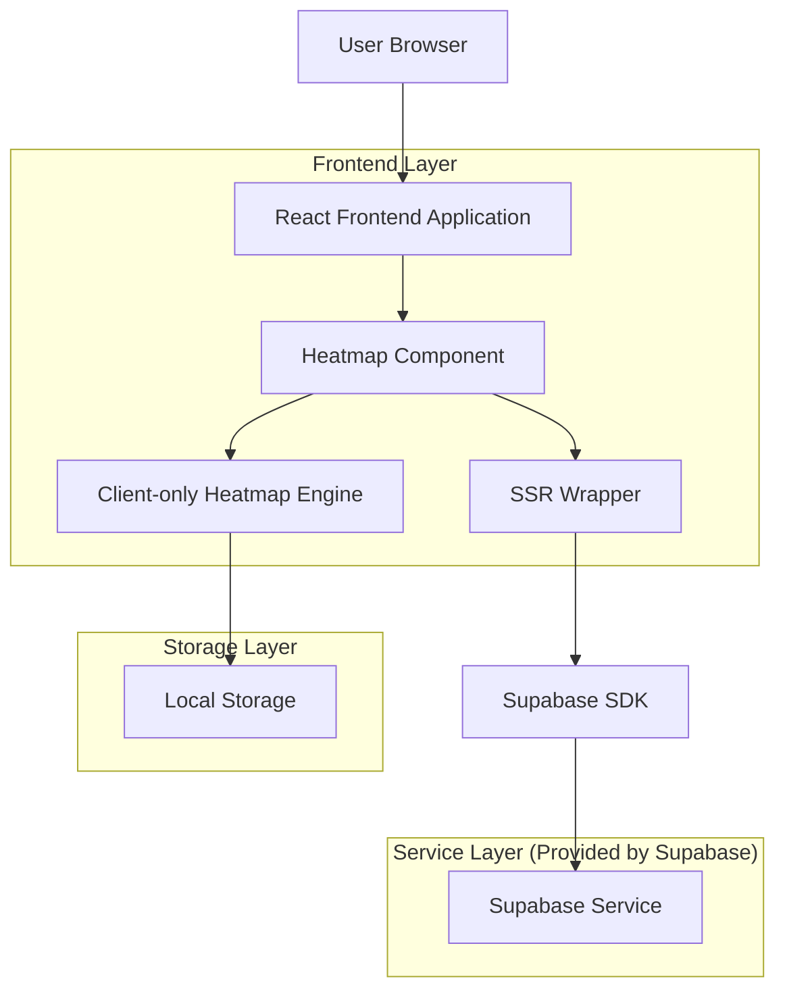
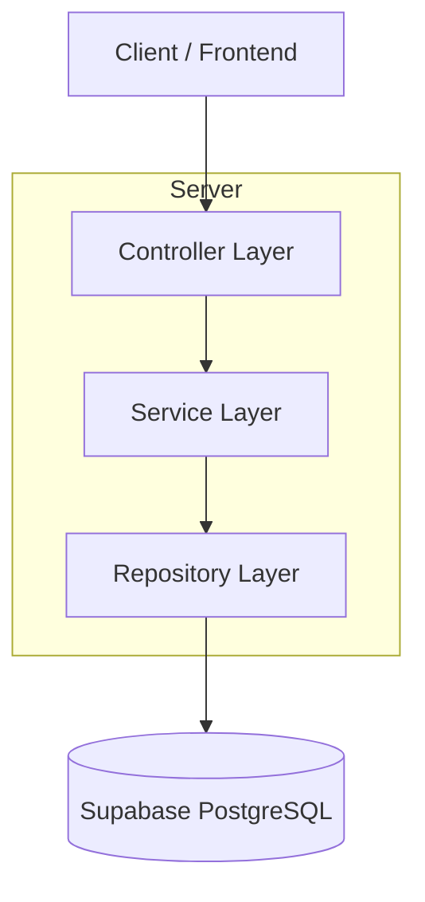
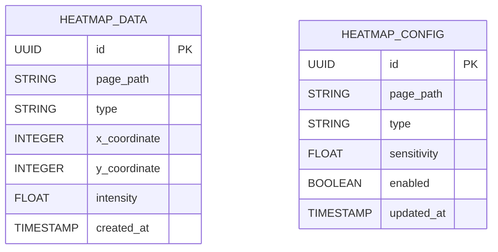

## 1. Architecture design



## 2. Technology Description
- Frontend: React@18 + tailwindcss@3 + vite
- Initialization Tool: vite-init
- Backend: Supabase (PostgreSQL)
- Heatmap Library: custom implementation using HTML5 Canvas
- State Management: React Context + useReducer
- TypeScript: strict mode enabled

## 3. Route definitions
| Route | Purpose |
|-------|---------|
| /demo/analytics | Demo page untuk menampilkan heatmap dengan toggle kontrol |
| /api/heatmap/data | Endpoint untuk mengambil data interaksi pengguna |
| /api/heatmap/config | Endpoint untuk konfigurasi heatmap sensitivity dan type |

## 4. API definitions

### 4.1 Core API

**Get Heatmap Data**
```
GET /api/heatmap/data
```

Request Parameters:
| Param Name| Param Type  | isRequired  | Description |
|-----------|-------------|-------------|-------------|
| page_path | string      | true        | Path halaman yang ingin dianalisis |
| date_from | string      | false       | Tanggal mulai (ISO 8601) |
| date_to   | string      | false       | Tanggal akhir (ISO 8601) |
| type      | string      | false       | Tipe heatmap: click, move, scroll |

Response:
| Param Name| Param Type  | Description |
|-----------|-------------|-------------|
| data      | array       | Array of coordinate points dengan intensity |
| total     | number      | Total interactions |
| type      | string      | Type of heatmap data |

Example Response:
```json
{
  "data": [
    {"x": 150, "y": 200, "intensity": 0.8},
    {"x": 300, "y": 150, "intensity": 0.5}
  ],
  "total": 1250,
  "type": "click"
}
```

## 5. Server architecture diagram



## 6. Data model

### 6.1 Data model definition



### 6.2 Data Definition Language

**Heatmap Data Table (heatmap_data)**
```sql
-- create table
CREATE TABLE heatmap_data (
    id UUID PRIMARY KEY DEFAULT gen_random_uuid(),
    page_path VARCHAR(500) NOT NULL,
    type VARCHAR(20) NOT NULL CHECK (type IN ('click', 'move', 'scroll')),
    x_coordinate INTEGER NOT NULL,
    y_coordinate INTEGER NOT NULL,
    intensity FLOAT DEFAULT 0.5 CHECK (intensity >= 0 AND intensity <= 1),
    created_at TIMESTAMP WITH TIME ZONE DEFAULT NOW()
);

-- create indexes
CREATE INDEX idx_heatmap_data_page_path ON heatmap_data(page_path);
CREATE INDEX idx_heatmap_data_type ON heatmap_data(type);
CREATE INDEX idx_heatmap_data_created_at ON heatmap_data(created_at DESC);

-- grant permissions
GRANT SELECT ON heatmap_data TO anon;
GRANT ALL PRIVILEGES ON heatmap_data TO authenticated;
```

**Heatmap Configuration Table (heatmap_config)**
```sql
-- create table
CREATE TABLE heatmap_config (
    id UUID PRIMARY KEY DEFAULT gen_random_uuid(),
    page_path VARCHAR(500) UNIQUE NOT NULL,
    type VARCHAR(20) NOT NULL DEFAULT 'click' CHECK (type IN ('click', 'move', 'scroll')),
    sensitivity FLOAT DEFAULT 0.5 CHECK (sensitivity >= 0 AND sensitivity <= 1),
    enabled BOOLEAN DEFAULT true,
    updated_at TIMESTAMP WITH TIME ZONE DEFAULT NOW()
);

-- create indexes
CREATE INDEX idx_heatmap_config_page_path ON heatmap_config(page_path);
CREATE INDEX idx_heatmap_config_enabled ON heatmap_config(enabled);

-- grant permissions
GRANT SELECT ON heatmap_config TO anon;
GRANT ALL PRIVILEGES ON heatmap_config TO authenticated;
```

## 7. SSR-Safe Implementation

### 7.1 Client Hydration Strategy
```typescript
// components/HeatmapSSRWrapper.tsx
const HeatmapSSRWrapper: React.FC = () => {
  const [isClient, setIsClient] = useState(false);
  
  useEffect(() => {
    setIsClient(true);
  }, []);
  
  if (!isClient) {
    return <div className="heatmap-placeholder" />;
  }
  
  return <HeatmapComponent />;
};
```

### 7.2 Dynamic Import Pattern
```typescript
// Lazy load heatmap engine to prevent SSR issues
const HeatmapEngine = dynamic(
  () => import('../lib/heatmap-engine'),
  { 
    ssr: false,
    loading: () => <div className="heatmap-loading" />
  }
);