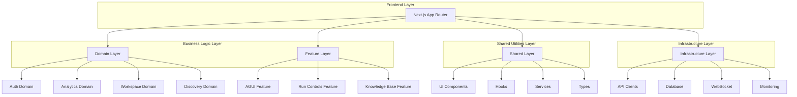
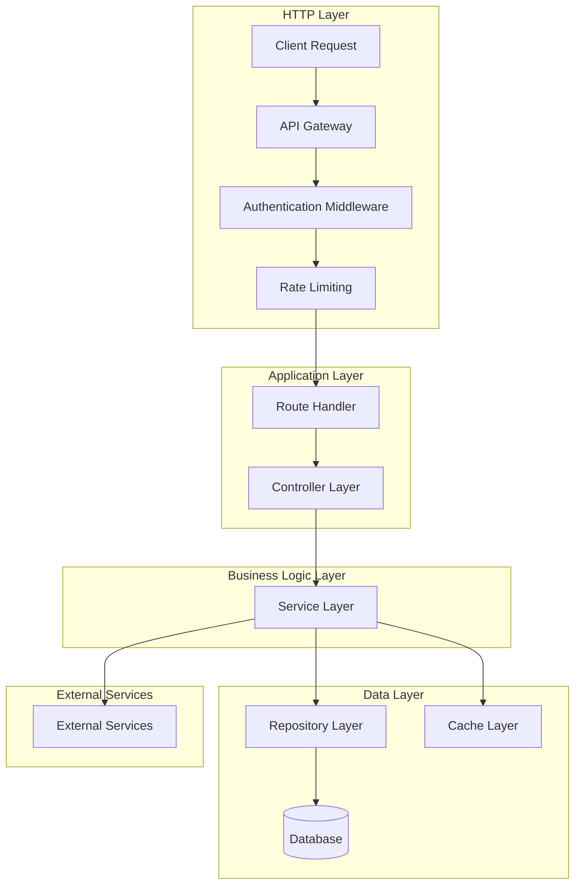
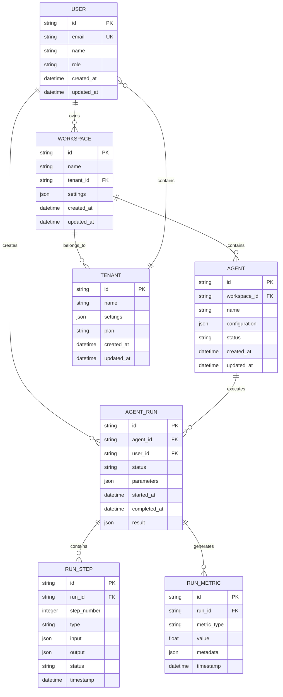
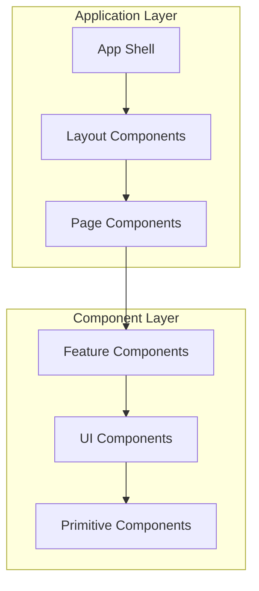
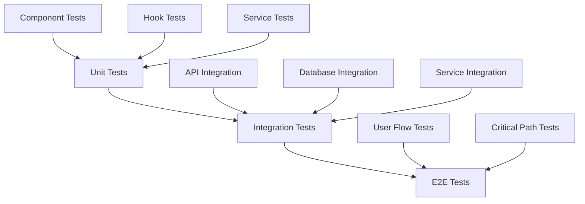

# Angular-Inspired Technical Architecture for Next.js Application

## 1. Architecture Design



## 2. Technology Description

### Core Technologies
- **Frontend Framework**: Next.js 14+ with App Router
- **UI Framework**: React 18+ with TypeScript
- **Styling**: Tailwind CSS + CSS Modules
- **State Management**: Zustand + React Context
- **Data Fetching**: SWR + Server Components
- **Database**: Supabase (PostgreSQL)
- **Real-time**: WebSocket + Server-Sent Events
- **Monitoring**: OpenTelemetry + Custom Metrics

### Development Tools
- **Build Tool**: Next.js built-in (Webpack/Turbopack)
- **Package Manager**: pnpm
- **Testing**: Vitest + React Testing Library
- **Linting**: ESLint + Prettier
- **Type Checking**: TypeScript 5.0+

## 3. Route Definitions

### Authentication Routes
| Route | Purpose | Layout |
|-------|---------|---------|
| `/login` | User authentication | Public layout |
| `/register` | User registration | Public layout |
| `/forgot-password` | Password recovery | Public layout |

### Dashboard Routes
| Route | Purpose | Layout |
|-------|---------|---------|
| `/` | Main dashboard | Authenticated layout |
| `/analytics` | Analytics dashboard | Authenticated layout |
| `/insights` | Insights and reporting | Authenticated layout |
| `/monitoring` | System monitoring | Authenticated layout |
| `/hub` | Integration hub | Authenticated layout |

### Workspace Routes
| Route | Purpose | Layout |
|-------|---------|---------|
| `/workspaces` | Workspace management | Authenticated layout |
| `/workspaces/[id]` | Specific workspace | Authenticated layout |
| `/workspaces/[id]/settings` | Workspace settings | Authenticated layout |

### Discovery Routes
| Route | Purpose | Layout |
|-------|---------|---------|
| `/discovery` | Discovery dashboard | Authenticated layout |
| `/runs` | Run management | Authenticated layout |
| `/runs/[id]` | Run details | Authenticated layout |
| `/run-controls` | Run control panel | Authenticated layout |

### Admin Routes
| Route | Purpose | Layout |
|-------|---------|---------|
| `/admin` | Admin dashboard | Admin layout |
| `/admin/users` | User management | Admin layout |
| `/admin/tenants` | Tenant management | Admin layout |
| `/admin/ux-heatmap` | UX analytics | Admin layout |

## 4. API Definitions

### Core API Endpoints

#### Authentication API
```http
POST /api/auth/login
Content-Type: application/json

{
  "email": "user@example.com",
  "password": "securePassword123"
}
```

Response:
```json
{
  "token": "jwt_token_here",
  "user": {
    "id": "user_id",
    "email": "user@example.com",
    "role": "user"
  }
}
```

#### Analytics API
```http
GET /api/analytics/metrics?startDate=2024-01-01&endDate=2024-12-31
Authorization: Bearer jwt_token_here
```

Response:
```json
{
  "metrics": {
    "totalRuns": 1500,
    "successRate": 0.85,
    "averageDuration": 120,
    "topAgents": [
      { "name": "Agent1", "count": 450 },
      { "name": "Agent2", "count": 320 }
    ]
  }
}
```

#### Agent Control API
```http
POST /api/agent/control
Authorization: Bearer jwt_token_here
Content-Type: application/json

{
  "action": "start",
  "agentId": "agent_123",
  "parameters": {
    "timeout": 300,
    "retryCount": 3
  }
}
```

Response:
```json
{
  "status": "started",
  "runId": "run_456",
  "estimatedDuration": 180
}
```

### WebSocket API
```typescript
// Connection
ws://localhost:3000/api/agent/ws

// Message Types
interface AgentMessage {
  type: 'status' | 'log' | 'error' | 'complete';
  runId: string;
  timestamp: string;
  data: any;
}

// Subscribe to run updates
{
  "action": "subscribe",
  "runId": "run_456"
}
```

## 5. Server Architecture Diagram



## 6. Data Model

### Entity Relationship Diagram



### Database Schema Definitions

#### Users Table
```sql
CREATE TABLE users (
    id UUID PRIMARY KEY DEFAULT gen_random_uuid(),
    email VARCHAR(255) UNIQUE NOT NULL,
    name VARCHAR(255) NOT NULL,
    password_hash VARCHAR(255),
    role VARCHAR(50) DEFAULT 'user' CHECK (role IN ('user', 'admin', 'super_admin')),
    tenant_id UUID REFERENCES tenants(id),
    metadata JSONB DEFAULT '{}',
    created_at TIMESTAMP WITH TIME ZONE DEFAULT NOW(),
    updated_at TIMESTAMP WITH TIME ZONE DEFAULT NOW()
);

CREATE INDEX idx_users_email ON users(email);
CREATE INDEX idx_users_tenant_id ON users(tenant_id);
```

#### Workspaces Table
```sql
CREATE TABLE workspaces (
    id UUID PRIMARY KEY DEFAULT gen_random_uuid(),
    name VARCHAR(255) NOT NULL,
    tenant_id UUID NOT NULL REFERENCES tenants(id),
    settings JSONB DEFAULT '{}',
    metadata JSONB DEFAULT '{}',
    created_at TIMESTAMP WITH TIME ZONE DEFAULT NOW(),
    updated_at TIMESTAMP WITH TIME ZONE DEFAULT NOW()
);

CREATE INDEX idx_workspaces_tenant_id ON workspaces(tenant_id);
```

#### Agents Table
```sql
CREATE TABLE agents (
    id UUID PRIMARY KEY DEFAULT gen_random_uuid(),
    workspace_id UUID NOT NULL REFERENCES workspaces(id),
    name VARCHAR(255) NOT NULL,
    configuration JSONB NOT NULL,
    status VARCHAR(50) DEFAULT 'inactive' CHECK (status IN ('active', 'inactive', 'error')),
    metadata JSONB DEFAULT '{}',
    created_at TIMESTAMP WITH TIME ZONE DEFAULT NOW(),
    updated_at TIMESTAMP WITH TIME ZONE DEFAULT NOW()
);

CREATE INDEX idx_agents_workspace_id ON agents(workspace_id);
CREATE INDEX idx_agents_status ON agents(status);
```

#### Agent Runs Table
```sql
CREATE TABLE agent_runs (
    id UUID PRIMARY KEY DEFAULT gen_random_uuid(),
    agent_id UUID NOT NULL REFERENCES agents(id),
    user_id UUID NOT NULL REFERENCES users(id),
    status VARCHAR(50) DEFAULT 'pending' CHECK (status IN ('pending', 'running', 'completed', 'failed', 'cancelled')),
    parameters JSONB DEFAULT '{}',
    result JSONB DEFAULT '{}',
    started_at TIMESTAMP WITH TIME ZONE,
    completed_at TIMESTAMP WITH TIME ZONE,
    duration_seconds INTEGER,
    metadata JSONB DEFAULT '{}',
    created_at TIMESTAMP WITH TIME ZONE DEFAULT NOW()
);

CREATE INDEX idx_agent_runs_agent_id ON agent_runs(agent_id);
CREATE INDEX idx_agent_runs_user_id ON agent_runs(user_id);
CREATE INDEX idx_agent_runs_status ON agent_runs(status);
CREATE INDEX idx_agent_runs_created_at ON agent_runs(created_at DESC);
```

#### Run Steps Table
```sql
CREATE TABLE run_steps (
    id UUID PRIMARY KEY DEFAULT gen_random_uuid(),
    run_id UUID NOT NULL REFERENCES agent_runs(id),
    step_number INTEGER NOT NULL,
    type VARCHAR(100) NOT NULL,
    status VARCHAR(50) DEFAULT 'pending' CHECK (status IN ('pending', 'running', 'completed', 'failed')),
    input JSONB DEFAULT '{}',
    output JSONB DEFAULT '{}',
    error_message TEXT,
    started_at TIMESTAMP WITH TIME ZONE,
    completed_at TIMESTAMP WITH TIME ZONE,
    duration_ms INTEGER,
    metadata JSONB DEFAULT '{}',
    created_at TIMESTAMP WITH TIME ZONE DEFAULT NOW()
);

CREATE INDEX idx_run_steps_run_id ON run_steps(run_id);
CREATE INDEX idx_run_steps_run_step_number ON run_steps(run_id, step_number);
```

#### Run Metrics Table
```sql
CREATE TABLE run_metrics (
    id UUID PRIMARY KEY DEFAULT gen_random_uuid(),
    run_id UUID NOT NULL REFERENCES agent_runs(id),
    metric_type VARCHAR(100) NOT NULL,
    value DECIMAL(10, 6) NOT NULL,
    unit VARCHAR(20),
    metadata JSONB DEFAULT '{}',
    timestamp TIMESTAMP WITH TIME ZONE DEFAULT NOW()
);

CREATE INDEX idx_run_metrics_run_id ON run_metrics(run_id);
CREATE INDEX idx_run_metrics_metric_type ON run_metrics(metric_type);
CREATE INDEX idx_run_metrics_timestamp ON run_metrics(timestamp DESC);
```

## 7. Component Architecture

### Component Hierarchy


### Component Types

#### 1. Layout Components
```typescript
// apps/app/src/shared/components/layouts/DashboardLayout.tsx
interface DashboardLayoutProps {
  children: React.ReactNode;
  sidebar?: React.ReactNode;
  header?: React.ReactNode;
}

export function DashboardLayout({ children, sidebar, header }: DashboardLayoutProps) {
  return (
    <div className="flex h-screen">
      {sidebar && <aside className="w-64 bg-gray-100">{sidebar}</aside>}
      <div className="flex-1 flex flex-col">
        {header && <header className="h-16 bg-white shadow">{header}</header>}
        <main className="flex-1 overflow-auto">{children}</main>
      </div>
    </div>
  );
}
```

#### 2. Feature Components
```typescript
// apps/app/src/domains/analytics/components/AnalyticsDashboard.tsx
interface AnalyticsDashboardProps {
  workspaceId: string;
  dateRange: DateRange;
}

export function AnalyticsDashboard({ workspaceId, dateRange }: AnalyticsDashboardProps) {
  const { data: metrics, isLoading } = useAnalyticsMetrics(workspaceId, dateRange);
  
  if (isLoading) return <LoadingSpinner />;
  
  return (
    <div className="space-y-6">
      <MetricsOverview metrics={metrics.overview} />
      <ChartsGrid charts={metrics.charts} />
      <DataTable data={metrics.detailedData} />
    </div>
  );
}
```

#### 3. UI Components
```typescript
// apps/app/src/shared/components/ui/DataTable.tsx
interface DataTableProps<T> {
  data: T[];
  columns: ColumnDef<T>[];
  onRowClick?: (row: T) => void;
}

export function DataTable<T>({ data, columns, onRowClick }: DataTableProps<T>) {
  const table = useReactTable({
    data,
    columns,
    getCoreRowModel: getCoreRowModel(),
  });
  
  return (
    <div className="rounded-md border">
      <Table>
        <TableHeader>
          {table.getHeaderGroups().map(headerGroup => (
            <TableRow key={headerGroup.id}>
              {headerGroup.headers.map(header => (
                <TableHead key={header.id}>
                  {flexRender(header.column.columnDef.header, header.getContext())}
                </TableHead>
              ))}
            </TableRow>
          ))}
        </TableHeader>
        <TableBody>
          {table.getRowModel().rows.map(row => (
            <TableRow 
              key={row.id}
              onClick={() => onRowClick?.(row.original)}
              className={cn(onRowClick && "cursor-pointer")}
            >
              {row.getVisibleCells().map(cell => (
                <TableCell key={cell.id}>
                  {flexRender(cell.column.columnDef.cell, cell.getContext())}
                </TableCell>
              ))}
            </TableRow>
          ))}
        </TableBody>
      </Table>
    </div>
  );
}
```

## 8. State Management Architecture

### Global State Structure
```typescript
// apps/app/src/shared/store/appStore.ts
interface AppState {
  // User state
  user: User | null;
  isAuthenticated: boolean;
  
  // UI state
  sidebarCollapsed: boolean;
  theme: 'light' | 'dark';
  
  // Domain state
  currentWorkspace: Workspace | null;
  workspaces: Workspace[];
  
  // Actions
  setUser: (user: User | null) => void;
  toggleSidebar: () => void;
  setTheme: (theme: 'light' | 'dark') => void;
  setCurrentWorkspace: (workspace: Workspace) => void;
  loadWorkspaces: () => Promise<void>;
}

export const useAppStore = create<AppState>((set, get) => ({
  user: null,
  isAuthenticated: false,
  sidebarCollapsed: false,
  theme: 'light',
  currentWorkspace: null,
  workspaces: [],
  
  setUser: (user) => set({ user, isAuthenticated: !!user }),
  toggleSidebar: () => set((state) => ({ sidebarCollapsed: !state.sidebarCollapsed })),
  setTheme: (theme) => set({ theme }),
  setCurrentWorkspace: (workspace) => set({ currentWorkspace: workspace }),
  loadWorkspaces: async () => {
    const workspaces = await workspaceService.getWorkspaces();
    set({ workspaces });
  },
}));
```

### Domain-Specific Stores
```typescript
// apps/app/src/domains/analytics/store/analyticsStore.ts
interface AnalyticsState {
  metrics: AnalyticsMetrics | null;
  selectedDateRange: DateRange;
  isLoading: boolean;
  error: string | null;
  
  // Actions
  loadMetrics: (dateRange: DateRange) => Promise<void>;
  setDateRange: (dateRange: DateRange) => void;
  clearError: () => void;
}

export const useAnalyticsStore = create<AnalyticsState>((set) => ({
  metrics: null,
  selectedDateRange: { start: subDays(new Date(), 30), end: new Date() },
  isLoading: false,
  error: null,
  
  loadMetrics: async (dateRange) => {
    set({ isLoading: true, error: null });
    try {
      const metrics = await analyticsService.getMetrics(dateRange);
      set({ metrics, isLoading: false });
    } catch (error) {
      set({ error: error.message, isLoading: false });
    }
  },
  
  setDateRange: (dateRange) => set({ selectedDateRange: dateRange }),
  clearError: () => set({ error: null }),
}));
```

## 9. Testing Architecture

### Testing Pyramid


### Testing Structure
```typescript
// apps/app/src/domains/auth/__tests__/authService.test.ts
describe('authService', () => {
  beforeEach(() => {
    // Reset mocks and setup test environment
    vi.clearAllMocks();
  });
  
  describe('login', () => {
    it('should successfully login with valid credentials', async () => {
      const credentials = { email: 'test@example.com', password: 'password123' };
      const mockResponse = { token: 'mock-token', user: { id: '1', email: credentials.email } };
      
      apiClient.post.mockResolvedValueOnce({ data: mockResponse });
      
      const result = await authService.login(credentials);
      
      expect(result).toEqual(mockResponse);
      expect(apiClient.post).toHaveBeenCalledWith('/auth/login', credentials);
    });
    
    it('should throw error with invalid credentials', async () => {
      const credentials = { email: 'test@example.com', password: 'wrong' };
      const mockError = new Error('Invalid credentials');
      
      apiClient.post.mockRejectedValueOnce(mockError);
      
      await expect(authService.login(credentials)).rejects.toThrow('Invalid credentials');
    });
  });
  
  describe('logout', () => {
    it('should clear user data and token', async () => {
      await authService.logout();
      
      expect(localStorage.removeItem).toHaveBeenCalledWith('auth_token');
      expect(useAppStore.getState().user).toBeNull();
      expect(useAppStore.getState().isAuthenticated).toBe(false);
    });
  });
});
```

## 10. Performance Optimization

### Bundle Optimization
```typescript
// apps/app/src/shared/lib/lazyLoad.ts
export const lazyLoad = <T extends ComponentType<any>>(
  importFunc: () => Promise<{ default: T }>
): LazyExoticComponent<T> => {
  return lazy(() =>
    importFunc().then((module) => ({
      default: module.default,
    }))
  );
};

// Usage in routing
const AnalyticsDashboard = lazyLoad(() => 
  import('@/domains/analytics/components/AnalyticsDashboard')
);
```

### Code Splitting Strategy
```typescript
// apps/app/src/app/(dashboard)/analytics/page.tsx
import { lazyLoad } from '@/shared/lib/lazyLoad';

const AnalyticsDashboard = lazyLoad(() => 
  import('@/domains/analytics/components/AnalyticsDashboard')
);

export default function AnalyticsPage() {
  return (
    <Suspense fallback={<AnalyticsSkeleton />}>
      <AnalyticsDashboard />
    </Suspense>
  );
}
```

### Caching Strategy
```typescript
// apps/app/src/shared/lib/cache.ts
export class CacheManager {
  private cache = new Map<string, CacheEntry>();
  
  set<T>(key: string, data: T, ttl = 300000): void { // 5 minutes default
    const entry: CacheEntry = {
      data,
      expires: Date.now() + ttl,
    };
    this.cache.set(key, entry);
  }
  
  get<T>(key: string): T | null {
    const entry = this.cache.get(key);
    if (!entry) return null;
    
    if (Date.now() > entry.expires) {
      this.cache.delete(key);
      return null;
    }
    
    return entry.data as T;
  }
  
  invalidate(pattern?: string): void {
    if (!pattern) {
      this.cache.clear();
      return;
    }
    
    for (const key of this.cache.keys()) {
      if (key.includes(pattern)) {
        this.cache.delete(key);
      }
    }
  }
}

export const cacheManager = new CacheManager();
```

This technical architecture provides a solid foundation for building a scalable, maintainable Next.js application with Angular-inspired organization patterns.