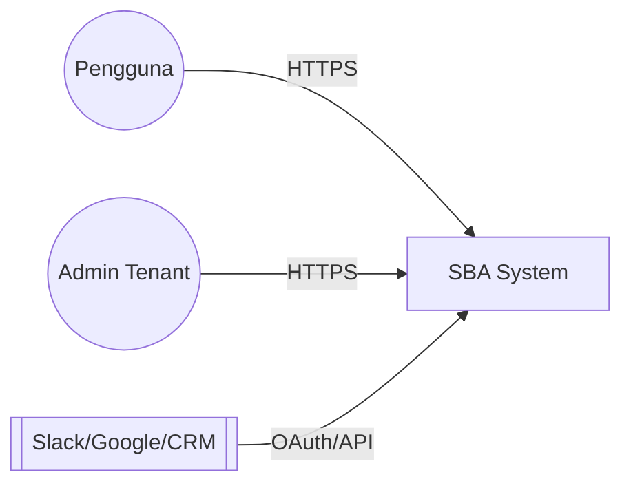
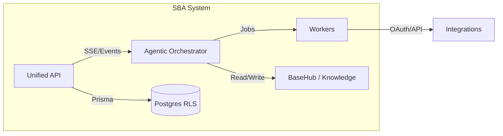
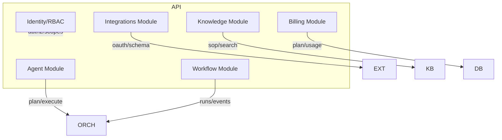

# C4 Model — `apps/api` (SBA-Agentic Orchestrator)

## Level 1 — System Context
- Sistem: Smart Business Assistant (SBA)
- Aktor Eksternal: Pengguna bisnis, Admin tenant, Integrasi (Slack, Google Workspace, CRM)
- Tujuan: Menyediakan API untuk orkestrasi agent, workflow, integrasi, pengetahuan, dan billing.



## Level 2 — Container
- Containers: Unified API, Orchestrator, Workers, BaseHub/Knowledge, Database, Observability.



## Level 3 — Component (API)
- Komponen API: Agent Module, Workflow Module, Integrations Module, Knowledge Module, Billing Module, Identity/RBAC.



## Keputusan Utama
- RLS berbasis `tenantId` untuk isolasi data.
- SSE untuk event stream dan timeline audit.
- Validasi kontrak (Zod) dan OpenAPI 3.1 sebagai sumber kebenaran API.

## Legend
- Persegi: komponen aplikasi
- Silinder: database
- Arah panah: arah komunikasi
- Subgraph: batas sistem/area

## Level 4 — Code Diagram (Kritis)
```
modules/
├─ agent/
│  ├─ services/AgentPlannerService.ts
│  ├─ services/ApprovalService.ts
│  └─ routes/agent.routes.ts
├─ workflow/
│  ├─ repositories/WorkflowRunRepository.ts
│  ├─ services/EventStreamService.ts
│  └─ routes/workflow.routes.ts
└─ integrations/
   ├─ services/OAuthService.ts
   └─ routes/integrations.routes.ts
```
