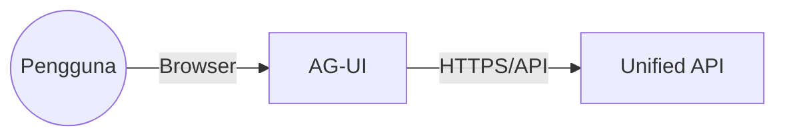
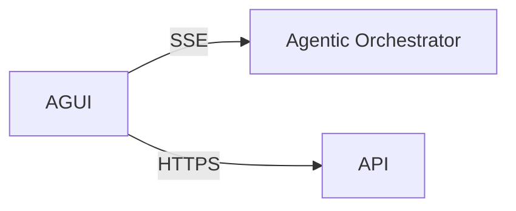
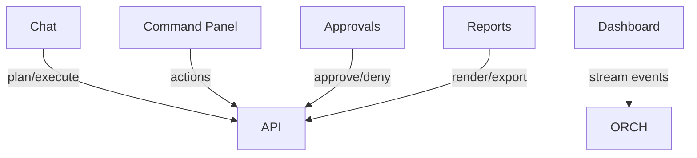

# C4 Model — `apps/app` (SBA-Agentic UI)

## Level 1 — System Context
- Pengguna berinteraksi dengan AG‑UI untuk menjalankan agent/workflow dan melihat laporan.



## Level 2 — Container
- Containers: Web App (AG‑UI), Unified API, Event Stream (SSE), Observability.



## Level 3 — Component (AG‑UI)
- Modul: Chat, Command Panel, Approvals, Dashboard Runs, Reports.



## Keputusan Utama
- FSD + Atomic Design; SSE untuk live timeline.
- Error taxonomy dan sanitasi konten; MFA via identity provider.

## Legend
- Persegi: modul UI
- Panah putus: streaming SSE
- Subgraph: batas aplikasi

## Level 4 — Code Diagram (Kritis)
```
src/
├─ features/
│  ├─ approval/
│  │  ├─ model/state.ts
│  │  ├─ ui/ApprovalDialog.tsx
│  │  └─ api/approve.ts
│  └─ workflow-panel/
│     ├─ model/state.ts
│     ├─ ui/WorkflowPanel.tsx
│     └─ api/getRuns.ts
├─ entities/run/
│  ├─ types.ts
│  └─ api.ts
└─ shared/ui/
   └─ Button.tsx
```
