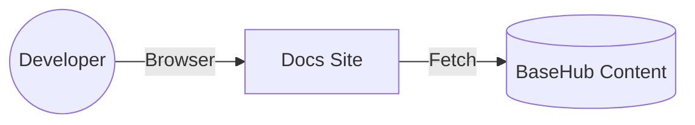
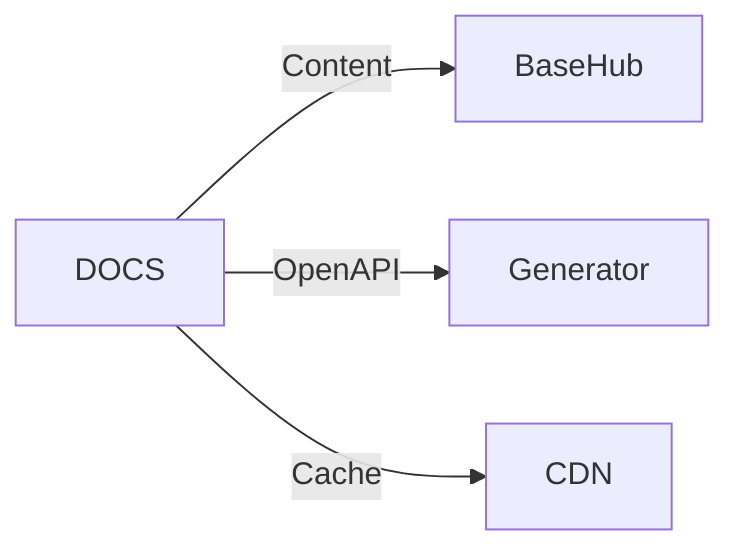

# C4 Model — `apps/docs` (BaseHub Docs Site)

## Level 1 — System Context
- Developer dan pengguna mengakses dokumentasi interaktif yang sinkron dengan OpenAPI.



## Level 2 — Container
- Containers: Docs Site (Static/SSR), BaseHub, OpenAPI Generator, CDN.



## Level 3 — Component
- Komponen: Guides, API Reference, Try It Playground, Analytics.

## Keputusan Utama
- OpenAPI sebagai sumber kebenaran; analitik penggunaan dokumentasi untuk iterasi konten.

## Legend
- Persegi: komponen situs
- Awan: CDN
- Dokumen: konten/kontrak

## Level 4 — Code Diagram (Kritis)
```
apps/docs/
├─ content/
│  ├─ guides/
│  └─ tutorials/
├─ openapi/
│  └─ openapi.yaml
├─ src/
│  ├─ pages/
│  ├─ components/TryIt.tsx
│  └─ index.ts
```
