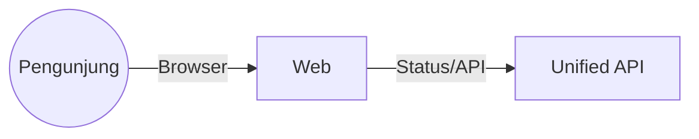

# C4 Model — `apps/web` (SBA Agentic Web)

## Level 1 — System Context
- Pengunjung mengakses halaman landing/marketing dan status.



## Level 2 — Container
- Containers: Static Site, CDN, API.

## Level 3 — Component
- Komponen: Landing, Features, Status, Changelog.

## Keputusan Utama
- CSP/Permissions-Policy ketat; a11y dan SEO; observability web vitals.

## Legend
- Persegi: komponen web
- Awan: CDN
- Panah: rute/komunikasi

## Level 4 — Code Diagram (Kritis)
```
apps/web/
├─ src/
│  ├─ pages/
│  │  ├─ index.tsx
│  │  └─ status.tsx
│  ├─ components/
│  │  ├─ Hero.tsx
│  │  └─ StatusCard.tsx
│  └─ shared/
│     └─ seo.ts
└─ public/
```
