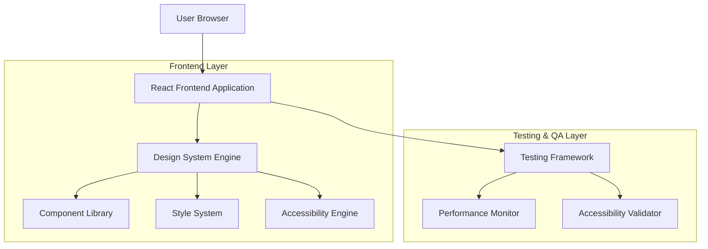
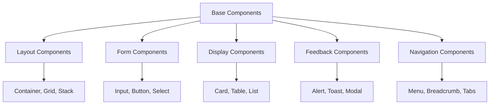
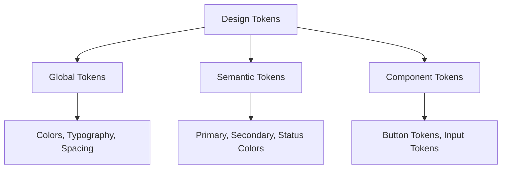
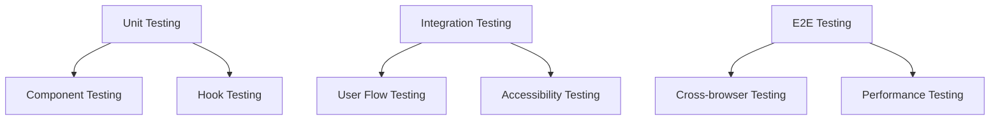

## 1. Architecture Design



## 2. Technology Description

- **Frontend**: React@18 + TypeScript + TailwindCSS@3
- **Initialization Tool**: vite-init
- **State Management**: Zustand untuk state management yang ringan
- **Styling**: TailwindCSS dengan custom design tokens
- **Animation**: Framer Motion untuk animasi yang smooth
- **Icons**: Heroicons + Lucide React
- **Testing**: Jest + React Testing Library + Playwright untuk E2E testing
- **Documentation**: Storybook untuk komponen documentation
- **Build Tool**: Vite untuk development dan production build
- **Backend**: Tidak diperlukan - full frontend implementation

## 3. Route Definitions

| Route | Purpose |
|-------|---------|
| / | Home - Design System Hub dengan component showcase |
| /components | Component Library dengan searchable komponen |
| /accessibility | Accessibility Dashboard untuk monitoring |
| /style-guide | Style Guide dengan color palette dan typography |
| /testing | Testing Interface untuk user flows |
| /playground | Interactive playground untuk testing komponen |
| /documentation | Technical documentation dan guidelines |

## 4. Component Architecture

### 4.1 Core Component Types
```typescript
// Base Component Interface
interface BaseComponent {
  id: string;
  name: string;
  category: ComponentCategory;
  variants: ComponentVariant[];
  accessibility: AccessibilityConfig;
  responsive: ResponsiveConfig;
}

// Design Token Interface
interface DesignToken {
  colors: ColorSystem;
  typography: TypographySystem;
  spacing: SpacingSystem;
  shadows: ShadowSystem;
  animations: AnimationConfig;
}

// Accessibility Configuration
interface AccessibilityConfig {
  ariaLabel?: string;
  role?: AriaRole;
  tabIndex?: number;
  keyboardNavigation?: boolean;
  screenReaderText?: string;
}
```

### 4.2 Component Hierarchy


## 5. Design System Architecture

### 5.1 Design Token System


### 5.2 Style Architecture
- **CSS Architecture**: TailwindCSS dengan custom configuration
- **CSS-in-JS**: Emotion untuk dynamic styling yang kompleks
- **CSS Custom Properties**: Untuk runtime theming
- **Responsive Design**: Mobile-first approach dengan breakpoints yang terdefinisi

### 5.3 Animation System
- **Transition Presets**: Predefined transitions untuk konsistensi
- **Animation Library**: Framer Motion untuk complex animations
- **Performance**: GPU-accelerated animations, will-change optimization

## 6. Testing Architecture

### 6.1 Testing Strategy


### 6.2 Testing Tools
- **Unit Testing**: Jest + React Testing Library
- **Visual Testing**: Chromatic untuk visual regression
- **Accessibility Testing**: jest-axe + manual testing
- **Performance Testing**: Lighthouse CI
- **Cross-browser Testing**: Playwright

## 7. Performance Optimization

### 7.1 Code Splitting Strategy
- **Route-based Splitting**: Automatic code splitting per route
- **Component-based Splitting**: Lazy loading untuk komponen berat
- **Dynamic Imports**: Untuk features yang jarang digunakan

### 7.2 Bundle Optimization
- **Tree Shaking**: Eliminasi unused code
- **Image Optimization**: WebP format dengan fallback
- **Font Optimization**: Font subsetting dan preloading

### 7.3 Runtime Performance
- **Virtual Scrolling**: Untuk long lists
- **Memoization**: React.memo untuk expensive components
- **Debouncing**: Untuk search dan filter operations

## 8. Development Workflow

### 8.1 Component Development
1. Design tokens definition
2. Component structure planning
3. Accessibility implementation
4. Responsive behavior
5. Testing dan documentation
6. Code review dan merge

### 8.2 Quality Assurance
1. Automated testing di CI/CD
2. Manual accessibility audit
3. Performance benchmarking
4. Cross-browser verification
5. Design consistency check

## 9. Deployment Strategy

### 9.1 Build Process
- **Development**: Vite dev server dengan HMR
- **Staging**: Build dengan environment variables