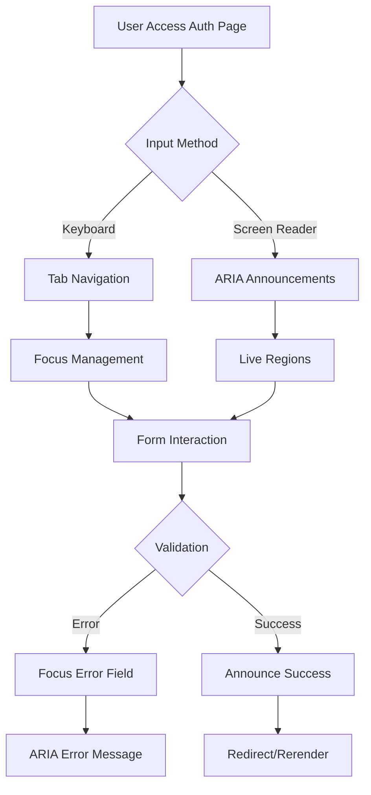

## 1. Product Overview
Fitur AuthLayout menyediakan layout otentikasi yang accessible dengan navigasi keyboard penuh dan memenuhi standar accessibility (a11y) baseline. Dirancang untuk pengguna dengan berbagai kemampuan, mendukung screen readers, keyboard navigation, dan kontras warna yang baik.

Target pengguna: Semua pengguna yang membutuhkan autentikasi, termasuk pengguna dengan disabilitas yang mengandalkan assistive technology.

## 2. Core Features

### 2.1 User Roles
| Role | Registration Method | Core Permissions |
|------|---------------------|------------------|
| Guest | Default | Melihat halaman login/register, navigasi keyboard |
| Authenticated User | Login berhasil | Akses ke halaman internal, logout |

### 2.2 Feature Module
Fitur AuthLayout dengan a11y baseline terdiri dari halaman berikut:
1. **Login Page**: Form login dengan navigasi keyboard dan screen reader support.
2. **Register Page**: Form registrasi dengan validasi real-time dan feedback accessible.
3. **Auth Layout Wrapper**: Container yang menyediakan struktur accessible untuk semua halaman auth.

### 2.3 Page Details
| Page Name | Module Name | Feature description |
|-----------|-------------|---------------------|
| Login Page | Keyboard Navigation | Tab order yang logical, focus trap di dalam form, skip links untuk bypass navigation |
| Login Page | Screen Reader Support | ARIA labels, live regions untuk error messages, semantic HTML structure |
| Login Page | High Contrast Mode | Mode kontras tinggi untuk pengguna dengan gangguan penglihatan, toggle switch di header |
| Login Page | Form Validation | Validasi real-time dengan pesan error yang jelas dan accessible |
| Register Page | Password Requirements | List requirement yang dapat diakses dengan screen reader, strength indicator |
| Register Page | Error Handling | Error messages dengan ARIA live regions, focus management ke field yang error |
| Auth Layout | Skip Navigation | Link "Skip to main content" yang muncul saat focus dari keyboard |
| Auth Layout | Focus Management | Focus trap di modal/overlay, restore focus ke element yang memicu |
| Auth Layout | Keyboard Shortcuts | Shortcut keys untuk submit form (Ctrl+Enter), reset form (Escape) |

## 3. Core Process
**User Flow (Keyboard Navigation):**
1. Pengguna menekan Tab untuk navigasi ke halaman login
2. Skip navigation link muncul, tekan Enter untuk skip ke form
3. Tab melalui form fields dengan urutan yang logical
4. Error messages diumumkan via ARIA live regions
5. Submit form dengan Enter atau Ctrl+Enter
6. Focus di-manage untuk hasil aksi (success/error)

**Screen Reader Flow:**
1. Page title dan struktur diumumkan
2. Form labels dan instructions dibaca secara berurutan
3. Error messages diumumkan secara real-time
4. Success status dikonfirmasikan dengan announcement

## 4. User Interface Design

### 4.1 Design Style
- **Primary Color**: #2563EB (blue-600) untuk button dan links
- **Secondary Color**: #1F2937 (gray-800) untuk text utama
- **Error Color**: #DC2626 (red-600) dengan kontras minimal 4.5:1
- **Success Color**: #059669 (emerald-600) untuk konfirmasi
- **Button Style**: Rounded corners (6px), ukuran minimum 44x44px untuk touch target
- **Font**: System font stack (Inter, system-ui, sans-serif), minimum 16px untuk body
- **Layout**: Single column layout dengan max-width 400px untuk form
- **Focus Style**: Outline 2px solid dengan offset 2px, warna biru yang terlihat jelas

### 4.2 Page Design Overview
| Page Name | Module Name | UI Elements |
|-----------|-------------|-------------|
| Login Page | Form Container | Card putih dengan shadow-sm, border radius 8px, padding 32px, max-width 400px |
| Login Page | Input Fields | Height minimum 44px, border 1px solid #D1D5DB, focus ring blue-500, label di atas field |
| Login Page | Submit Button | Full width, height 48px, background blue-600, hover blue-700, active state yang jelas |
| Login Page | Error Messages | Text merah-600, font-size 14px, margin-top 8px, role="alert" untuk screen reader |
| Register Page | Password Strength | Progress bar horizontal dengan 4 level, warna dari merah ke hijau, dengan text alternatif |
| Register Page | Requirement List | Unordered list dengan checkboxes, ARIA describedby untuk referensi |
| Auth Layout | Skip Link | Position absolute di atas kiri, muncul saat focus, background kuning, teks hitam |
| Auth Layout | Focus Indicator | Outline 2px solid #2563EB dengan 2px offset, visible untuk semua interactive elements |

### 4.3 Responsiveness
Desktop-first design dengan mobile-adaptive:
- Desktop: Form terpusat di tengah viewport dengan lebar optimal 400px
- Tablet: Padding menyesuaikan, tetap single column layout
- Mobile: Touch target minimum 44x44px, font size minimum 16px untuk prevent zoom
- Orientation: Support portrait dan landscape mode dengan layout yang tetap usable