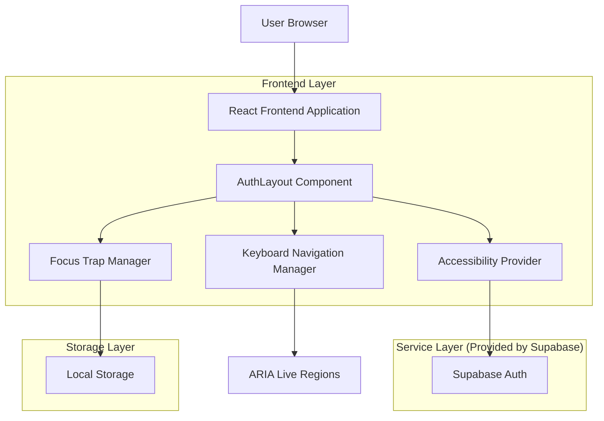
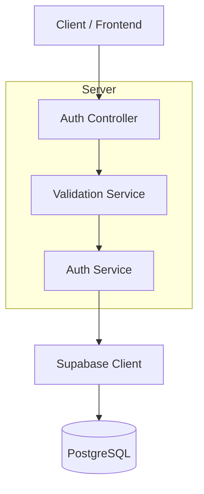
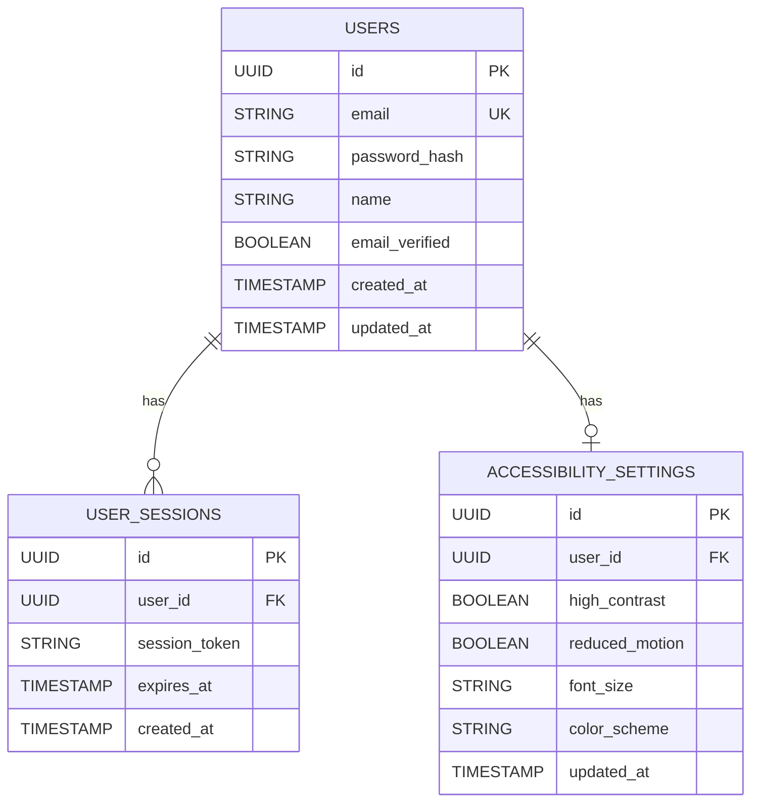

## 1. Architecture design



## 2. Technology Description

* Frontend: React\@18 + tailwindcss\@3 + vite

* Initialization Tool: vite-init

* Backend: Supabase (PostgreSQL)

* Accessibility Library: @react-aria, @react-stately

* Form Validation: React Hook Form + Zod

* State Management: React Context + useReducer

* TypeScript: strict mode enabled

## 3. Route definitions

| Route                      | Purpose                                          |
| -------------------------- | ------------------------------------------------ |
| /demo/auth/login           | Login page dengan a11y baseline implementation   |
| /demo/auth/register        | Register page dengan password strength indicator |
| /demo/auth/forgot-password | Forgot password dengan email validation          |
| /api/auth/session          | Endpoint untuk session management                |

## 4. API definitions

### 4.1 Core API

**User Login**

```
POST /api/auth/login
```

Request:

| Param Name | Param Type | isRequired | Description                            |
| ---------- | ---------- | ---------- | -------------------------------------- |
| email      | string     | true       | Email address dengan format validation |
| password   | string     | true       | Password dengan minimum 8 karakter     |

Response:

| Param Name | Param Type | Description              |
| ---------- | ---------- | ------------------------ |
| status     | boolean    | Login success status     |
| message    | string     | Error message jika gagal |
| user       | object     | User data jika berhasil  |

Example:

```json
{
  "email": "user@example.com",
  "password": "securepassword123"
}
```

**User Registration**

```
POST /api/auth/register
```

Request:

| Param Name | Param Type | isRequired | Description                          |
| ---------- | ---------- | ---------- | ------------------------------------ |
| email      | string     | true       | Valid email address                  |
| password   | string     | true       | Password dengan strength requirement |
| name       | string     | true       | Nama pengguna                        |

Response:

| Param Name | Param Type | Description                |
| ---------- | ---------- | -------------------------- |
| status     | boolean    | Registration success       |
| user       | object     | New user data              |
| message    | string     | Error atau success message |

## 5. Server architecture diagram



## 6. Data model

### 6.1 Data model definition



### 6.2 Data Definition Language

**Users Table (users)**

```sql
-- create table
CREATE TABLE users (
    id UUID PRIMARY KEY DEFAULT gen_random_uuid(),
    email VARCHAR(255) UNIQUE NOT NULL,
    password_hash VARCHAR(255) NOT NULL,
    name VARCHAR(100) NOT NULL,
    email_verified BOOLEAN DEFAULT false,
    created_at TIMESTAMP WITH TIME ZONE DEFAULT NOW(),
    updated_at TIMESTAMP WITH TIME ZONE DEFAULT NOW()
);

-- create indexes
CREATE INDEX idx_users_email ON users(email);
CREATE INDEX idx_users_created_at ON users(created_at DESC);

-- grant permissions
GRANT SELECT ON users TO anon;
GRANT ALL PRIVILEGES ON users TO authenticated;
```

**User Sessions Table (user\_sessions)**

```sql
-- create table
CREATE TABLE user_sessions (
    id UUID PRIMARY KEY DEFAULT gen_random_uuid(),
    user_id UUID REFERENCES users(id) ON DELETE CASCADE,
    session_token VARCHAR(255) UNIQUE NOT NULL,
    expires_at TIMESTAMP WITH TIME ZONE NOT NULL,
    created_at TIMESTAMP WITH TIME ZONE DEFAULT NOW()
);

-- create indexes
CREATE INDEX idx_user_sessions_user_id ON user_sessions(user_id);
CREATE INDEX idx_user_sessions_token ON user_sessions(session_token);
CREATE INDEX idx_user_sessions_expires ON user_sessions(expires_at);

-- grant permissions
GRANT SELECT ON user_sessions TO anon;
GRANT ALL PRIVILEGES ON user_sessions TO authenticated;
```

**Accessibility Settings Table (accessibility\_settings)**

```sql
-- create table
CREATE TABLE accessibility_settings (
    id UUID PRIMARY KEY DEFAULT gen_random_uuid(),
    user_id UUID REFERENCES users(id) ON DELETE CASCADE,
    high_contrast BOOLEAN DEFAULT false,
    reduced_motion BOOLEAN DEFAULT false,
    font_size VARCHAR(20) DEFAULT 'medium' CHECK (font_size IN ('small', 'medium', 'large', 'extra-large')),
    color_scheme VARCHAR(20) DEFAULT 'light' CHECK (color_scheme IN ('light', 'dark', 'high-contrast')),
    updated_at TIMESTAMP WITH TIME ZONE DEFAULT NOW()
);

-- create indexes
CREATE UNIQUE INDEX idx_accessibility_settings_user_id ON accessibility_settings(user_id);
CREATE INDEX idx_accessibility_settings_user ON accessibility_settings(user_id);

-- grant permissions
GRANT SELECT ON accessibility_settings TO anon;
GRANT ALL PRIVILEGES ON accessibility_settings TO authenticated;
```

## 7. Accessibility Implementation

### 7.1 Keyboard Navigation Manager

```typescript
// hooks/useKeyboardNavigation.ts
const useKeyboardNavigation = () => {
  const handleKeyDown = (event: KeyboardEvent) => {
    switch (event.key) {
      case 'Tab':
        // Implement focus trap logic
        break;
      case 'Escape':
        // Handle escape key for form reset
        break;
      case 'Enter':
        // Handle form submission with Enter
        break;
    }
  };
  
  useEffect(() => {
    document.addEventListener('keydown', handleKeyDown);
    return () => document.removeEventListener('keydown', handleKeyDown);
  }, []);
};
```

### 7.2 ARIA Live Regions

```typescript
// components/AriaLiveRegion.tsx
const AriaLiveRegion: React.FC = () => {
  const [announcements, setAnnouncements] = useState<string[]>([]);
  
  return (
    <div className="sr-only" role="status" aria-live="polite">
      {announcements.map((message, index) => (
        <div key={index}>{message}</div>
      ))}
    </div>
  );
};
```

### 7.3 Focus Management

```typescript
// utils/focusManagement.ts
export const focusFirstError = (formRef: RefObject<HTMLFormElement>) => {
  const firstError = formRef.current?.querySelector('[aria-invalid="true"]');
  if (firstError instanceof HTMLElement) {
    firstError.focus();
    firstError.scrollIntoView({ behavior: 'smooth', block: 'center' });
  }
};
```

### 7.4 High Contrast Mode Detection

```typescript
// hooks/useHighContrast.ts
const useHighContrast = () => {
  const [isHighContrast, setIsHighContrast] = useState(false);
  
  useEffect(() => {
    const mediaQuery = window.matchMedia('(prefers-contrast: high)');
    setIsHighContrast(mediaQuery.matches);
    
    const handler = (e: MediaQueryListEvent) => setIsHighContrast(e.matches);
    mediaQuery.addEventListener('change', handler);
    return () => mediaQuery.removeEventListener('change', handler);
  }, []);
  
  return isHighContrast;
};
```

