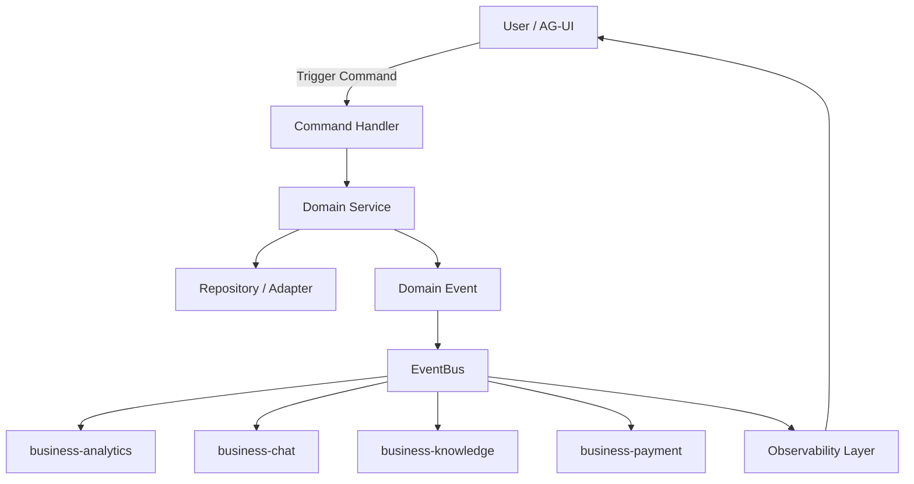

**technical blueprint implementasi SBA-Agentic** yang **layered, modular, dan production-ready**, mencakup **packages/business, AG-UI, EventBus, observability, multi-tenant**, sehingga bisa langsung dijadikan acuan implementasi.

---

# **SBA-Agentic — Technical Blueprint Implementasi**

## **I. Layered Architecture Overview**

```
+------------------------------------------------------+
| Layer 1: User Interaction & AG-UI                   |
| - Adaptive agentic UI                                |
| - Triggers commands / queries                        |
+------------------------------------------------------+
                     |
                     v
+------------------------------------------------------+
| Layer 2: Application Layer / Orchestration          |
| - Command / Query dispatch                           |
| - Handler execution                                  |
| - TenantContext propagation (tenantId, traceId)     |
+------------------------------------------------------+
                     |
                     v
+------------------------------------------------------+
| Layer 3: Domain Layer                                |
| - Domain entities & value objects                    |
| - Domain services per package                        |
| - Event publishing (DomainEvent)                     |
+------------------------------------------------------+
                     |
                     v
+------------------------------------------------------+
| Layer 4: Infrastructure / Adapter / Repository      |
| - Persistence (DB, vector store)                     |
| - External APIs (Slack, Notion, CRM, ERP, Payment)  |
| - Adapter abstraction per package                    |
+------------------------------------------------------+
                     |
                     v
+------------------------------------------------------+
| Layer 5: EventBus & Cross-Package Communication     |
| - Async event-driven architecture                    |
| - Multi-adapter support (InMemory, Redis, Kafka)    |
| - Tenant-aware event propagation                     |
+------------------------------------------------------+
                     |
                     v
+------------------------------------------------------+
| Layer 6: Observability & Feedback                   |
| - Logging, metrics, meta-events                      |
| - Dashboards & alerts                                 |
| - Feedback to AG-UI & human-in-the-loop optimizations|
+------------------------------------------------------+
```

---

## **II. Package-Specific Blueprint**

### **1. business-core**

**Purpose:** Pondasi DDD + EventBus multi-adapter.

**Components:**

* `Command<T>` / `Query<T>` → base class generic.
* `Handler<C>` → executes commands, injects services & TenantContext.
* `DomainEvent` → immutable event objects.
* `EventBus` → async publish/subscribe, supports multiple adapters.

**Technical Notes:**

* TenantContext injected via DI or middleware.
* Supports tracing (`traceId`) & observability hooks.
* Standardized `Result<T, E>` for all responses.

---

### **2. business-analytics**

**Purpose:** Metrics aggregation & dashboards.

**Flow:**

```
LogEventCommand → AggregationService → IAnalyticsRepository → DB
        ↓
      EventBus → Observability
```

**Implementation Details:**

* `AggregationService` strategy-based (sum, avg, custom).
* Repository abstraction: `IAnalyticsRepository`.
* Adapter: `DashboardAdapter` (stateless, multi-tenant).
* Observability: latency, throughput, error metrics.

---

### **3. business-chat**

**Purpose:** Conversation & messaging system.

**Flow:**

```
SendMessageCommand → ChatService → IChatRepository → EventBus
        ↓
      Observability Layer → Dashboard
```

**Implementation Details:**

* `ChatService` tenant-aware, context-preserving.
* Publish `ChatMessageSent` events to EventBus.
* Adapters for UI (AG-UI/WebSocket).
* Repository interface for pluggable storage (Postgres, MongoDB, In-Memory).

---

### **4. business-knowledge**

**Purpose:** Context retrieval & knowledge base management.

**Flow:**

```
RetrieveContextQuery → ContextEngine → IKnowledgeRepository → Adapter → Return
        ↓
      EventBus → Observability Layer
```

**Implementation Details:**

* Plugin-based `ContextEngine` for LLM, vector DB, or semantic search.
* Entities `KnowledgeBase`, `Document` versioned.
* Embedding vectors immutable.
* Repository interface supports multiple backend stores.
* Observability tracks retrieval latency & success rate.

---

### **5. business-payment**

**Purpose:** Payment processing & multi-gateway support.

**Flow:**

```
ExecutePaymentCommand → PaymentGatewayService → Adapter → EventBus → Observability
```

**Implementation Details:**

* `IPaymentGateway` interface for pluggable gateways (Stripe, Midtrans, etc.).
* Transaction entity lifecycle-aware, multi-tenant.
* Retry logic & idempotency built-in.
* Webhook handling via adapter.
* Audit logs for all transactions.

---

## **III. Multi-Tenant & Observability**

**Tenant Awareness:**

* Every command, service, repository call includes `tenantId`.
* EventBus events include tenant metadata.

**Observability:**

* Centralized logging: `traceId`, `tenantId`, timestamp.
* Metrics pipeline: command execution, event propagation, DB latency.
* Meta-events published to dashboard and human-in-the-loop system.

---

## **IV. Event Flow Example**



**Key Points:**

* Flow is **tenant-aware** and **traceable**.
* All domain events propagated async.
* Observability closes the loop for feedback and optimization.

---

## **V. Development Roadmap (Layered)**

| Phase | Layer Focus               | Deliverables                                                                  |
| ----- | ------------------------- | ----------------------------------------------------------------------------- |
| 1     | Core                      | Command/Handler/Query, EventBus, TenantContext                                |
| 2     | Analytics                 | AggregationService, DashboardAdapter, IAnalyticsRepository                    |
| 3     | Chat                      | ChatService, IChatRepository, ChatUIAdapter, event-driven messaging           |
| 4     | Knowledge                 | ContextEngine, IKnowledgeRepository, embedding vector management              |
| 5     | Payment                   | PaymentGatewayService, ExecutePaymentCommand, adapter abstraction, audit logs |
| 6     | Observability             | Logging, metrics, meta-events pipeline, dashboards                            |
| 7     | Integration & Validation  | AG-UI → Core → Packages → EventBus → Observability full test                  |
| 8     | Deployment & Optimization | CI/CD, edge runtime deployment, human-in-the-loop optimization                |

---

Blueprint ini **menyatukan semua package dalam flow agentic**, modular, multi-tenant, dan event-driven, sekaligus menyiapkan **observability + feedback loop**.

**versi diagram visual interaktif tambahan** `.trae/documents/business/versi%20sequence%20diagram.md` yang menunjukkan **flow antar package per tenant** dengan **sequence diagram lengkap** untuk command, event, dan observability.


